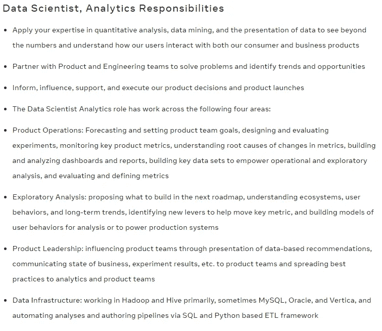

# 为数据科学毕业生/爱好者提供先进的项目理念，方便他们寻找工作

> 原文：<https://towardsdatascience.com/advanced-project-ideas-for-data-science-graduates-enthusiasts-to-ease-their-job-search-ee14420b261?source=collection_archive---------24----------------------->

## 数据科学是一个广阔的领域。它可以从把莎莎酱放在当地商店的芯片旁边到火星漫游者！我将分享一些项目想法，这些想法将使您能够做更现实的项目，最适合当前的技术和业务场景。

Shravankumar Hiregoudar 在 [Unsplash](https://unsplash.com?utm_source=medium&utm_medium=referral) 上拍摄的照片

数据科学家经常用简单明了的方法对干净、结构化的数据进行学术/业余项目。虽然我同意最好从简单的数据集开始，但这些项目与现实世界的场景没有任何关系，我们经常很难找到这些项目的工作。这些公司会寻找一个比你使用的工具和技术更适合他们业务的候选人。如果你能在工具和语言的帮助下做一个更现实的项目，那么你的项目故事将符合真实世界的数据场景！如果你同意我的观点，那么让我们开始吧。

> 数据科学求职小技巧:[链接](https://shravankumarhiregoudar.medium.com/data-science-job-search-what-worked-for-me-c60a1df222b5)

让我们来谈谈这个项目的想法，它涉及到:

1.  *产品感*
2.  *多个数据源*
3.  *准备部署*
4.  *与 ETL 工具和 DW 的集成*
5.  *非结构化数据*
6.  *帮助小企业成长*

# 产品感

亚历山大·安德鲁斯在 [Unsplash](https://unsplash.com?utm_source=medium&utm_medium=referral) 拍摄的照片

基于产品的公司中的数据科学家通常致力于预测和设置产品团队目标、设计和评估实验、监控关键产品指标、了解指标变化的根本原因、构建和分析仪表板和报告、构建关键数据集以支持运营和探索性分析，以及评估和定义指标。

了解 KPI、指标、A/B 测试，并对产品有一个完整的认识变得至关重要。如果你的目标是基于产品的公司，你应该做一个涉及 KPI、度量、A/B 测试和产品参与的项目。你应该能够通过你的项目回答这些问题；

*   您将如何创建一个模型来预测这一指标？
*   你如何测试产品的新特性？
*   你想完成什么？你想用你的数据解决什么问题？

一家方公司的数据科学家职责。看到产品感的重要性了吧！(截图)

# *多个数据源*

由 [Eric Prouzet](https://unsplash.com/@eprouzet?utm_source=medium&utm_medium=referral) 在 [Unsplash](https://unsplash.com?utm_source=medium&utm_medium=referral) 上拍摄的照片

在现实世界中，客户/公司到处都有数据。最好了解如何提取、转换和合并所有不同的数据源，以便更好地使用和预测。只处理 CSV 文件会限制您的范围，并且不能清晰地描述实际的案例场景。

处理具有多个来源的项目，因为这对于现代业务和分析是必要的，但是如果不小心，可能会导致数据质量问题。通过这种方法，您将学会如何处理，

*   数据的异质性
*   数据源集成
*   缩放问题
*   数据冗余

了解这些问题并解决它们会让你成为更好的数据科学家。

# *准备部署*

由 [SpaceX](https://unsplash.com/@spacex?utm_source=medium&utm_medium=referral) 在 [Unsplash](https://unsplash.com?utm_source=medium&utm_medium=referral) 上拍摄的照片

部署模型是数据科学家工作的一部分，因为系统可以通过调用机器学习模型来进行实时预测。当 ML 项目在生产中部署时，我们必须监控性能并构建系统化的工具，这些工具可以处理性能下降并找到正确类型的数据以流回 ML 生命周期的早期阶段，从而重新训练和更新模型以参与 CI/CD(持续集成和持续部署)。最重要的部分是确保数据系统地流向早期阶段。

为了理解 ML 部署，您可以尝试将最终模型部署到 S3 上，并从 ETL/雪花中调用它来执行预测。此外，如果你不是初学者，可以尝试使用亚马逊 sagemaker 而不是 jupyter notebook 进行编码。这些整合将使你能够理解 ML 如何在大范围内工作，以及实时预测是如何发生的。

# *与 ETL 工具和 DW 的集成*

照片由[迈克·彼得鲁奇](https://unsplash.com/@mikepetrucci?utm_source=medium&utm_medium=referral)在 [Unsplash](https://unsplash.com?utm_source=medium&utm_medium=referral) 上拍摄

当你看到一个大规模的机器学习过程时，理解 ETL、DB 和 DW 的作用对于一个数据科学家来说变得非常重要。ETL 或 DW 的角色绝对是数据工程师的。尽管如此，一些公司要求数据科学家理解和实现这些。尽管如此，了解 ETL、DW 和 DB 的基础知识将有助于您编写更好的集成代码。整个 ML 系统更有意义。

您可以在 ETL 工具中执行提取、转换和加载，然后在 notebook/sagemaker 中输入干净的数据来构建模型和执行预测。这将有助于你处理集成和流水线问题，这是一件很重要的事情。您还可以使用 AWS 或雪花来理解这些工具在数据世界中的作用。

# 非结构化数据

里克·梅森在 [Unsplash](https://unsplash.com?utm_source=medium&utm_medium=referral) 上的照片

非结构化数据是指没有预定义方式的信息。它可能以文本为主，如开放式调查回复和社交媒体对话，也可能包括图像、视频和音频。现实世界中的数据通常是非结构化的，这种数据不需要预处理和清洗。如果分析正确，来自非结构化数据的结果更有价值。

处理非结构化数据的项目将使您认识到数据清理和预处理对于建模的重要性。这些非结构化数据由于其复杂性而经常被忽略；利用这个机会，学习如何处理这些数据。它包含有价值的信息，可以促进业务发展。

# 帮助小企业成长

照片由[卡罗琳·布鲁曼斯](https://unsplash.com/@karolien?utm_source=medium&utm_medium=referral)在 [Unsplash](https://unsplash.com?utm_source=medium&utm_medium=referral) 拍摄

像这样具有挑战性的时代需要每个人尽我们所能地投入和帮助。在做一个学术/业余爱好项目的时候，试着接近一家收集了足够数据的当地企业，以进行预测和绘制模式。这些结果将有助于他们将商品更好地摆放在过道上，或者打折出售。永远学习人工智能，并尝试用你的技能帮助他人或企业。

如果你是以新生的身份申请或者改变工作领域，项目就变得至关重要。做高质量的项目会让你在真实世界的场景中体验不同的数据部分，这在找工作时是一个优势。此外，这些项目将帮助您了解数据科学在业务中的影响。完成项目后，在 GitHub 推送，写一个小报告，说明你的思考过程和旅程。

你也可以看看数据科学求职博客:

 [## 数据科学求职——什么对我有用？

### “从别人的错误中吸取教训。你不可能活得足够长，让它们都是你自己做的。”―埃莉诺·罗斯福。

towardsdatascience.com](/data-science-job-search-what-worked-for-me-c60a1df222b5) 