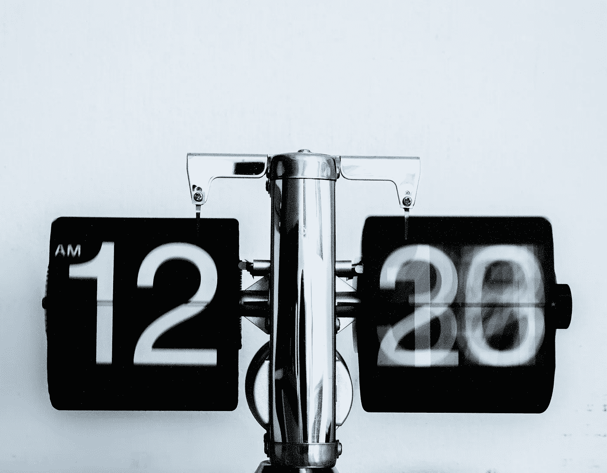

# BigQuery SQL 中的高级随机采样

> 原文：<https://towardsdatascience.com/advanced-random-sampling-in-bigquery-sql-7d4483b580bb?source=collection_archive---------13----------------------->

## 了解如何以可重现的方式对 BigQuery 表中的行进行采样

做你想知道如何在 BigQuery SQL 中**采样吗？在这里，我将向您展示如何在 Google BigQuery 中以一种可以重现结果的方式进行随机采样。我还将向您展示如何同时获取**多个样本**并计算后面的更好的统计数据。**

我在为 BigQuery 寻找一些大的东西… |照片由[paweczerwi324ski](https://unsplash.com/@pawel_czerwinski?utm_source=unsplash&utm_medium=referral&utm_content=creditCopyText)在 [Unsplash](https://unsplash.com/s/photos/big?utm_source=unsplash&utm_medium=referral&utm_content=creditCopyText) 上拍摄

*我确实有一些关于 BigQuery 的其他文章，所以请查看我的个人资料以获得更多 BQ 阅读:*

<https://niczky12.medium.com>  

> 要获得所有媒体文章的完整访问权限，包括我的文章，请考虑在此订阅。

# 生成一些数据

BigQuery 中有一些很棒的开放数据集，但是它们相当大，所以如果你不够小心的话，你很容易因为查询它们而被收费。我鼓励你去看看这些数据集，但是这里我将**生成一个很小的数据集**，只是为了确保我不会因为任何查询而被计费(BQ 有 1TB/月的免费 trier 限制)。

这将给出 2 组(a 和 b ),第一组在 5 和 15 之间具有**均匀随机分布**,第二组在 2 和 9 之间具有均匀随机分布。

> 您可以使用此方法从任意两个数字之间的均匀随机分布中生成一个数字列表。

我们将在整个教程中使用这个数据集，所以我建议您**将它保存为数据集**——我将它保存为`ds.random_table`，这是我在后面的查询中引用它的方式。

## 查询解释—请随意跳过

如果您还不熟悉 BQ 中的数组或随机函数，下面是上面查询中发生的情况:

*   我们创建一个从 1 到 1000 的数组。
*   对于 a 组，我们将这个数组扩展为每行一个数字(unnest)
*   我们为这一千行中的每一行添加一个标志`group_a`和一个随机数。
*   我们对`group_b`重复同样的事情，用`union all`把它加到上表的末尾。

# 简单抽样

照片由 [Djim Loic](https://unsplash.com/@loic?utm_source=unsplash&utm_medium=referral&utm_content=creditCopyText) 在 [Unsplash](https://unsplash.com/s/photos/changing?utm_source=unsplash&utm_medium=referral&utm_content=creditCopyText) 上拍摄

网上有一些关于随机抽样的 SQL 教程，提倡使用`RAND()`函数。让我们看看这是如何工作的，以及为什么你不应该使用它😉。

我们将随机抽取 20 个 id，然后取`v`数的平均值以及`group_a`和`group_b`观察值的计数。

我们如何做到这一点？我们**为每个项目**生成一个介于 0 和 1 之间的随机数，**根据这个随机数对行**进行排序，然后**可以将前 20 行**作为我们的样本。

现在，给定这个样本表，我们计算我们的统计数据:

我得到以下结果:

从 BigQuery UI 捕获的图像

现在让我们再运行一次:

从 BigQuery UI 捕获的图像

哇，这不一样。😱

Gif 来自 [GIPHY](https://giphy.com/gifs/mrw-show-remote-HUkOv6BNWc1HO/links) 。

这并不十分理想，因为我想确保我在 BQ 中所做的任何计算都能被我的数据科学家同事复制**。让我们看看你如何做到这一点。**

# 哈希可重复采样

照片由[S O C I A L C U T](https://unsplash.com/@socialcut?utm_source=unsplash&utm_medium=referral&utm_content=creditCopyText)在 [Unsplash](https://unsplash.com/s/photos/hashtag?utm_source=unsplash&utm_medium=referral&utm_content=creditCopyText) 上拍摄

函数`RAND()`的问题在于它**在每次执行**时都会创建新的随机数。因此，第一行可能在第一次运行时得到 0.2，但在第二次运行时得到 0.99。我们想要实现的是为每一行获得相同的随机数。

这就是散列变得有用的地方。哈希函数接受一个字符串或数字，并返回一个随机但一致的字符串或数字。[在 BQ](https://cloud.google.com/bigquery/docs/reference/standard-sql/hash_functions#farm_fingerprint) 中最容易使用的散列函数是`farm_fingerprint`。这个函数总是为相同的输入返回相同的整数，它可以接受字符串作为输入。让我们看看它与没有输入的`RAND()`相比如何。

结果是:

从 BigQuery UI 捕获的图像

您可以看到，我们的两个 Alberts 具有相同的 farm_fingerprint 值，而我们的 rand 函数返回了不同的值。更好的是，`farm_fingerprint`将在每次运行时产生相同的数字。

> 继续尝试吧，上面的查询在 BQ 中没有任何成本，因为我们在查询时生成所有的数据。

有了这个新的闪亮的函数，是时候修改我们原来的采样查询并使它完全可再现了。

这里发生了什么事？

1.  我们使用`row_number`函数创建了一个名为`rn`的整数列
2.  我们将它们转换为字符串，因为`farm_fingerprint`需要一个字符串或字节输入。
3.  然后，代替`rand()`,我们使用`farm_fingerprint`函数来生成一些我们可以排序的随机数。

无论运行多少次查询，我都会得到以下结果。(您可能会得到稍微不同的结果，因为我们的原始表是由`rand()`生成的，所以您的基本数字可能会有所不同)。

在真实的场景中，您可能已经有一个与您的数据相关联的**行 id 或用户 id** 。在这种情况下，您可以随意将其作为输入传递到`farm_fingerprint`中。只是**注意重复的 id**，因为这些重复的 id 将具有相同的散列！这可能是你在某些情况下想要的。

# 模数采样比

我们现在知道如何重复采样值。但是对于大型数据集，对整个表进行排序，然后取前 n 行可能会有问题。我们如何在不点餐的情况下占桌子的 x%?

我们的散列函数总是返回一个整数。那个整数有时能被 10 整除，有时不能。因为**散列函数将观察值相当均匀地分布在整数**上，我们希望 10 个散列中有 1 个(10%)能被 10 整除。类似地，平均来说，1%的数字应该能被 100 整除。我们可以利用这一点来决定是否要保留一个数字。

为了抽取 15%的样本，我们将散列的模取 100，然后选择模小于 15 的所有数字。

> 这里有一个陷阱！BQ 模运算符可以为负整数返回负数。所以必须先取绝对值。

以上比之前复杂了一点。这是因为我们想要使用一个`where`语句，并且不能包含一个`row_number()`函数——或者任何带有`over()`部分的东西。所以我们**首先创建行号**，然后使用`farm_fingerprint`获取样本。

> 当您像这样采样时，在 SQL 代码中添加注释，因为新数据科学家可能会发现很难理解您将要采样的比率！

## 多个样本

Miguel Orós 在 [Unsplash](https://unsplash.com/s/photos/more?utm_source=unsplash&utm_medium=referral&utm_content=creditCopyText) 上拍摄的照片

作为我们的最后一步，我们将采取**多个样本**，然后计算每组的样本平均值。这会变得很有趣，所以系好安全带！

这是我们要做的:

1.  创建一个长度为`n`的数组，其中`n`是我们想要采样的次数。我们称这个数字为`sample_id`。
2.  将我们的数组`sample_id`交叉连接到原始数据集，以复制每个项目`n`次。
3.  将`sample_id`和行号组合起来，为每一行获得一个惟一的 id，我们可以用它来处理`farm_fingerprint`。
4.  使用模方法获得所有观察值的 15%—平均每个`sample_id`将获得每个观察值的 15%。
5.  根据`sample_id`和组 id 获取平均值。

如果您绘制结果，您将得到以下结果:

是的，这是从谷歌床单。随便你怎么评价我，我都懒得读成 Python。|来源:作者创作

这给了我们**非常好的估计**——和两个漂亮的钟形曲线——对于我们两个不同的组。没错，这就是[中心极限定理](https://www.onlinestatbook.com/stat_sim/normal_approx/clt.html)在起作用。*回到最初的数据生成步骤，看看这是否正确估计了我们的人口均值！*

记住 BigQuery 是按查询的字节收费的，而我们**只查询了一次我们的原始数据**。我们只是碰巧把它交叉连接到一堆整数上来复制我们的采样 1000 次！🎉

> 现在，您可以使用数组、farm_fingerprint 和 mod，通过便宜的 BigQuery 获得更好的统计估计！

# 结论

感谢阅读到最后！🙏

现在，您知道了如何使用 Google BigQuery 中一些方便的函数在 SQL 中进行采样。你已经学会了:

*   如何免费生成一些均匀分布的哑数据？
*   为什么不应该使用`rand()`函数来采样
*   那个`farm_fingerprint`接受字符串或字节，给你散列的整数。
*   如何使用模函数进行采样？
*   如何通过与整数列表交叉连接来获取多个样本？

通过阅读更多内容，让您的 BigQuery 技能更上一层楼😅：

</loops-in-bigquery-db137e128d2d>  </fizzbuzz-in-bigquery-e0c4fbc1d195>  </load-files-faster-into-bigquery-94355c4c086a> 