# 使用 Python 进行高级回归分析

> 原文：<https://towardsdatascience.com/advanced-regression-f74090014f3?source=collection_archive---------23----------------------->

## 用 Python 实现大学统计

# 介绍

在一系列的每周文章中，我将会涉及一些重要的统计学主题。

目标是使用 Python 来帮助我们获得对复杂概念的直觉，从经验上测试理论证明，或者从零开始构建算法。在本系列中，您将会看到涵盖随机变量、抽样分布、置信区间、显著性检验等主题的文章。

在每篇文章的最后，你可以找到练习来测试你的知识。解决方案将在下周的文章中分享。

迄今发表的文章:

*   [伯努利和二项随机变量与 Python](/bernoulli-and-binomial-random-variables-d0698288dd36)
*   [用 Python 从二项式到几何和泊松随机变量](/geometric-and-poisson-random-variables-with-python-e5dcb63d6b55)
*   [用 Python 实现样本比例的抽样分布](/sampling-distributions-with-python-f5a5f268f636)
*   [Python 的置信区间](/confidence-intervals-with-python-bfa28ebb81c)
*   [使用 Python 进行显著性测试](/significance-or-hypothesis-tests-with-python-7ed35e9ac9b6)
*   [用 Python 进行组间差异的双样本推断](/two-sample-inference-for-the-difference-between-groups-with-python-de91fbee32f9)
*   [分类数据的推断](/inference-for-categorical-data-9f3c6034aa57)
*   [高级回归](/advanced-regression-f74090014f3)
*   [方差分析— ANOVA](/analysis-of-variance-anova-8dc889d2fc3a)

像往常一样，代码可以在我的 [GitHub](https://github.com/luisroque/College_Statistics_with_Python) 上找到。

# 线性回归中斜率的推断

想象一下，你想根据一个数据科学家编码的年数来预测他的工资。为了建立这种关系，我们可以从数据科学家群体中随机抽取 20 个人，并绘制关系图(注意，工资单位是 10，000€)。同时，我们可以计算出最佳拟合的线。


图 1:数据科学数据科学是一个跨学科的领域，利用科学的方法、过程、算法和系统从结构化和非结构化数据中提取知识和见解；[来源](https://unsplash.com/photos/NDfqqq_7QWM)

```
import pandas as pd
import matplotlib.pyplot as plt
import numpy as np
from scipy.stats import t, chi2salaries = [[4, 5.5, 3.5, 6, 7, 9, 3.4, 5.3, 4.3, 5.3, 6, 6.2, 6.5, 7, 7.1, 4.3, 5.2, 5, 5.7, 3.2]]
yearsCoding = [[2, 5, 1, 4, 5, 10, 2, 2, 4, 3, 4, 6, 5, 6, 7, 4, 3, 4, 4, 3]]
n = 20plt.scatter(yearsCoding[0], salaries[0])
plt.xlabel('Years Coding')
plt.ylabel('Salary');
```

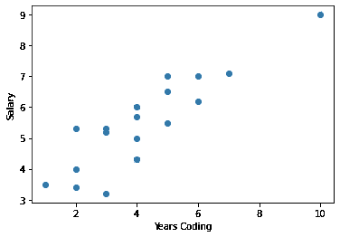

图 2:数据科学家样本的工资(10，000€)按编码年数。

最佳拟合线可以通过最小化数据点和线之间的平方距离来计算。回归线的方程式如下:

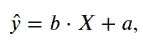

其中 b 是斜率，a 是回归线的截距。请注意，通过为我们的数据计算这条线，我们计算了 20 名数据科学家的单一样本的最佳拟合线。我们可以计算出一条不同的最佳拟合线，用于我们从总体中抽取的不同样本。发生这种情况是因为我们在估计总体的参数。如果您可以获得世界上所有数据科学家的工资和编码年数来构建您的模型，您将可以估计真实的总体参数。在这种情况下，我们用α 和β代替 a 和 b:

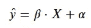

因为我们使用样本来估计总体参数，所以我们可以根据这些样本进行推断。考虑到这一点，我们知道 b 不会完全等于β，但是我们能说工资和编码年限之间存在正的线性关系或者非零的线性关系吗？事实上，我们可以通过定义该统计数据的置信区间来实现。这样，我们就能很好地理解真正的参数可能在哪里。在以前的文章中，我们看到了如何计算这样的区间:我们减去/加上临界值 t*乘以 b 的标准误差。

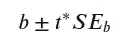

同样，我们可以为斜率参数定义一个假设检验。一种说法是变量之间没有关系，作为无效假设，另一种说法是变量之间有关系(你也可以更具体地定义另一种假设，只有正或负)。

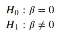

正如在任何其他推理过程中一样，我们必须尊重条件以确保有效的结果。在这种情况下，对于线性回归的斜率，我们必须确保:

*   数据必须是随机生成的；
*   个人观察应该是独立的(或近似独立的——记住 10%规则)；
*   变量之间的关系必须是线性的；
*   对于总体中任意给定的 x，y 的分布一定是正态的；
*   对于任何给定的 x，方差应该是常数。

# 从头开始拟合回归线

我们已经定义了回归线的方程。现在，我们需要定义成本函数和更新参数的方法。对于我们的成本函数，我们将使用均方差:

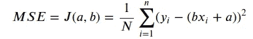

为了更新我们的参数，我们将使用梯度下降。我不会深入讨论这个方法；我只想给出一些直觉。第一步是计算成本函数相对于每个参数的梯度:

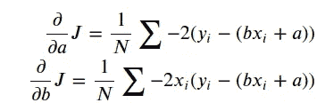

然后我们相应地更新参数:

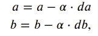

其中α代表学习率。

```
def fit_lr(X, y, num_iter=1000, lr=0.01):
    n_samples = X.shape[0]
    slope = 0
    intercept = 0

    for _ in range(num_iter):
        y_predicted = np.dot(X, slope) + intercept

        ds = (1/n_samples) * np.dot(X.T, (y_predicted - y))
        di = (1/n_samples) * np.sum(y_predicted - y)

        slope -= lr * ds
        intercept -= lr * di

    return (slope, intercept)slope, intercept = fit_lr(np.array(yearsCoding[0]), np.array(salaries[0]))plt.scatter(yearsCoding[0], salaries[0])
plt.xlabel('Years Coding')
plt.ylabel('Salary')
plt.plot(yearsCoding[0],slope*np.array(yearsCoding[0]) + intercept, color='r');
```

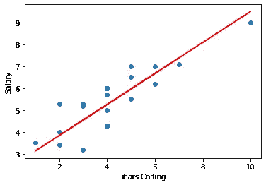

图 3:最佳拟合线(红色)对数据科学家样本的工资(10，000€)和编码年数之间的关系进行建模。

```
print('Slope=' + str(slope))
print('Intercept=' + str(intercept))Slope=0.7096702503648314
Intercept=2.4147010493601404
```

一个编码 15 年的数据科学家工资会是多少？

```
slope * 15 + intercept13.059754804832611
```

大约是 13 万€。

# 斜率的置信区间

我们可以将斜率^b 视为正态分布的随机变量，其均值为 b，方差等于 *σ* 除以 x 的平方和

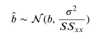

由于我们不知道总体方差，我们使用抽样方差来计算标准误差(se):

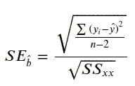

我们可以将 SE 描述为回归线斜率的抽样分布的标准偏差。

```
SS_xx = np.sum((np.array(yearsCoding[0]) - np.mean(np.array(yearsCoding[0])))**2)
SS_xx79.20000000000002SE_b = (np.sqrt(np.sum((np.array(salaries[0])-(np.array(yearsCoding[0])*slope+intercept))**2)/(n-2))) / np.sqrt(SS_xx)
SE_b0.08687984291368046
```

我们最终可以计算出线性回归斜率的 95%置信区间。

```
print('95% Confidence interval=[' + str(np.round(slope - t.ppf(0.975, df=n-2)*SE_b,2)) + ',' + str(np.round(slope + t.ppf(0.975, df=n-2)*SE_b,2)) + ']')95% Confidence interval=[0.53,0.89]
```

回想一下，95%的置信区间意味着真实斜率在 95%的时间里都包含在我们的置信区间内。

我们可以用这个区间在α= 0.05 的显著性水平上检验以下假设:


我们能得出什么结论？假设 H_0 为真，我们面临β=0 不与 95%区间重叠的情况，这种情况发生的概率小于 5%。因此，我们拒绝 h0，接受建议的 h1。它指出，编码的年数和数据科学家的工资之间存在某种关系(非零)。

# 非线性回归

现在，假设一个数据科学家的工资和编码的年数之间的关系不是线性的。在这种情况下，我们看到它更接近于指数关系。如果我们试图用一条线来拟合这些数据，会发生什么？

```
salaries =    [[3.5, 7.5, 2.5, 7, 9, 40, 3.4, 4.3, 5.3, 5.3, 4, 12.2, 8.5, 10, 18.1, 4.3, 5.2, 5, 5.7, 5.2]]
yearsCoding = [[2, 5,   1  , 4, 5, 10, 2  , 2  , 4,   3  , 4, 6  , 5  , 6 , 7   , 4   , 3  , 4, 4  , 3  ]]
n = 20plt.scatter(yearsCoding[0], salaries[0])
plt.xlabel('Years Coding')
plt.ylabel('Salary');
```

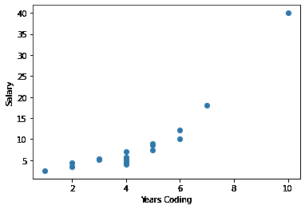

图 4:数据科学家不同样本的薪资(10000€)与编码年数之间的指数关系。

```
slope, intercept = fit_lr(np.array(yearsCoding[0]), np.array(salaries[0]))plt.scatter(yearsCoding[0], salaries[0])
plt.xlabel('Years Coding')
plt.ylabel('Salary')
plt.plot(yearsCoding[0],slope*np.array(yearsCoding[0]) + intercept, color='r');
```

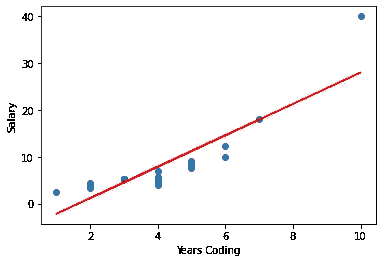

图 5:最佳拟合线(红色)对数据科学家样本的工资(10，000€)和编码年数之间的指数关系建模不佳。

```
print('Slope=' + str(slope))
print('Intercept=' + str(intercept))Slope=3.35501894004377
Intercept=-5.5729005963397205
```

我们发现我们拟合的线根本不能解释这些数据。我们甚至会得到一个刚开始编码的人的负工资，而且我们会严重低估一个编码了 10 年的人的工资。我们有两个选择。第一种是用指数线拟合数据。这种方法的问题是，我们失去了我们一直在开发的工具来拟合和分析两个变量之间的线性关系。另一方面，我们可以在拟合回归线之前转换我们的数据。

```
plt.scatter(yearsCoding[0], np.log(salaries[0]))
plt.xlabel('Years Coding')
plt.ylabel('ln(Salary)');
```

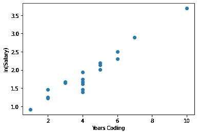

图 6:数据科学家样本按编码年限的工资自然对数(万€)。

```
slope, intercept = fit_lr(np.array(yearsCoding[0]), np.log(np.array(salaries[0])))plt.scatter(yearsCoding[0], np.log(salaries[0]))
plt.xlabel('Years Coding')
plt.ylabel('ln(Salary)')
plt.plot(yearsCoding[0],slope*np.array(yearsCoding[0]) + intercept, color='r');
```

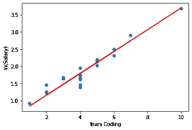

图 7:最佳拟合线(红色)对数据科学家样本的工资(10，000€)的自然对数和编码年数之间的关系进行建模。

```
print('Slope=' + str(slope))
print('Intercept=' + str(intercept))Slope=0.3173211894646696
Intercept=0.5195321580809141
```

通过转换，我们看到最佳拟合线实际上解释了编码的可变年数和转换后的可变薪金之间的关系。但是请注意，原始变量之间的关系不是线性的，而是指数关系。

在这种情况下，编码 15 年的数据科学家的工资是多少？

```
np.exp(slope * 15+intercept)196.24227641696947
```

这将是几乎 2M€！将其与我们之前使用的线性数据集的结果进行比较。

# 结论

本文介绍了如何解决线性回归问题，然后使用我们的最佳拟合线来推断我们的参数。在这种情况下，我们关注斜率参数，使用置信区间和假设检验来评估两个感兴趣的变量之间的关联类型。最后，我们引入了转换变量的概念来处理数据可能具有非线性模式的事实。

保持联系: [LinkedIn](https://www.linkedin.com/in/luisbrasroque/)

# 练习

你将在下周的文章中找到答案。

1.  Márcia 收集了便携式电脑随机样本的电池寿命和价格数据。根据下面提供的数据，总体斜率为 0 的零假设的检验统计量是什么？
2.  芮随机抽取了一些同事，注意到他们的年龄和他们昨天步行的公里数成正比。回归线斜率的 95%置信区间为(15.4，155.2)。芮想用这个区间在 5%的显著性水平上检验 H_0: β=0 vs. H_1: β ≠ 0。假设推断的所有条件都已满足。芮应该得出什么结论？

## 上周的答案

1.  根据冲浪板经销商的说法，66%的冲浪板是常见的，25%是不常见的，9%是罕见的。José想知道他和他的朋友拥有的板子的稀有程度是否遵循这种分布，所以他随机抽取了 500 块板子并记录了它们的稀有程度。结果如下表所示。进行拟合优度测试，以确定 José和他的朋友拥有的冲浪板的稀有程度分布是否与声称的百分比不一致。

```
table = [['Cards', 345, 125, 30]]
alpha = 0.05
df = pd.DataFrame(table)
df.columns = ['Rarity level', 'Common', 'Uncommon', 'Rare']
df = df.set_index('Rarity level')
df
```


```
arr = df.to_numpy()

arr = np.concatenate((arr, (np.sum(arr)*np.asarray([0.66, 0.25, 0.09])).reshape(1,-1)))chi_sq_statistic = np.sum((arr[0]-arr[1])**2/arr[1])
chi_sq_statistic5.681818181818182print('P-value = ' + str(np.round(1-chi2.cdf(chi_sq_statistic, df =2), 4)))P-value = 0.0584if 1-chi2.cdf(chi_sq_statistic, df =2) < alpha:
    print('Reject H_0')
else:
    print('Fail to reject H_0')Fail to reject H_0
```