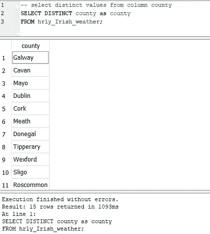
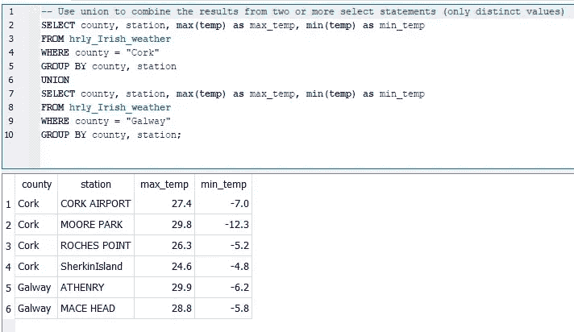
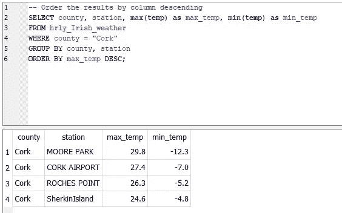
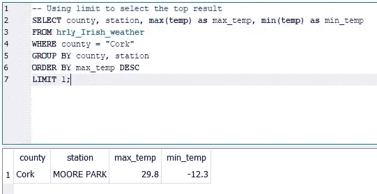
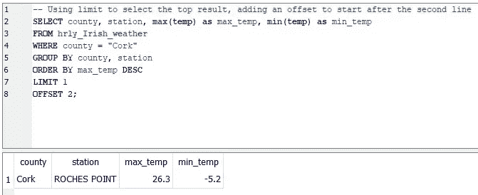

# 高级 SQL 操作

> 原文：<https://towardsdatascience.com/advanced-sql-operations-8856084a95a8?source=collection_archive---------13----------------------->

## 查看更高级的 SQL 操作，以从爱尔兰天气数据集中提取额外的数据洞察。

施泰耶·希勒沃特在 [Unsplash](https://unsplash.com?utm_source=medium&utm_medium=referral) 上的照片

在上一篇文章中，我们开始了解可以执行的基本 SQL 操作。这些操作帮助我们对数据集有了初步的了解。他们确保我们优化了解释器，以有效地分析数据。

 [## 经受 SQL 解释器的考验

### 理解解释器是如何构造 SQL 查询的，可以使数据专家的工作变得更加容易

medium.com](https://medium.com/codex/weathering-the-sql-interpreter-13ebaa175955) 

本文旨在更深入地研究和回顾更高级的 SQL 操作。

**鲜明的**

distinct 操作旨在显示列中包含的唯一值。查看数据集时，可能存在多个重复值。一些列可能包含一些离散值，这些值会产生一个简短的唯一值列表。而具有大范围值的列(如连续列)会有大量离散值。意识到这种差异有助于理解列的基数。对于连续变量，划分为单独范围值的方法可以提供更多信息。

代码 1.1 概述了列中的不同值

SQL 输出 1.1 是对 county 列的不同查询的结果

从代码 1.1 和下面的输出中，我们可以看到 county 列有一个简短的唯一值列表。对 continuous temperature 列执行相同的操作会产生一个更大的列表。

**联合**

UNION 操作旨在将两个或多个查询的结果组合成一个结果输出。在大多数数据库中，有两种选择。首先，UNION 语句组合了来自所提供查询的所有唯一值。这旨在将输出减少到最少数量的值。小心地按正确的顺序排列查询可以减少显示错误结果顺序的机会。第二个选项是 UNION ALL 语句，它旨在将所有值组合在一起，而不执行任何重复的检查。

代码 1.2 通过联合合并两个查询结果

从代码 1.2 开始，我们创建了两个查询，这两个查询组合起来显示一个数据集中的汇总值。我们需要确保每个查询中显示的相同列的顺序相同。如果一个列只存在于一个查询中，那么相应的列应该在另一个查询中设置为缺失值。

SQL Output 1.2 来自两个 SQL 查询结果的所有不同值的联合

上面的输出显示两个查询已经堆叠在一起，并且所有的唯一值都保留了下来。

**排序依据**

以正确的顺序输出有助于向最终用户显示附加信息。使用 order by 语句，我们能够以类似于 group by 语句的方式对结果进行排序。可以使用各种列，例如:现有列、列别名或聚合函数。

代码 1.3 查询同一订单的两个变体

代码 1.3 中显示的代码显示了同一查询的变体，在感兴趣的列后添加了关键字 DESC。包含此关键字可确保结果以降序显示，因为默认操作是升序。

SQL 输出 1.3 创建最高温度的降序

SQL 输出 1.3 突出显示了应用于最高温度的下降操作的结果。

**极限和偏移**

当第一次与数据集交互时，我们有兴趣了解数据样本是什么样的。通过查看数据样本，我们可以获得关于列如何显示的有价值的见解。它允许开发人员快速产生数据分析想法。此外，当开始产生派生变量时，我们可以通过在较小的样本上执行它们来减少操作的开销。一旦我们对样本的操作感到满意，就可以将它们转移到整个群体。然而，我们必须始终意识到，小样本可能与总体差异很大，因此需要进行其他分析，以确保不会产生奇怪的结果。

代码 1.4 极限方法的两种变化

从上面显示的代码中，我们可以看到每次都提取顶部的记录，并使用偏移量进行了轻微的修改。

选择顶部记录的 SQL 输出 1.4 结果

正如 SQL 输出 1.4 所示，在应用了其他 SQL 操作之后，已经提取了顶部的记录。此示例从整个数据集中为筛选的数据挑选出最高温度。

偏移前两个结果行后，SQL 输出上限值的 1.5 个结果

通过引入偏移操作，我们能够排除前两个结果并显示下一个最佳输出。如果您意识到输出将包含一些可能影响列解释方式的异常值，这种分析可能会很有用。

**窗口**

旨在从结果集中创建一个包含一行或多行的窗口。有很多种方法可以应用于这种操作。我们展示了一些高级方法，可以帮助快速总结感兴趣窗口中的列。

代码 1.5 使用窗口对结果进行分区

SQL 输出 1.6 从窗口 order by 方法创建等级值

row_number 突出显示了 partition 子句中的行数。而等级显示了与其他值相比的相对等级。在上面的输出中，我们看到窗口操作的相似值显示为相同的等级值。

## 结论

使用高级 SQL 技术确实有助于提高从数据集发现的数据洞察力。在本文中，我们看到了检查唯一值如何有助于开发聚合统计数据。然而，随着订单语句的添加，最高或最低值可以真正显示出来。union 的使用有助于堆叠数据集分析，这对于时间序列输出非常有效。当我们窥视数据集内部时，引入限制可以帮助初始发现过程。最后，对窗口功能的简要介绍有助于在单独的窗口中查看数据。

*感谢阅读*