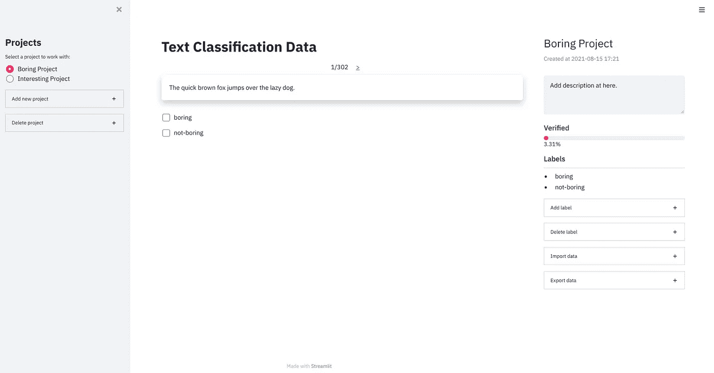

# 高级 Streamlit:数据标签工具的会话状态和回调

> 原文：<https://towardsdatascience.com/advanced-streamlit-session-state-and-callbacks-for-data-labelling-tool-1e4d9ad32a3f?source=collection_archive---------4----------------------->

## 我制作的一个数据标签工具中的 Streamlit 会话状态和回调的例子。



图片由作者提供。

如今，使用 Streamlit[创建一个 web 应用程序非常简单，但是在构建复杂的东西时会有一些限制。其中之一是缺乏有状态性，因为每次我们与小部件交互时，代码中的变量都会重新初始化。好消息是 Streamlit 现在在 0.84 版本中提供了对会话状态和回调函数的本地支持。我们现在可以跨重新运行存储变量，并在与小部件交互时定义我们的自定义事件处理程序。](https://streamlit.io/)

# 会话状态

自 2019 年 10 月以来，会话状态的黑客攻击就已经存在，但新的`st.session_state`为我们提供了一个访问有状态变量的优雅解决方案。在我的数据标记工具中，会话状态的一个用例是能够保存所选的项目。该应用程序需要知道有哪些可用的项目，以及该项目正在进行中。这可以通过以下方式简单实现:

```
import streamlit as st# set variables in session state
st.session_state.projects = [
    'Boring Project', 'Interesting Project'
]
st.session_state.current_project = st.radio(
    'Select a project to work with:',
    st.session_state.projects,
)
```

下一步是获取所选项目的数据。除了选定的项目，该应用程序还需要获取数据的行索引。为简单起见，我们假设有一个从数据库中提取数据的函数，如下所示:

```
def fetch_data(project_name: str, row_index: int):
    """ A simple example function to fetch data. """
    dbs = {
        'Boring Project': [...],
        'Interesting Project': [...],
    }
    return dbs[project_name][row_index]  # output can be any formif 'current_project' in st.session_state:
    row_index = st.session_state.get('row_index', 0)
    data = fetch_data(st.session_state.current_project, row_index)
```

一旦用户单击下一个或上一个数据，会话状态中的`row_index`变量可以设置为另一个数字，新数据将自动加载。

```
# examples to update row index
if st.button('Next', key='next_data'):
    st.session_state.row_index += 1if st.button('Previous', key='previous_data'):
    st.session_state.row_index -= 1
```

# 复试

回调是当输入小部件被触发时调用的函数。支持回调的 Streamlit widgets 有`st.button()`、`st.radio()`、`st.text_input()`等。让我们看一个在提交按钮中添加新项目的回调例子。

```
def submit_add_project(project_name: str):
    """ Callback function during adding a new project. """
    # display a warning if the user entered an existing name
    if project_name in st.session_state.projects:
        st.warning(f'The name "{project_name}" is already exists.')
    else:
        st.session_state.projects.append(project_name)new_project = st.text_input('New project name:',
                            key='input_new_project_name')
st.button('Add project', key='button_add_project',
          on_click=submit_add_project, args=(new_project, ))
```

注意回调函数需要`project_name`参数，因此我们需要使用`args`传递参数。除了添加新项目之外，我们还应该允许用户通过以下方式删除项目:

```
def submit_delete_project(project_name: str):
    """ Callback function during deleting an existing project. """
    st.session_state.projects.remove(project_name)to_delete = st.selectbox('Project to be deleted:',
                         st.session_state.projects)
st.button('Delete project', key='button_delete_project',
          on_click=submit_delete_project, args=(to_delete, ))
```

# 结论

本文展示了一些会话状态和回调的例子，这些例子使应用程序能够在重新运行和与小部件交互时保留变量。我建议您尝试与他们深入了解，并查看 streamlit [博客帖子](https://blog.streamlit.io/session-state-for-streamlit/)。最后，您可以在 [Github](https://github.com/chiachong/cry-for-help) 中找到数据标签工具的 repo。

这是我的第一篇媒体文章，我非常感谢你们成为我的读者。希望你喜欢这篇文章，并从中学到一些东西。谢谢你的时间。注意安全。