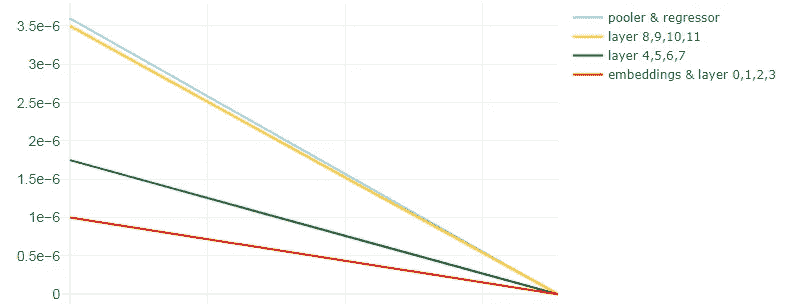

# 微调变压器的先进技术

> 原文：<https://towardsdatascience.com/advanced-techniques-for-fine-tuning-transformers-82e4e61e16e?source=collection_archive---------0----------------------->

## [提示和技巧](https://towardsdatascience.com/tagged/tips-and-tricks)

## 学习这些先进的技术，看看它们如何帮助改善结果


用 Python 代码生成的 Transformer 单词云。作者图片

T 变压器——大家好，我们又见面了。我们有个约会，不是吗，罗伯塔？

如果你已经阅读并坚持了我之前关于 [**变形金刚的帖子，你能评价阅读段落的复杂性吗？**](/transformers-can-you-rate-the-complexity-of-reading-passages-17c76da3403) 太棒了！这意味着你很可能已经熟悉了变压器微调或培训过程的基础。如果你没有看到这个帖子，你可以访问下面的链接。

</transformers-can-you-rate-the-complexity-of-reading-passages-17c76da3403>  

你的模特怎么样了？它能取得相当好的结果吗？或者你的变压器模型遭受性能和不稳定性？如果是，根本原因通常很难诊断和确定。这类问题通常在大型模型和小型数据集上更为普遍。相关数据和下游任务的性质和特征也有一定影响。

如果您的变压器的性能没有达到您的预期，您能做什么？您可以尝试超参数调谐。此外，你也可以尝试使用一些高级的训练技巧，我将在这篇文章中介绍。这些技术可用于微调 BERT、ALBERT、RoBERTa 等变压器。

# 内容

[1。分层学习率衰减(LLRD)](#6196)
[2。预热步骤](#ee6f)
[3。重新初始化预训练层](#1fbc)
[4。](#12b3)
[5 随机加权平均法。频繁评估](#dea1)
[结果](#811e)
[总结](#7f5b)

> 对于我们在这篇文章中要做的所有高级微调技术，我们将使用我们从 [**变形金刚中得到的相同模型和数据集，你能评价阅读段落的复杂性吗？**](/transformers-can-you-rate-the-complexity-of-reading-passages-17c76da3403)
> 
> 最后，我们将能够将基本微调的结果与我们通过应用高级微调技术获得的结果进行相对比较。

# 1.分层学习率衰减(LLRD)

在[重温少样本 BERT 微调](https://arxiv.org/abs/2006.05987)中，作者将**逐层学习速率衰减**描述为"*一种对顶层应用较高学习速率、对底层应用较低学习速率的方法。这是通过设置顶层的学习率并使用乘法衰减率从上到下逐层降低学习率来实现的*”。

在[用于文本分类的通用语言模型微调](https://arxiv.org/abs/1801.06146)中也表达了被称为**区别性微调**的类似概念。

> “区别性微调允许我们以不同的学习率调整每一层，而不是对模型的所有层使用相同的学习率”

所有这些都是有意义的，因为 Transformer 模型中的不同层通常捕获不同种类的信息。底层通常编码更常见、通用和广泛的信息，而更接近输出的顶层编码更本地化和特定于手头任务的信息。

在我们开始实施之前，让我们快速回顾一下我们为 [**变形金刚所做的基本微调，你能评价一下阅读段落的复杂性吗？**](/transformers-can-you-rate-the-complexity-of-reading-passages-17c76da3403)

在由一个嵌入层和 12 个隐藏层组成的`roberta-base`模型上，我们使用了线性调度器，并在优化器中设置了初始学习速率`1e-6`(即 0.000001)。如图 1 所示，调度程序创建了一个学习率在训练步骤中从`1e-6`线性下降到零的时间表。


图 1:初始学习率为 1e-6 的线性时间表。作者图片

现在，要实现逐层学习速率衰减(或区别性微调)，有两种可能的方法。

第一种方法是遵循[中描述的方法，重新考虑少样本 BERT 微调](https://arxiv.org/abs/2006.05987)。我们为顶层选择学习速率`3.5e-6`，并使用乘法衰减速率`0.9`从上到下逐层降低学习速率。这将导致底层(`embeddings`和`layer0`)的学习率大致接近`1e-6`。我们在一个名为`**roberta_base_AdamW_LLRD**`的函数中实现了这一点。

好了，我们已经设置了隐藏层的学习速率。`pooler`和`regressor`头怎么样？对于他们，我们选择`3.6e-6`，比顶层略高的学习率。

在下面的代码中，`head_params`、`layer_params`和`embed_params`是定义我们想要优化的参数、学习率和权重衰减的字典。所有这些参数组都被传递到由函数返回的`AdamW`优化器中。

下面是具有逐层学习率衰减的线性时间表的样子:


图 2:具有逐层学习速率衰减的线性时间表。作者图片

实现逐层学习速率衰减(或区别性微调)的第二种方法是将层分成不同的组，并对每个组应用不同的学习速率。我们将此称为**分组 LLRD** 。

使用一个新的函数`**roberta_base_AdamW_grouped_LLRD**`，我们将`roberta-base`模型的 12 个隐藏层分成 3 组，其中`embeddings`附加到第一组。

*   集合 1:嵌入+层 0，1，2，3(学习率:`1e-6`)
*   集合 2:第 4、5、6、7 层(学习率:`1.75e-6`)
*   集合 3:第 8、9、10、11 层(学习率:`3.5e-6`)

与第一种方法相同，我们将`3.6e-6`用于`pooler`和`regressor`头部，这是一个略高于顶层的学习速率。

下面是分组 LLRD 的线性时间表:



图 3:分组 LLRD 的线性时间表。作者图片

# 2.热身步骤

对于我们使用的线性调度程序，我们可以应用预热步骤。例如，应用 50 个预热步骤意味着在前 50 个步骤(预热阶段)，学习率将从 0 线性增加到优化器中设置的初始学习率。之后，学习率将开始线性下降至 0。


图 4:带 LLRD 和 50 个热身步骤的线性时间表。作者图片

下图显示了在步骤 50 中各层的学习率。这些是我们为优化器设置的学习率。


图 5:悬停文本反映了第 50 步的学习率。作者图片

要应用预热步骤，在`get_scheduler`功能上输入参数`num_warmup_steps`。

```
scheduler = transformers.get_scheduler(
                "linear",    
                optimizer = optimizer,
                num_warmup_steps = 50,
                num_training_steps = train_steps
)
```

或者，你也可以使用`get_linear_schedule_with_warmup`。

```
scheduler = transformers.get_linear_schedule_with_warmup(                
                optimizer = optimizer,
                num_warmup_steps = 50,
                num_training_steps = train_steps
)
```

# 3.重新初始化预训练层

微调变压器是一件轻而易举的事，因为我们使用预先训练的模型。这意味着我们不是从零开始训练，这会占用大量的资源和时间。这些模型通常已经在大型文本数据语料库上进行了预训练，并且它们包含我们可以使用的预训练权重。然而，为了获得更好的微调结果，有时我们需要在微调过程中丢弃一些权重并重新初始化它们。

那么我们如何做到这一点呢？前面，我们讨论了转换器的不同层捕获不同类型的信息。底层通常编码更一般的信息。这些是有用的，所以我们想保留这些低级的表示。我们想要刷新的是更接近输出的顶层。它们是对预训练任务更具体的信息进行编码的层，现在我们希望它们适应我们的。

我们可以在之前创建的`MyModel`类中这样做。初始化模型时，我们传入一个参数，指定要重新初始化的顶部`n`层。你可能会问，为什么是`n`？事实证明，为`n`选择一个最佳值是至关重要的，可以导致更快的收敛。也就是说，有多少顶层要重新初始化？这要视情况而定，因为每个模型和数据集都是不同的。在我们的例子中，`n`的最佳值是 5。如果重新初始化超过最佳点的更多层，您可能会开始经历恶化的结果。

在下面的代码中，我们使用模型的`initializer_range`定义的平均值 0 和标准偏差重新初始化`nn.Linear`模块的权重，并使用值 1 重新初始化`nn.LayerNorm`模块的权重。偏差被重新初始化为值 0。

如代码所示，我们还重新初始化了`pooler`层。如果你没有在你的模型中使用`pooler`，你可以省略`_do_reinit`中与它相关的部分。

重新初始化层的代码改编自[这里的](https://www.kaggle.com/rhtsingh/on-stability-of-few-sample-transformer-fine-tuning?scriptVersionId=67176591&cellId=9)。

# 4.随机加权平均法

**随机权重平均(SWA)** 是[中提出的深度神经网络训练技术，平均权重导致更宽的最优值和更好的泛化能力](https://arxiv.org/abs/1803.05407)。据作者称，

> “SWA 非常容易实现，与传统的训练方案相比，几乎没有计算开销”

那么，SWA 是如何工作的呢？如 PyTorch 博客[所述，SWA 由两部分组成:](https://pytorch.org/blog/pytorch-1.6-now-includes-stochastic-weight-averaging/)

*   首先，它使用一个**修改的学习率**时间表。例如，我们可以在训练时间的前 75%使用标准的衰减学习率策略(例如我们正在使用的线性时间表),然后在剩余的 25%时间将学习率设置为一个相当高的恒定值。
*   第二，它对所遍历的网络的权重进行**平均。例如，在最后 25%的训练时间内，我们可以保持最后获得的重量的连续平均值。训练完成后，我们将网络的权重设置为计算出的 SWA 平均值。**

> **py torch 中如何使用 SWA？**
> 
> 在`torch.optim.swa_utils`中，我们实现了所有的 SWA 成分，以方便在任何模型中使用 SWA。
> 
> 特别地，我们实现了用于 SWA 模型的`AveragedModel`类、`SWALR`学习速率调度器和`update_bn`实用函数，以在训练结束时更新 SWA 批量标准化统计。
> 
> 来源: [PyTorch 博客](https://pytorch.org/blog/pytorch-1.6-now-includes-stochastic-weight-averaging/)

SWA 很容易在 PyTorch 中实现。您可以参考下面来自 [PyTorch 文档](https://pytorch.org/docs/stable/optim.html#stochastic-weight-averaging)的示例代码来实现 SWA。


用于实施 SWA 的示例代码来自 [PyTorch 文档](https://pytorch.org/docs/stable/optim.html#stochastic-weight-averaging)

为了在我们的`run_training`函数中实现 SWA，我们为`swa_lr`接受一个参数。该参数是设定为常数值的 SWA 学习率。在我们的例子中，我们将使用`2e-6`来表示`swa_lr`。

因为我们想切换到 SWA 学习率计划，并开始收集时段 3 的参数的 SWA 平均值，我们为`swa_start`指定 3。

对于每个文件夹，我们初始化`swa_model`和`swa_scheduler`以及数据加载器、模型、优化器和调度器。`swa_model`是累计权重平均值的 SWA 模型。

接下来，我们遍历这些时期，调用`train_fn`并传递给它`swa_model`、`swa_scheduler`和一个布尔指示器`swa_step`。这是一个指示符，告诉程序在时段 3 切换到`swa_scheduler`。

在`train_fn`中，从`run_training`函数传入的参数`swa_step`控制切换到`SWALR`以及平均模型`swa_model`的参数更新。

SWA 的优点是我们可以将它用于任何优化器和大多数调度器。在 LLRD 的线性时间表中，我们可以从图 6 中看到，在时段 3 切换到 SWA 学习速率时间表后，学习速率如何在`2e-6`保持不变。


图 6:带 LLRD、50 个热身步和 SWA 的线性时间表。作者图片

下面是在分组 LLRD 上实施 SWA 后，线性时间表的样子，有 50 个热身步骤:


图 7:具有分组 LLRD、50 个热身步骤和 SWA 的线性时间表。作者图片

你可以在这个 [PyTorch 博客](https://pytorch.org/blog/pytorch-1.6-now-includes-stochastic-weight-averaging/)和这个 [PyTorch 文档](https://pytorch.org/docs/stable/optim.html#stochastic-weight-averaging)上阅读更多关于西南铝的细节。

# 5.频繁评估

频繁评估是另一种值得探索的技术。它简单的意思是，我们将对该时期内的每`x`批训练数据执行验证，而不是在每个时期验证一次。这需要在我们的代码中做一点结构上的改变，因为目前训练和验证功能是分开的，每个时期都调用一次。

我们要做的是创建一个新函数，`train_and_validate`。对于每个时期，`run_training`将调用这个新函数，而不是分别调用`train_fn`和`validate_fn`。


图 8:作者图片

在`train_and_validate`内部，对于每一批训练数据，都会运行模型训练代码。然而，为了验证，只会在每`x`批训练数据上调用`validate_fn`。因此，如果`x`是 10，并且如果我们有 50 批训练数据，那么每个时期将进行 5 次验证。


图 9:作者图片

# 结果

好了，激动人心的部分来了…结果！

这些技术能对结果有如此大的改善，这是相当令人惊讶的。结果显示在下表中。

平均 RMSE 分数从 0.589 到 0.5199，在应用了这篇文章中提到的所有先进技术后，有了基本的微调。

表 1:微调技术的结果

# 摘要

在本帖中，我们介绍了用于微调变压器的各种技术。

☑️首先，我们使用**逐层学习率衰减(LLRD)** 。LLRD 背后的主要思想是将不同的学习率应用于变压器的每一层，或者在**分组 LLRD** 的情况下应用于层的分组。具体来说，顶层应该比底层具有更高的学习速率。

☑️接下来，我们将**热身步骤**应用到学习率计划中。对于线性时间表中的预热步骤，学习率从 0 线性增加到预热阶段优化器中设置的初始学习率，之后开始线性减少到 0。

☑️:我们还为变压器的顶层`n`执行了**重新初始化**。为`n`选择一个最佳值是至关重要的，因为如果重新初始化超过最佳点的更多层，您可能会开始经历恶化的结果。

☑️:然后我们应用了**随机加权平均(SWA)** ，这是一种深度神经网络训练技术，它使用了一种修改的学习速率表。在训练时间的最后一段，它还保持了在结束时获得的重量的连续平均值。

☑️最后但同样重要的是，我们在变压器微调过程中引入了**频繁评估**。我们不是在每个时期验证一次，而是在该时期内对每`x`批训练数据进行验证。

使用所有这些技术，我们看到结果有了很大的改善，如表 1 所示。

*如果你喜欢我的帖子，别忘了点击* [***关注***](https://peggy1502.medium.com/) *和* [***订阅***](https://peggy1502.medium.com/subscribe) *获取邮件通知。*

*可选地，您也可以* [*注册*](https://peggy1502.medium.com/membership) *成为媒体会员，以获得媒体上每个故事的全部访问权限。*

📑*访问此*[*GitHub repo*](https://github.com/peggy1502/Data-Science-Articles/blob/main/README.md)*获取我在帖子中分享的所有代码和笔记本。*

2021 保留所有权利。

# 参考

[1] T. Zhang，F. Wu，A. Katiyar，K. Weinberger 和 Y. Artzi，[重温少样本 BERT 微调](https://arxiv.org/abs/2006.05987) (2021)

[2] A .塔库尔，[接近(几乎)任何机器学习问题](https://www.amazon.com/dp/8269211508) (2020)

[3] C .孙，x .邱，y .徐，x .黄，[如何微调用于文本分类的 BERT？](https://arxiv.org/abs/1905.05583) (2020)

[4] P .伊兹迈洛夫、d .波多普里欣、t .加里波夫、d .维特罗夫和 a .威尔逊，[平均权重导致更宽的最优值和更好的泛化](https://arxiv.org/abs/1803.05407) (2019)

[5] J. Howard 和 S. Ruder，[用于文本分类的通用语言模型微调](https://arxiv.org/abs/1801.06146) (2018)