# Python 中的高级时间序列分析:季节性和趋势分析(分解)，自相关

> 原文：<https://towardsdatascience.com/advanced-time-series-analysis-in-python-decomposition-autocorrelation-115aa64f475e?source=collection_archive---------0----------------------->

## 和其他技术来发现多个时间序列之间的关系


**照片由** [**乔丹本顿**](https://www.pexels.com/@bentonphotocinema?utm_content=attributionCopyText&utm_medium=referral&utm_source=pexels) **上** [**像素**](https://www.pexels.com/photo/shallow-focus-photography-of-hourglass-1095602/?utm_content=attributionCopyText&utm_medium=referral&utm_source=pexels)

# 介绍

继我的[非常受欢迎的帖子](/every-pandas-function-you-can-should-use-to-manipulate-time-series-711cb0c5c749?source=your_stories_page-------------------------------------)和 [Kaggle notebook](https://www.kaggle.com/bextuychiev/every-pandas-function-to-manipulate-time-series/comments) 之后，现在是时候将这个 TS 项目的轨迹可视化了。

这篇文章是关于构成深度时间序列分析的核心过程。具体来说，我们将讨论:

*   时间序列的分解——季节性和趋势分析
*   同时分析和比较多个时间序列
*   计算自相关和偏自相关以及它们代表什么

以及多个系列之间的季节性或趋势是否相互影响。

最重要的是，我们将建立一些非常酷的可视化，这个图像应该是你将要学习的东西的预览。

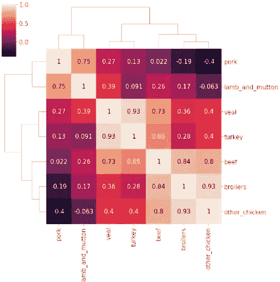

我希望在写这篇文章的时候，你和我一样对学习这些东西感到兴奋。我们开始吧。

> 在这里阅读文章[的笔记本](https://www.kaggle.com/bextuychiev/advanced-time-series-analysis-decomposition)。

<https://ibexorigin.medium.com/membership>  

获得由强大的 AI-Alpha 信号选择和总结的最佳和最新的 ML 和 AI 论文:

<https://alphasignal.ai/?referrer=Bex>  

# 1.时间序列分解

任何时间序列分布都有 3 个核心部分:

1.  **季节性** —数据是否有明确的循环/周期性模式？
2.  趋势——数据代表了总体的上升还是下降趋势？
3.  **噪声** —有哪些与其余数据不一致的异常值或缺失值？

将一个时间序列分解成这些部分称为**分解，**我们将详细探讨每一个部分。

## 1.1 季节性分析

考虑一下 TPS 月 Kaggle 游乐场数据集:

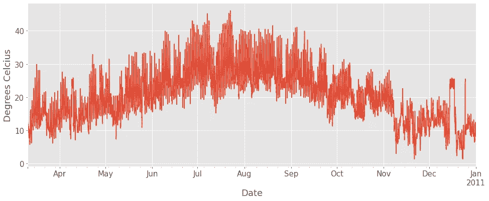

显然，夏季气温较高，我们预计这种现象每年都会重复。然而，人眼及其检测图案的能力只能到此为止。

例如，可能更难从如下图中找到季节模式:

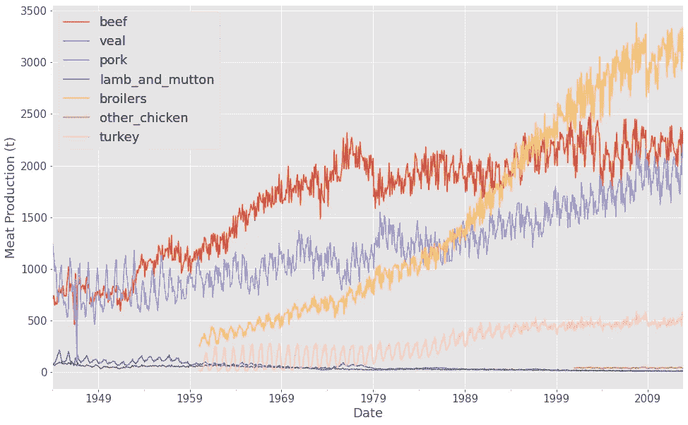

为了从上面的时间序列中找到隐藏的季节模式，我们将使用`statsmodels`中的`seasonal_decompose`函数:

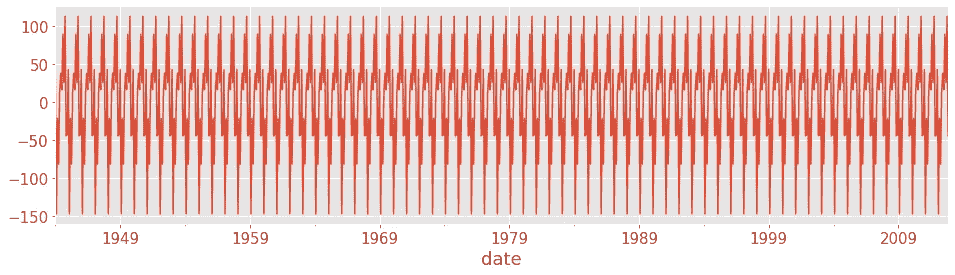

对“牛肉”时间序列使用`sm.tsa.seasonal_decompose`会返回一个`DecomposeResult`对象，该对象具有类似于`seasonal`、`trend`和`resid`的属性(后面会详细介绍后两个属性)。

上面，我们在绘制季节性，但是这个图没有用，因为它有太多的噪音。让我们选择一个间隔，给这条线一些喘息的空间:

```
decomposition.seasonal["1999":"2005"].plot();
```

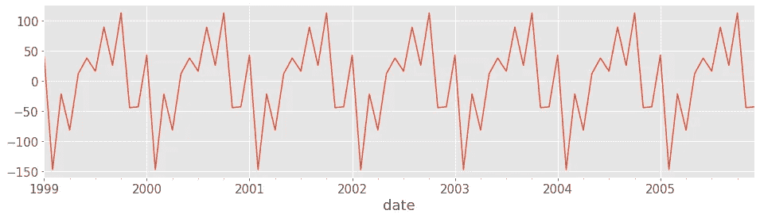

这张图显示，牛肉产量在每年年初确实下降，但在接近年底时达到顶峰。

> 关于`seasonal_decompose`功能的说明:默认情况下，它产生小数字。你必须自己控制它的各个方面，而且`plot`函数不接受大多数常规的 Matplotlib 参数。

现在，让我们绘制 5 年间所有肉类的季节性变化图:

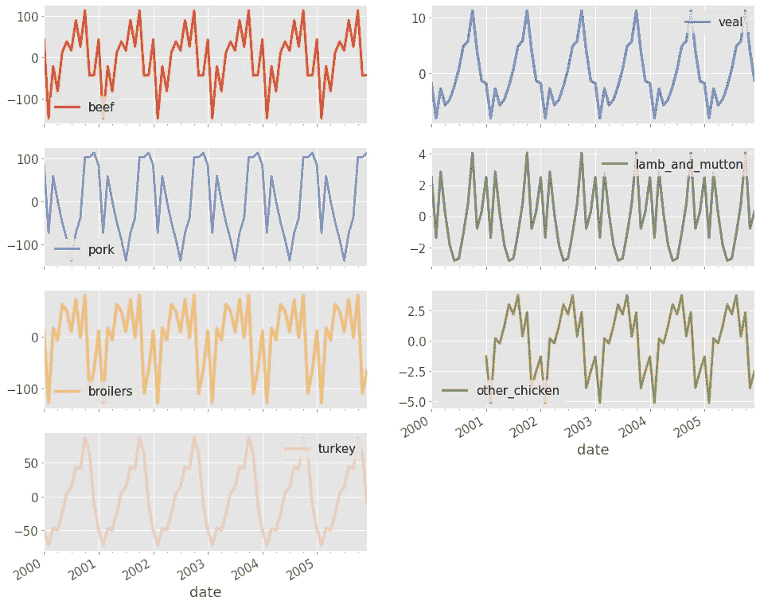

如你所见，每种肉类都有不同的季节性模式。现在，我们来探讨一下趋势。

## 1.2 趋势分析

同样，时间序列的总体趋势显示了它在一段时间内是增加、减少还是保持不变(持平)。上面的`DecomposeResult`对象包含的值显示了`trend`属性下时间序列的总体斜率。

让我们为肉类生产数据集绘制它们:

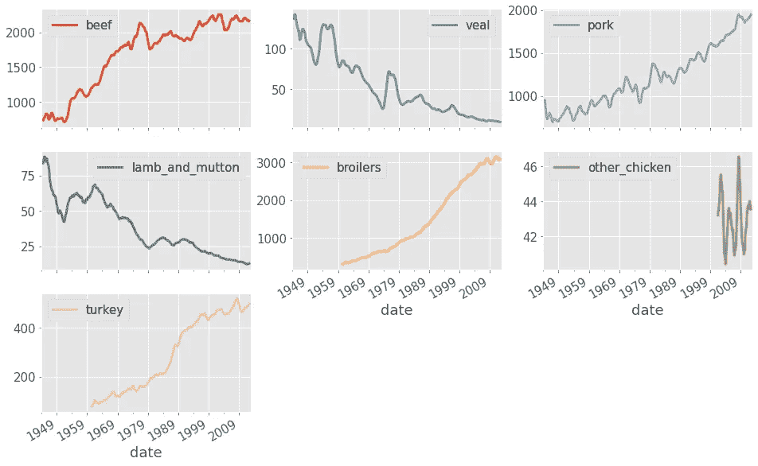

与我们一开始看到的简单线图相比，这个图非常有洞察力。事实上，我们现在看到，自 20 世纪 40 年代以来，羔羊肉和小牛肉产量急剧下降。

这可能部分是由于牛肉、肉鸡和火鸡的产量增加了两倍或三倍。我们现在正在进行有根据的猜测，但是我们将在后面的部分探索一些强有力的方法来验证它们。

## 1.3 噪音

时间序列的第三个组成部分是噪音。它不像其他两个组件那样花哨。它只显示随机和不规则的数据点，这些数据点不能归因于季节性或噪音。

您可以使用来自`DecomposeResult`对象的`resid`属性来绘制它们:

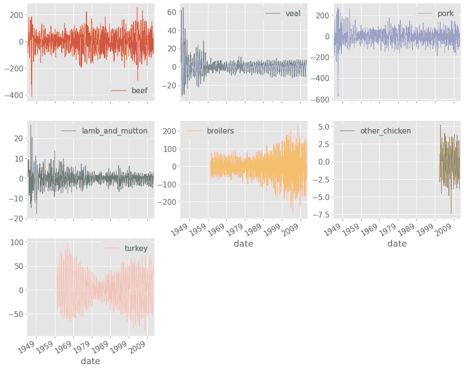

> 在整个`DecomposeResult`对象上调用`plot`将产生一个所有组件都显示在同一轴上的图。

分解你的时间序列有助于你以一种结构化的方式思考它们。不要把一个序列想象成一个随时间变化的值，你可以把它想象成一个具有特定季节性信号的分布或者一个具有特定斜率的特征。在特征工程和建模过程中，这种数据理解水平可能是一个关键因素。

# 2.使用多个时间序列

## 2.1 将军

处理多个时间序列存在一定的挑战。如我们所见，一个例子是每个分布的不同规模:

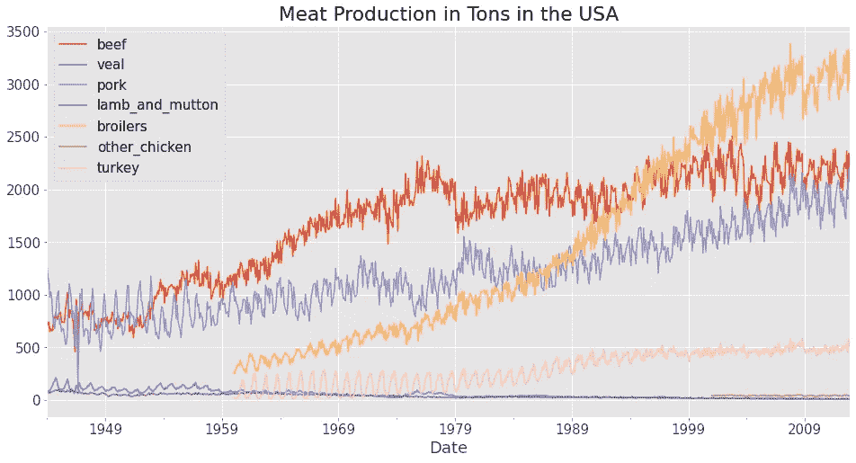

当具有较大鳞片的特征将其他特征挤压成一条直线(羔羊肉和小牛肉)时，不可能比较它们的生长。一种解决方案是使用标准化。

归一化时间序列时，将分布中的每个数据点除以第一个样本。这具有将每个数据点表示为相对于第一个样本的百分比增加的效果:

```
meat.div(meat.iloc[0]).head()
```

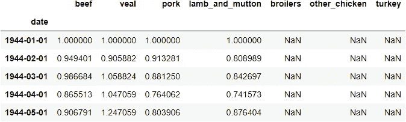

最棒的是，现在每个发行版都有相同的规模。让我们通过执行标准化来绘制肉类生产数据:

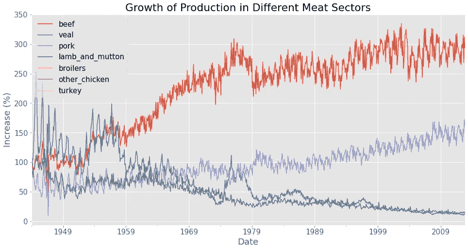

牛肉和猪肉的增长百分比最高，而小牛肉和羊肉的产量在特定时期内直线下降。

## 2.1 具有相关性的时间序列之间的关系

我知道你在说什么:“相关性？真的吗？有什么新内容…“

但是请原谅我。一个简单的关联热图确实能告诉我们很多变量之间的线性关系:

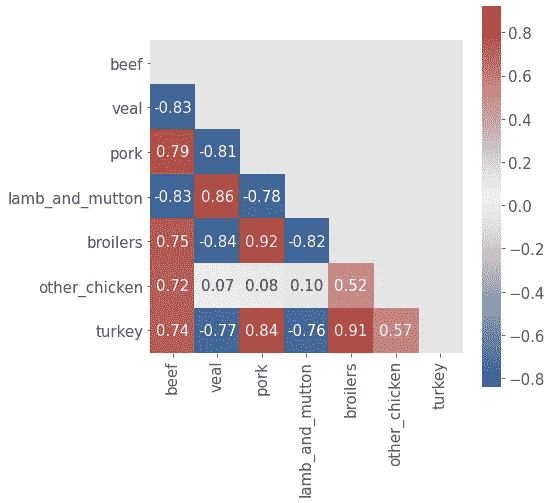

我们更感兴趣的是时间序列的基本组成部分如何相互影响。例如，让我们看看每个时间序列的季节性如何影响其他时间序列:

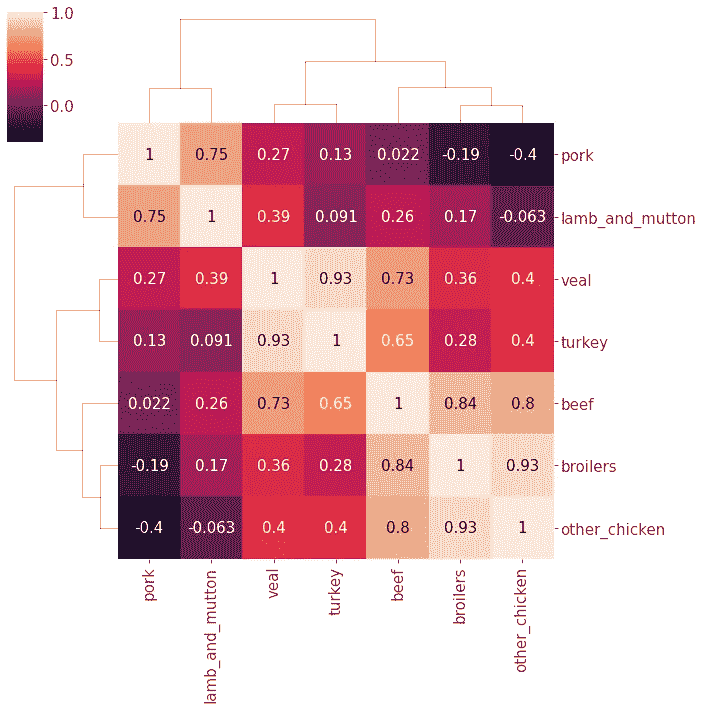

这一次，我们使用聚类图而不是热图，在树状图的帮助下立即查看密切相关的组。

该图告诉我们，牛肉、肉鸡和其他鸡肉的季节性密切相关。猪肉和羊肉也是如此。这种正相关可以表示接近的季节性匹配。

例如，牛肉、肉鸡和其他鸡肉的增加/减少模式可能在给定时期内经常匹配。

让我们对趋势也这样做，我认为这应该更有趣:

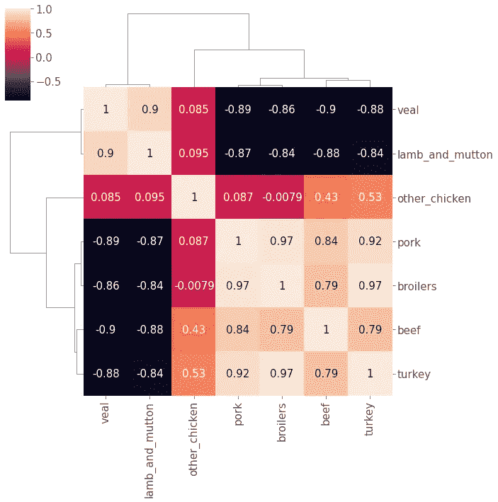

上面的图很棒，因为它帮助我们验证了趋势分析部分的假设。让我们再来看看肉类生产的标准化图:


你能把聚类图中的模式和线图匹配起来吗？例如，牛肉与羔羊肉/羊肉和小牛肉具有很强的负相关性。与此相匹配的事实是，牛肉产量增加了两倍，而其他两种产品的产量下降了约 75%(从线图中可以看出)。

在猪肉和小牛肉、羔羊肉和羊肉之间也可以观察到同样的现象。

## 2.2 相关性并不意味着因果关系

我希望你在对相关特征做出假设时小心行事。永远记住，相关性并不意味着因果关系。当两个特征高度相关时，这并不意味着一个特征的增加会导致另一个特征的增加。

我喜欢用的一个例子是，即使一个城镇中鹳的数量可以与新生婴儿的数量相关联，但这并不意味着鹳接生了婴儿。

可能需要一段时间来清楚地划分相关性和因果关系，所以你为什么不看看我的[关于这个话题的另一篇文章](https://towardsdev.com/how-to-not-misunderstand-correlation-75ce9b0289e?source=your_stories_page-------------------------------------)。

# 3.自相关和偏自相关

## 3.1 自相关

自相关是时间序列数据建模的强大分析工具。顾名思义，它涉及到计算相关系数。但是在这里，不是在两个特征之间进行计算，而是用一个滞后版本的时间序列来发现时间序列的相关性。

让我们先看一个示例图，并进一步解释:

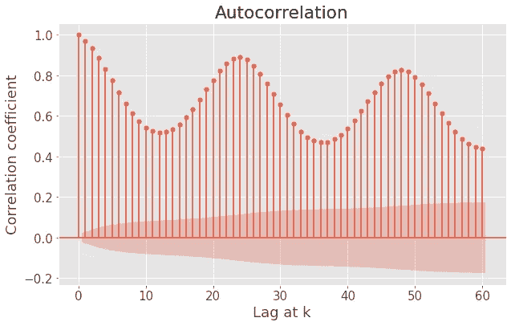

自相关函数图(ACF)的 x 轴是滞后数 *k* 。例如，当 k=1 时，通过将序列移动 1 来找到相关性。这和使用熊猫的`shift`功能是一样的:

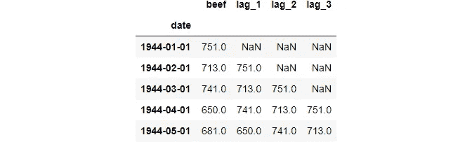

YAXis 是每个滞后 *k* 处的相关量。红色阴影区域是一个置信区间——如果条形的高度在该区域之外，则意味着相关性在统计上*显著*。

请停下来想一想，你能从 ACF 图中学到什么。

它们提供了另一种检测模式和季节性的方法。例如，以摄氏度为单位的温度的 ACF 图显示，每 15 个滞后的相关性降低，或者每 25 个滞后的相关性增加。

当时间序列中存在明显的趋势时，自相关性在小滞后(如 1 或 2)时往往较高。当季节性存在时，自相关以较大的滞后周期性上升。

让我们看另一个例子:

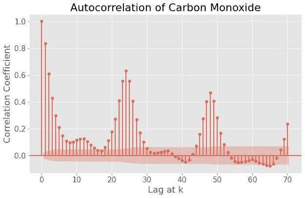

一氧化碳的 ACF 证实了小滞后往往具有高相关性。它还显示，每 25 个滞后，相关性显著增加，但很快下降到负值。但是大多数向下的柱线都在阴影区域内，表明它们*在统计上不显著*。

这种比较过去和现在数据点之间关系的能力具有独特的优势。如果您可以将现值与 k 个周期之前的点相关联，这也意味着您可以找到 k 个周期之后的值的链接。

此外，理解自相关是用 ARIMA 模型建模时间序列的关键(另一篇文章的主题)。

## 3.2 部分自相关

尽管讨论偏相关意味着我们走在了事情的前面，我还是会给你要点。

它类似于自相关——使用序列及其在 *k* 的滞后版本进行计算:

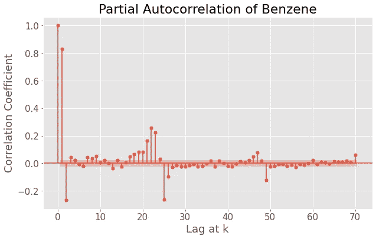

唯一的区别是，这种方法试图说明干预滞后的影响。例如，在滞后 3 处，部分自相关消除了滞后 1 和滞后 2 对计算相关性的影响。

虽然自相关对于分析时间序列的属性和选择使用哪种类型的 ARIMA 模型很有用，但偏相关可以告诉我们自回归模型的拟合阶数。

同样，当我们谈论预测时，将深入讨论这个主题。所以，[敬请期待](https://ibexorigin.medium.com/)！

## 摘要

恭喜你！

通过阅读这篇文章，你学会了剖析任何时间序列并获得有意义的见解的强大技术。最重要的是，您现在有能力将这些技术应用于多个时间序列，并批判性地评估它们之间的关系。

感谢您的阅读，下一期再见！

## 您可能也会感兴趣…

*   [每一个你可以(应该)用来操纵时间序列的熊猫函数](/every-pandas-function-you-can-should-use-to-manipulate-time-series-711cb0c5c749?source=your_stories_page-------------------------------------)
*   [多类分类指标综合指南](/comprehensive-guide-on-multiclass-classification-metrics-af94cfb83fbd?source=your_stories_page-------------------------------------)
*   [三阶段实用 Sklearn 功能选择](/4-part-practical-study-guide-to-sklearn-feature-selection-b959a28d9ef7?source=your_stories_page-------------------------------------)