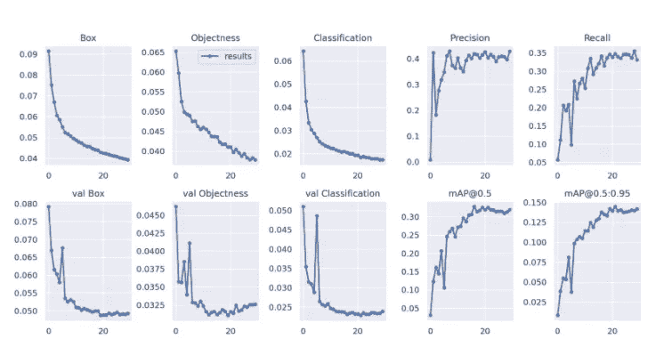

# 高级 YoloV5 教程—使用加权盒融合增强 YoloV5

> 原文：<https://towardsdatascience.com/advanced-yolov5-tutorial-enhancing-yolov5-with-weighted-boxes-fusion-3bead5b71688?source=collection_archive---------4----------------------->

## 关于使用 YoloV5 和提升其 WBF 性能的深入教程


埃里克·卡里姆·科内利斯在 [Unsplash](https://unsplash.com?utm_source=medium&utm_medium=referral) 上拍摄的照片

有大量的 YoloV5 教程，本文的目的不是重复这些内容，而是对其进行扩展。我最近参加了一个数据科学对象检测比赛，虽然我找到了大量创建基线的教程，但我没有找到任何关于如何扩展它的建议。此外，我想强调 YoloV5 配置中可能影响性能的最重要部分，因为毕竟数据科学主要是关于实验和超参数调整。

在此之前，我只想说，就框架和库如何工作而言，使用对象检测模型不同于使用图像分类模型。这是我注意到的事情，我花了一段时间才明白过来。大多数流行的对象检测模型，如 YoloV5、EfficientDet，都使用命令行界面来训练和评估，而不是使用编码方法。这意味着，从字面上看，你需要做的就是获得特定格式(COCO 或 VOC)的数据，然后将 cmd 指向它。这通常不同于使用代码训练和评估模型的影像分类模型。

## 数据预处理

YoloV5 希望你有两个目录，一个用于训练，一个用于验证。在这两个目录中，你需要另外两个目录，“图像”和“标签”。图像将包含实际的图像和标签应该有一个. txt 文件为每个图像与该图像的注释，文本文件应该有相同的名称作为其相应的图像。

注释格式如下:

```
<'class_id'> <'x_center'> <'y_center'> <width'> <'height'>
```

要在代码中实现这一点，您可能需要一个与此类似的函数，其中原始数据框包含图像条目、它们的类 id 以及它们的边界框:

```
def create_file(df, split_df, train_file, train_folder, fold):

    os.makedirs('labels/train/', exist_ok=True)
    os.makedirs('images/train/', exist_ok=True)
    os.makedirs('labels/val/', exist_ok=True)
    os.makedirs('images/val/', exist_ok=True)

    list_image_train = split_df[split_df[f'fold_**{**fold**}**']==0]['image_id']    
    train_df = df[df['image_id'].isin(list_image_train)].reset_index(drop=True)
    val_df = df[~df['image_id'].isin(list_image_train)].reset_index(drop=True)

    for train_img **in** tqdm(train_df.image_id.unique()):
        with open('labels/train/**{**train_img**}**.txt', 'w+') as f:
            row = train_df[train_df['image_id']==train_img]\
            [['class_id', 'x_center', 'y_center', 'width', 'height']].values
            row[:, 1:] /= SIZE # Image size, 512 here
            row = row.astype('str')
            for box **in** range(len(row)):
                text = ' '.join(row[box])
                f.write(text)
                f.write('**\n**')
        shutil.copy(f'**{**train_img**}**.png', 
                f'images/train/**{**train_img**}**.png')

    for val_img **in** tqdm(val_df.image_id.unique()):
        with open(f'**{**labels/val/**{**val_img**}**.txt', 'w+') as f:
            row = val_df[val_df['image_id']==val_img]\
            [['class_id', 'x_center', 'y_center', 'width', 'height']].values
            row[:, 1:] /= SIZE
            row = row.astype('str')
            for box **in** range(len(row)):
                text = ' '.join(row[box])
                f.write(text)
                f.write('**\n**')
        shutil.copy(f'**{**val_img**}**.png', 
                f'images/val/**{**val_img**}**.png')
```

来源:[卡格尔](https://www.kaggle.com/nxhong93/yolov5-chest-512)

注意:不要忘记保存在标签文本文件**中的边界框的坐标必须被标准化(从 0 到 1)。**这很重要。此外，如果图像有多个注释，在文本文件中，每个注释(预测+边界框)将位于单独的一行。

之后，您需要一个配置文件，其中包含标签的名称、类的数量以及训练和验证路径。

```
import yaml
classes = [ ‘Aortic enlargement’,
 ‘Atelectasis’,
 ‘Calcification’,
 ‘Cardiomegaly’,
 ‘Consolidation’,
 ‘ILD’,
 ‘Infiltration’,
 ‘Lung Opacity’,
 ‘Nodule/Mass’,
 ‘Other lesion’,
 ‘Pleural effusion’,
 ‘Pleural thickening’,
 ‘Pneumothorax’,
 ‘Pulmonary fibrosis’]data = dict(
 train = ‘../vinbigdata/images/train’, # training images path
 val = ‘../vinbigdata/images/val’, # validation images path
 nc = 14, # number of classes
 names = classes
 )with open(‘./yolov5/vinbigdata.yaml’, ‘w’) as outfile:
 yaml.dump(data, outfile, default_flow_style=False)
```

现在，您需要做的就是运行这个命令:

```
python train.py — img 640 — batch 16 — epochs 30 — data ./vinbigdata.yaml — cfg models/yolov5x.yaml — weights yolov5x.pt
```

## **根据经验需要注意的事项:**

好了，现在我们已经略读了基础知识，让我们看一下重要的东西:

1.  不要忘记标准化坐标
2.  如果您的初始性能比预期的差得多，发生这种情况的最可能的原因(我在许多其他竞争对手身上看到过这种情况)是您在预处理方面做了一些错误的事情。这看起来很琐碎，但有很多细节你必须要注意，尤其是如果你是第一次。
3.  YoloV5 有多个型号(yolov5s，yolov5m，yolov5l，yolov5x)，不要只挑最大的一个，因为它可能会过拟合。从中等水平的基线开始，并努力提高它。
4.  虽然我是在 512 张图片上训练的，但是我发现将-img 标志作为 640 传递可以提高性能
5.  不要忘记加载预训练的重量(-重量标志)。迁移学习将极大地提高你的表现，并节省你大量的训练时间(在我的例子中，大约 50 个周期，每个周期大约需要 20 分钟！)
6.  Yolov5x 需要大量的内存，当在批量大小为 4 的 512 个图像上训练时，它需要大约 14GB 的 GPU 内存(大多数 GPU 都有 8GB 左右的内存)。
7.  YoloV5 **已经使用了增强，**你可以选择你喜欢的或者不喜欢的，你所需要做的就是使用 yolov5/data/hyp.scratch.yml
8.  默认的 yolov5 训练脚本使用了[权重和偏差](https://wandb.ai/site)，老实说这给人留下了非常深刻的印象，它在模型训练时保存了你所有的指标**。但是，如果您想关闭它，只需将 WANDB_MODE="dryrun "添加到训练脚本标志中**
9.  我希望早点发现的一件事是，YoloV5 将大量有用的指标保存到目录 yolov5/runs/train/exp/中。训练后，您可以找到“混淆 _ 矩阵. png”和“结果. png ”,其中 results.png 应该是这样的:



图片由作者转载。可能最重要的两个指标是 mAP@0.5 和 mAP@0.5:0.95

## 用 WBF 预处理


照片由 [Unsplash](https://unsplash.com?utm_source=medium&utm_medium=referral) 上的 [Siebe Warmoeskerken](https://unsplash.com/@devetpan?utm_source=medium&utm_medium=referral) 拍摄

好了，现在你已经调整了超参数，升级了你的模型，测试了多种图像尺寸和交叉验证。是时候介绍一些提高性能的技巧了。

加权盒子融合是一种在训练之前(清理数据集)或训练之后(使预测更准确)动态融合盒子的方法。如果你想知道更多，你可以看看我的文章:

[](/wbf-optimizing-object-detection-fusing-filtering-predicted-boxes-7dc5c02ca6d3) [## WBF:优化目标检测——融合和过滤预测框

### 加权盒融合已经成为优化目标检测模型的新 SOTA

towardsdatascience.com](/wbf-optimizing-object-detection-fusing-filtering-predicted-boxes-7dc5c02ca6d3) 

要使用它来预处理数据集(大多数竞争对手的性能大约提高了 10–20%)，您可以使用如下代码:

```
from ensemble_boxes import *for image_id **in** tqdm(df['image_id'], leave=False):
        image_df = df[df['image_id']==image_id].reset_index(drop=True)
        h, w = image_df.loc[0, ['height', 'width']].values
        boxes = image_df[['x_min', 'y_min',
                          'x_max', 'y_max']].values.tolist()
        # Normalise all the bounding boxes (by dividing them  by size-1
        boxes = [[j/(size-1) for j **in** i] for i **in** boxes]
        scores = [1.0]*len(boxes) # set all of the scores to 1 since we only have 1 model here
        labels = [float(i) for i **in** image_df['class_id'].values] boxes, scores, labels = weighted_boxes_fusion([boxes], [scores], [labels],weights=None,iou_thr=iou_thr,
                                          skip_box_thr=skip_box_thr) list_image.extend([image_id]*len(boxes))
        list_h.extend([h]*len(boxes))
        list_w.extend([w]*len(boxes))
        list_boxes.extend(boxes)
        list_cls.extend(labels.tolist())
    # bring the bounding boxes back to their original size  (by multiplying by size - 1) list_boxes = [[int(j*(size-1)) for j **in** i] for i **in** list_boxes]
    new_df['image_id'] = list_image
    new_df['class_id'] = list_cls
    new_df['h'] = list_h
    new_df['w'] = list_w
    # Unpack the coordinates from the  bounding boxes new_df['x_min'], new_df['y_min'], \
    new_df['x_max'], new_df['y_max'] = np.transpose(list_boxes)
```

这应该在将边界框坐标保存到注释文件之前完成。你也可以用同样的方法用 YoloV5 预测边界框后再尝试使用。

首先，在训练 YoloV5 之后，运行:

```
!python detect.py — weights /runs/train/exp/weights\
 — img 640\
 — conf 0.005\
 — iou 0.45\
 — source $test_dir\
 — save-txt — save-conf — exist-ok
```

然后从以下位置提取方框、分数和标签:

```
runs/detect/exp/labels
```

并将它们传递给:

```
boxes, scores, labels = weighted_boxes_fusion([boxes], [scores], [labels],weights=None,iou_thr=iou_thr,
                                          skip_box_thr=skip_box_thr)
```

我不想包含所有的后处理代码，因为它包含了很多我正在做的比赛的细节。

## 最后的想法

我希望你已经了解了一些关于延长基线的事情，我认为最重要的事情是转移学习，图像增强，模型复杂性，前&后处理技术。使用 YoloV5，您可以轻松控制和使用这些方面来提升您的性能。