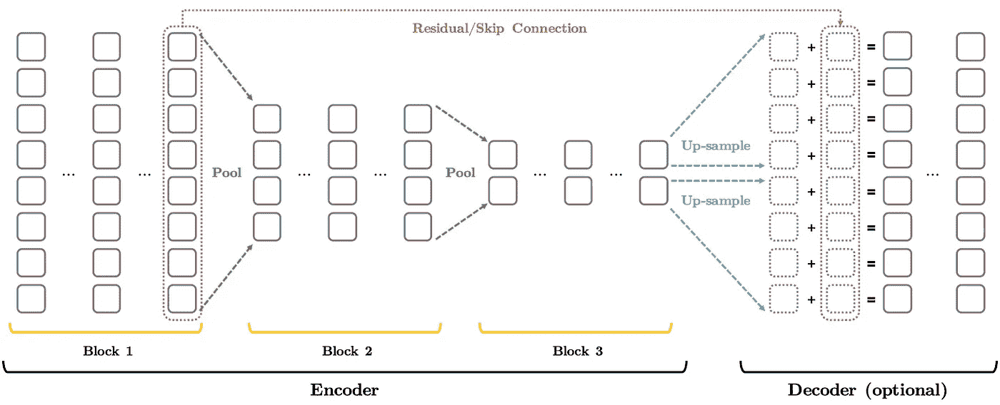
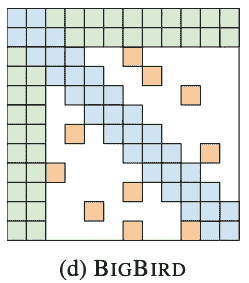

# 你应该选择哪种型号？大鸟，康伯特，朗福尔曼…

> 原文：<https://towardsdatascience.com/advancing-over-bert-bigbird-convbert-dynabert-bca78a45629c?source=collection_archive---------11----------------------->

## 超过 BERT 的进展..

图像[来源](https://unsplash.com/photos/wb85DEFXeRg)

B ERT 及其变体也在 2021 年席卷了 NLP 领域。在 NeurIPS2020 和 ICLR2020 中分别有超过 20 篇关于 BERT 或 Transformers 的文章，并且这一趋势还在继续！在本帖中，我们将分析哪些最新的进步是必须的，以及它们何时有用。

> 对 BERT 的最初改进要么增加了数据，要么提高了计算能力，从而超越了它。然而，最近，从 StructBERT 和 ALBERT 开始，模型在概念和架构上已经超越了 BERT。

S **tructBERT** :又名爱丽丝，将**语言结构**融入预训练过程。具体来说，它引入了一个新的目标函数，称为 WSO(词结构目标)。WSO 旨在预测句子中单词的顺序。这是通过屏蔽 15%的记号来实现的，类似于 BERT，但是随后训练以预测混洗的 15%记号的正确位置。结果，模型开始学习单词的排序！他们还引入了 SSO(句子结构目标)，这是 BERT 的下一句预测(NSP 任务)的修改版本，用于预测下一句和上一句，再次提高了模型的排序能力。这是在使用**可比数据和计算能力的同时**优于 BERT** 的第一种方法。**

**ALBERT:** 是相对于 BERT 的第一个**架构改进**，使用 18 倍小的模型在 5 个 NLU 任务上胜过 BERT。尺寸**的减小是通过两个进步实现的。首先，遵循共享参数以减少自由变量的思想，ALBERT 在跨层注意力地图中引入了**参数共享**，减少了大约 7000 万个冗余参数。其次，ALBERT 对巨大的令牌嵌入矩阵执行**低维投影**，减少了多达 2000 万个附加参数。由于过度拟合的机会有限，ALBERT 还消除了丢失现象，从而降低了内存消耗。**

然而，这两种方法都只能得出一个近似的解决方案，因此与 BERT 相比，ALBERT 的性能会降低 1–2%。为了避免这一点，ALBERT 引入了**句子顺序预测**(瞧！)任务类似于 StructBERT，增加了比 BERT 多 10 倍的数据(我们以前也见过！).由于尺寸减小，但数据和近似设置增加，在消耗相当数量的计算资源时，ALBERT 的性能优于 BERT。

> 网络宽度/深度适配？是啊！也许比蒸馏还要好！
> 
> ——谷歌，微软，华为。

D **ynaBERT** :取得显著进步。由华为推出的 DynaBERT 是一款宽度和深度自适应模型，旨在降低计算成本。虽然这个想法对深度学习来说并不新鲜，但结果是有影响的。DynaBERT 几乎总是比 DistilBERT 的计算成本低 2-3 倍，但却能获得相当的精度！

从技术上来说，DynaBERT 通过解耦来并行化多个注意力头和层的计算。这使得调整模型的宽度变得很容易，只需要调整头部和层数就可以了！然后，DynaBERT 继续通过在训练期间计算重要性分数来自动识别和移除最不重要的头/层。使用臭名昭著的学生-教师方法来训练可变深度模型。因此，DynaBERT 的性能至少可以与相同或更小型号的 BERT 相媲美，而且它的性能确实优于 DistilBERT。([条](https://proceedings.neurips.cc/paper/2020/file/6f5216f8d89b086c18298e043bfe48ed-Paper.pdf))

**漏斗变压器**:在类似的一行，漏斗变压器，确实如其名。它汇集输入，就像自动编码器逐渐将隐藏状态压缩成更短的序列。压缩跨三个块进行，其中每个块都是一组大小相同的层。从一个块到下一个块，隐藏单元的数量(序列长度)通过平滑的池层减少。这消除了 BERT 层中众所周知的冗余，最终性能当然比 BERT 更好！

漏斗变压器，图片来自[文章](https://proceedings.neurips.cc/paper/2020/file/2cd2915e69546904e4e5d4a2ac9e1652-Paper.pdf)

微软在 NeurIPS 2020 上的另一项[工作](https://proceedings.neurips.cc/paper/2020/file/a1140a3d0df1c81e24ae954d935e8926-Paper.pdf)通过简单的网络大小调整，在相同或更高的精度下，将 BERT 的训练速度提高了 2.5 倍。有趣的是，他们提出 I)在多头之前移动层范数，以允许更高的学习速率。ii)帮助绕过子层的选通机制 iii)层丢弃时间表。概念上类似于宽度/深度适配！

> 一系列的努力引入了新颖的关注层，使变压器更具成本效益。这些方法减少了注意矩阵中的条目。
> 
> 其中最突出的是:

B 直觉是，对角线上的注意力是局部注意力，两边是远距离注意力(称为全局注意力)，随机位置有助于更好地逼近矩阵。不错——对！

图片来自[文章](https://arxiv.org/pdf/2007.14062.pdf)

因此，BigBird 在 BERT 的基础上实现了 5–10%的准确性改进，并显示在 4096 长度的序列上，这是 BERT 的 8 倍长的序列。实现这一点的一个挑战是在 GPU/TPU 上计算稀疏运算的能力。这通过将稀疏表示转换成块并计算这些块中的关注度以及再次重构回矩阵来解决。对于序列长度，该模型以 O(L)进行缩放。注意:早些时候 Google 也引入了一个 [ETC](https://arxiv.org/pdf/2004.08483.pdf) 变体，如果你有一个捕捉单词之间语义关系的图表，这个变体会很有用。

**Longformer** :由艾伦研究所(Allen Institute)计算矩阵内部对角线、边和边的投影中的注意力。该模型在长达 20K 令牌的序列上进行训练和评估，并且标度为 O(L)！因此能够执行文档级任务。

*Longformer 和 BigBird 的性能相当接近，BigBird 的性能提高了 1–3 %,但是它使用的计算能力是 Longformer 的 16 倍！*

**重整器:**用 LSH 注意力代替变压器的二次点积注意力。简而言之，LSH(局部敏感散列)注意力使用基于散列的记号分组来执行本地化的点积，这允许点积矩阵中高值的良好质量近似。重要的是，这意味着重整器只需要 O(L log(L))而不是 O(L)复杂度，从而产生显著的加速。模型显示在 30K 标记大小的序列上，对于更大的序列长度，速度提高了 5-10 倍。然而，与 BigBird 和 Longformer 不同，对于较小的序列，成本效率优势是最小的。

**ConvBERT:** 使用跨度级动态卷积改进 BERT。它使用卷积核来捕获单词之间的局部相似性，然后将它们纳入自我注意，以创建混合注意块。由于受到新的关注，ConvBERT 模型的性能提高了 5–6 %,计算成本效率提高了 5 倍。([条](https://proceedings.neurips.cc/paper/2020/file/96da2f590cd7246bbde0051047b0d6f7-Paper.pdf))

# 那么，用哪一个呢？

是的，我们现在有了比伯特更受欢迎的型号。

> **长文**:大鸟胜，可比回落:Longformer
> 
> **更小的网络/速度** : DynaBERT、ConvBERT
> 
> **多语言**:如果计算机不是问题，XLM-罗伯塔，否则就是姆伯特

这是 BERT 技术进步的第 2 部分。参见第一部分的这篇博文。

可以通过@ LinkedIn 联系到作者。