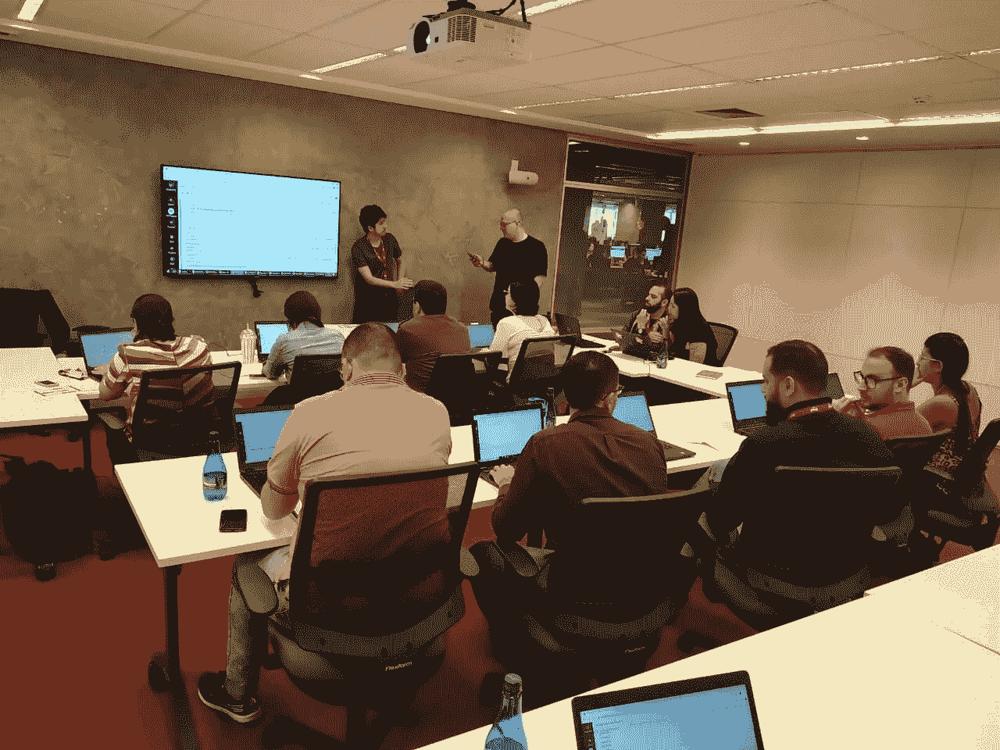
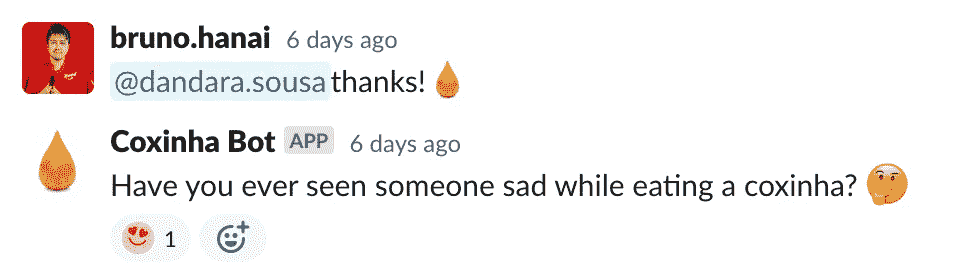

# 通过实践社区提高非技术专业人员的 SQL 技能

> 原文：<https://towardsdatascience.com/advancing-sql-skills-of-non-tech-professionals-through-communities-of-practice-764722c43d62?source=collection_archive---------28----------------------->

## [办公时间](https://towardsdatascience.com/tagged/office-hours)

## 通过知识共享提高数据技能，而不仅仅是学习正式课程，完成工作，并分发虚拟的“coxinhas”


由 [Robynne Hu](https://unsplash.com/@robynnexy?utm_source=unsplash&utm_medium=referral&utm_content=creditCopyText) 在 [Unsplash](https://unsplash.com/s/photos/network?utm_source=unsplash&utm_medium=referral&utm_content=creditCopyText) 上拍摄

# 介绍

> *现在是下午 12:21，刚刚在 Slack App 里收到消息通知。一位业务分析师在#badhus 频道上发了一条消息，询问在哪个表中可以找到关于具有特定列的 iFood 餐馆的数据。下午 02:55，一位业务专家发布了一个格式错误的 SQL 查询，请求帮助了解他哪里出错了。下午 3 点 55 分，另一位业务分析师寻求帮助，想知道她如何从字母数字字符串中“提取”数字，有人向她介绍了正则表达式。下午 4:10，一名数据架构师发布了一条消息，警告所有人一些表将很快发生变化，以便当前用户能够意识到这一点。下午 5 点 31 分，一位商业策划分析师就请求访问我们的 Tableau 服务器寻求指导。在工作日结束时，一位财务分析师请求帮助使用 SQL 的 AND 或 or 语句。这是我们公司迈向数据驱动的典型一天(更确切地说，是 2021 年 5 月 24 日)。该频道有大约 700 名成员，我们可爱而自豪的 bad Hu——正如我们给他们起的名字:商业分析师数据重度用户。顺便说一下，所有这些消息都被其他 BADHUs 回复了(除了关于正则表达式的那条——我回复了)。*

大约 18 个月前，我们启动了一个名为 Data Academy 的项目，向从未使用过 SQL，甚至从未想过使用 SQL 的人教授 SQL。我们开设了一门入门课程，并开始让人们相信这门课程对他们的职业有帮助、有价值，而且在某种程度上很有趣。

事实是:他们非常喜欢它。从那以后，他们渴望提高自己的技能。他们想要更多。我被问了几百次:*“我们什么时候有第二道菜？你什么时候教我们 Python？”*

诚实的回答是:我不认为第二道菜是他们旅行的最佳路线。我建议去真正的工作，面对课程没有涉及的误导性问题。然后，试着去理解它，搜索解决方案，在 *#badhus* Slack 频道求助。将这些问题作为他们后续研究课题的课程。

# 什么是实践社区？

不依靠这个非常准确的定义，几乎不可能更好地回答这个问题:

> “实践社区是一群人，他们对一个话题有共同的关注点、一系列的问题或激情，并通过持续的互动加深他们在这个领域的知识和专业技能。”

这些社区可以以多种形式存在:小的或大的、长的或短的、自发的或有意的、面对面的、远程的，但它们都有一个标准的结构:

*   **域。**社区存在的目的。它通过对主题的兴趣聚集人们，并指导学习日程。这是对将在那群人中管理的人员的官方声明。
*   **社区。**在相互尊重和信任的关系中互动的人。他们谈论、学习、教授、记录和发展与所定义领域相关的知识。
*   **修炼。**虽然领域是关于社区的话题，但是实践是由成员创造的特定知识:文档、框架、想法和其他种类的材料，只有参与该社区的人才能理解其价值。

实践社区是这三个要素的独特组合。重要的是要理解，没有一个明确定义的域，社区只是一群朋友。另一方面，没有实践，它只是一群对一个话题感兴趣的人，没有采取行动，改变他们的行为，提高他们的能力。此外，如果没有社区元素，它就缺乏构成社区的人的因素。

如果您想利用员工的集体智慧来利用公司内部的知识，实践社区是您应该考虑的一个选项。这是一种战略方法，通过和那些更好地理解其挑战、有着共同关注点并且渴望在他们的技术上有所进步的人一起发展知识。

# 连接点

在以下部分，我将讨论规划和构建实践社区。在此之前，重要的是要警告您，我甚至在这样做之前就已经开始计划和构建它了。这怎么可能？

我喜欢记得事情甚至在正式开始*之前就已经开始了。*这个想法是我通过 Sonke Ahrens 想到的，他的想法是[勤于记笔记](https://www.google.com.br/books/edition/How_to_Take_Smart_Notes/DGMTzgEACAAJ)以便在面对一张白纸时做好准备，或许更符合这份出版物的受众，史蒂夫·乔布斯的想法是[连接点](https://www.youtube.com/watch?v=UF8uR6Z6KLc)。

> 对于那些从未接触过的人来说，这个想法可能听起来有点奇怪，所以这里有一个关于它的个人例子:
> 
> 在 2021 年初，我有了创作一个“年度回顾风格”的视频的想法，展示了在巴都项目中发生的事情。因此，我花了几个小时在我们庞大的 Slack 档案、LinkedIn 书签、相册等中搜索和收集了一些过去的瞬间。沟通团队不支持我，我决定将这个想法存档。几个月后，一位主任让我为第二天准备一个五分钟长的关于巴都项目成就的报告。我不知道你是否意识到，一个精彩的五分钟演讲比其他任何事情都更具挑战性，因为你首先需要对所有事情有一个完整的看法，这样你才能以最佳的顺序选择最佳的部分，并进行连贯的演讲。幸运的是，我之前就开始了，当时我做了大量的搜索——如果我之前就开始，收集发生的瞬间，事情会变得更容易。

那么，我们之前是怎么开始的呢？在我的记忆中，业务人员会密集地向数据分析团队询问数据。这种情况发生了很多次，而且越来越频繁，我们知道我们需要采取行动。因此，我们准备了一个实验性的*“SQL、Datalake 和 data bricks”*课程，并亲自将其应用于财务团队的一些早期采用者。进行得非常顺利，所以我们把它录了下来，以便在整个组织中传播这些知识。



来自金融 team(❤的早期采用者)—2019 年 11 月

在那项艰苦的工作之后，另一项艰苦的工作开始了:社区(不是实践社区)的建设。我们知道勇敢的人在探索新的道路，自己寻找数据，“谈论”SQL 语言，面对可怕的错误。所以我们试着为他们提供充分的时间，回答他们的问题，为他们提供日历时间。在这个过程中，我们可以更好地了解他们，我们看到人们在他们的职业生涯中进步，我们告别那些去了另一家公司的人。这项工作非常有价值，现在我明白了:*我们*用了一个月完成了课程，而*参与者*用了一年多的时间建立了社区——一次一个互动。

现在开始一切可能很难，但并非不可能。你可以看看你的组织，试着找出一些已经在做的事情。也许有一种你从未留意过的非正式群体。如果是这样，你可以试着确定:对他们来说重要的话题，参与的成员，交流偏好，新成员如何加入那个社区，他们如何接收新成员，他们可能有的阻碍者，等等。相反，你将不得不从头开始，尝试许多事情，把事情搞清楚。所以，快开始，好开始。希望在以下几节能帮到你。

# “研究胜过最佳实践”

自从我们决定推出实践社区以来，我已经阅读了一些关于该主题的有趣文献，并意识到这种社区非常复杂:人类行为的许多错综复杂、工作环境的限制以及学习和知识管理要求的挑战的混合。这并不意味着我们应该放弃这个想法；这只是意味着我们需要站在那些研究过，谢天谢地，还写过相关文章的人的肩膀上。

那么，你从哪里可以了解实践社区呢？我强烈建议你坚持阅读艾蒂安·温格的这两本书:1) [培养实践社区:知识管理指南](https://books.google.com.br/books/about/Cultivating_Communities_of_Practice.html?id=m1xZuNq9RygC)，如果你想更进一步，还有 2) [实践社区:学习、意义和身份](https://books.google.com.br/books/about/Communities_of_Practice.html?id=heBZpgYUKdAC)。

此外，您应该将实践社区视为新事物，不要将其与您可能知道的另一个类似术语联系起来。实践元素的社区(领域、社区和实践)对您来说可能很熟悉，但是请记住:真正的潜力存在于“这三个元素*的独特组合”中。最常见的被误导的术语是 *guild* ，由于著名的*“Spotify 模式”，这个术语有点流行。行业协会有其价值，但我建议避开它们以及大公司创造的所有其他术语(又名。“最佳实践”)。首先，大多数文章简化了*“Spotify 的公会”*的解释，这可能对你没有帮助。另外，[我们甚至不知道 Spotify 是否使用 Spotify 模式](https://www.agility11.com/blog/2020/6/22/spotify-doesnt-use-the-spotify-model)。在从事过去的项目时，我没能避开最佳实践。我甚至设法找到了好的故事，但这些都是*[一切顺利](https://medium.com/airbnb-engineering/how-airbnb-democratizes-data-science-with-data-university-3eccc71e073a)*或*[断章取义](https://www.norulesrules.com/)*的故事，尽管鼓舞人心，但并不恰当。因此，我最近越来越倾向于阅读文献，而不是大公司的最佳实践。******

**回避大公司最佳实践的建议不仅是我提出的，也是在其中一家公司工作的人提出的:**

> **每当我们在 Google now 面临新的人事问题时，我们不会问自己:成功的 X 组织是如何处理这个话题的？相反，我们问自己:文献说了什么？(……)与学术界发展更好的关系，而不是咨询公司。**
> 
> **—谷歌人力分析与薪酬副总裁普拉萨德·塞蒂**

**按照这个建议，你成功的机会可能会增加。也许你的第一个实践社区不会完全成功，但你可能会知道原因。否则，你会发现自己被一些危险的后果所束缚:不知道失败的根源，责怪社区成员，以及挫伤团队的士气。通过不完整的故事和只暴露积极的事实，共享的最佳实践会让您认为它也需要在您的环境中很好地工作，如果您对此不警惕，它可能会造成损害。**

# **实施实践社区**

**正如您将从文献中了解到的那样，实践社区需要被设计并对演进开放，因此最好专注于快速且扎实地实现初始结构。发布后，社区将拥有自己的生命，而[的复杂性](https://en.wikipedia.org/wiki/Complexity)将浮出水面，需要不断的培育和监控。**

**本节将描述**我们如何**实现这个最初的实践社区结构(你将在文献中找到行动背后的**为什么**)。**

## **情况**

*   ****团队:** 3 名兼职人员— [布伦达](https://www.linkedin.com/in/brenda-borges-b6aa15171/)、[加布里埃尔](https://www.linkedin.com/in/gabrielle-rodriguesmia/)、[我](https://www.linkedin.com/in/brunohanai/)。**
*   ****时间:** 6 周(我们按照 [Basecamp 的塑造方法](https://basecamp.com/shapeup/webbook))。**

## **前期工作**

*   **阅读实践社区。**
*   **收集所有过去的相关内容，如课程统计、反馈、评价、社交媒体。**
*   **创建了一个*“行动案例”*，在这里我们收集论据来说服主要的利益相关者。**

## **结构化**

*   **用我们的主要关注点创建了一个思维导图，我们将其命名为*“担忧树”*。它就像一个[](https://hbr.org/2007/09/performing-a-project-premortem)*，但更简单。我们使用[异想天开的](http://whimsical.com)应用程序创建了它。***
*   ***定义了社区的*【领域】*:提高 SQL。***
*   **定义了社区的*【名字】* : Fluent SQL。**
*   **定义了社区的*【主要意图】* : *互相帮助*解决日常问题。(将来，我们可能会将目标转向*知识管理*型)。**
*   **定义了社区的*“协调人】*:我——录制课程的人，对角色有个人兴趣的人，大部分成员都认识的人。**
*   **创建了一份*“工作描述”*文档，描述社区协调员的角色和职责。**
*   **创建了一个名为*“生存指南”*的 PowerPoint 文件，其中包含说明、清单和我们社区的最低共存规则。**
*   **创建了一个名为*“邀请课程”*的快速课程，有五个选择题练习，测试他们对生存指南的理解。**

## **首批成员**

*   **创建了#badhus-cop-fluent-sql Slack 通道(*CoP*代表实践社区)。****
*   ***创建了一个*“会员案例”*，在这里我们收集了一些论据，以帮助潜在会员看到互动和为社区做贡献的价值。***
*   **根据以下因素，精心挑选了前 30 名潜在成员:在 *#badhu* Slack 渠道中表现出知识共享行为的人；不同级别的 SQL 知识；数据团队成员的推荐；性别、种族、工作领域和角色的混合。**
*   **以 15 人为一批邀请成员，推断其中多达 5 人将因时间限制原因拒绝邀请。**
*   **安排一个 30 分钟的电话会议来解释实践社区，并亲自正式邀请他们。我们满怀期待地分享了生存指南和邀请课程。**
*   **在接下来的星期一，我们邀请那些已经完成邀请课程的人到实践松弛频道的私人社区。**

## **活动和参与**

*   **创建了一份*“活动建议”文档*，其中包含成员可以执行的逐步想法，以便在社区中开展活动并提高参与度。**
*   **镜像 [HeyTaco](https://www.heytaco.chat/) 认可机械师使用 [Zapier](http://zapier.com/) 让成员正式感谢某人的一些有价值的贡献。每当有人发类似*“@姓名谢谢！🌮“*，我们计算一个指向 *@name* 的点。详细:我们通过*:*[*coxinha*](https://en.wikipedia.org/wiki/Coxinha)*:*表情符号交换了 *:taco:* 表情符号因为它是巴西非常受人喜爱的食物。**

****

**“coxinha-points”，灵感来自 [HeyTaco](https://www.heytaco.chat/) (作者截图自 Slack)**

## **韵律学**

*   **创建了一些 zap 来收集和保存松散的通道消息和交互。**
*   **[定义了与我们的目标更相关的指标](/seven-steps-to-set-goals-and-pick-metrics-for-customers-613283570521)。**
*   **使用 Google Sheets 创建了一个简单的报告来监控我们的指标。**

**注意:我们选择 Zapier 和 Google Sheets 是为了遵守我们的 6 周时间限制。我们计划在后续项目中使用我们的平台工具栈(数据块、气流和表格)来偿还这笔技术债务**

# **未来是数据驱动的**

**我们将更多地探索它，邀请新成员并激发他们更多地学习和分享。我可以想象这些商人还没有意识到他们学到了多少东西，他们正在成为他们领域的杰出专业人士。**

**对我来说，从事这种类型的倡议是一种乐趣，将学习理论与技术联系起来，同时提高我的数据素养水平。**

```
****References**[1] E. Wenger, R. McDermott and W. Snyder, Cultivating Communities of Practice (2002), Harvard Business Review Press
[2] [YouTube: HR meets science at Google with Prasad Setty](https://www.youtube.com/watch?v=KY8v-O5Buyc)**
```