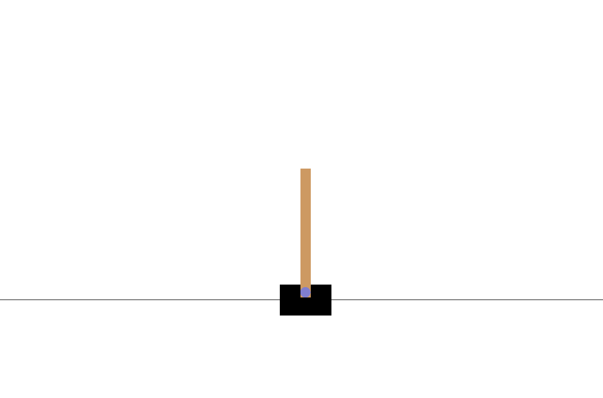
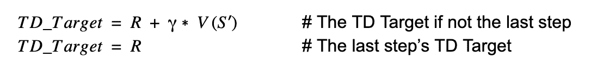
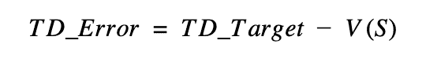
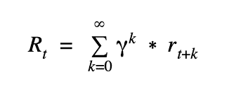
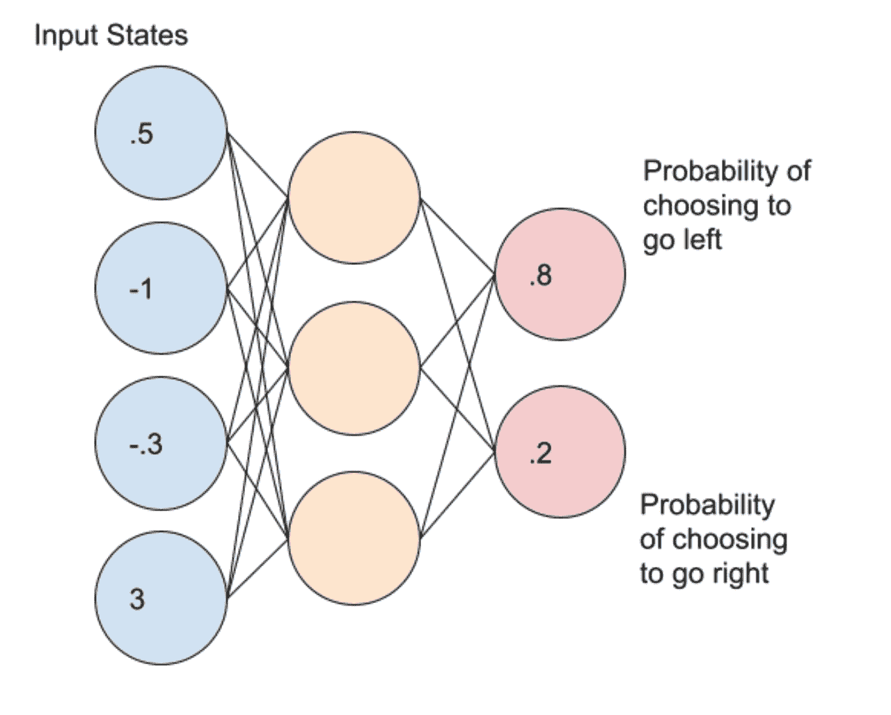
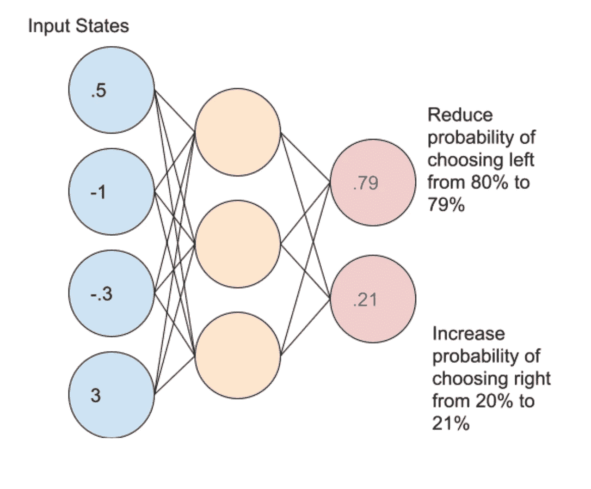
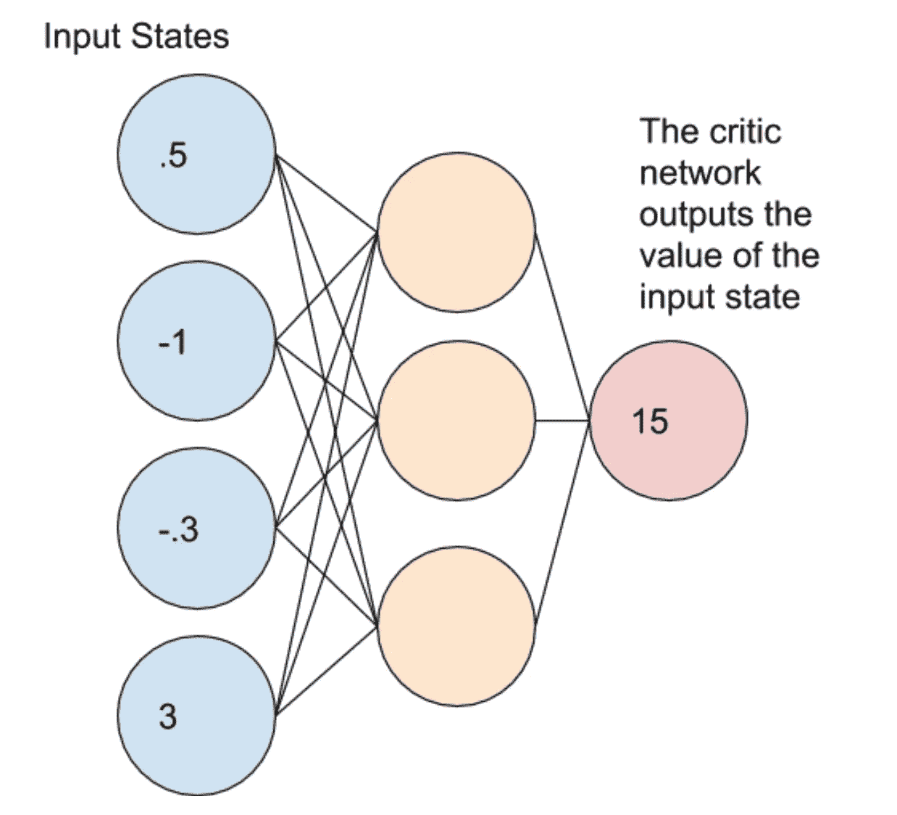
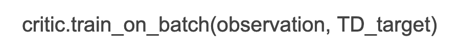
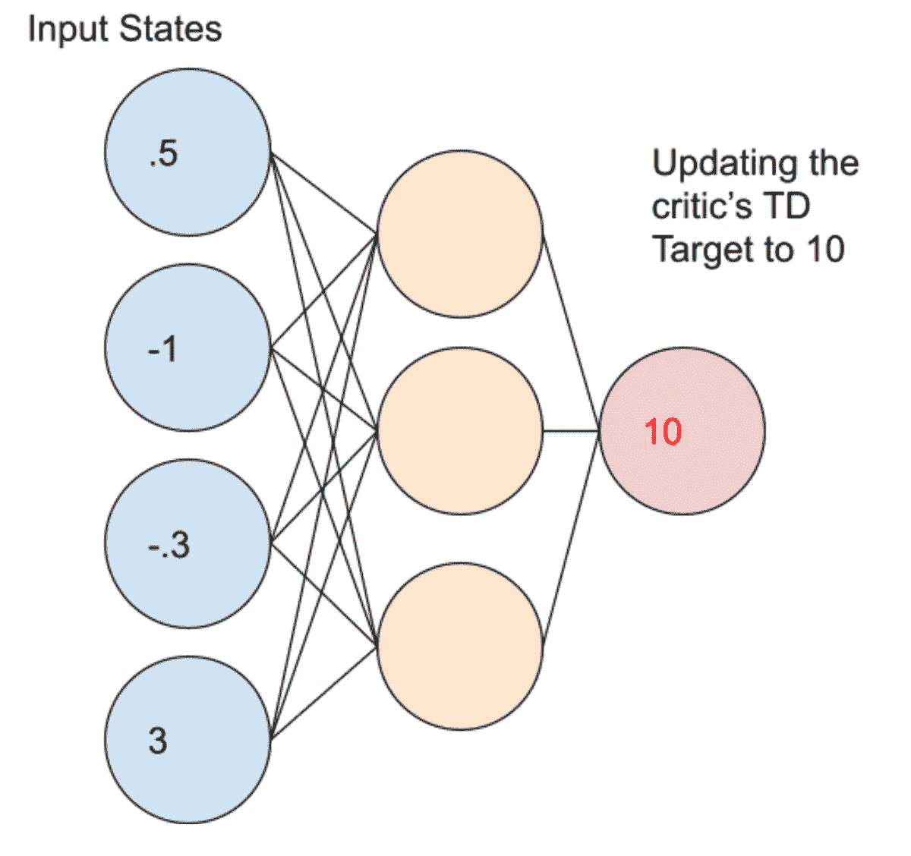
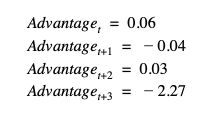

# 优势演员评论家教程:minA2C

> 原文：<https://towardsdatascience.com/advantage-actor-critic-tutorial-mina2c-7a3249962fc8?source=collection_archive---------2----------------------->

## 优势因素评价算法简介

在强化学习领域，A2C 算法结合了两种强化学习算法(基于策略和基于值)。**基于策略**代理直接学习将输入状态映射到输出动作的策略(动作的概率分布)。**基于值的**算法根据输入状态或动作的预测值学习选择动作。在我们之前的[深度 Q 学习教程:minDQN](/deep-q-learning-tutorial-mindqn-2a4c855abffc) 中，我们学习了实现我们自己的深度 Q 网络来解决简单的 Cartpole 环境。在本教程中，我们将分享一个最小的 Advantage Actor Critic (minA2C)实现，以帮助新用户学习如何编写自己的 Advantage Actor-Critic 实现。你也可以在这里观看这个教程的 Youtube 版本[。](https://www.youtube.com/watch?v=AsRxwt5j9Mo)

# 目录

1.  优势行动者-评论家算法概述
2.  钢管舞露天健身环境
3.  优势函数
4.  演员网络
5.  评论家网络
6.  实施细节
7.  优势行动者评论家编码实现
8.  资源

# 1.优势行动者-评论家算法概述

actor critic 算法由两个网络(actor 和 critic)组成，它们一起工作来解决特定的问题。在高层次上，**优势函数**计算代理的 **TD 误差**或**预测误差**。行动者网络在每个时间步选择一个动作，而批评家网络评估给定输入状态的质量或 Q 值。当批评家网络知道哪个状态更好或更坏时，行动者使用这个信息来教代理寻找好的状态并避免坏的状态。

# 2.钢管舞露天健身环境



图 1:在横拉杆环境中平衡拉杆(图片由作者提供)

在本教程中，我们将使用优势行动者批评法来解决 CartPole 环境。在每个时间步，代理接受 4 个输入状态(小车位置、小车速度、极点角度和尖端的极点速度),并选择向左或向右移动。我们的目标是尽可能长时间地保持平衡。

# 3.优势函数

优势功能是什么？考虑到“优势”是优势演员评论家算法的名字，它一定是相当重要的。为了理解优势函数是什么，我们首先需要理解如何计算 TD 误差，或时间差分误差。

在时间差异学习中，代理通过对未来回报进行预测并根据预测误差调整他们的行动来学习。时间差异学习非常有趣的原因之一是，预测误差似乎也是大脑学习新事物的方式之一。

# 3a。计算 TD 误差



图 2:TD 目标是当前状态的奖励 R 加上下一个状态的未来折扣奖励**S’**(图片由作者提供)

为了计算优势函数(TD 误差)，我们需要先计算 **TD 目标**。在上面的等式中，TD 目标是来自当前状态 S 的所有未来奖励的预测值。函数 V(S’)表示计算下一个状态 S’的值的评论家网络。



图 3:TD 误差定义为 TD 目标减去当前状态 S 的值(图片由作者提供)

在优势因素评论家算法中，**优势**等于上面所示的 **TD 误差**。优势也可以解释为我们代理人的预测误差。



图 4:我们可以通过合计所有未来时间点的折扣奖励来计算总奖励(图片由作者提供)

注意，优势函数可能不总是与 TD 误差函数相同。例如，在许多政策梯度算法中，优势通常被计算为未来折扣奖励的总和，如图 4 所示。

**优势**功能告诉我们一个状态是比预期的好还是差。如果一个动作比预期的好(优势大于 0)，我们希望鼓励演员采取更多的**动作。如果一个动作比预期的差(优势小于 0)，我们要鼓励行动者采取与那个动作的**相反的**。如果一个动作完全按照预期执行(优势等于 0)，参与者不会从那个动作中学到任何东西。**

# 4.演员网络



图 5:行动者网络将状态映射到行动概率(图片由作者提供)

演员网络将每个**状态**映射到相应的**动作**。就像批评家网络一样，我们可以在每个时间步之后更新演员网络权重。

演员网络输出对应于每个动作的**概率分布**。我们根据每个动作的概率从这个概率分布中抽取动作样本。如果向左的动作的值是 0.8，向右的动作的值是 0.2，我们将只在 80%的时间里选择向左的动作，在 20%的时间里选择向右的动作。因为输出是一个概率分布，请注意代理不会总是选择概率最高的动作。

# 4a。定义演员网络

```
def create_actor(state_shape, action_shape):
    learning_rate = 0.001
    init = tf.keras.initializers.HeUniform()
    model = keras.Sequential()
    model.add(keras.layers.Dense(24, input_shape=state_shape, activation=tf.keras.layers.LeakyReLU(), kernel_initializer=init))
    model.add(keras.layers.Dense(12, activation=tf.keras.layers.LeakyReLU(), kernel_initializer=init))
    model.add(keras.layers.Dense(action_shape, activation='softmax', kernel_initializer=init))
    model.compile(loss='categorical_crossentropy', optimizer=tf.keras.optimizers.Adam(lr=learning_rate), metrics=['accuracy'])
    return model
```

在我们的实现中，Actor 网络是一个简单的网络，由 3 个紧密连接的层组成，具有 LeakyReLU 激活功能。网络使用 Softmax 激活函数和分类交叉熵损失函数，因为网络输出动作的概率分布。

# 4b。更新演员网络的权重



图 6:更新演员网络概率(图片由作者提供)

一旦我们构建并初始化了演员网络，我们需要更新它的权重。在上面的例子中，代理人认为选择向左是错误的决定。在这种情况下，代理人希望将选择左的概率从 80%降低到 79%。同样，代理人需要将选择正确的概率从 20%增加到 21%。在更新这些概率之后，我们可以通过使网络适应新的概率来更新我们的网络权重。

算法如何决定鼓励哪些行为，劝阻哪些行为？A2C 算法通过计算优势来做出决定。优势决定了如何**衡量**代理刚刚采取的行动。重要的是，优势也可能是不利的**，这会阻碍所选择的行动。同样，**积极的**优势会鼓励和加强这种行动。**

# **5.评论家网络**

**critic 网络将每个**状态**映射到其对应的 **Q 值**。Q 值代表一个状态的值，其中 **Q** 代表该状态的**质量**。**

****

**图 critic 网络将输入状态映射到它们相应的值(Q 值)(图片由作者提供)**

**与输出动作概率分布的行动者网络不同，批判者网络将输入状态的 TD 目标输出为浮点数。在上图中，critic 网络评估输入状态的 Q 值为 15。**

# **5a。定义我们的评论家网络**

```
def create_critic(state_shape, output_shape):
    learning_rate = 0.001
    init = tf.keras.initializers.HeUniform()
    model = keras.Sequential()
    model.add(keras.layers.Dense(24, input_shape=state_shape, activation=tf.keras.layers.LeakyReLU(), kernel_initializer=init))
    model.add(keras.layers.Dense(12, activation=tf.keras.layers.LeakyReLU(), kernel_initializer=init))
    model.add(keras.layers.Dense(output_shape, activation='linear', kernel_initializer=init))
    model.compile(loss=tf.keras.losses.MeanSquaredError(), optimizer=tf.keras.optimizers.Adam(lr=learning_rate), metrics=['accuracy'])
    return model
```

**像演员网络一样，我们的评论家网络也由 3 个具有 LeakyReLU 激活功能的紧密连接的层组成。因为 Critic 网络的输出是 TD 目标，所以使用均方误差损失函数来优化网络。**

# **5b。更新 Critic 网络权重**

**既然我们知道如何计算 TD 目标和 TD 误差，我们如何更新 Critic 网络权重？注意，随着 TD 误差接近 0，Critic 网络在预测当前状态的结果方面变得越来越好。这种情况下，我们希望 TD 误差尽可能接近 0。为了更新临界网络权重，我们使用 TD 误差函数的均方误差。**

****

**图 8:给定一个状态或观察值，我们希望将 critic 网络与目标(TD_target)相匹配(图片由作者提供)**

****

**图 9:用新的 **TD 目标**10 更新评论家网络(图片由作者提供)**

**为了更新网络，我们调整了网络权重，使其以新的 TD 目标值 10 为目标。请注意，优势因素评论家算法不同于普通策略梯度(加强)算法。我们可以在每个时间步之后更新 critic 网络，而不是像在加强算法中那样等待一集的结束。**

# **6.实施细节**

**当代理探索其环境时，批评家网络试图将优势函数驱动到 0。在学习过程的开始，评论家可能会犯很大的错误，导致计算的 TD 误差非常不正确。因为算法是从批评家对环境一无所知开始的，演员同样不能从批评家那里学到很多东西。随着评论家开始做出越来越准确的预测，计算出的 TD 误差(优势)也变得越来越准确。演员能够从越来越精确的 TD 误差中学习，以决定一步棋是好是坏。**

****

**图 10:在时间步长 t+3 游戏结束时，掷球问题的优势值序列示例(图片由作者提供)**

**对于横翻筋斗的问题，当游戏结束时，每一时间步的奖励 1 停止出现。游戏的结局出乎评论家的意料，通常会导致更大的负值。奖励的意外结局导致演员形象地思考，“这一步比预期的更糟，下次我们试试别的”。通过在许多游戏情节中重复这个学习过程，评论家和演员一起学习在更长的时间内平衡杆子。**

# **7.优势行动者批评家实现**

**最后，我们可以把优势功能，演员，和评论家放在一起，以解决 CartPole 环境。你可以在这里找到我们的优势演员评论家实现，它在 300 集的时间里学习平衡侧手翻。**

# **8.资源**

*   **[优势演员评论家(A2C)实现](https://medium.com/deeplearningmadeeasy/advantage-actor-critic-a2c-implementation-944e98616b)**
*   **[深度强化学习:来自像素的 Pong】](http://karpathy.github.io/2016/05/31/rl/)**
*   **[使用 Keras 的策略梯度强化学习](https://medium.com/swlh/policy-gradient-reinforcement-learning-with-keras-57ca6ed32555)**
*   **[演员评论家(A3C)教程](https://www.youtube.com/watch?v=O5BlozCJBSE)**
*   **[掌握演员评论方法所需的一切| Tensorflow 2 教程](https://www.youtube.com/watch?v=LawaN3BdI00)**
*   **[软演员兼评论家揭秘](/soft-actor-critic-demystified-b8427df61665)**