# 打破深度学习模型的反面例子

> 原文：<https://towardsdatascience.com/adversarial-examples-to-break-deep-learning-models-e7f543833eae?source=collection_archive---------22----------------------->

## 如何用一点 Python 来愚弄一个 27M 参数的模型

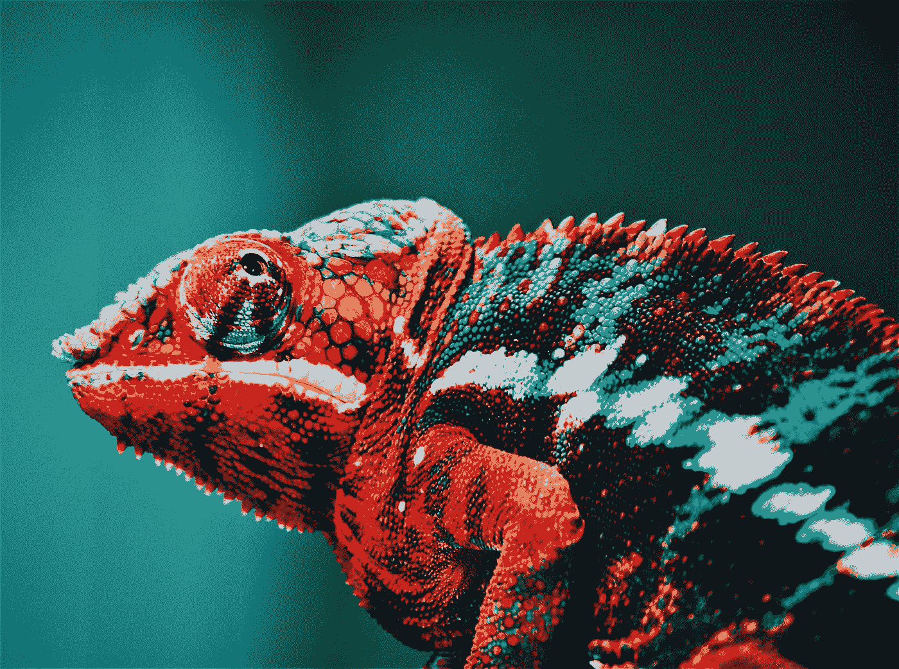

照片由[乔治·勒巴达](https://www.pexels.com/@george-lebada-175028?utm_content=attributionCopyText&utm_medium=referral&utm_source=pexels)从[派克斯](https://www.pexels.com/photo/red-chameleon-567540/?utm_content=attributionCopyText&utm_medium=referral&utm_source=pexels)拍摄

你以为骗过自动驾驶特斯拉汽车的视觉系统是不可能的吗？

或者说恶意软件检测软件中使用的机器学习模型太好了，无法被黑客规避？

或者机场的人脸识别系统是防弹的？

像我们任何一个机器学习爱好者一样，你可能会陷入这样一个陷阱，认为现有的深度模型是完美的。

嗯，你错了。

有一些简单的方法可以建立*对抗的例子*，可以欺骗任何深度学习模型，并产生安全问题。在本帖中，我们将涵盖以下内容:

1.  什么是对立的例子？
2.  你如何产生对立的例子？
3.  动手例子:让我们打破盗梦空间 3
4.  如何保护你的模型免受反面例子的攻击

开始吧！

# 1.什么是对立的例子？😈

最近 10 年，深度学习模型已经离开了学术幼儿园，成为大男孩，并改造了许多行业。对于计算机视觉模型来说尤其如此。当 [**AlexNet**](https://papers.nips.cc/paper/2012/file/c399862d3b9d6b76c8436e924a68c45b-Paper.pdf) 在 2012 年登上排行榜，深度学习时代正式开始。

如今，计算机视觉模型与人类视觉一样好，甚至更好。您可以在无数地方找到它们，包括…

*   无人驾驶汽车
*   人脸识别
*   医疗诊断
*   监控系统
*   恶意软件检测
*   …

直到最近，研究人员还在一个*实验室*环境中训练和测试机器学习模型，比如机器学习竞赛和学术论文。如今，当部署到现实场景中时，来自模型错误的安全漏洞已经成为一个真正的问题。

想象一下，你的自动驾驶汽车的最先进的超级花哨的深度学习视觉系统无法将[这个停车标志](https://spectrum.ieee.org/cars-that-think/transportation/sensors/slight-street-sign-modifications-can-fool-machine-learning-algorithms)识别为停车标志。

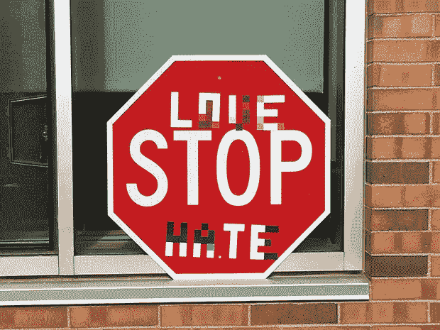

[对深度学习视觉分类的强大物理世界攻击](https://arxiv.org/abs/1707.08945)eyk Holt et altri。

嗯， [**这是** **到底是** **发生了什么事情**](https://spectrum.ieee.org/cars-that-think/transportation/sensors/slight-street-sign-modifications-can-fool-machine-learning-algorithms) 。这个停车标志图像是一个*反面例子*。就当是模型的视错觉吧。

让我们看另一个例子。下面你有两张狗的图片，人眼无法分辨。

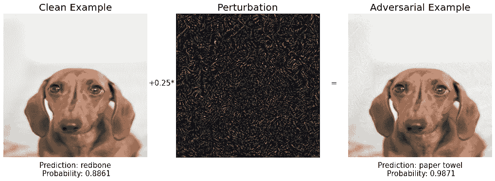

敌对的小狗(图片由作者提供)

左边的图片是 Dominika rose clay[拍摄的一只小狗的原始照片。右边的是对第一个的一点修改，我在中间的图像中添加了噪声向量。](https://www.pexels.com/photo/soft-focus-photo-of-dachshund-895259/)

Inception v3 正确地将原始图像分类为狗的品种(红骨头)。然而，同一个模型非常自信地认为，我创建的修改图像是一张纸巾。

换句话说，我创造了一个对立的例子。您也会看到，因为这是我们将在第 3 节后面讨论的示例。

> 计算机视觉模型的一个**对抗示例**是具有人眼察觉不到的小扰动的输入图像，这导致错误的模型预测。

不要认为这两个例子是在花费大量时间和计算资源后发现的罕见的边缘例子。有很容易的方法来生成对立的例子，这为生产中的机器学习系统的严重漏洞打开了大门。

让我们看看如何生成一个对立的例子，并愚弄一个最先进的图像分类模型。

# 2.如何生成对抗性的例子？

对立的例子😈是通过拍摄清晰的图像产生的👼该模型正确分类，并找到导致新图像被 ML 模型错误分类的小扰动。

## 白盒场景

让我们假设您有关于您想要愚弄的模型的完整信息。在这种情况下，您可以计算模型的损失函数

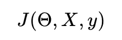

在哪里

*   *X* 是输入图像
*   *y* 是输出类，
*   并且 *θ* 是网络参数的向量。

该损失函数通常是分类方法的负对数似然。

你的目标是找到一个新的图像***X’***，它接近原始的 ***X*** 并且在损失函数值上产生一个大的变化。

想象你在所有可能的输入图像的空间里，坐在原始图像的上面。这个空间有尺寸*宽 x 高 x 通道*，所以如果你不能很好地想象它，我会原谅你😜。

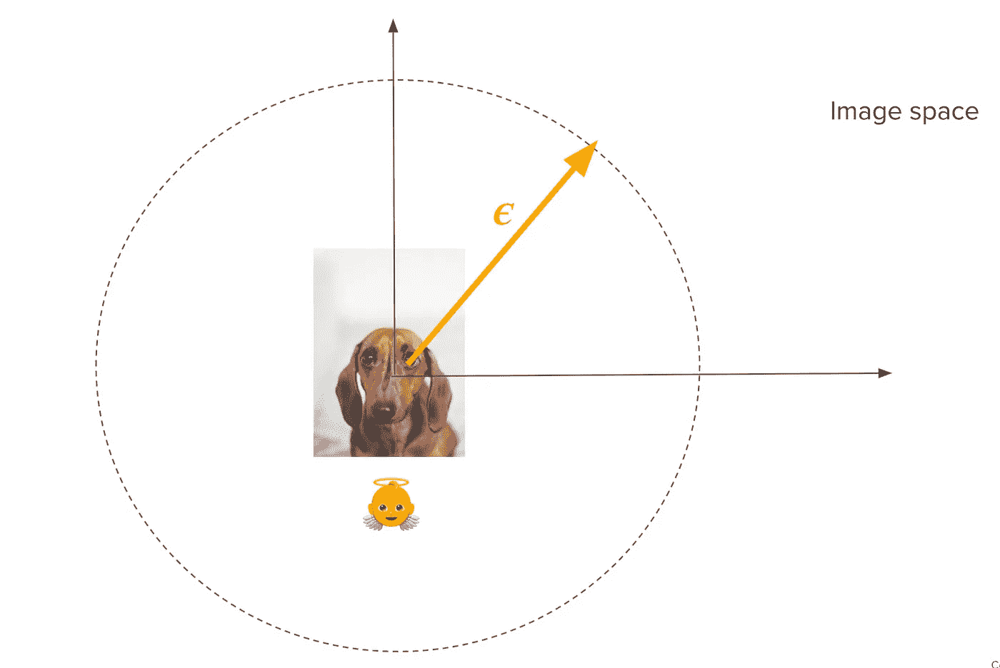

行走在输入图像空间(图片由作者提供)

为了找到一个对立的例子，你需要在这个空间中向某个方向走一点，直到你找到另一个损失显著不同的图像**X’**。对于固定的小步长**ε**，你要选择使损失函数**T3【J变化最大的方向。**

现在，如果你稍微复习一下你的数学微积分课程，损失函数在 *X* 空间中变化最大的方向就是 *J* 相对于 *X* 的梯度。

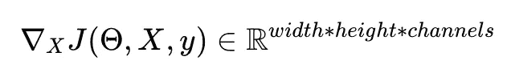

一个函数相对于它的一个变量的梯度恰好是最大变化的方向。顺便说一下，这就是为什么人们用随机梯度下降法而不是随机方向下降法来训练神经网络。

## 快速梯度符号法

形式化这种直觉的一种简单方法如下:

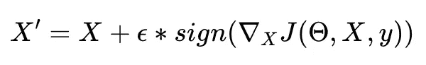

快速梯度符号法

我们仅采用梯度的符号，并使用小参数ε对其进行缩放，以保证 *X* 和 *X* 之间的失真小到人眼察觉不到。这种方法被称为**快速梯度符号法**。

# 黑盒攻击

在大多数情况下，您很可能没有关于模型的完整信息。因此，前面的方法是没有用的，因为你不能计算梯度。

然而，有一个显著的属性叫做对立例子的*可转移性*，恶意代理可以利用它来破坏一个模型，即使他们不知道它的内部架构和参数。

> 研究人员反复观察到**对立的例子在模型之间转移**相当好，这意味着它们可以为目标模型 A 设计，但最终对在类似数据集上训练的任何其他模型都有效。

对立的例子可以如下产生:

1.  对于 i = 1 … n，用输入 X_i 查询目标模型，并存储输出 y_i。
2.  使用训练数据(X_i，y_i)建立另一个模型，称为*替代模型。*
3.  使用白盒算法，如快速梯度符号，为替代模型生成对立的示例。他们中的许多人将成功地转移，并成为目标模式的反面例子。

在 [**这篇计算机视觉基础论文**](http://openaccess.thecvf.com/content_ECCV_2018/papers/Arjun_Nitin_Bhagoji_Practical_Black-box_Attacks_ECCV_2018_paper.pdf) **中介绍了这种策略在一个商业机器学习模型中的成功应用。**

# 3.动手例子:让我们打破盗梦空间 3

让我们动手使用 Python 和伟大的 PyTorch 库实现一些攻击。知道攻击者的想法总是很方便的。

你可以在 [**这个 Github 回购**](https://github.com/Paulescu/adversarial-machine-learning) **中找到完整的代码。**

我们的目标模型将是 Inception V3，这是一个由谷歌开发的强大的图像分类模型，它有大约 2700 万个参数，并在属于 20000 个类别的大约 1400 万张图像上进行训练。

我们下载模型被训练的类的列表，并构建一个将类 id 映射到标签的辅助字典。

让我们以一只无辜的红骨狗的图像作为开始的图像，我们将仔细地修改它以构建对立的例子:

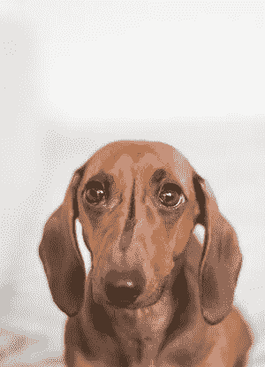

[照片由 Pexels 的 Dominika Roseclay 拍摄](https://www.pexels.com/photo/soft-focus-photo-of-dachshund-895259/)

Inception V3 期望图像的尺寸为 299 x 299，归一化像素范围在-1 和 1 之间。

让我们预处理一下我们漂亮的狗狗形象:

并检查该模型是否正确地对该图像进行了分类。

很好。模型按预期工作，并且*红骨*狗被归类为*红骨*狗:-)。

让我们转到有趣的部分，用快速梯度符号法产生对立的例子。

我已经创建了一个辅助函数来*可视化*原始图像和敌对图像。你可以在这个 [**GitHub 库**](https://github.com/Paulescu/adversarial-machine-learning/blob/main/adversarial_example_generation.ipynb) 中看到完整的实现。

我们第一次尝试愚弄概念 3(图片由作者提供)

好吧。有趣的是，新图像的模型预测是如何变化的，这与原始图像几乎无法区分。新预测的是一只*寻血犬*，是另一个肤色非常相似、耳朵很大的犬种。由于有问题的小狗可能是混种，模型错误似乎很小，所以我们想进一步工作，真正打破这个模型。

一种可能性是尝试不同的 T21 值，并试图找到一个明显给出错误预测的值。让我们试试这个。

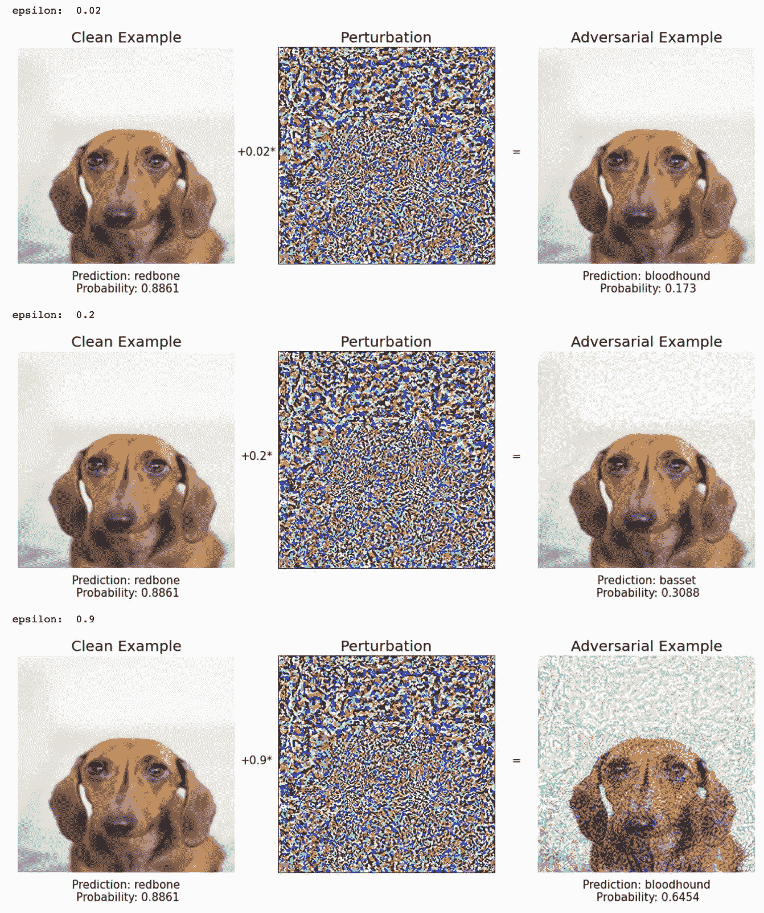

我们第二次试图愚弄盗梦空间 3(图片由作者提供)

随着ε增加，图像中的变化变得可见。不过模型预测的还是其他犬种: *bloodhound* 和 *basset* 。我们需要比这更聪明来打破这个模式。

记住快速梯度符号方法背后的直觉，即想象自己在所有可能图像的空间内(尺寸为 299 x 299 x 3)，就在原始图像 X 所在的位置。损失函数的梯度告诉您需要增加其值的方向，并使模型对正确的预测不太确定。步长为ε。你走一步，检查你现在是否坐在一个对立的例子上。

这种方法的延伸是采取许多更小的步骤，而不是一步到位。每走一步，你都要重新评估坡度，决定你要走的新方向

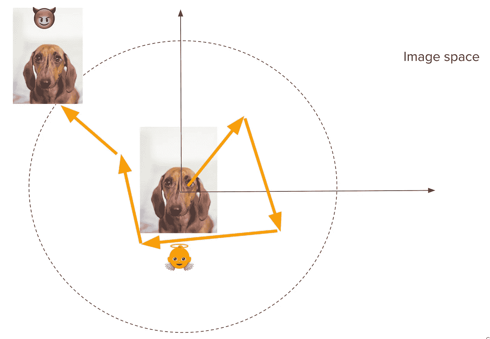

迭代快速梯度符号法(图片由作者提供)

这种方法称为迭代快速梯度法。多么原始的名字！

更正式地说:

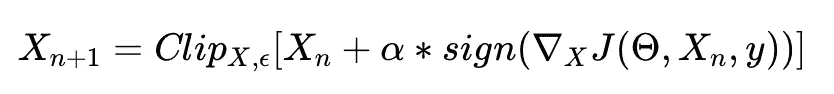

其中 *X0 = X* ，而*削波 X,ϵ* 表示在【x+ϵ].x−ϵ】范围内对输入的削波

PyTorch 中的一个实现如下:

现在，让我们再次尝试从我们无辜的小狗开始，创造一个好的反面例子。

第一步:又是猎犬

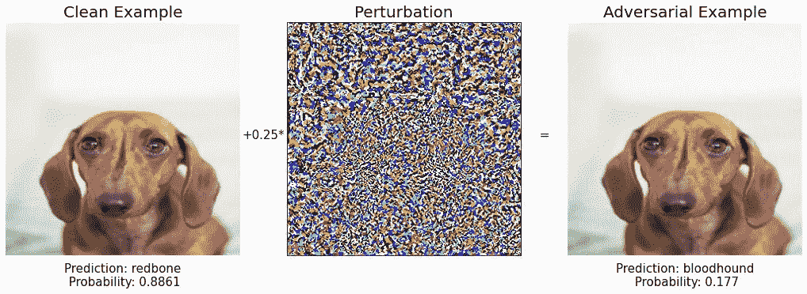

第一步(作者图片)

再次比格犬

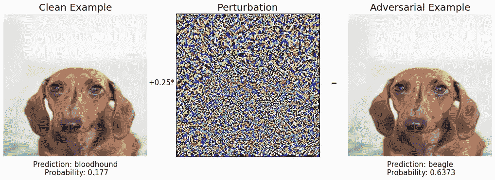

第二步(作者图片)

第三步:捕鼠器？有意思。然而，该预测的模型置信度仅为 16%。让我们更进一步。

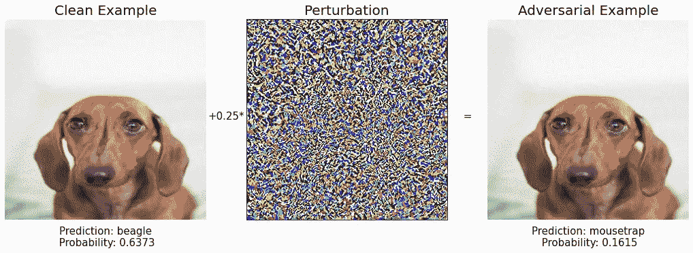

第三步(作者图片)

第四步:多一个犬种，无聊…

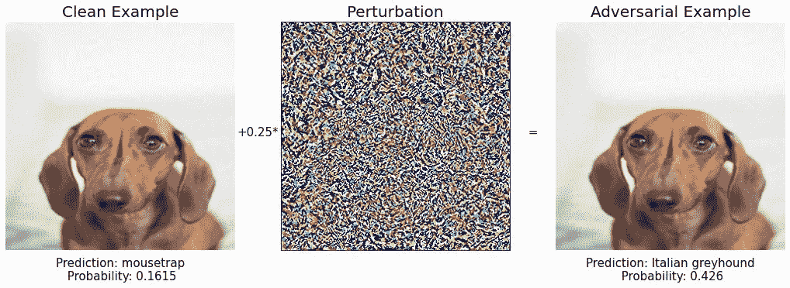

第四步(作者图片)

第五步:再次比格犬..

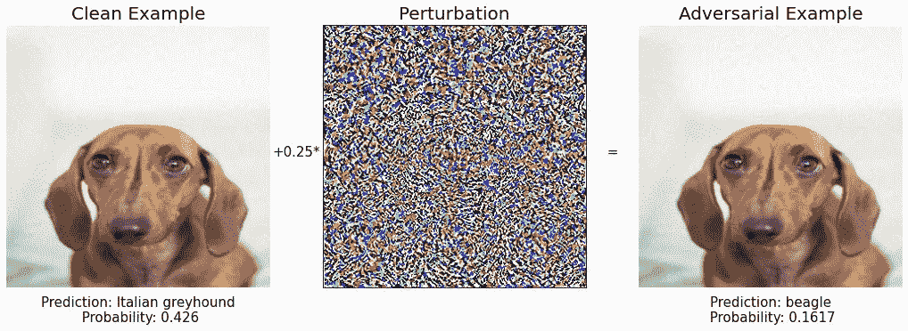

第五步(作者图片)

第六步:

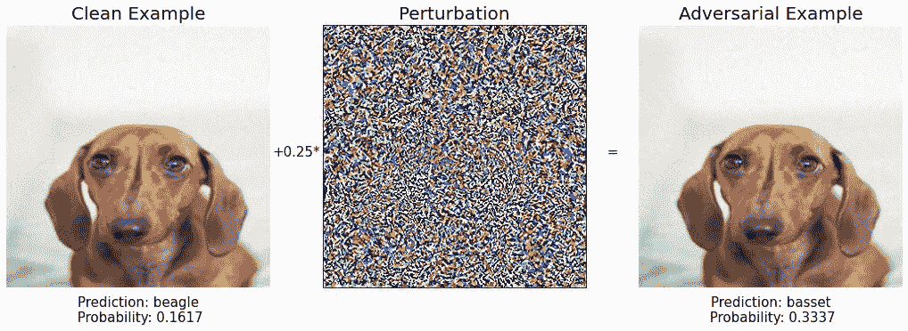

第六步(作者图片)

第七步:再次红骨。*保持冷静，继续在影像空间中行走。*

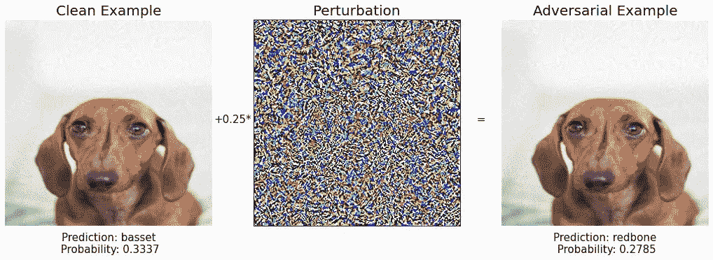

第七步(作者图片)

第八步:

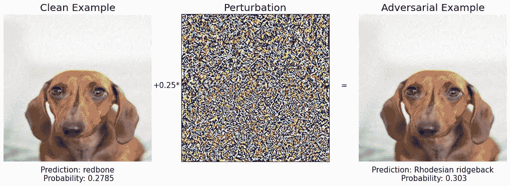

第八步(作者图片)

第九步:宾果！🔥🔥🔥

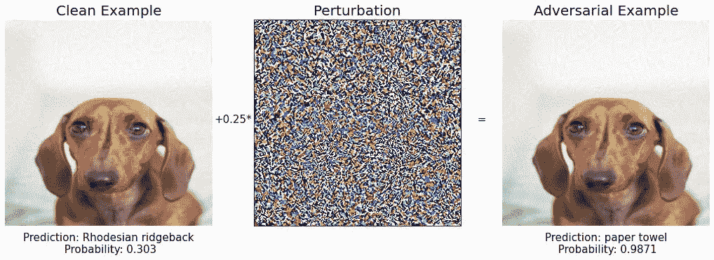

第九步(作者图片)

多么奇特的纸巾啊。这个模型对它的预测相当有信心，几乎有 99%。

如果您比较我们在步骤 9 中找到的初始图像和最终图像

第九步(作者图片)

你可以看到它们本质上是一样的，一只*小狗*，但是对于 Inception V3 模型来说，它们是两个非常不同的东西。

我第一次看到这样的东西，非常惊讶。对图像的微小修改会导致这样的模型错误行为。这个例子很有趣，但如果你想到自动驾驶汽车愿景的含义，你可能会开始有点担心。

部署在关键任务中的深度学习模型需要正确处理对立的例子，但如何处理呢？

# 4.如何为你的模型辩护对抗的例子？

截至 2021 年 11 月，没有一个通用的防御策略可以让你抵御敌对的例子。换句话说，用对立的例子攻击一个模型比保护它更容易。

可以抵御任何已知攻击的最佳通用策略是在训练模型时使用对立的示例。

如果模型*在训练过程中看到*的对立实例，那么对于以相同方式生成的对立实例，其在预测时的性能会更好。这种技术被称为**对抗训练**。

您可以在训练模型时动态生成它们，并调整损失函数以查看干净的和敌对的输入。

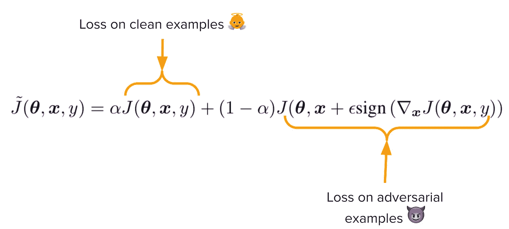

使用对抗训练时的损失函数(图片由作者提供)

例如，如果我们将 10+个例子添加到训练集中，并将它们都标记为 *redbone* ，我们可以消除在上一节中发现的对立例子。

这种防御对于使用快速梯度符号方法的攻击非常有效。然而，还有更强大的攻击，我们在这篇文章中没有提到，可以绕过这种防御。如果你想知道更多，我鼓励你读一读尼古拉斯·卡里尼和戴维·瓦格纳写的这篇令人惊叹的论文<https://arxiv.org/abs/1608.04644>**。**

**这就是为什么对抗性防御是机器学习和网络安全中的一个公开问题的原因。**

# **结论**

**对抗性的例子是网络安全和机器学习交汇处的一个有趣的话题。然而，这仍然是一个有待解决的开放性问题。**

**在这篇文章中，我用代码示例对这个主题进行了实际介绍。如果你想进一步工作，我推荐 [**cleverhans**](https://github.com/cleverhans-lab/cleverhans) ，这是一个由伟大的 Ian Goodfellow 和 Nicolas Papernot 开发的用于对抗性机器学习的 Python 库，目前由多伦多大学<https://cleverhans-lab.github.io/>**维护。****

****本文中我展示的所有源代码都在 [**这个 Github repo**](https://github.com/Paulescu/adversarial-machine-learning) 中。****

****<https://github.com/Paulescu/adversarial-machine-learning>  

*你想成为(甚至)更好的数据科学家，接触机器学习和数据科学的顶级课程吗？*

👉🏽订阅 [***数据机*通迅**](https://datamachines.xyz/subscribe/) **。**

👉🏽给我很多掌声👏🏿👏🏽👏在下面

👉🏽 [**跟着我**](https://medium.com/@pau-labarta-bajo) 上媒。

祝你愉快，🧡

避寒胜地****