# 欺骗面部识别的对抗性眼镜

> 原文：<https://towardsdatascience.com/adversarial-eyeglasses-to-trick-facial-recognition-887c9f90930f?source=collection_archive---------25----------------------->

我最近读了 Sharif 等人的一篇论文，描述了一个生成对抗性例子的一般框架，他们利用固定在人们脸上的眼镜框来欺骗面部识别分类器。此外，这种方法在打印出眼镜框并在身体对抗攻击中使用它们时也有效。

我决定用 PyTorch 构建一个 GitHub 库来实现这个方法[。我还添加了一些额外的附加功能用于推断(比如在你的网络摄像头上自动试用眼镜)。](https://github.com/jchaykow/AGN-pytorch)

我将谈一谈这个方法以及我是如何实现它的。

# 目标

来生成眼镜框，使面部识别分类器认为你是别人

# 工具

*   1 甘
*   1 个分类器
*   [1 大眼镜架数据集](https://drive.google.com/file/d/1Gil6VHYI3FCkwNO8T3vCtFc75zltolIl/view)
*   [一些名人面孔的图片](http://vis-www.cs.umass.edu/lfw/)
*   我脸部的一些图像

# 算法

我想把论文中的算法分解成简单的文字，以便更好地理解讨论的方法。

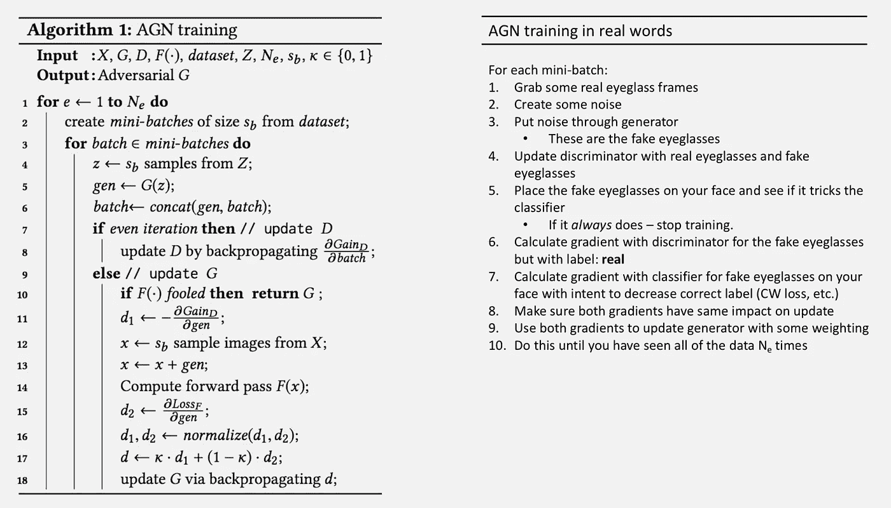

来自[论文](https://arxiv.org/pdf/1801.00349.pdf)(左图)——我的“翻译”(右图)[图片由作者提供]

# 微调面部识别分类器

我利用在 VGGFace2 上训练的预训练面部识别模型，然后微调它来识别我的脸。查看[我的另一篇关于微调面部识别分类器的文章](/finetune-a-facial-recognition-classifier-to-recognize-your-face-using-pytorch-d00a639d9a79)了解更多信息。

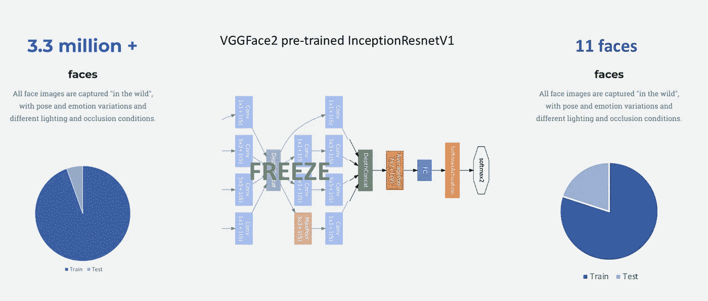

冻结网络中的图层并微调模型[图片来自作者]

我用交叉熵损失和随机梯度下降训练。

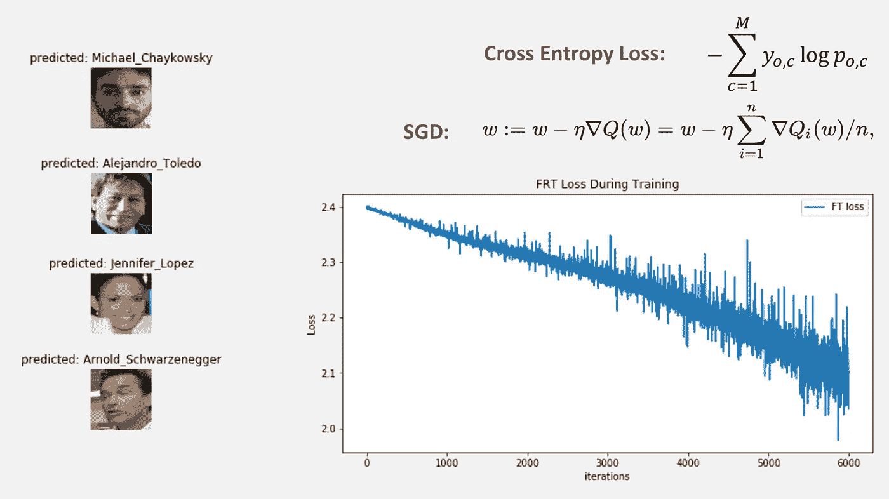

迭代损失图和微调模型的样本输出[图片由作者提供]

# 预训练 GAN

我实现了一个简单的 DCGAN 架构，它是在[成千上万个眼镜框图像](https://drive.google.com/file/d/1Gil6VHYI3FCkwNO8T3vCtFc75zltolIl/view)(最初由论文作者收集和清理)上从头开始训练的。

具有训练数据和样本输出的 GAN 结构[图片由作者提供]

训练这个甘是棘手的，需要一些按摩。GAN 逐步了解了眼镜框的结构(如下所示)。GAN 还学习了每个图像的黑色背景。

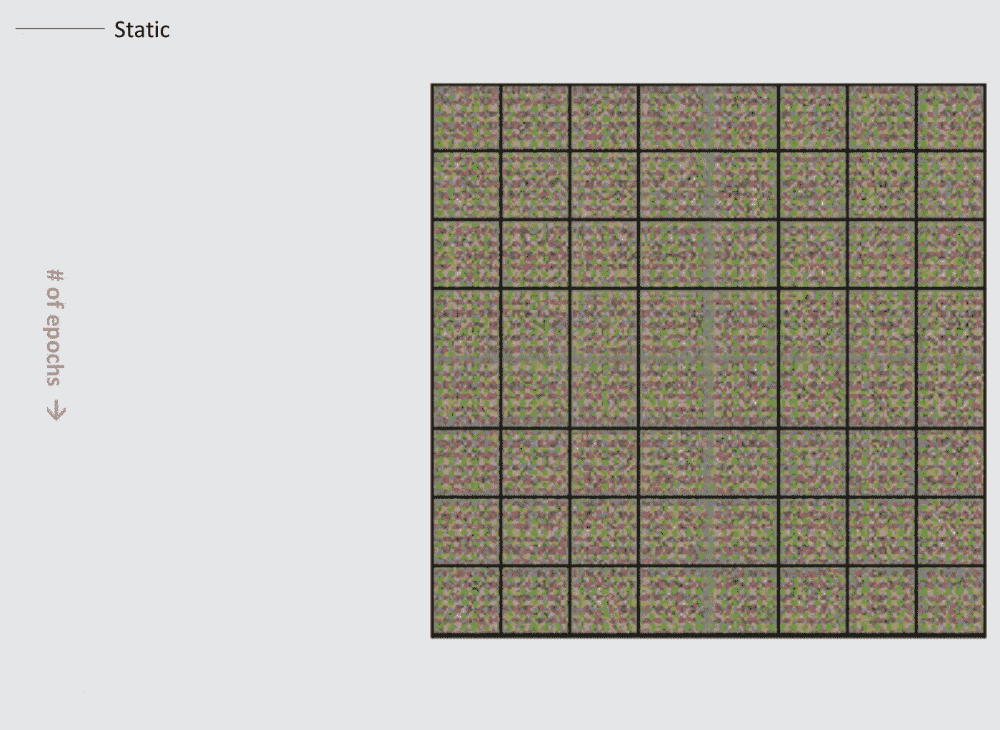

起初，甘只是产生静电[图片由作者]

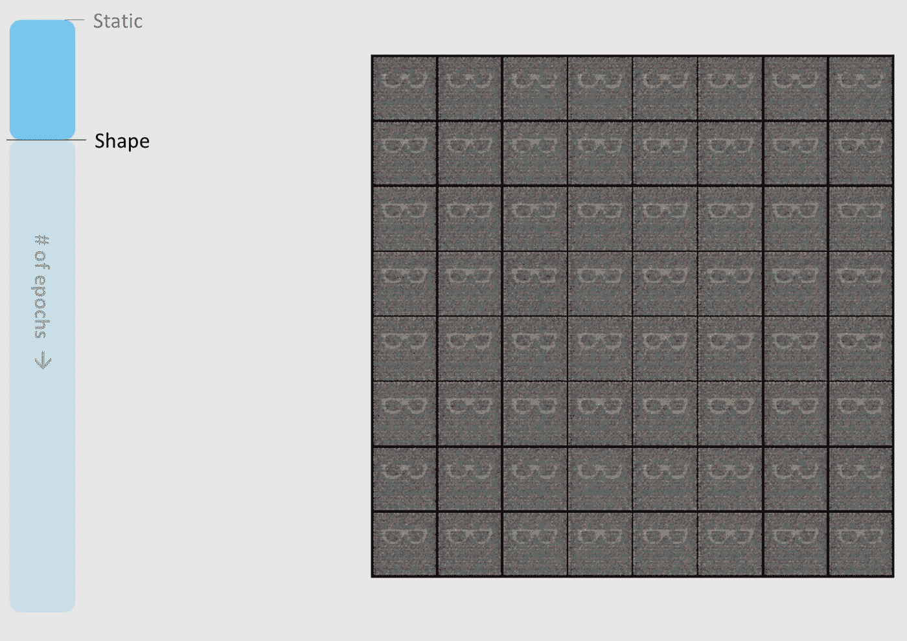

然后它开始呈现眼镜的形状[图片由作者提供]

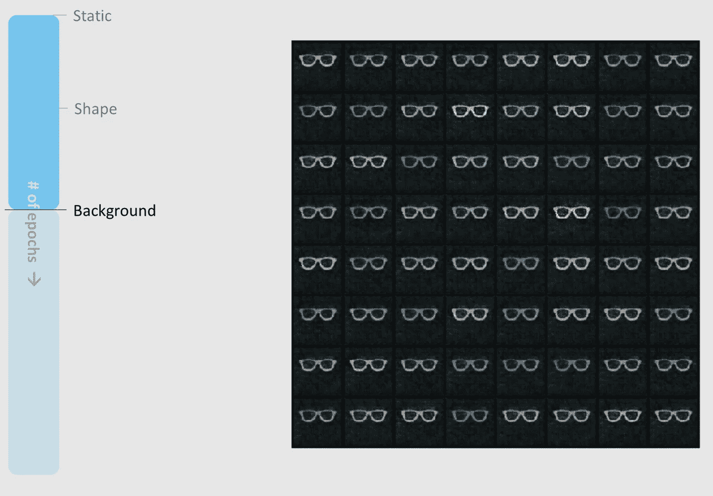

然后它学习了背景，但颜色仍然是柔和的[图片由作者提供]

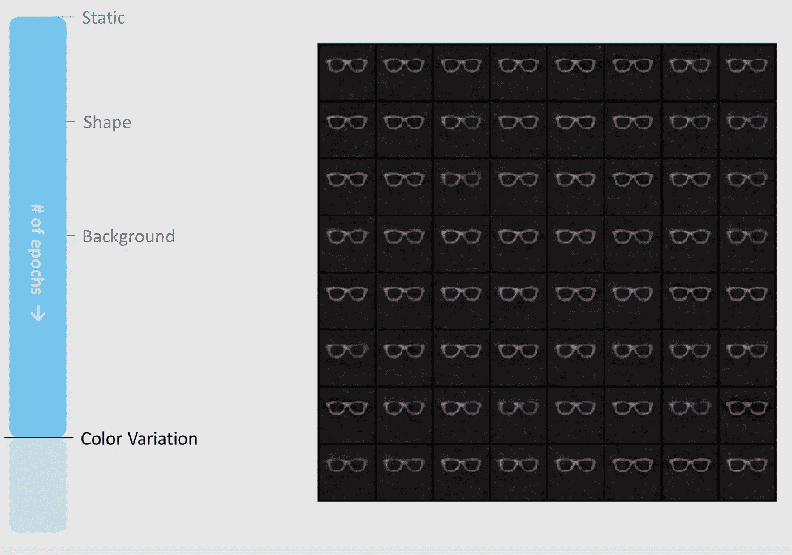

它终于开始出现一些颜色变化[图片由作者提供]

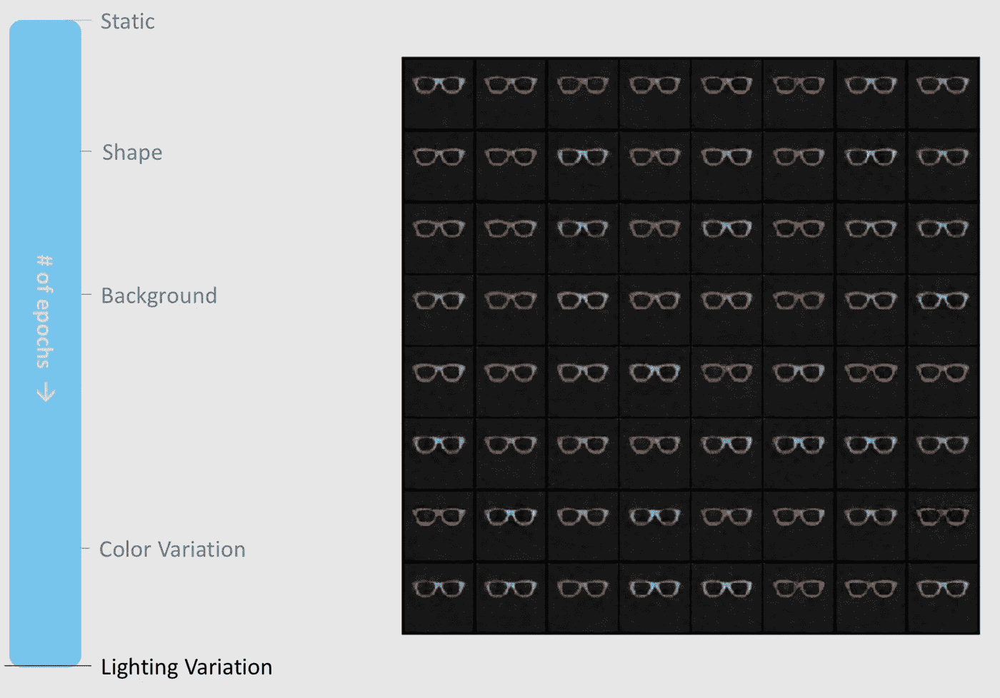

然后我开始注意到图像中的一些光线变化

现在我们有了一个预训练的 GAN 和一个微调的面部识别分类器。

# 为 AGN 培训准备数据

我需要我的脸的图像，将有轻微的倾斜和照明变化。然后，这些图像将在 AGN 训练中用于将对立的眼镜框固定到每张脸上，并检查分类器是否被欺骗。为了获得这些图像，我简单地用我的 iPhone 拍了一段视频，然后把它们转换成 png 图像。然后，我将这些图像通过一个 MTCNN，它将每张脸与图像的宽度和高度相匹配，用于面部识别模型的训练和推理。

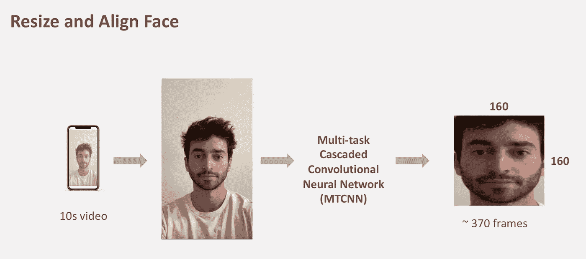

[图片由作者提供]

在训练期间，我尝试了一系列不同的变换，希望能使我的实现对各种角度和光线变化更加鲁棒。

[图片由作者提供]

> 最大的挑战之一是在每次迭代中将眼镜框固定到每张人脸图像上，因为每张图像的眼睛位置都不同于上一张图像——这一切都必须是可区分的！

为了能够将眼镜框架准确地固定到每幅图像中眼睛所在的位置，我利用面部标志分析来获得每幅图像中眼睛位置的坐标。

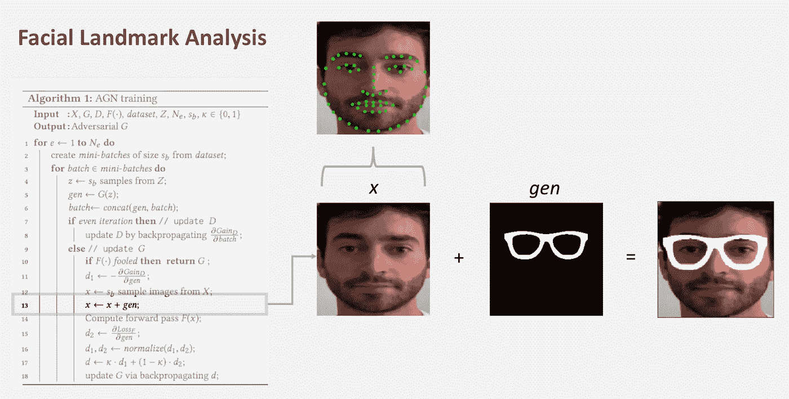

[图片由作者提供]

我的 PyTorch 数据集类由我的脸部图像和每张图像中我眼睛位置的坐标组成。然后，为了将 *gen* 图像转换成眼镜框，我使用 PyTorch 转换函数来保持整个过程的可区分性——我也在 CV 中实现了这一点，但必须为训练步骤重写它。

# AGN 培训

培训期间最大的挑战是一个培训循环中的 2 个生成器更新。我们希望更新生成器是传统的 GAN 方式 s.t .它可以继续输出适当的眼镜框，但是，我们也希望这些眼镜框欺骗面部识别分类器。对于对抗性损失函数，我使用了卡里尼-瓦格纳损失(连续波损失)。

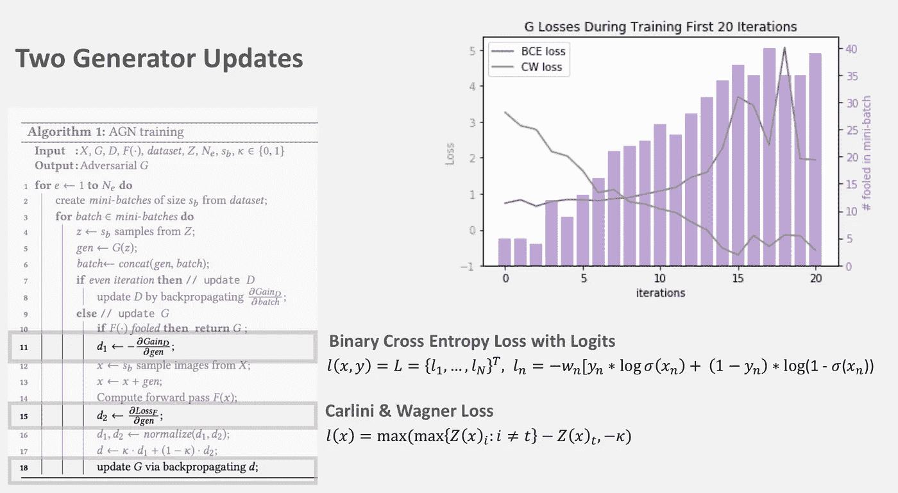

[图片由作者提供]

稍作调整，这种损失可以进行有针对性的或非有针对性的攻击。

现在，我们应该有一个生成器来输出眼镜框，这些眼镜框一贯欺骗面部识别分类器。我想在我的脸上测试这个对抗性生成器，所以我写了一个脚本来利用我的计算机的网络摄像头，并在执行面部识别时自动将生成的眼镜框放在我的眼睛上。眼镜可以随时换成新眼镜或非对抗性眼镜。

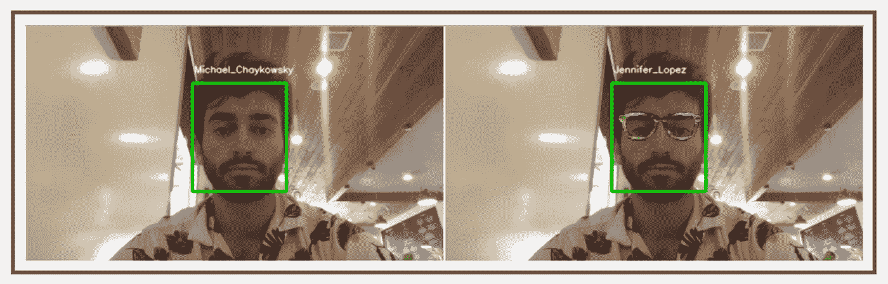

我在咖啡馆里测试一些对抗性眼镜[图片由作者提供]

查看[GitHub 回购](https://github.com/jchaykow/AGN-pytorch)了解更多信息！