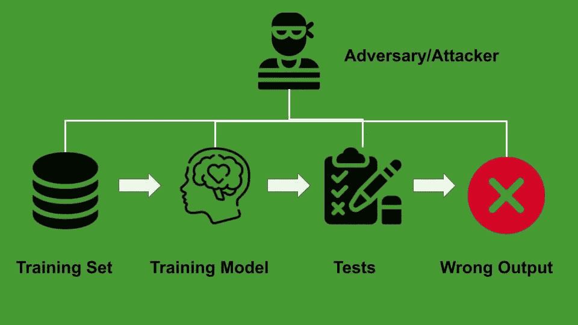

# 对抗性机器学习:攻击和可能的防御策略

> 原文：<https://towardsdatascience.com/adversarial-machine-learning-attacks-and-possible-defense-strategies-c00eac0b395a?source=collection_archive---------13----------------------->

## 信息论

## 关于机器学习和人工智能的一个新兴研究领域的概述。

作者图片

近年来，对机器学习(ML)模型的研究不断发展，导致了非常精确的模型的定义。事实上，ML 研究人员的主要目标一直是开发更精确的模型。

因此，**研究和开发没有关注这些模型的安全性，留下了许多严重的漏洞，这在理论上可能会对已实现的模型造成重大损害。**

> 对抗性机器学习是一种试图修改现有机器学习模型的技术，目的是在预测中引入错误。

在这篇文章中，我将概述对抗性的 ML 攻击和可能的防御策略。

# 攻击

在计算机安全中，**对手**(或攻击者)是试图攻击系统以达到某些目的的人(人或机器)。对手可以在两个层次上对 ML 模型进行攻击:

*   **训练**:攻击者试图在训练时扰乱模型或数据集，例如通过注入虚假数据或修改数据集中的数据；
*   **测试**(或**推理** ) **:** 这种攻击是在模型已经训练好的情况下进行的。

无论执行何种类型的攻击，对手可能知道也可能不知道该模型，因此他们可以执行以下攻击之一:

*   **黑盒攻击—** 攻击者对模型一无所知
*   **灰箱攻击—** 攻击者拥有模型的部分知识，如模型架构、参数、训练方法或训练数据；
*   **白盒攻击**:攻击者完全了解模型或训练集。

## 训练时间攻击

这种攻击的目的是修改学习过程，以便:

*   训练模型以预测特定的输出，或者
*   训练模型来预测任何输出，但不预测实际输出。

存在两类训练攻击:

*   **数据访问** —攻击者拥有数据集的(部分)访问权，因此他们可以创建一个替代模型，该模型可以在测试阶段使用。
*   **中毒** —攻击者修改数据集或模型本身，以创建一个经过修改的训练模型。

实施中毒的攻击者可能采用以下策略:

*   **操纵**现有的训练集
*   **向训练集注入**新的虚假数据
*   **逻辑讹误，**篡改学习算法。

在前两种情况下，攻击者应该有一些控制训练集的方法，而在第三种情况下，攻击者应该能够控制模型。

例如，让我们假设一个分类任务预测两个输出标签:**同意**和**不同意**。攻击者可以修改一些训练标签，将两个字符 **a** 和 **s** 分别改为 **d** 和 **i** ，反之亦然。这将最终产生反向训练模型。

## 测试时的攻击

测试时的攻击在运行时执行，此时模型已经被训练和部署。这些类型的攻击不会试图修改输出。相反，测试时的攻击旨在找到训练模型中的一些漏洞，以便:

*   通过模型(**规避攻击**)找到一些能够规避适当输出的对抗性例子，
*   推断模型或训练集的一些信息( **Oracle 攻击**)。

Oracle 攻击包括:

*   **提取攻击**，攻击者试图从模型预测的分析中提取模型的参数；
*   **反转攻击**，攻击者试图重建训练集，包括侵犯隐私的个人信息。
*   **成员推断**，攻击者试图确定作为输入提供的给定数据是否在模型训练集中。

下图总结了攻击者可以执行的主要攻击类型:

作者图片

# 防卫

为了保护 ML 系统免受恶意 ML 攻击，应遵循以下步骤:

*   识别管理信息系统的**潜在漏洞**
*   **设计并实施**相应的攻击，并**评估**它们对系统的影响
*   提出一些**对策**来保护 ML 系统免受已识别的攻击。

无论如何，所有的防御策略都可能涉及系统的一些性能开销，以及模型准确性的降低。

## 防御训练攻击

这种类型的防御试图**使训练集更加健壮**，例如通过删除所有导致高错误率的记录。防御训练攻击包括以下策略:

*   **数据加密**——对抗数据访问攻击。
*   **数据净化** —对比中毒攻击。这种技术测试每一个样本，以发现对立的样本。
*   **稳健统计** —对比中毒攻击。该技术试图通过应用约束和正则化方法来减少由中毒引起的模型的潜在失真。

## 防御测试攻击

这种类型的防御是在训练阶段实现的，尽管它的目的是在测试阶段保护系统。对测试攻击的防御试图**减少对手对模型造成的扰动的影响。**

存在许多技术来保护系统免受测试攻击，包括**对抗训练**，其中具有对抗扰动的新输入和正确的输出标签被注入到训练数据中，旨在最小化由对抗数据引起的错误；**渐变掩蔽**、**防御提取**、**集成方法**、**特征挤压**和**自动编码器。**

> 当对手能够执行 Oracle 攻击时，防御测试攻击是非常困难的，这允许他们建立一个替代模型，该模型可以用作白盒。

下图总结了针对对抗性机器学习攻击的可能防御策略:

作者图片

# 用于对抗性 ML 的 Python 库

有许多 Python 库处理对立的 ML，比如下面这些:

*   [对抗性鲁棒性工具箱](https://github.com/Trusted-AI/adversarial-robustness-toolbox/wiki/ART-Attacks)
*   [挂钩](https://github.com/cleverhans-lab/cleverhans)
*   [傻瓜箱](https://github.com/bethgelab/foolbox)
*   [刮擦声](https://github.com/iArunava/scratchai)

在我以后的帖子中，我将调查这些库…敬请关注！

# 摘要

在本文中，我简要描述了最著名的对抗性机器学习攻击和一些可能的防御技术，以减轻它们对已部署的 ML 模型的影响。

如果你想了解我的研究和其他活动的最新情况，你可以在 [Twitter](https://twitter.com/alod83) 、 [Youtube](https://www.youtube.com/channel/UC4O8-FtQqGIsgDW_ytXIWOg?view_as=subscriber) 和 [Github](https://github.com/alod83) 上关注我。

# 参考

[21 种对抗性机器学习的分类和术语](https://nvlpubs.nist.gov/nistpubs/ir/2019/NIST.IR.8269-draft.pdf)

[什么是对抗性学习？](https://pralab.diee.unica.it/en/WhatIsAdversarialLearning)

# 相关文章

 [## 语义网真的死了吗？

### 语义网好像已经快没了。这是真的吗？在这篇文章中，我们试图追溯语义学的历史…

medium.com](https://medium.com/geekculture/is-the-semantic-web-really-dead-7113cfd1f573)  [## 我六月文章的摘要…以防你错过

### 快速回顾一下我在六月份发表的文章:从数据分析，到数据可视化，再到环境设置。

alod83.medium.com](https://alod83.medium.com/june-articles-a-summary-of-my-june-articles-in-case-you-have-missed-them-8bc370375419)  [## Expire-Span:忘记无关信息的新人工智能算法

towardsdatascience.com](/expire-span-the-new-ai-algorithm-that-forgets-irrelevant-information-61da9b442237)