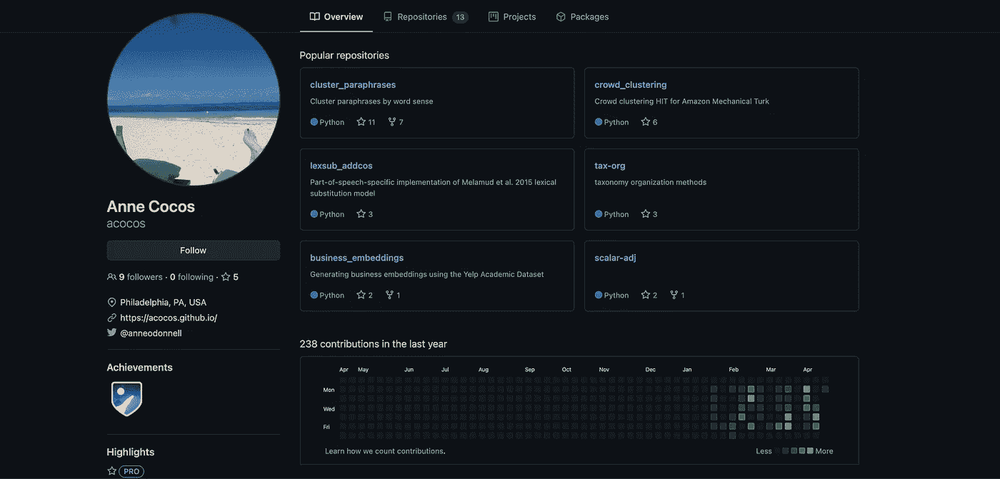
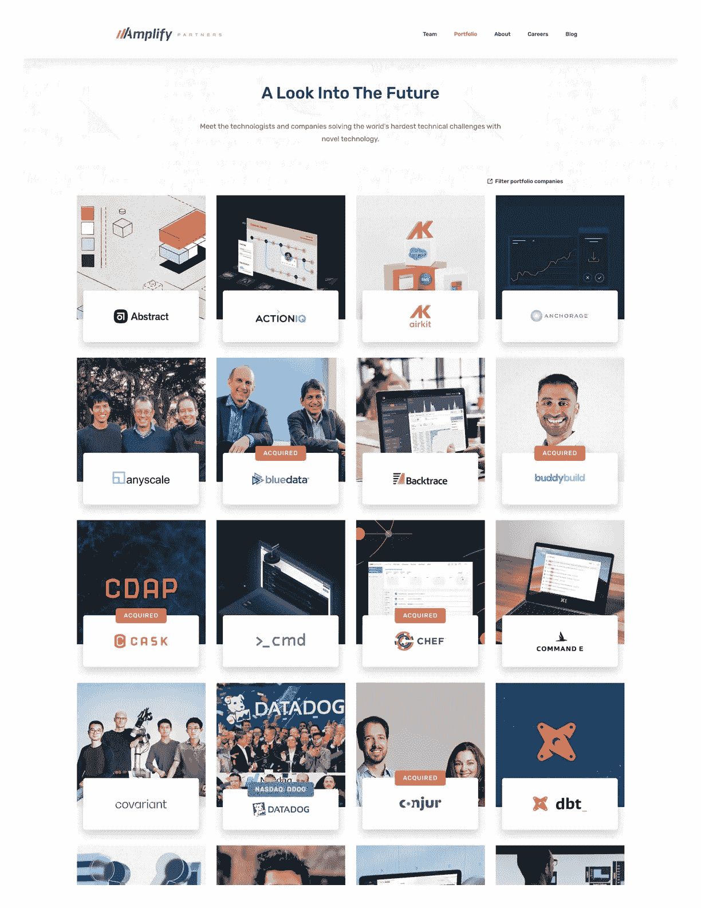

# 给有抱负的数据科学家的建议

> 原文：<https://towardsdatascience.com/advice-for-aspiring-data-scientists-20e71dd9ef25?source=collection_archive---------11----------------------->

## 来自创业公司创始人和前 Airbnb 数据科学经理的专业建议，帮助你的应用脱颖而出

照片由 [**克里斯蒂娜@ wocintechchat.com**](https://unsplash.com/@wocintechchat)在 [Unsplash](https://unsplash.com/?utm_source=medium&utm_medium=referral) 上拍摄。

几年前，基于我在 Airbnb 数据科学团队的经历，我写了一篇名为“[给新数据科学家的建议](https://medium.com/airbnb-engineering/new-data-scientists-tips-for-success-5f898b6a33f3)”的文章。这篇文章是 2019 年 4 月 KD-nugget 的[最受关注的博客](https://www.kdnuggets.com/2019/05/top-stories-2019-apr.html)之一，自那以来，它在 Medium 上有近 4 万次观看。它已经在许多地方被联合发行——甚至被剽窃，如果你能相信的话！😂我对那些给出太多建议的人很警惕，但我真的喜欢规模经济，我有太多关于这类信息的请求，但我都忽略了(抱歉！).因此，我决定尝试综合我对进入您的第一个数据科学角色的建议。这个建议是基于我在 Airbnb 近 5 年的工作经历，我在那里参加了数十个数据科学团队的招聘委员会，担任过许多职位的招聘经理，以及我最近在 Iggy 担任初创公司创始人兼首席执行官的经历。

为了正确设定期望值，这篇文章*假设你在数据科学或分析*方面受过一些培训。在我看来，这意味着你可以用 R 或 Python 编写代码，使用这两种语言中的通用包快速转换数据，编写复杂的 SQL，掌握可靠的统计数据，并充分理解各种机器学习技术和算法。(关于如何快速了解这些话题的资源，请查看我的前 Airbnb 同事 [Kelly Peng](https://medium.com/u/f4a64ff38660?source=post_page-----20e71dd9ef25--------------------------------) 的精彩文章[。大多数人认为这种基础培训足以获得数据科学领域的第一份工作。对不起，但那基本上是错的。基础训练只是基础。我接下来要分享的建议是你从这个基础出发的跳板。](/how-to-land-a-data-scientist-job-at-your-dream-company-my-journey-to-airbnb-f6a1e99892e8)

**投资组合**

Github 回购作为投资组合的一个极好的例子。记录每个回购的 READMEs 的使用情况和其中链接的博客(即在[business _ embeddeds](https://github.com/acocos/business_embeddings)*)。*图片作者。

如果你没有从这篇文章中得到其他东西:建立一个作品集，最好是在 Github 中，展示你的数据科学技能。我坚信这是任何应用程序和真正引起关注的应用程序之间的区别。作品集的目标是让你的简历更有活力；它将你从数百名(如果不是数千名的话)申请你的第一份数据科学工作的其他申请者中区分出来。你的作品集是展示你作品的地方。

关于你的投资组合应该包括什么的一些想法:分析、代码要点、网络应用、数据文档和博客(+ [自述文件](https://docs.github.com/en/github/creating-cloning-and-archiving-repositories/about-readmes)！).无论如何，你不需要所有这些，但如果我必须选择两个，我会选择一个 webapp 和附带的博客帖子。webapp 是一种很好的方式，可以展示你将不同的软件链接在一起，并在 web 上创建动态的东西的能力。但是为什么是博客呢？正如我在上一篇文章中所说的那样，*作为一名数据科学家，沟通是你工作*中最重要的方面之一。书面交流尤其重要，如果你的工作地点很远，就更是如此。一篇写得好的博客文章(带有链接代码)可以让读者了解你是如何交流、编码和思考的。如果他们从这里得到好的信号，他们会想和你交谈。这一点很重要，因为让别人看你的简历是求职过程中最难的一步，所以如果你能增加在这里转换的机会，你将处于一个很好的位置。

你现在可能想知道如何为你的投资组合获得灵感。从你在 Twitter 或 Kaggle 上看到的一个很酷的数据集开始怎么样？是否存在任何数据质量问题，如泄漏、截断、丢失数据？它们如何影响分析？您也可以从思想领袖的时事通讯中获得灵感(参见下面的参考资料部分)。从当前和过去的问题中选择一些让你感兴趣的文章并阅读它们，开始在 Twitter 上关注人们，你很快就会有大量数据科学内容出现。有些人会分享分析——看看你能否复制和更新。其他人可能会讨论需要解决的数据科学挑战，您会如何解决？还有一些人会展示他们可以用 Python 做一些事情——你能用 R 做吗？最后，像我这样的公司将为数据科学家发布新工具。(这是[另一个我挖的](https://hex.tech/)。试用他们的工具并分享您的成果！你明白了。所有这些的目的都是为了成长和学习如何找到工作。这需要时间。

**求职**

一旦你的投资组合准备就绪，就开始找工作吧！如果你对初创公司感兴趣，请浏览 TechCrunch，看看有哪些公司获得了资助，并查看它们的招聘信息。或者对各种风投公司的投资组合公司做同样的事情。我会瞄准至少已经融资 B 轮的公司，尽管 C 轮可能是更好的选择。为什么？嗯，作为一名初级数据科学家，您可能需要一个足够的数据基础架构来保持高效，而对于年轻的公司来说，这种情况不太可能出现。如果你对大公司的工作更感兴趣，看看他们的工作列表，尽可能多地了解他们的工作。如果他们有科技博客，读一读。调查他们开源了什么。

来自 [Amplify Partners](https://amplifypartners.com/portfolio/) 的投资组合样本页面。*图片作者。*

**冷外展**

了解我的人都知道我是科技多元化的狂热支持者。我创办 Iggy 的原因有很多，但其中一个与我作为一名女性在一个极度男性主导的领域中的感受有关。我坚信，女性和少数族裔应该像男性一样创建公司，推动决策，设计出可以想象的最佳产品。不幸的是，这么多女人(包括我自己！)等着被告知他们可以做这些事情。分享一下我自己的经历:在离开数据科学公司创办自己的公司之前，我一心想要晋升为一名数据科学家。出于某种原因，我认为我需要那枚认可的印章去做一些不同的事情。！？).当我意识到(在一些帮助下)这毫无意义时，我就采取了行动。为什么我在这里分享这个？大多数男人做事不会等待或请求许可；他们只是做他们！作为一名招聘多个职位的创始人，[我几乎每周都会收到想要加入我公司的男性发来的冷冰冰的电子邮件。我已经收到 0 封来自女性的冰冷邮件](https://www.linkedin.com/feed/update/urn:li:activity:6788215079432155137/)。所以，读这篇文章的女人们:学会如何发送冷冰冰的邮件。这可能意味着稍微走出你的舒适区，申请一份工作，即使你没有达到 100%的工作要求。这很好！只要仔细看看你已经建立的投资组合，明确你的互补背景或深厚的个人兴趣。这可以抵消一些次要的工作要求。男人这样做，不加思考，这有助于他们。这一现实让我感到沮丧，但作为一名创始人，我可以告诉你，招聘真的很难，所以当人们通过一封简短的电子邮件将简历上的点点滴滴联系起来，让我的工作变得更容易时，我很感激。

我在下面附上了一封冷漠邮件的样本文本。请不要一字不差地照抄——用它作为灵感，写一些反映你声音的东西。

**关闭**

我希望这对你有所帮助。当招聘人员向你伸出援手时，你会知道你做得很好，当你给他们一个好的理由时，他们更有可能这样做！如果你有问题，请在评论区提问。如果这有所帮助，请在下面分享你的故事，让我知道。

林赛·佩廷吉尔，首席执行官@ Iggy

**资源**

**投资组合工具**

*   Github(托管你所有的代码):[https://github.com/](https://github.com/)
*   Heroku(托管 web apps):[https://www.heroku.com/](https://www.heroku.com/)
*   Iggy(我的公司；对于位置丰富):[https://askiggy.com/](http://askiggy.com/)
*   十六进制(用于交互式笔记本/应用):[https://hex.tech/](https://hex.tech/)

**时事通讯**

*   数据科学综述【http://roundup.fishtownanalytics.com/ 
*   dbt 社区简讯[https://community.getdbt.com/newsletter](https://community.getdbt.com/newsletter)
*   数据仙丹:[https://dataelixir.com/](https://dataelixir.com/)
*   要了解的项目[https://projectstoknow.amplifypartners.com/ml-and-data](https://projectstoknow.amplifypartners.com/ml-and-data)

**样本冷邮件模板**

*嗨，我刚刚看到/读到/听到{参考一些关于公司的实质性内容}。这对我来说很有吸引力/很有趣，因为{与以前的工作有联系，是作品集里的东西}。我在这方面做了一些工作{链接到它}，很想和您聊聊{公司}的数据科学职位。在接下来的几周里，你有时间和我聊 15 分钟吗？*