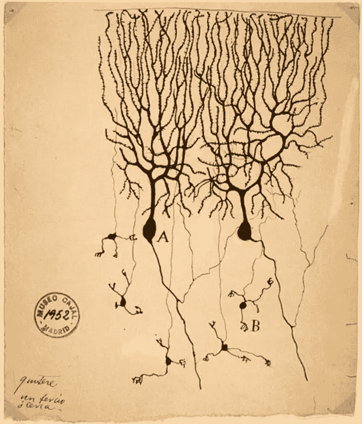
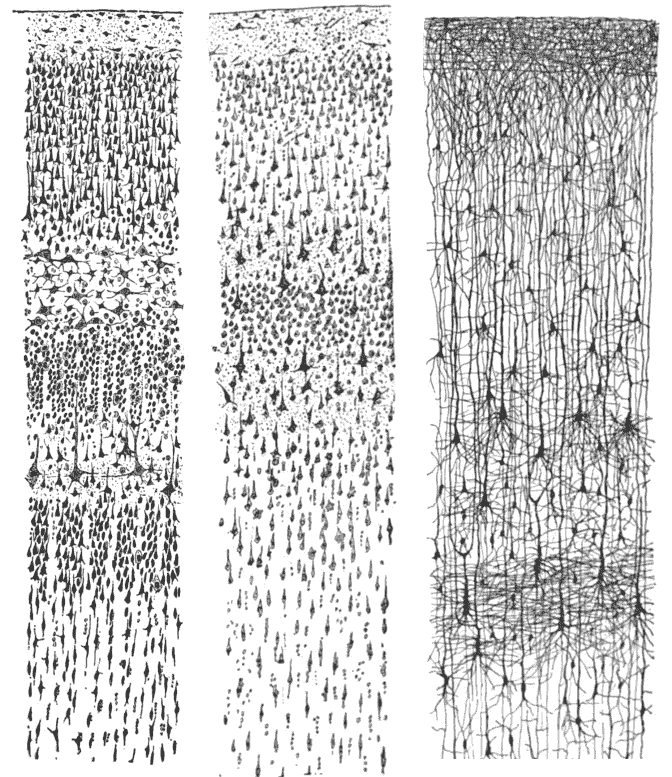
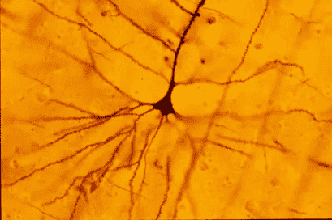

# 审美认识论——评埃尔娜·菲奥伦蒂尼的“诱导可见性”

> 原文：<https://towardsdatascience.com/aesthetic-epistemology-a-review-of-erna-fiorentinis-inducing-visibilities-3d61919593c3?source=collection_archive---------44----------------------->

## “诱导可见性:圣地亚哥·拉蒙·卡哈尔美学认识论的尝试”简评

[文章](https://www.ncbi.nlm.nih.gov/pubmed/22035711)作者[埃尔娜·菲奥伦蒂尼](https://kg.ikb.kit.edu/hinterwaldner/2508.php) : *“诱导可见性:圣地亚哥·拉蒙·y·卡哈尔审美认识论的尝试”/生物学和生物医学科学的历史和哲学研究 42(2011)391–394*

由 [Santiago Ramón y Cajal](https://en.wikipedia.org/wiki/Santiago_Ram%C3%B3n_y_Cajal) 于 1899 年从鸽子[小脑](https://en.wikipedia.org/wiki/Cerebellum)中提取[浦肯野细胞](https://en.wikipedia.org/wiki/Purkinje_cell) (A)和[颗粒细胞](https://en.wikipedia.org/wiki/Granule_cell) (B );西班牙马德里卡哈尔学院。

埃尔娜·菲奥伦蒂尼对神经科学之父、科学家圣地亚哥·拉蒙·y·卡哈尔的研究引入了“审美认识论”的概念来描述卡哈尔研究组织学的方法。组织学是用显微镜对植物和动物的细胞和组织进行解剖的研究。就其本质而言，组织学是一个我们不能直接观察研究对象的研究领域。

菲奥伦蒂尼理论化的“审美认识论”描述了一种知识生产的形式，在这种形式中，可视化被创造出来，使隐藏在观察者面前的东西变得可见，同时也提高了观察者的敏感性。大约在 1887 年，Cajal 改进了一种染色技术，使人类大脑皮层的神经元结构可见，大脑皮层是人体的一部分，神经元如此密集，以至于不能用标准的显微镜工具观察。通过使用这种染色方法并创建他的发现的大量详细图纸，Cajal 能够“诱导可见性”或创建测试结果的可视化，然后他拼凑起来以表示关于它们的更深层次的知识。因此，Cajal 绘制了代表在染色技术结果*中发现的信息的图纸，因为*假定了实际(不可见)神经元的可视化。他的目的不仅是展示大脑皮层中的神经元是什么样子，而且是解释整个系统及其功能。

这个提取和可视化数据以形成知识的过程就是菲奥伦蒂尼所说的“审美认识论”。用她自己的话来说，“卡哈尔高度复杂的绘画并没有再现给定的三维可视性，而是诱导了它的高级形式。”(菲奥伦蒂尼，第 393 页)因此，菲奥伦蒂尼认为，可见性的归纳不仅需要先进的可视化技术，而且这些可视化是知识生产的构成形式。卡哈尔的可见性归纳策略同样提到了理性的和审美的视觉感受，并认为这两者都是知识生产的构成要素(菲奥伦蒂尼，第 394 页)这个过程的一部分需要某种美学，因为艺术家科学家用手绘制图纸，通过绘画的过程梳理知识。

Santiago Ramon y Cajal 的三幅绘画，摘自《人类大脑皮层感觉区域的比较研究》一书，第 314、361 和 363 页。左图:成人尼氏染色的视觉皮层。中间:尼氏染色的成人运动皮质。右图:一个半月大婴儿的高尔基染色皮层。圣地亚哥·拉蒙·y·卡哈尔的《人类大脑皮层感觉区域的比较研究》，出版于 1899 年， [ISBN 9781458821898](https://commons.wikimedia.org/wiki/Special:BookSources/9781458821898)

将 Cajal 的画与最近的大脑成像可视化放在一起看，显示了 Cajal 能够诱导大脑皮层神经元可视化的惊人准确性。

照片由科罗拉多学院心理学系定量神经形态学实验室的鲍勃·雅各布拍摄

**我的收获和对数据科学家/数据可视化专家的意义:**

作为一名读者和数据从业者，我没有深入探讨菲奥伦蒂尼理论更深层次的认知影响，而是从这篇文章中带走了许多问题和想法。从可视化中归纳知识的概念是数据可视化的一个隐含部分。数据通常与它们量化的事物相分离，通常数据可视化是数字的表示，而不是这些数字所描述的主题。换句话说，仅仅是地图、图形和图表。因此，数据可视化专家通常依靠写作来创建关于数据的有意义的故事，即补充可视化。

卡哈尔的工作显示了将艺术和美学作为一种知识生产形式的承诺和可能性。对于数据可视化专家来说，只要有可能，就应该使用诱导可见性和审美认识论的概念，将美学和艺术实践融入到他们的工作中。