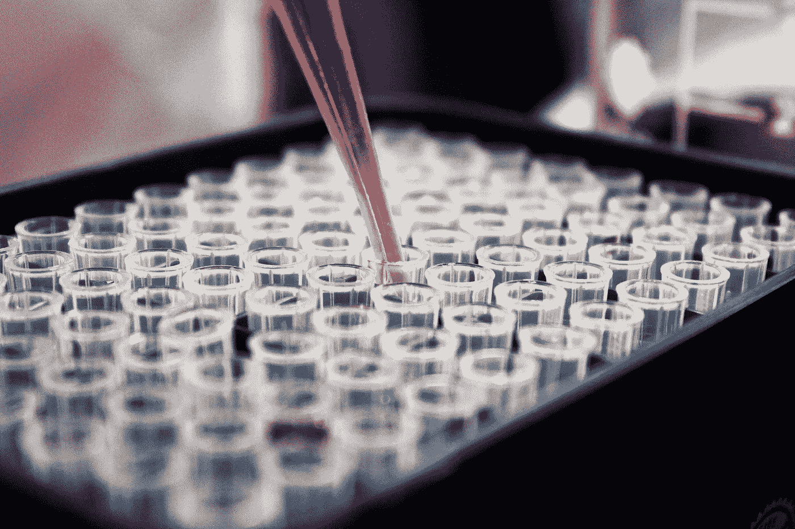
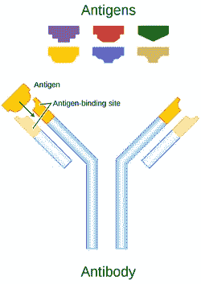
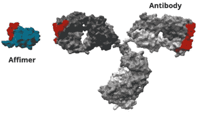
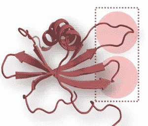
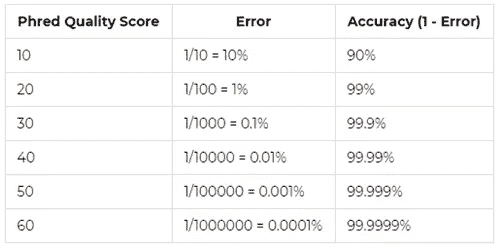
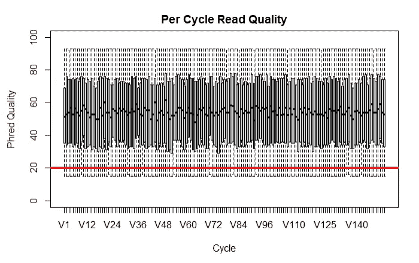

# 亲和蛋白质:下一代测序数据分析(第 1 部分)

> 原文：<https://towardsdatascience.com/affimer-proteins-next-generation-sequencing-data-analysis-part-1-ac6a252842be?source=collection_archive---------25----------------------->



路易斯·里德在 [Unsplash](https://unsplash.com/s/photos/science?utm_source=unsplash&utm_medium=referral&utm_content=creditCopyText) 上的照片

## [思想和理论](https://towardsdatascience.com/tagged/thoughts-and-theory)，亲和蛋白质

## *亲和分子、抗体和 DNA 序列内的搜索*

# 介绍

在这个博客系列中，我将使用 R 编程语言描述一个具体的数据分析问题。也就是说，分析来自下一代测序机器的生物数据，涉及一种称为亲和蛋白的特定类型的分子。合理的 R 工作知识有利于理解代码，但没有这个也能理解整体流程。

在第 1 部分中，我们将首先介绍分析任务的背景，然后我们将开始探索一些示例数据，并在 DNA 序列中找到特定的模式。在第二部分，我们将进一步分析，看看氨基酸翻译和“移码”。最后，在第 3 部分，我们将看到如何使用分子条形码，然后如何削减最佳亲和蛋白质候选人的选择。

# 什么是亲和分子？

在讲亲和分子之前，我们需要了解 [***抗体***](https://en.wikipedia.org/wiki/Antibody) 的基础知识。抗体是 Y 形分子，是免疫系统的重要组成部分。它们被用来检测和结合触发免疫反应的分子，如细菌或病毒。靶向的独特分子部分被称为**抗原**(或“抗体发生器”)，可以被认为是抗体相应“锁”的“钥匙”。

抗体上的一个部分(“Y 部分”)在不同的抗体之间有很大的差异，但对每种抗原都有极强的特异性。这不仅使它们可用于对抗感染，还可用于诊断测试的开发，因为它们可用于检测感兴趣的分子。例如，家庭妊娠测试使用抗体(固定在试纸上的一条线上)来检测并附着到 [*人绒毛膜促性腺激素*](https://en.wikipedia.org/wiki/Human_chorionic_gonadotropin) (hCG)。

出于这一原因以及许多其他原因，抗体在全球范围内被用于从诊断到治疗的许多医学领域。通常，用于特定应用的抗体由单个细胞系产生，产生所谓的 [***单克隆抗体***](https://en.wikipedia.org/wiki/Monoclonal_antibody) 。

然而，尽管它们具有所有有用的特性，但这种抗体也有缺点，包括可能需要很长的时间来识别合适的结合物(即，与某些感兴趣的靶结合的特定抗体)，与它们相对较大的尺寸相关的问题(例如“空间位阻”，或由于分子庞大的性质而导致的化学反应变慢)，以及 [*不可避免地使用动物*](https://www.animalresearch.info/en/designing-research/experimental-design-analysis/antibody-production/) 。

下面是抗体的示意图，突出显示了抗原结合位点，



[图像参考](https://en.wikipedia.org/wiki/Antibody)

[***亲和分子***](https://en.wikipedia.org/wiki/Affimer) 是设计用于执行与单克隆抗体相似功能的蛋白质，但具有几个优点。首先，它们要小得多，这使它们比大得多的抗体更稳定(在温度和 pH 值方面)，也更不容易产生空间位阻。第二，就找到特定目标的活页夹而言，创建它们要快得多。第三，它们的批间一致性高。第四，不涉及动物，因为它们是通过体外过程产生的。

下图显示了抗体和亲和蛋白的相对大小。绑定区域显示为红色，



[图像参考](https://www.edisongroup.com/publication/affimer-potential-best-in-class-antibody-mimetic/24390/)

# 亲和分子生成

亲和分子不是为特定的应用而单独设计的。相反，大量的亲和结合物库被创造出来，从中选择合适的分子。我们将在下面更详细地描述这一过程，但在此之前，更深入地研究一下大自然是如何解决同一问题的，也就是说，如何为一个新的、以前未知的目标找到合适的粘合剂，这很有趣？这个过程实际上与亲和分子方法没有什么不同。

如果这是一个工程问题，我们会分析目标，并从理论上找出最好的粘合剂。大自然没有这种能力。相反，所采取的方法是从使用数十亿种不同抗体的强力随机方法开始。上面我们看到每个抗体都有一个高度可变的区域。有几种机制已经进化到在该区域产生变异(同时保持框架的其余部分不变，或在抗体之间“保守”)。首先， [***B 细胞***](https://en.wikipedia.org/wiki/B_cell) (一种产生抗体的白细胞)利用一种叫做**体细胞重组**(或者更具体地说， [***V(D)J 重组***](https://en.wikipedia.org/wiki/V(D)J_recombination) )的过程来产生初始可变性。这个过程基本上包括通过随机选择不同的可能子部分来构建抗体(有点像重复从一副牌中随机挑选卡片来生成许多不同的组合)。

一旦这些具有随机可变区的抗体之一与抗原结合(由于其可变区恰好相容)，第二种机制开始工作，以进一步提高亲和力(或吸引力的强度)。这被称为 [***体细胞超突变***](https://en.wikipedia.org/wiki/Somatic_hypermutation) ，涉及 B 细胞快速增殖过程中的错误导致的基因点突变(单核苷酸突变)。这些突变采用编码合适结合物的 DNA 序列，并以许多不同的方式对其进行轻微修改。一些随之而来的可变区将具有较低的亲和力，并且一些可变区可能一起失去它们与相应抗原的结合能力。但是有些可能，再次偶然地，增加它们的结合亲和力。随着细胞继续繁殖，产生这些抗体的相应 B 细胞将与那些结合强度较低的细胞竞争，导致在一个称为 [***亲和力成熟***](https://en.wikipedia.org/wiki/Affinity_maturation) 的过程中整体产生最佳结合剂。

结果是大量抗体具有非常适合结合特定抗原的可变区。

Affimer binders 以类似的方式创建，在特定的设计中使用随机化。这要从一个叫做<https://en.wikipedia.org/wiki/Phage_display>*的噬菌体展示过程说起。这是一个使用一种叫做噬菌体或简称噬菌体的病毒的过程。基因被插入到这些噬菌体中，使它们产生(或“展示”)与在其表面注射的基因相对应的特定蛋白质。通过允许这种基因突变，一些初始遗传序列的随机变体被创造出来，导致许多不同的版本(因此有术语“文库”)。亲和蛋白质文库由大约 10^10 随机序列组成。*

*下一步是将靶分子(即感兴趣的分子，为此需要结合剂)通过该文库，并观察哪些 10^10 结合剂是相容的。在简单的洗涤步骤去除剩余部分后，带有结合体分子的噬菌体可以被去除、扩增(通过感染细菌并使它们产生更多拷贝)，并重复该过程。这样，恰好结合的一种或多种结合物(记住，文库由随机突变组成)可以被分离、鉴定和表征。*

*正是这种表征开始产生数据。这个过程的第一步是从这些重复的步骤中提取结合物，并确定它们的确切 DNA 序列。这是至关重要的一步，因为现在有一个 Affimer 粘合剂具有特定应用的正确特征。表现型和相关基因型之间的这种联系使得某种分子能够被唯一地识别、隔离(比如说，由某个特定的公司或大学)和大规模生产。*

*就物理结构而言，亲和分子由“支架”(分子的主体)和两个肽环(氨基酸的短序列)组成。正是环的可变性使得亲和结合物能够针对靶分子进行筛选和选择。就数据分析而言，这些环的氨基酸序列是关键。请注意，这两个循环区域分别称为“循环 2”和“循环 4”。下图显示了突出显示这些可变环区域的亲和分子，*

**

*[图像参考](https://www.edisongroup.com/publication/affimer-potential-best-in-class-antibody-mimetic/24390/)*

# *数据分析*

*在这一节中，我们将深入分析与档案夹相关的数据。*

# *序列搜索*

*首先，我们来看看一些有用的 R 库和它们对应的用于简单 DNA 操作的函数。首先，确保安装了正确的 R 库，*

```
**if (!requireNamespace(“BiocManager”, quietly = TRUE))*
*install.packages(“BiocManager”)*

*BiocManager::install(“Biostrings”)*
*BiocManager::install(“ShortRead”)*

*#Note, if after ‘updating all’ from the above you receive an installation error, you may have to manually delete the ‘rlang’ folder and reinstall**
```

*接下来，加载已安装的库，*

```
*library(“Biostrings”) *#Package for sequence analysis*
library(“ShortRead”) *#For loading fastq files*
library(“tidyverse”) *#For general data manipulation and plotting*
library(“gridExtra”) *#For plotting multiple plots*
library(“stringr”) *#For various string functions**
```

*让我们从一个例子(完全虚构的)DNA 序列开始，我们将它设置为一个名为“seq”的变量，*

```
*seq = “TACGGAAAGCTAGAAAGTTTTGCTACTACATCAAAGTCCGCAAATACATGCACCTAAAAGTTGTTAACGGCCCATTCATA”*
```

*[***生物字符串***](https://bioconductor.org/packages/release/bioc/html/Biostrings.html) 模块提供了一个名为 **matchPattern** 的函数，用于在一个更大的序列中搜索一个序列。下面是一个例子，我们在“seq”变量中搜索子序列“AAGTTTT ”,*

```
*matchPattern(pattern = 'AAGTTTT', 
             subject = seq)## Views on a 80-letter BString subject
## subject: TACGGAAAGCTAGAAAGTTTTGCTACTACATCAA…CATGCACCTAAAAGTTGTTAACGGCCCATTCATA
## views:
## start end width
## [1] 15 21 7 [AAGTTTT]*
```

*您可以看到找到了较小的序列，从位置 15 开始，到位置 21 结束。该功能允许错配和**插入**(插入或删除碱基)。例如，让我们在子序列中间添加一个“A ”,并像以前一样运行它，*

```
*matchPattern(pattern = ‘AAGTATTT’, 
             subject = seq)## Views on a 80-letter BString subject
## subject: TACGGAAAGCTAGAAAGTTTTGCTACTACATCAA…CATGCACCTAAAAGTTGTTAACGGCCCATTCATA
## views: NONE*
```

*现在因为插入的 DNA 碱基，什么都没发现。但是，我们可以设置适当的参数来允许不匹配，最多允许 1 个不匹配，*

```
*matchPattern(pattern = ‘AAGTATTT’, 
             subject = seq, 
             with.indels = T, 
             max.mismatch = 1)## Views on a 80-letter BString subject
## subject: TACGGAAAGCTAGAAAGTTTTGCTACTACATCAA…CATGCACCTAAAAGTTGTTAACGGCCCATTCATA
## views:
## start end width
## [1] 15 21 7 [AAGTTTT]*
```

*现在该函数已经找到了原始匹配。注意，长度仍然是 7，因为它将插入的“A”识别为插入，而不是实际搜索序列的一部分。*

# *加载多个序列*

*现在让我们将它和其他一些有用的函数一起应用到一个加载的(演示)数据集。我们将使用 **readFastq** 函数直接加载一个 [*下一代测序*](https://www.ncbi.nlm.nih.gov/pmc/articles/PMC3841808/) (NGS) **Fastq** 文件。注意，我们实际上有两个文件，一个针对 [*读取方向*](https://thesequencingcenter.com/knowledge-base/what-are-paired-end-reads/) 。这是 NGS 机器如何工作的结果，通过从开始，向前，从结束，向后读取 DNA 的每个部分。我们稍后将研究 NGS 机器是如何工作的。*

*我们还将使用**线程**来提取 DNA 序列，最后**对第二个 DNA 序列进行反向补全**。*

*首先，我们使用函数 **readFastq** 来读取 Fastq 文件。这种文件格式广泛用于基因组学领域，是一种简单的文本文件。文件不仅包含序列，还包含“质量分数”(称为[***)Phred 质量分数***](https://gatk.broadinstitute.org/hc/en-us/articles/360035531872-Phred-scaled-quality-scores) 。这些是由 NGS 机器产生的，并且给出了单个碱基被阅读的程度的指示。见下表，*

**

*[图像参考](https://gatk.broadinstitute.org/hc/en-us/articles/360035531872-Phred-scaled-quality-scores)*

*分数实际上是用 ASCII 字符编码的，其中每个 ASCII 字符的数字代表质量分数(具体来说，从 0 到 93 的 Phred 质量分数用 ASCII 字符 33 到 126 编码)。我们会看看质量分数，但首先我们需要阅读数据，*

```
*#*Forward read* read_f = readFastq(path, pattern=”999250_S99_L001_R1_001.fastq”)*#Reverse read* read_r = readFastq(path, pattern=”999250_S99_L001_R2_001.fastq”)* 
```

*接下来，让我们使用 sread 从文件中提取序列，*

```
*dna_1 = sread(read_f)
dna_2 = sread(read_r)*
```

*然后得到反向阅读的反向恭维(因为是反向的！),*

```
*dna_2 = reverseComplement(dna_2) *#Get the reverse compliment**
```

*让我们看看第一个序列的质量，*

```
*quality(read_f[1])## class: FastqQuality
## quality:
## BStringSet object of length 1:
## width seq
## [1] 153 ^6@e?U1d@sy0i@`XHe~@BzFn`Ak=F7TQuT…Vq[q@VJ`TzVMGzoawbloN]P17k^zjA\d9*
```

*这里我们可以看到 ASCII 格式的质量分数。我们可以更进一步，通过使用 **FastqQuality** 和 **quality** 函数从文件中获取质量分数，然后使用 **boxplot** 函数绘制它们。根据经验，任何超过 Phred 质量分数 20 的都是可以接受的，所以我们将把这个阈值添加为一条红线，*

```
*qual <- FastqQuality(quality(quality(read_f))) *#get quality scores*

readM <- as(qual, “matrix”) *#convert scores to matrix*

boxplot(as.data.frame((readM)), *#Plot the data*
        outline = FALSE, 
        main=”Per Cycle Read Quality”, 
        xlab=”Cycle”, 
        ylab=”Phred Quality”, 
        ylim=c(0,100))

abline(h=20, lwd = 3, col = ‘red’) *#Add the horizontal line**
```

**

*我们可以看到，这次阅读的质量是好的，所有 Phred 分数都远远高于临界值。*

# *摘要*

*在第一篇文章中，我们已经看了什么是亲和分子，并开始看与 DNA 序列相关的 R 中的基本数据分析。在[第 2 部分](/affimer-proteins-next-generation-sequencing-data-analysis-part-2-8ebc0e90f460)中，我们将更深入地研究数据，看看 DNA 序列如何被翻译成氨基酸序列，搜索特定的亲和分子环，并看看所谓的“阅读框架”。*