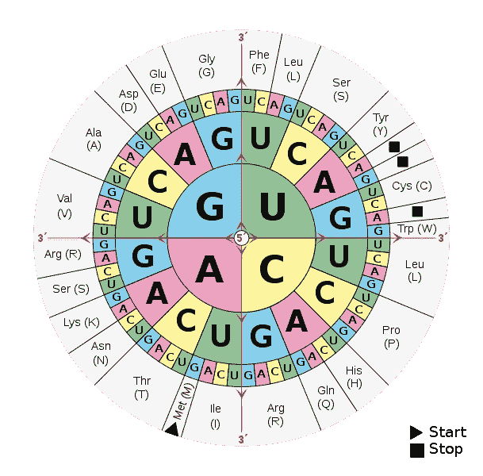
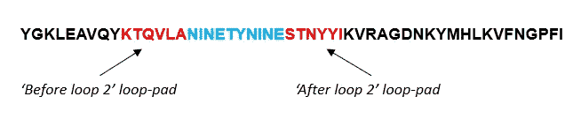

# 亲和蛋白质:下一代测序数据分析(第二部分)

> 原文：<https://towardsdatascience.com/affimer-proteins-next-generation-sequencing-data-analysis-part-2-8ebc0e90f460?source=collection_archive---------32----------------------->


路易斯·里德在 [Unsplash](https://unsplash.com/s/photos/science?utm_source=unsplash&utm_medium=referral&utm_content=creditCopyText) 上的照片

## 亲和蛋白质类

## *氨基酸翻译和寻找亲和环区*

在第 1 部分中，我们看了什么是亲和分子，并开始看与 DNA 序列相关的 R 中的基本数据分析。接下来，我们将更深入地研究数据，搜索特定的亲和分子环，并查看不同的“阅读框架”如何影响特定序列的搜索。

# DNA ->氨基酸

最终，我们实际上对亲和结合物的 DNA 序列并不感兴趣。相反，我们感兴趣的是氨基酸(AA)序列。其原因是，正是氨基酸形成了蛋白质，进而产生了亲和分子(特别是环区)的物理特征(和结合特性)。

DNA 到 AA [***翻译***](https://en.wikipedia.org/wiki/Translation_(biology)) 的物理过程是从一个叫做 [***转录***](https://en.wikipedia.org/wiki/Transcription_(biology)) 的过程开始的。首先，一种叫做 [***RNA 聚合酶***](https://en.wikipedia.org/wiki/RNA_polymerase) 的酶解开 DNA 分子的双螺旋结构，露出 DNA 碱基。接下来，该酶创建了一个互补的单链分子，称为[***messenger-RNA***](https://en.wikipedia.org/wiki/Messenger_RNA)(mRNA)，这意味着 DNA 链上的每个 C 都变成了 mRNA 链上的 G，每个 G 都变成了 C，每个 T 变成了 A，每个 A 变成了 A，每个 A 变成了 U(注意，U 取代了 DNA 中的 T)。

进一步的步骤使这种“前 mRNA”成熟为 mRNA 的最终形式，然后 mRNA 序列被称为 [***核糖体***](https://en.wikipedia.org/wiki/Ribosome) 的结构读取。这种阅读过程是通过一次查看 3 个碱基(称为**密码子**)来进行的，每个碱基要么编码一个氨基酸，要么告诉核糖体停止(称为终止密码子)。氨基酸链继续构建，直到到达终止密码子，由此产生的分子链就是最终生成的蛋白质。

令人难以置信的是，取决于氨基酸转换是从第一、第二还是第三个碱基开始，你最终可以得到完全不同的 3 碱基集合，因此完全不同的氨基酸和因此完全不同的蛋白质。这些被称为**阅读框架**，我们稍后将回到它们。

下面是密码子到氨基酸转换的示意图(从中间开始向外移动，选择 3 个氨基酸)。请注意，不同的 DNA 组合可以导致相同的氨基酸，DNA -> AA 翻译是直接的，但 AA -> DNA 翻译是不可能的(因为没有办法知道哪个 DNA 序列在给定的 AA 后面)。这对数据管理有影响，即 AA 序列和它们的潜在 DNA 序列必须总是以某种方式保留和连接。



[图像参考](https://en.wikipedia.org/wiki/DNA_and_RNA_codon_tables)

现在让我们使用**翻译**函数将 DNA 翻译成 AA。这个函数应用于每个 DNA 序列，然后数据被组合成一个 data frame(R 中常用的 2D 数据结构)，

```
*#AA translation*
aa_1 = translate(dna_1) *#Translate*
aa_1_dt = as.data.frame(aa_1) *#Add to a dataframe*

aa_2 = translate(dna_2) *#Translate*
aa_2_dt = as.data.frame(aa_2) *#Add to a dataframe*

*#Create a label for the direction,*
aa_1_dt$read_direction = ‘F’
aa_2_dt$read_direction = ‘R’

*#Combine the two dataframes,*
aa_all = rbind(aa_1_dt, aa_2_dt)
colnames(aa_all) = c(‘amino_acid_seq’, ‘read_direction’)
```

这是我们现在拥有的(前 6 项)，

```
head(aa_all)## amino_acid_seq                            read_direction
 ## 1 YGKLEAVQYKTQVLANINETYNINESTNYYIKVRAGDNKYMHLKVFNGPFI F
 ## 2 YGKLEAVQYKTQVLANINETYNINESTNYYIKVRAGDNKYMHLKVFNGPFI F
 ## 3 YGKLEAVQYKTQVLAEIGHTYTHREESTNYYIKVRAGDNKYMHLKVFNGPT F
 ## 4 YGKLEAVQYKTQVLATWENTYSTNYYIKVRAGDNKYMHLKVFNGPFIFTYN F
 ## 5 YGKLEAVQYKTQVLANINETYNINESTNYYIKVRAGDNKYMHLKVFNGPTH F
 ## 6 YGKLEAVQYKTQVLATWENTYSTNYYIKVRAGDNKYMHLKVFNGPNINETY F
```

我们还可以看到一些相反的顺序(最后 6 项)，

```
tail(aa_all)## amino_acid_seq                              read_direction
 ## 995 VESTNYYIKVRAGDNKYMHLKVFNGPTHIRTYFIVEADRVLTGYQVDKNKD R
 ## 996 ESTNYYIKVRAGDNKYMHLKVFNGPNINETYSEVENADRVLTGYQVDKNKD R
 ## 997 ESTNYYIKVRAGDNKYMHLKVFNGPNINETYSEVENADRVLTGYQVDKNKD R
 ## 998 ESTNYYIKVRAGDNKYMHLKVFNGPNINETYSEVENADRVLTGYQVDKNKD R
 ## 999 VESTNYYIKVRAGDNKYMHLKVFNGPTHIRTYFIVEADRVLTGYQVDKNKD R
 ## 1000 ESTNYYIKVRAGDNKYMHLKVFNGPNINETYSEVENADRVLTGYQVDKNKD R
```

我们的 DNA 序列现在是 AA 序列，我们已经将它们标记为“正向”或“反向”(我们稍后会用到)。

# 环路搜索

下一个问题是，你如何在这些长长的氨基酸序列中找到两个环区？答案是每个亲和分子(从进入噬菌体的起始 DNA 开始)都编码了特定的短序列，就像环的路标一样。在两个循环的每一个之前和之后有一个，即总共 4 个。让我们在数据帧中定义这些“环垫”,

```
loop_pads = data.frame(type = ‘demo’,
                       l2_before =’KTQVLA’,
                       l2_after = ‘STNYYI’,
                       l4_before = ‘KVFNGP’,
                       l4_after = ‘ADRVLT’)

loop_pads## type l2_before l2_after l4_before l4_after
## 1 demo KTQVLA STNYYI KVFNGP ADRVLT
```

(请注意，我将这些称为“演示”，因为我们正在查看演示数据集)。

让我们搜索一下，看看能否找到第一个循环垫。下面我们将搜索模式设置为“循环 2 之前”循环垫，主题为数据帧中的第一个序列。

```
matchPattern(pattern = loop_pads$l2_before, 
             subject = aa_all$amino_acid_seq[1])## Views on a 51-letter BString subject
## subject: YGKLEAVQYKTQVLANINETYNINESTNYYIKVRAGDNKYMHLKVFNGPFI
## views:
## start end width
## [1] 10 15 6 [KTQVLA]
```

它找到了，从位置 10 开始，到位置 15 结束。“后循环 2”循环垫呢？

```
matchPattern(pattern = loop_pads$l2_after, 
             subject = aa_all$amino_acid_seq[1])## Views on a 51-letter BString subject
## subject: YGKLEAVQYKTQVLANINETYNINESTNYYIKVRAGDNKYMHLKVFNGPFI
## views:
## start end width
## [1] 26 31 6 [STNYYI]
```

又找到了。

我们现在知道“环 2”区域在位置 16(第一个环填充结束后的一个)和位置 25(第二个环填充开始前的一个)之间，



然后很容易提取这个循环，使用 **substr** 函数并指定开始和结束位置，

```
substr(aa_all$amino_acid_seq[1], 16, 25)## [1] “NINETYNINE”
```

如你所见，我们找到了单词“999”。这显然是我们的演示数据的产物，但在真实的数据集中，这将是我们的“环 2”氨基酸序列。

# 阅读框架

如上所述，DNA 使用三个核苷酸(密码子)来编码氨基酸。其结果是转录可以从第一、第二或第三个核苷酸开始，导致三个所谓的**阅读框**。至关重要的是，每个阅读框架将导致完全不同的氨基酸被翻译。

起始密码子，或告诉 RNA 聚合酶从哪里开始的密码子，决定了从哪个密码子开始，导致了所谓的**开放框架**，或导致翻译成氨基酸和蛋白质的阅读框架。有时，插入或缺失会导致所谓的“移码突变”，这是许多严重疾病的原因。

在我们的数据中，重要的是确定哪个阅读框编码所需的亲和蛋白序列。让我们来看看实际情况。首先，我们将创建一个随机的 DNA 序列，

```
dna_eg = DNAString(‘TGATATACGGATCGATGCATTCAGGACGCTCTGCTGGATAAGAACACCCTGTGGAAAACCATGTACTACCTGACC’)dna_eg## 75-letter DNAString object
## seq: TGATATACGGATCGATGCATTCAGGACGCTCTGCTGGATAAGAACACCCTGTGGAAAACCATGTACTACCTGACC
```

接下来，我们会像之前一样把它翻译成氨基酸，

```
aa_eg_frame1 = translate(dna_eg) *#Translate, frame 1*
aa_eg_frame1## 25-letter AAString object
## seq: *YTDRCIQDALLDKNTLWKTMYYLT
```

我们从 75 个字母的 DNA 序列到 25 个字母的 AA 序列(如预期的那样)。现在，假设我们的循环垫是序列“ENHV”。下面我们将在我们的 AA 序列中搜索它，

```
matchPattern(pattern = ‘ENHV’, 
             subject = as.character(aa_eg_frame1))## Views on a 25-letter BString subject
## subject: *YTDRCIQDALLDKNTLWKTMYYLT
## views: NONE
```

什么也没找到。接下来，让我们去掉第一个核苷酸，重新翻译，

```
*#trim first base from sequence* aa_eg_frame2 <- DNAStringSet(dna_eg, start=2)*#Translate, frame 1* aa_eg_frame2 = translate(aa_eg_frame2)## Warning in .Call2(“DNAStringSet_translate”, x, skip_code,
## dna_codes[codon_alphabet], : last 2 bases were ignoredaa_eg_frame2## AAStringSet object of length 1:
## width seq
## [1] 24 DIRIDAFRTLCWIRTPCGKPCTT*
```

我们现在得到了一个完全不同的氨基酸序列。注意，translate 函数也给了我们一个警告，指出最后两个碱基被忽略了。这是有意义的，因为我们在开始时去掉了一个碱基，不再有 3 的倍数的 DNA 序列长度。接下来我们将再次搜索，

```
matchPattern(pattern = ‘ENHV’, 
             subject = as.character(aa_eg_frame2))## Views on a 24-letter BString subject
## subject: DIRIDAFRTLCWIRTPCGKPCTT*
## views: NONE
```

还是一无所获。最后，我们会去掉最初的两个碱基，然后重做所有的东西，

```
*#trim first base from sequence* aa_eg_frame3 <- DNAStringSet(dna_eg, start=3)*#Translate, frame 
1*aa_eg_frame3 = translate(aa_eg_frame3)## Warning in .Call2(“DNAStringSet_translate”, x, skip_code,
## dna_codes[codon_alphabet], : last base was ignoredaa_eg_frame3## AAStringSet object of length 1:
## width seq
## [1] 24 IYGSMHSGRSAG*EHPVENHVLPD
```

现在我们看到一个关于单个拖尾基座的警告。最后，我们再次搜索，

```
matchPattern(pattern = ‘ENHV’, 
             subject = as.character(aa_eg_frame3))## Views on a 24-letter BString subject
## subject: IYGSMHSGRSAG*EHPVENHVLPD
## views:
## start end width
## [1] 18 21 4 [ENHV]
```

这一次序列找到了。换句话说，亲和分子序列在第三个阅读框*中编码。这突出了一个事实，即当从 DNA 序列开始搜索氨基酸序列时，阅读框架是绝对关键的。*

# 摘要

在这篇文章中，我们进一步分析了基本数据，寻找循环，并看到了使用正确阅读框架的重要性。在第三篇[也是最后一篇](/affimer-proteins-next-generation-sequencing-data-analysis-part-3-90b4304413b5)文章中，我们将看到“独特的分子标识符”如何帮助消除 NGS 读数错误，Affimer 环频率如何在几轮“摇摄”中发生变化，并以 Affimer 蛋白质应用为结尾。