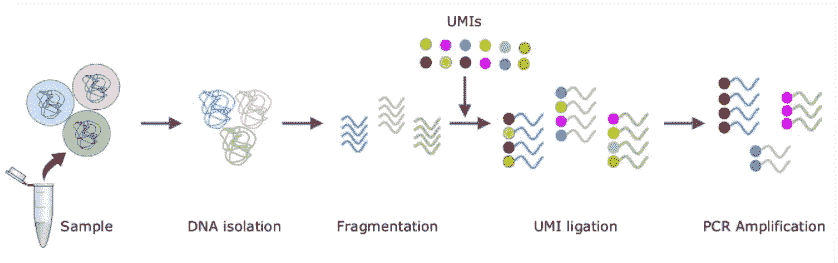
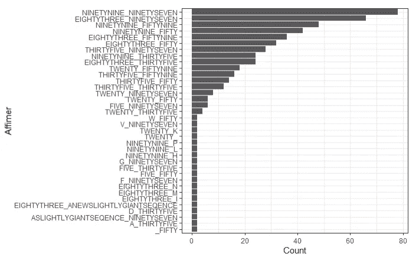
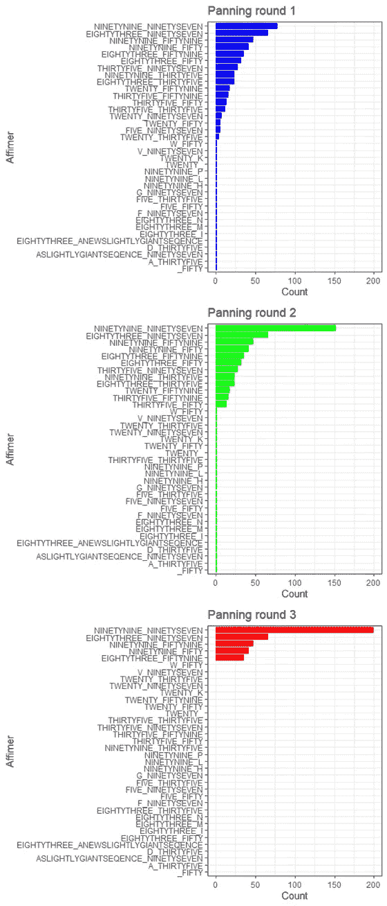

# 亲和蛋白质:下一代测序数据分析(第三部分)

> 原文：<https://towardsdatascience.com/affimer-proteins-next-generation-sequencing-data-analysis-part-3-90b4304413b5?source=collection_archive---------33----------------------->


在 [Unsplash](https://unsplash.com/s/photos/science?utm_source=unsplash&utm_medium=referral&utm_content=creditCopyText) 上由[路易斯·里德](https://unsplash.com/@_louisreed?utm_source=unsplash&utm_medium=referral&utm_content=creditCopyText)拍摄的照片

## 亲和蛋白质类

## *独特的分子标识符和亲和结合物的淘选*

在[第 2 部分](/affimer-proteins-next-generation-sequencing-data-analysis-part-2-8ebc0e90f460)中，我们进一步进行了基本数据分析，寻找循环，并看到了使用正确阅读框架的重要性。在第三篇也是最后一篇文章中，我们将看到“独特的分子标识符”如何帮助消除 NGS 读数错误，Affimer 环频率如何在几轮“平移”中变化，并以 Affimer 蛋白质应用为例进行总结。

# 独特的分子标识符

[*独特的分子标识符*](http://blog.avadis-ngs.com/2018/01/ultra-sensitive-variant-calling-and-transcript-quantification-using-unique-molecular-identifiers/) 或 UMIs，是“分子条形码”(短 DNA 序列)，用于从几个不同序列的混合物中识别序列。这个想法很简单。首先，用 UMI 标记你的开始序列。接下来，让这些 umi 通过 DNA 扩增的各个阶段。最后，在您的数据中，搜索这些条形码，以便将序列“家族”分组在一起。

乍一看，这似乎是浪费时间。当你可以只寻找序列本身时，为什么要搜索 UMI 来识别一个序列呢？原因是 NGS 的阅读过程并不完美，而且在阅读过程中可能会引入错误。因为 umi 相对较短，所以不太容易出现这些错误。然后，通过识别相同序列的组，然后可以比较这些序列，并通过在每个位置寻找最常见的核苷酸来确定所谓的**共有序列**。这就减少了读取阶段引入的误差。下图给出了一个概览，显示了共享 UMI 序列的结果序列家族，



[图像参考](http://blog.avadis-ngs.com/2018/01/ultra-sensitive-variant-calling-and-transcript-quantification-using-unique-molecular-identifiers/)

NGS 的工作方式是首先将感兴趣的 DNA 序列片段化，在每个片段的末端连接两种不同的分子结合剂，然后将这些片段的一端连接到一个表面(流动池)。 [*聚合酶链式反应*](https://en.wikipedia.org/wiki/Polymerase_chain_reaction) (PCR)扩增步骤接着进行，导致表面上每个片段的许多拷贝，包括原始(正向)和反向拷贝。最后，将荧光标记的单个核苷酸添加到流动池中，然后结合，从而可以成像和读取。在标准 DNA 应用中，然后将片段读数与参考序列进行比较，并用适当的算法对任何重叠区域进行比对。诚然，这是对一个复杂过程的非常基本的描述。要了解更多信息，请参见[此链接](https://www.illumina.com/science/technology/next-generation-sequencing/sequencing-technology.html)。

在这个 NGS 过程中，既有 PCR 错误，也有读取错误。读取错误是由成像系统不能完美地分辨和区分不同核苷酸的不同颜色引起的。如上所述，这就是 UMIs 可以提供帮助的地方。

umi 是用称为 IUPAC(国际纯粹与应用化学联合会)的模糊代码来描述的。这些编码或者指定一个特定的核苷酸，或者选择一个核苷酸。我们可以通过调用下面的函数看到这些，

```
IUPAC_CODE_MAP## A C G T M R W S Y K V 
## “A” “C” “G” “T” “AC” “AG” “AT” “CG” “CT” “GT” “ACG” 
## H D B N 
## “ACT” “AGT” “CGT” “ACGT”
```

这里你可以看到‘A’代表‘A’，但是像‘Y’这样的字符可以表示‘C’或者‘T’。重点是允许不同的序列存在于一个给定的模糊代码中，但是仍然指定一些顺序给 UMIs。例如，以 IUPAC 模糊度代码‘nnabnnabnnabnnabnnabnnabnab’为例，它是重复 6 次的子序列‘NNAB’。通过在那里有‘N’字符，你给了许多可能的 umi 自由，但同时，你限制了相同类型的相邻核苷酸的数量。像“NNAB”这样的重复核苷酸的最高数量是 3，即“AAAB”(其中“B”可以是“C”、“G”或“T”)。至关重要的是，这减少了 UMIs 本身潜在的读取错误。

让我们创建一个示例序列，我们称之为“seq”和两个可能的 UMI(其中第二个 UMI 与第一个相同，但在开头多了一个“A”)，

```
seq = “AATGTAGACAGGGATCAAGTTACTACGGATCGATGCATTCAGGACGCTCTGCTGGAATTCGTTCGTGTTGTTAAAGCGAAAGAACA”umi1 = “NABNNABNNABNNABNNABNNABN”
umi2 = “ANABNNABNNABNNABNNABNNABN”
```

只要我们提供参数‘fixed = False’(即序列不固定)，matchPattern 函数就可以处理 IUPAC 模糊代码，

```
matchPattern(pattern = umi1, 
             subject = DNAString(seq), 
             fixed = False)## Views on a 86-letter DNAString subject
## subject: AATGTAGACAGGGATCAAGTTACTACGGATCGAT…TGGAATTCGTTCGTGTTGTTAAAGCGAAAGAACA
## views:
## start end width
## [1] 1 24 24 [AATGTAGACAGGGATCAAGTTACT]
```

在这里，我们已经找到了示例序列中的第一个 UMI，它从位置 1 开始，正如预期的那样。

现在想象你已经测序了许多序列，包括连接到这两个不同 umi 的序列。下面是开头附有 UMIs 的 13 个序列的例子，

```
sequences = c(“AATGTAGACAGGGATCAAGTTACTACGGAT”,
              “AATGTAGACAGGGATCAAGTTACTACGGCT”,
              “AATGTAGACAGGGATCAAGTTACTACGGAT”,
              “AATGTAGACAGGGATCAAGTTACTACGGAT”,
              “AATGTAGACAGGGATCAAGTTACTACGGAT”,
              “AATGTAGACAGGGATCAAGTTACTACGGAT”,
              “AATGTAGACAGGGATCAAGTTACTACGGAT”,
              “AATGTAGACAGGGATCAAGTTACTACGGCT”,
              “AATGTAGACAGGGATCAAGTTACTACGGAT”,
              “AATGTAGACAGGGATCAAGTTACTACGGAT”,
              “AAATGTAGACAGGGATCAAGTTACTACGGAT”,
              “AAATGTAGACAGGGATCAAGTTACTACGGAT”,
              “AAATGTAGACAGGGATCAAGTTACTACGGTT”)
```

下面是一个简单的 for 循环，它遍历这个序列向量，对于每一个序列，它检查哪个 UMI 序列匹配。这个循环只针对 2 个 umi，但是扩展它并不困难。基本概念是检查哪个 UMI 在序列的最开始，

```
umi = vector()

for(s in sequences) { *#Extracting the start position of umi1,* umi1_start = start(matchPattern(pattern = umi1, 
                    subject = DNAString(s), 
                    fixed = False)) *#Extracting the start position of umi2*
 umi2_start = start(matchPattern(pattern = umi2, 
                    subject = DNAString(s), 
                    fixed = False)) *#Is UMI1 is at the start or not? If not, it must be UMI2,*
 umi_num = if(umi1_start == 1) {umi_num = 1} else {umi_num = 2} print(paste0(‘UMI number: ‘, umi_num))
 umi = c(umi, umi_num)

}## [1] “UMI number: 1”
## [1] “UMI number: 1”
## [1] “UMI number: 1”
## [1] “UMI number: 1”
## [1] “UMI number: 1”
## [1] “UMI number: 1”
## [1] “UMI number: 1”
## [1] “UMI number: 1”
## [1] “UMI number: 1”
## [1] “UMI number: 1”
## [1] “UMI number: 2”
## [1] “UMI number: 2”
## [1] “UMI number: 2”
```

我们可以看到，我们有十个使用 UMI 1 的序列和三个使用 UMI 2 的序列。现在让我们把这些序列和 UMI 数放在一个数据帧里，然后把两个不同的 UMI 家族分开，

```
sequences = data.frame(sequences, umi)
umi_family_1 = sequences$sequences[sequences$umi == 1]
umi_family_2 = sequences$sequences[sequences$umi == 2]
```

现在我们可以在这些序列上调用一个名为 **consensusMatrix** 的函数(特别是第一个 UMI 家族)，

```
consensusMatrix(umi_family_1)## [,1] [,2] [,3] [,4] [,5] [,6] [,7] [,8] [,9] [,10] [,11] [,12] [,13] [,14]
 ## A 10 10 0  0  0  10 0  10 0  10 0   0  0  10
 ## C 0  0  0  0  0  0  0  0  10 0  0   0  0  0
 ## G 0  0  0  10 0  0  10 0  0  0  10  10 10 0
 ## T 0  0  10 0  10 0  0  0  0  0  0   0  0  0## [,15] [,16] [,17] [,18] [,19] [,20] [,21] [,22] [,23] [,24] [,25] [,26] [,27]
 ## A 0  0  10 10 0  0  0  10 0  0  10 0  0
 ## C 0  10 0  0  0  0  0  0  10 0  0  10 0
 ## G 0  0  0  0  10 0  0  0  0  0  0  0  10
 ## T 10 0  0  0  0  10 10 0  0  10 0  0  0## [,28] [,29] [,30]
 ## A 0  8 0
 ## C 0  2 0
 ## G 10 0 0
 ## T 0  0 10
```

该函数计算了每个位置上每个核苷酸的总数。例如，对于第一个位置，您可以看到有 10 个“A”碱基，没有“C”、“G”或“T”碱基。除了一个职位外，所有职位都有这种共识。你能发现它吗？

我们还可以调用函数来显示概率数据，

```
consensusMatrix(umi_family_1, 
                as.prob = TRUE)## [,1] [,2] [,3] [,4] [,5] [,6] [,7] [,8] [,9] [,10] [,11] [,12] [,13] [,14]
 ## A 1 1 0 0 0 1 0 1 0 1 0 0 0 1
 ## C 0 0 0 0 0 0 0 0 1 0 0 0 0 0
 ## G 0 0 0 1 0 0 1 0 0 0 1 1 1 0
 ## T 0 0 1 0 1 0 0 0 0 0 0 0 0 0
 ## [,15] [,16] [,17] [,18] [,19] [,20] [,21] [,22] [,23] [,24] [,25] [,26] [,27]
 ## A 0 0 1 1 0 0 0 1 0 0 1 0 0
 ## C 0 1 0 0 0 0 0 0 1 0 0 1 0
 ## G 0 0 0 0 1 0 0 0 0 0 0 0 1
 ## T 1 0 0 0 0 1 1 0 0 1 0 0 0
 ## [,28] [,29] [,30]
 ## A 0 0.8 0
 ## C 0 0.2 0
 ## G 1 0.0 0
 ## T 0 0.0 1
```

区别在 29 号位。这里，10 个序列中有 8 个在这个位置有一个“A”。在剩下的 2 个单词中，他们有一个 C。我们可以将这 10 个序列合并成一个，使用**共识**函数，在每个位置使用最常见的碱基，

```
consensusString(umi_family_1)## [1] “AATGTAGACAGGGATCAAGTTACTACGGAT”
```

如您所见，我们在倒数第二个位置有一个“A ”,因为它是 10 个序列中最常见的核苷酸。这样，扩增错误或读取错误就被“消除”了。

# 计数亲和分子

现在我们已经看到了所有单独的片段，让我们将它们放在一起，并计算我们在演示数据中的不同循环组合(循环 2 和 4)。为了简单起见，我们不会担心读取帧或 UMIs。

下面是一个大函数，它接受氨基酸数据帧和循环填充数据帧。然后，它遍历数据帧，搜索所有 4 个循环填充，提取循环，将它们组合成一个新的数据帧，并返回它。阅读函数中的注释，了解它是如何工作的。请注意，下面的代码效率低、速度慢，并且不会在数据集非常大的真实 NGS 环境中使用。然而，以这种方式使用循环有助于理解和演示工作中的一般原则，

```
*#Function for amino acid sub-sequence matching,*
 match_function = function(data, loop_pad, out_max=1, out_min=0) {

  *#Extract the forward and reverse reads,*
  data1 = data[data$read_direction == ‘F’,]
  data2 = data[data$read_direction == ‘R’,] #remove the read directions as no longer needed,
  data1$read_direction = NULL 
  data2$read_direction = NULL

  *#Create empty loop position columns,*
  data1$Loop2_start = NA_integer_
  data1$Loop2_end = NA_integer_
  data2$Loop4_start = NA_integer_
  data2$Loop4_end = NA_integer_

  *#Iterate through each forward read, search for loop-pads 1 and 2  (either side of loop 2), and if found, extract the start and end  positions,* i=1
  while(i<=length(data1$amino_acid_seq)) {

   matches_l2_left = matchPattern(pattern = loop_pad$l2_before, 
   subject = data1$amino_acid_seq[i], 
   max.mismatch = out_max, 
   min.mismatch = out_min)

   matches_l2_right = matchPattern(pattern = loop_pad$l2_after, 
   subject = data1$amino_acid_seq[i], 
   max.mismatch = out_max, 
   min.mismatch = out_min)

   if(length(matches_l2_left) != 0) {
   data1$Loop2_start[i] = end_pos_l2_left = end(matches_l2_left)+1}      else {data1$Loop2_start[i] = NA}

   if(length(matches_l2_right) != 0) {
   data1$Loop2_end[i] = start(matches_l2_right)-1} else {
   data1$Loop2_end[i] = NA
   }

   i=i+1

 }

 *#Iterate through each reverse read, search for loop-pads 3 and 4 (either side of loop 4), and if found, extract the start and end positions,*
  i=1
  while(i<=length(data2$amino_acid_seq)) {

    matches_l4_left = matchPattern(pattern = loop_pad$l4_before, 
    subject = data2$amino_acid_seq[i], 
    max.mismatch = out_max, 
    min.mismatch = out_min)

    matches_l4_right = matchPattern(pattern = loop_pad$l4_after, 
    subject = data2$amino_acid_seq[i], 
    max.mismatch = out_max, 
    min.mismatch = out_min)

    if(length(matches_l4_left) != 0) {
    data2$Loop4_start[i] = end_pos_l4_left = end(matches_l4_left)+1}    else {data2$Loop4_start[i] = NA}

    if(length(matches_l4_right) != 0) {
    data2$Loop4_end[i] = start(matches_l4_right)-1} else {
    data2$Loop4_end[i] = NA}
    i=i+1

 }

  *#Extract the loop sequences from the full sequences, using the  start and end positions,*
  data1$loop2 = str_sub(data1$amino_acid_seq, 
  start = data1$Loop2_start, end = data1$Loop2_end)

  data2$loop4 = str_sub(data2$amino_acid_seq, 
  start = data2$Loop4_start, end = data2$Loop4_end)

  *#Combine the loops,*
  affimer_binder = paste0(data1$loop2, ‘_’, data2$loop4)
  affimer_binder_df = as.data.frame(affimer_binder)

  *#Return the combined loop data,*
  return(affimer_binder_df)

 }
```

现在，运行函数，

```
results_df = match_function(aa_all, loop_pads)
```

让我们看看前 6 个循环序列，

```
head(results_df)## affimer_binder
## 1 NINETYNINE_FIFTYNINE
## 2 NINETYNINE_FIFTY
## 3 EIGHTYTHREE_THIRTYFIVE
## 4 TWENTY_FIFTYNINE
## 5 NINETYNINE_THIRTYFIVE
## 6 TWENTY_NINETYSEVEN
```

这里我们可以看到实际的单词拼写。这只是演示数据的一个有意的方面，这样做是为了对任何循环搜索过程的成功提供一个快速的视觉检查。

最后，我们可以使用 **tidyverse** R 包中的函数按照亲和蛋白序列进行分组并计数，

```
*#Group by the Affimer protein loop column and count,*
affimer_families = results_df %>%
group_by(affimer_binder) %>%
tally()

*#Order by this new count column,*
affimer_families = affimer_families[order(affimer_families$n, decreasing = T),]
```

然后使用 **ggplot** 作为柱状图绘制它们，

```
ggplot(data = affimer_families, 
       aes(x=reorder(affimer_binder, X=n), y=n)) +
       geom_bar(stat=”identity”) + 
       coord_flip() + 
       xlab(‘Affimer’) + 
       ylab(‘Count’) + 
       theme_bw()
```



# 亲和分子淘选

在实际应用中，通过若干轮“筛选”(或 [*生物筛选*](https://en.wikipedia.org/wiki/Biopanning) )来选择一个确定的文件夹。这是噬菌体展示过程重复多次的地方，候选结合物在洗涤步骤后被留下，以被扩增并再次呈现给靶分子。其结果是每一轮中结合候选物的种类稳步减少。

下面我们来看看一些示例演示数据。我们将创建 3 个不同的情节，每个模拟平移一轮，

```
plot1 <- ggplot(data = affimer_families_p1,         aes(x=reorder(affimer_binder, X=n), y=n)) +
geom_bar(stat=”identity”, fill = ‘blue’) + 
coord_flip() + 
xlab(‘Affimer’) + 
ylab(‘Count’) + 
ylim(0,200) +
ggtitle(‘Panning round 1’) +
theme_bw()

plot2 <- ggplot(data = affimer_families_p2, aes(x=reorder(affimer_binder, X=n), y=n)) +
geom_bar(stat=”identity”, fill = ‘green’) + 
coord_flip() + 
xlab(‘Affimer’) + 
ylab(‘Count’) + 
ylim(0,200) +
ggtitle(‘Panning round 2’) +
theme_bw()

plot3 <- ggplot(data = affimer_families_p3, aes(x=reorder(affimer_binder, X=n), y=n)) +
geom_bar(stat=”identity”, fill = ‘red’) + 
coord_flip() + 
xlab(‘Affimer’) + 
ylab(‘Count’) + 
ylim(0,200) +
ggtitle(‘Panning round 3’) +
theme_bw()

grid.arrange(plot1, plot2, plot3, nrow=3)
```



如你所见，不同活页夹的频率随着每一轮摇摄而变化，许多变得不那么频繁，少数变得更频繁。这就是如何从庞大的起始库中找到给定目标的最佳候选者。在这个演示示例中，我们将把“999 _ 997”作为我们的主要候选。

# 最后

我们已经看到大自然如何进化出各种体内机制，为任何遇到的抗原创造出特定的抗体结合物。我们也看到了一个类似的体外过程来创造亲和结合物。这两种方法虽然不完全相同，但都依赖于大量随机 DNA 序列的原理，导致随机氨基酸序列和随后随机变化的蛋白质区域。这些亲和文库从 10^10 潜在序列开始，然后通过淘选筛选出针对特定靶标的最佳结合候选物。

从数据分析的角度来看，挑战基本上是关于“环搜索”，即寻找精确定位可变区位置的氨基酸保守模式(沿途可能有突变)。然后，看到这些区域的变化随着平移的进行而减少。在现实生活的实验中，阅读框架、UMIs、低质量分数和点突变增加了额外的复杂性。

为了说明亲和结合剂有多有效，亲和分子应用的一个很好的例子是最近的 [*亲和新冠肺炎诊断测试*](https://avacta.com/diagnostics/products/) 。这是一个 [*侧流装置*](https://en.wikipedia.org/wiki/Lateral_flow_test) (LFD)，从鼻腔拭子中提取的样本与缓冲液混合后涂在一张纸条上。液体穿过条带，在那里有一排新冠肺炎病毒结合亲和蛋白在等待。如果病毒存在，亲和分子结合并固定颗粒。检测抗体然后结合，为用户创建一个可视线。这些高度特异性的亲和分子，导致了世界上最敏感的 lfd 之一的开发，是通过上述淘选方法发现的。从开始到结束，仅在 4 周内就找到了最佳粘合剂。


[图像参考](https://avacta.com/wp-content/uploads/2021/06/Brochure-Type-00901-SC2-Product-Specification-Sheet-v2-ID-33989.pdf)

亲和蛋白的这种快速发展的能力，加上它们的抗体击败特性，使它们成为大量诊断应用的理想工具。然而，还在继续开发它们的特性用于治疗应用。例如，一种被称为“检查点抑制剂”的抗癌药目前正在开发[](https://www.genengnews.com/insights/antibody-mimetics/)*，以及最近《自然》杂志上发表的一篇关于“可药用口袋[](https://www.nature.com/articles/s41467-021-24316-0)*”的文章，众所周知，这种药物很难识别。**

**无论给定的 Affimer 活页夹的最终应用是什么，总的过程如上所述，提出了一个有趣和独特的数据分析挑战。**

# **进一步阅读**

**[*亲和蛋白是多用途和可再生的亲和试剂*](https://elifesciences.org/articles/24903)**

**[*Avacta*](https://avacta.com/) (开发并商业化亲和分子技术的公司)**