# 相似性分析(市场篮子分析)

> 原文：<https://towardsdatascience.com/affinity-analysis-market-basket-analysis-c8e7fcc61a21?source=collection_archive---------2----------------------->

你有没有想过，你们多久一起买一次某些东西？为什么会一起买一些物品？您购买一件商品和另一件商品的可能性有多大？为什么糖放在茶包附近？这几项之间有什么关系吗？背后的主旨是什么？


照片由[艾美奖·史密斯](https://unsplash.com/@emsmith?utm_source=unsplash&utm_medium=referral&utm_content=creditCopyText)在 [Unsplash](https://unsplash.com/s/photos/grocery?utm_source=unsplash&utm_medium=referral&utm_content=creditCopyText) 上拍摄

所有这些问题的答案都是亲和力分析(**也可以被称为购物篮分析**)。**这种分析背后的主要思想是通过识别哪些商品经常一起购买来获得有价值的见解。**

关联性分析(或市场购物篮分析)寻找模式来确定购买之间的联系，以便商店可以增加他们的交叉销售潜力。

在我们进入细节之前，我们必须解释一些术语。

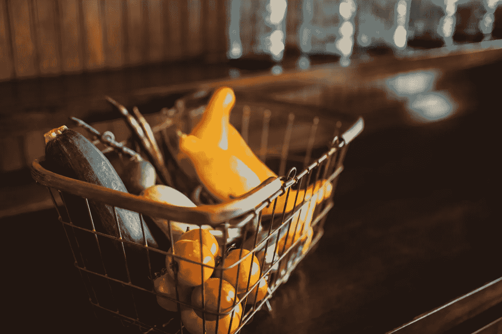

照片由[布鲁克·卡吉尔](https://unsplash.com/@brookecagle?utm_source=unsplash&utm_medium=referral&utm_content=creditCopyText)在 [Unsplash](https://unsplash.com/s/photos/market-basket?utm_source=unsplash&utm_medium=referral&utm_content=creditCopyText) 上拍摄

## 市场篮子

市场篮子指的是在一个经济系统中通常被购买和出售的一组物品。(查看上图，了解购物篮的基本示例。)

## i̇temset

众所周知，项集是由两个或更多项组成的一组项。(多么令人兴奋的信息啊，对吧？:P)

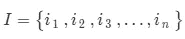

项目集

## 处理

事务是亲和力分析的主要数据来源。商店或零售商通过记录一段时间内的活动来收集大量交易数据。每个事务都与一个唯一的事务 ID (TID)相关联，并且包含项目集的子集。

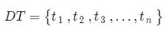

一组交易

## 支持

Support 只是强调一个项集有多受欢迎。尽管支持度很简单，但它是相似性分析中的一个重要度量，用于确定项目之间的关联强度。以 5 笔交易为例。如果你在 3 次交易中购买面包，你可以知道面包的支持度等于 3/5。

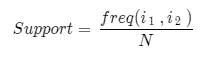

支持的定义

## 信心

虽然支持度强调项目集的受欢迎程度，但置信度表示一起购买某些项目的可能性。例如，购买面包时购买黄油的可能性有多大。信心通常表示为 ***面包*** (包含面包也包含黄油的交易比例。)

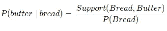

信心的定义

正如你在上面看到的，置信度是一个概率，所以它的范围是[0，1]。如果 ***面包黄油*** 的置信度等于 1，我们可以说顾客每次购买面包，也购买黄油。

## 电梯

就像信心一样，生活就像黄油面包。 它说在控制黄油受欢迎程度的同时，购买面包时购买黄油的可能性有多大。

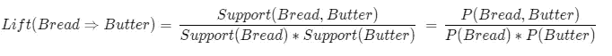

电梯的定义

Lift 的范围是[0，+∞]。当 lift 等于 1 时，面包和黄油是独立的，因此，当购买面包时，不能做出关于黄油的推论。但是，当 lift 大于 1 时，意味着黄油很可能与面包一起购买。

## **定罪**

维基百科上说*“确信度可以解释为，如果 X 和 Y 是独立的，那么 X 在没有 Y 的情况下出现的预期频率(也就是说，规则做出不正确预测的频率)除以观察到的不正确预测频率的比值。”*定罪的范围为[0，+∞],形式如下:

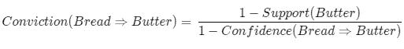

定罪的定义

## 简单的例子

所以，让我们看一遍，以确保您清楚地理解这些术语的含义。

***第一步:***

让我们创建事务数据。

***第二步:***

让我们定义一个函数。

该功能给出支持、信心、提升和信念的值。*(顺便说一下，你可以确定两个以上的参数。)*

```
**frequency_items('bread','butter')**
```

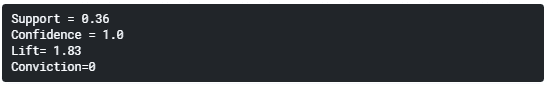

36%的交易包含面包和黄油。黄油每次都出现在只包含面包的交易中。置信度= 1 表示每当购买面包时，总是购买黄油。最后，lift 的值大于 1，这意味着人们更有可能一起购买面包和黄油，而不是分别购买。

(请记住，我们的数据集非常小。实际上，一个规则需要数百个事务的支持。)

## Apriori 算法

Apriori 算法是一种用于识别数据库中频繁项集和相关关联规则的数据挖掘技术。支持度、置信度和提升度是 Apriori 算法的三个主要组成部分。

让我们用一个例子来说明 apriori 算法:

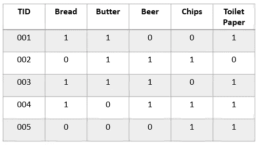

***第一步:***

*   在第一步中，我们将在事务中创建一个项目频率表。让我们将最小支持度设置为 2。

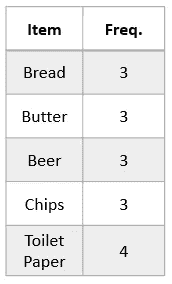

*   正如您所注意到的，所有项目的支持度都大于最小支持度(2)。

***第二步:***

*   在这一步中，我们将制作所有可能的物品对。(顺序无关紧要，即{面包，黄油} = {黄油，面包})

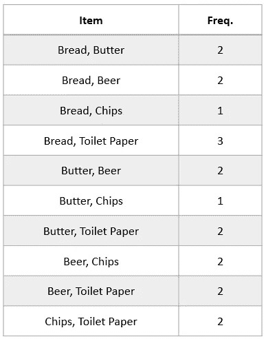

*   同样，我们需要将这些对与最小支持(2)进行比较。

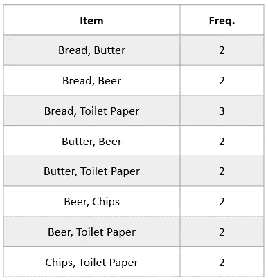

***重复前面的步骤:***

*   现在分析 3 个项目集并计算频率，再次应用阈值。(面包，黄油，啤酒)，(面包，黄油，卫生纸)…

正如你所注意到的，算法一遍又一遍地扫描数据库。因此，整体性能降低。

## Python 实现

我将使用杂货市场购物篮数据集。( [Kaggle 链接](https://www.kaggle.com/irfanasrullah/groceries))

1.  正在加载数据。

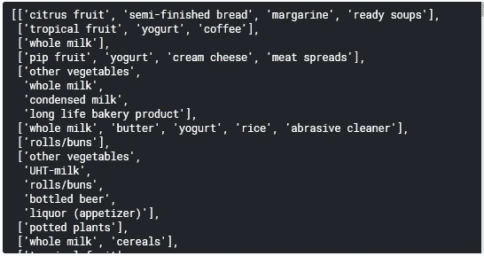

资料组

2.导入包和数据预处理([关于 mlxtend](http://rasbt.github.io/mlxtend/)

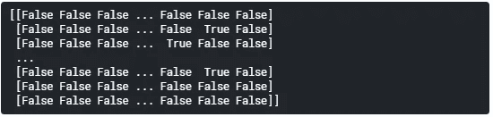

数据预处理

3.正在转换为数据帧。

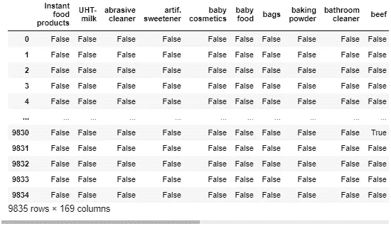

数据帧

4.计算支持。

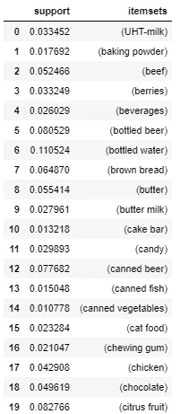

支持

5.创建规则(度量:置信度) ***前因后果***

规则

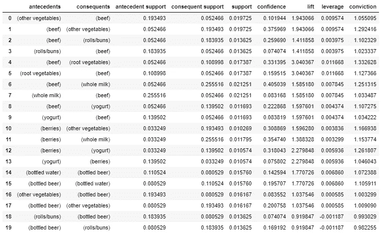

度量:置信度

6.创建规则(公制:升程) ***前因后果***

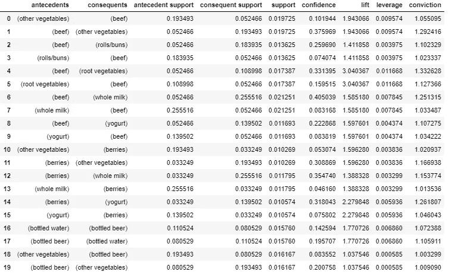

公制:提升

7.散点图

散点图帮助我们评估前因和后果之间规则的一般趋势。

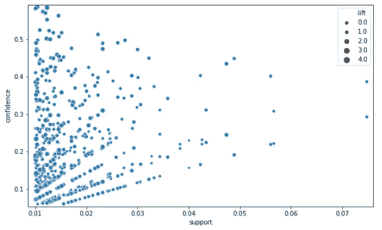

## 结论

在这篇文章中，我们大致了解了什么是相似性分析，以及如何用 python 实现它。

关联性分析或购物篮分析用于从交易数据中提取有价值的见解。它可以用来确定哪些产品要打折。此外，它还可以提高销售额和客户满意度。重要的是要认识到它还可以应用于许多其他领域。

你可以在这里找到 mlxtend 文档[。](http://rasbt.github.io/mlxtend/)