# 害怕 Git？让我们打破它。

> 原文：<https://towardsdatascience.com/afraid-of-git-lets-break-it-eaab427c73c0?source=collection_archive---------28----------------------->

## 你听说过，但现在是时候使用它了。


图片由来自 Unsplash.com[的](https://unsplash.com/photos/wX2L8L-fGeA)罗曼·辛克维奇拍摄

进入数据科学领域可能是势不可挡的，有些人甚至会说是令人生畏的。你刚刚开始学习 python 和机器学习，就有一个家伙开始告诉你把注意力放在新来的酷小子身上。尽管这个领域非常广阔并且在高速发展，但是有些东西仍然是数据科学家工具箱的一部分。

举个例子，我们有 SQL，而且不管方言(MySQL，PostgreSQL，SQLite，T-SQL，Vertica SQL 等。)，您将在日常工作中的某个时候需要它来提取、清理或理解数据。虽然这种语言已经有 30 多年的历史了，但它仍然很有意义。

> 如果你在理发店呆的时间够长，你就会去理发——丹泽尔·华盛顿

另一个例子是 Git，这是一个我经常在不同网站上遇到的名字，我诚实地尽力避免它。我还没有准备好使用命令行界面，GitHub 对我来说也不适用。但是就像他们说的，如果你在理发店呆的时间够长，你就会去理发。在这种情况下，理发店就是数据科学领域，Git 就是让你焕然一新的工具。

# Git 是什么？

早在 2005 年，软件工程师 Linus Torvalds 引入了 Git，他是 Linux 内核的主要开发者。Git 这个名字是 Global Information Tracker 的首字母缩写，但他也为它提出了其他名字，称这取决于用户的心情。

他把这个系统描述为“愚蠢的内容追踪器”，但更恰当的描述应该是称之为版本控制系统(VCS)。VCS 被开发人员用来在单独或与他人合作编写程序时跟踪变更。

让我们想象一下，上一次你不得不提交一篇重要论文时，你经历了怎样的恐惧。您创建了该文件，并且每隔一段时间都会进行一次复制以确保进度。你甚至可以给自己发一份副本，以防电脑崩溃，并将副本命名为“论文-版本 1”、“论文-版本 2”、“论文-最终”、“论文-真正的最终”，等等。VCS 通过跟踪并允许我们在任何需要的时候在新旧版本之间导航来解决这个令人头疼的问题。我们甚至可以制作“分支”,这可以被认为是实验性的想法，以后可能会也可能不会应用到主工作中(我以后会回到分支上)。

VCS 甚至更进一步，让多个人合作处理同一个文件，并在你的工作和其他人的工作发生冲突时通知你。您将能够准确地看到哪些代码行与您同事的工作相冲突，并选择如何合并更改。

## **版本控制系统的类型**

版本控制系统可以分为两类，要么是集中式的，要么是分布式的。集中的 VCS 在一个服务器上存储了你作品的一个“中心”副本，这意味着你把你的修改提交到这个中心副本上。您的计算机上没有本地副本。这些类型的 VCS 的供应商是 SVN 和 Perforce。另一种 VCS 允许你上传或下载你的作品，在上传到服务器之前可以在本地进行修改。两个常见的分布式版本控制系统是 Git 和 Mercurial。

## 什么是 GitHub？

介绍了 Git，还需要提一下 GitHub。第一个是 VCS，另一个是在线托管 Git 仓库的网站。换句话说，你想要跟踪或与世界分享的文件都存储在 GitHub 上。你可能已经有了一个帐户，或者你还没有看到它的需要。不管是什么情况，请随意访问我的 [GitHub](https://github.com/sg-tarek) ，点击一下，感受一下 GitHub 个人资料包含的内容。

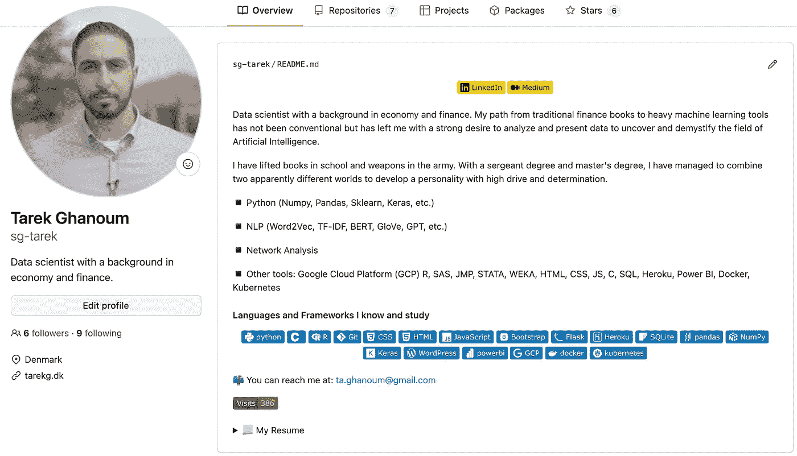

我的 [GitHub](https://github.com/sg-tarek) 页面

# Git 命令

下一步是获得使用 Git 的实践经验。为了让您对这些步骤有所了解，我创建了下面的概述。不要担心术语，当我们需要它的时候，我会检查它。

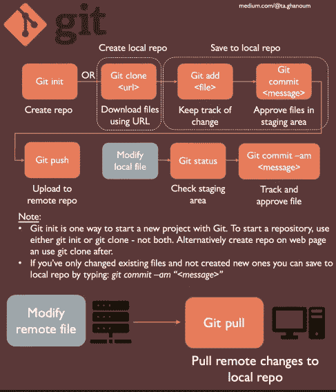

作者图片

最好的学习方法是通过例子，虽然一切都可以单独用 Git 命令来完成，但我选择依靠命令和 GitHub 页面来提供完整的体验。

此时，您应该首先创建一个 [GitHub 帐户](https://github.com/join)，然后将 [Git](https://git-scm.com/downloads) 下载到您的计算机上。对于我的示例，我将使用 Visual Studio 代码(VS 代码)，但是您可以使用任何命令行界面(CLI)运行 Git 命令。

## **步骤 1 —创建一个存储库(Git init)**

我们将经历的第一步是创建一个空文件夹。文件夹被称为 Git 存储库，简称为 *repo* 。我们将它称为远程回购，因为我们是在线创建的。

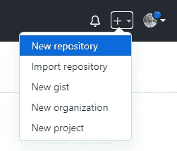

作者图片

我们给它一个名字，并选择是公开还是私有。虽然没有必要，但我选择添加一个“自述”文件，用于描述回购的内容。

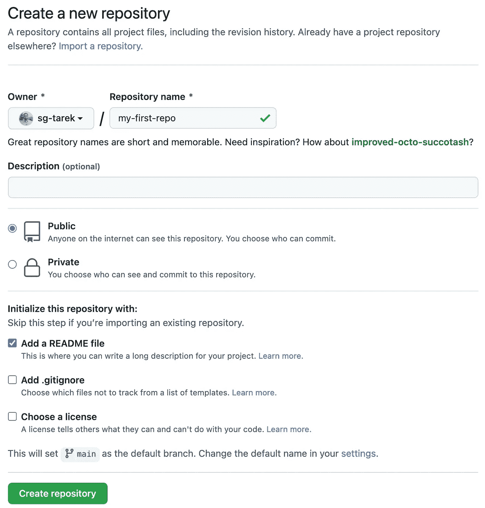

作者图片

我们可以使用 CLI 通过简单地运行以下命令来实现同样的目的:

```
git init <REPO-NAME>
```

该命令在当前目录下创建一个文件夹，见下图。如果需要，以后可以手动添加 README.md 文件。这种回购被称为本地回购，因为它在您的本地计算机上。

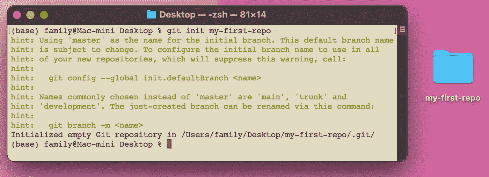

作者图片

## 步骤 2 —克隆存储库(Git 克隆)

使用 *git init* 命令可能并不总是最佳的，因为远程 repo 中可能已经包含了几个文件。相反，我现在将向您展示如何从远程回购创建本地回购。换句话说，我将制作一个本地副本。

转到“存储库”部分，单击新创建的存储库:


作者图片

远程 repo 已创建，这意味着我现在可以通过单击“添加文件”按钮来创建或上传文件。相反，我选择点击绿色的“代码”按钮，并将下载链接复制到我们的回购。

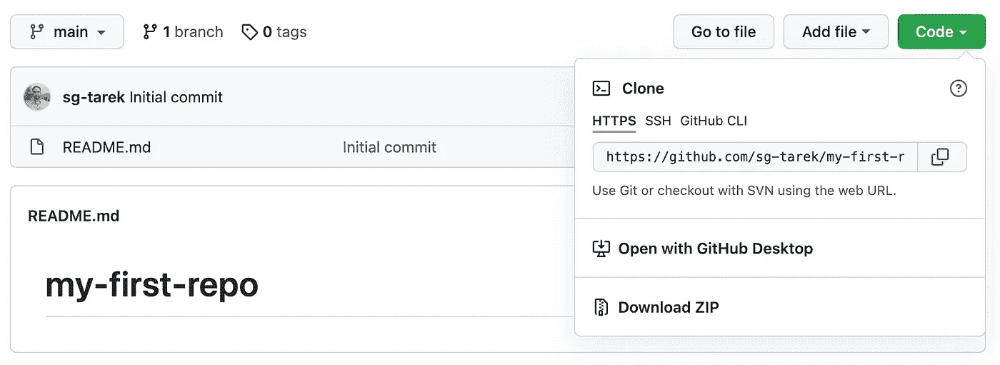

作者图片

复制完链接后，我现在选择在 VS 代码中打开一个 CLI 并运行 clone 命令:

```
git clone <REPOSITORY-URL>
```


作者图片

我的远程回购被克隆到我的当前目录中，为我提供了“my-first-repo”文件夹和 README.md 文件。如果您没有创建 README.md 文件，您会得到警告:*您似乎克隆到了一个空的存储库*。这很正常，没必要担心。


作者图片

您可以使用“ls”命令列出当前路径中的项目，并使用“cd”将路径更改为克隆的存储库:


作者图片

## 步骤 3 —创建文件

使用版本控制系统的目的是跟踪变更。因此，我将创建一个 HTML 文件作为示例，但是您也可以创建更适合您的情况的文件。

我将创建一个名为“Intro-to-Git.html”的 HTML 文件，我将让 VS 代码通过简单地键入 html:5 并单击 tab 按钮来插入内容。之后，我只需编辑标题并在正文部分插入一个标题:


作者图片

## 步骤 4—临时区域(Git 添加)

创建了一个文件后，我现在告诉 Git 跟踪它。我可以选择通过运行以下命令来跟踪特定文件:

```
git add <FILE-NAME>
```

或者，我可以通过添加一个“点”来跟踪本地 repo 中的所有文件。点是对当前目录的引用。

```
git add .
```

跟踪意味着 Git 将准备好提交(即保存)文件。可以把暂存想象成一个等待区域，在那里您想要保存的文件还没有被保存。他们只是在等待批准，我们将在下一步中这样做。


作者图片

## 步骤 5—保存更改(Git 提交)

要保存临时区域中的更改，只需运行以下命令:

```
git commit
```

可以把它看作是对暂存区文件的认可。该命令告诉 Git 将临时区域中的所有内容保存为一个单元。假设您想要撤消对项目的更改，在这种情况下，您要么撤消所有提交，要么不撤消任何提交。

当您运行 *git commit* 命令时，您将被要求添加一条消息。可以把它想象成程序中的注释，告知用户创建或更改的目的。通过添加消息，我们可以知道是谁 做了更改，什么*做了更改，什么时候*做了更改。**

**您可以运行上面的命令，这将触发 Git 启动一个文本编辑器，让您编写一条消息。或者，我们可以在命令中添加一个扩展名，以输入单行消息:**

```
**git commit -m "<MESSAGE>"**
```

****

**作者图片**

**我可以通过运行以下命令来查看我的提交:**

```
**git show**
```

**该命令在时显示之前提到的*谁*、*什么*和*(按住 ctrl+z 键退出 *git 显示*命令):***

*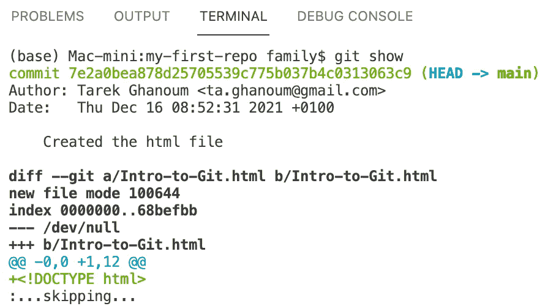*

*假设您对同一个 HTML 文件进行了更多的更改，例如更改颜色或添加新的标题，在这种情况下，我们可以通过运行以下命令来简单地合并第 4 步和第 5 步:*

```
*git commit -am "some message in quotes"*
```

*此命令将 HTML 文件放在临时区域中并批准它。*

## *第 6 步—分支*

*使用 Git 时需要理解的最重要的概念之一是分支。把一个分支想象成你工作的一个特定版本。我们在步骤 1 中创建的远程 repo 是主分支(也称为主分支或原始分支)。当我们创建本地回购时，我们只是复制了主分支。*

*正如我在下图中所展示的，一个人可以有多个分支，每个矩形代表一个提交。我的任务是创建 HTML 文件，我的团队同事可能会做一些错误修复，而第三个人可能会直接在主分支上工作。*

*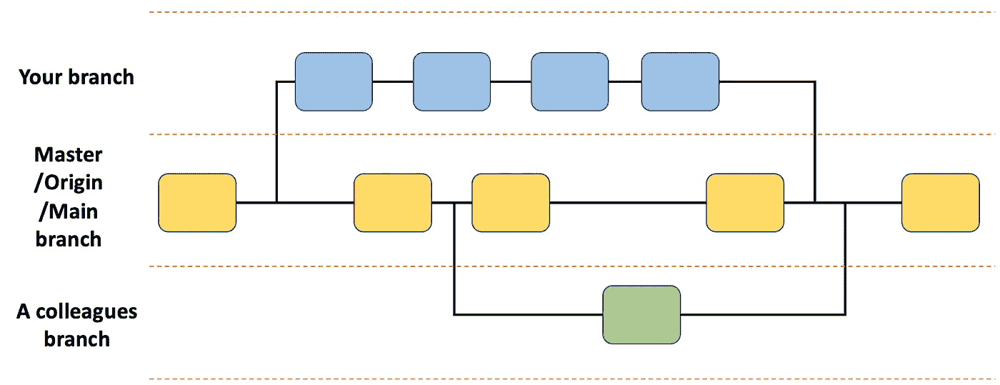*

*作者图片*

*让我们看看目前我们正在做哪个分支:*

```
*git branch*
```

**

*作者图片*

*我们看到我们只有一个分支，主分支，星号表示我们做的任何事情都会影响主分支。为了简单起见，我将继续直接在主分支上工作(尽管不推荐)。*

*我可以运行一个 *git status* 命令来查看主分支的本地副本和 GitHub 上的远程分支之间的差异:*

```
*git status*
```

**

*作者图片*

*输出告诉我，我的主分支的本地副本包含 1 个远程主分支中没有的提交。我的分支包含一个 HTML 文件，该文件尚未包含在远程主分支中。*

## *步骤 7 —上传或下载(Git 推/拉)*

*最后一步是向 GitHub 发布我们的本地提交。换句话说，我希望我的工作在远程回购中得到反映:*

```
*git push*
```

*git push 命令将我的工作推送到远程 repo 的主分支:*

*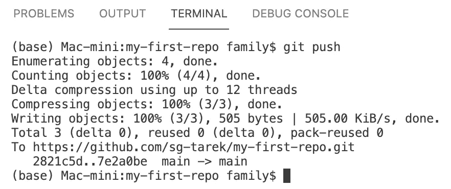*

*作者图片*

*如果我现在转到 GitHub，查看我们创建的 repo，我会看到我的 HTML 文件:*

**

*作者图片*

*我可以通过重新运行 git status 命令来确认我的本地存储库与远程存储库是一致的:*

**

*作者图片*

*假设远程回购比我的本地回购更新，我可以简单地选择运行 git pull 来获取最新的更改:*

```
*git pull*
```

# *合并冲突*

*与其他团队成员协作时可能出现的一个问题是所谓的合并冲突。当不同的人在不同的位置编辑或更新相同的文件时，就会出现这些类型的冲突。*

*在运行 *git push* 或 *git pull* 命令时，您可能会遇到这种情况。当这种情况发生时，Git 会自动将文件更改为清晰概述冲突的格式。*

*让我们假设一下，我的同事在远程回购中打开了 Intro-to-Git.html 文件，并更改了标题行。我也因为某些原因选择在本地回购中更改相同的标题行。我们都提交了我们的工作，但是当我运行 git pull 时会发生什么呢？*

*我收到一条消息，说有冲突:*

*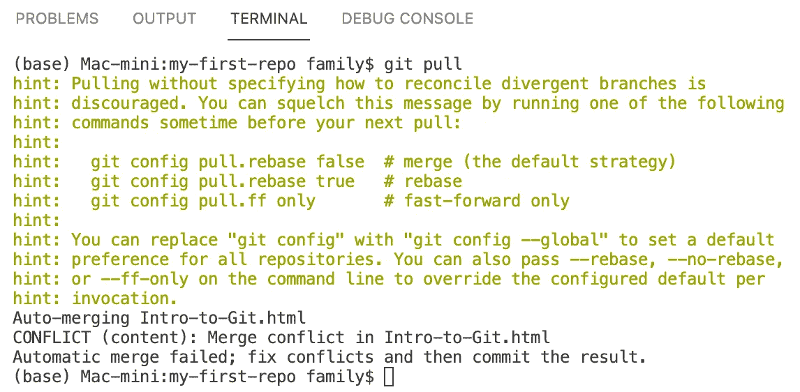*

*作者图片*

*幸运的是，VS 代码向我展示了实际的冲突。我看到我添加了两个感叹号(绿色)，我的同事添加了一些 CSS 颜色样式(蓝色):*

**

*作者图片*

*我可能会通过接受传入的更改，然后简单地添加感叹号来处理冲突。现在我做一个 git 提交和 git 推送:*

*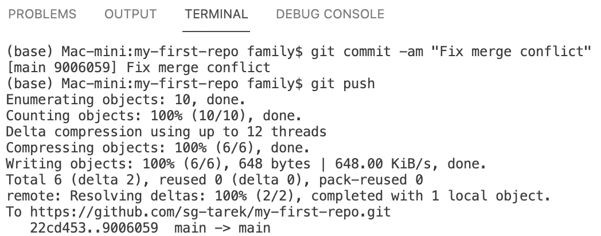*

*作者图片*

*查看远程回购中的文件，我现在应该能够看到更新。*

# *其他有趣的 Git 命令*

*假设您想要创建自己的分支:*

```
*git checkout -b <NEW-BRANCH-NAME>*
```

*通过运行以下命令在分支之间切换:*

```
*git checkout <BRANCH-NAME>*
```

*通过运行以下命令合并两个分支:*

```
*git merge <OTHER-BRANCH-NAME>*
```

*为了删除本地回购，您需要删除。git”目录，它是在克隆存储库时创建的。这是 Mac 上的一个隐藏文件，但你可以使用“ls -a”命令查看它，然后运行 *sudo rm -r* 删除它:*

**

*作者图片*

*我希望你像我喜欢写这篇文章一样喜欢它。如果你理解我的代码有任何困难，请留下评论。数据科学社区给了我很多，所以我总是乐于回馈。*

*请随时在 Linkedin 上与我联系，并在 Medium 上关注我以接收更多文章。*

## *进一步阅读的灵感*

*<https://cs50.harvard.edu/web/2020/notes/1/>  <https://github.com/datacamp/courses-introduction-to-git/blob/master/chapter1.md> *