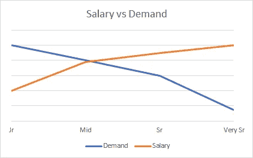
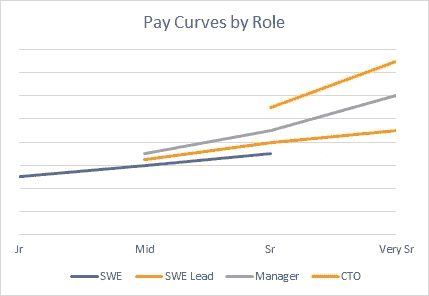
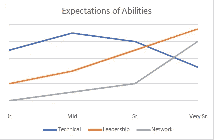
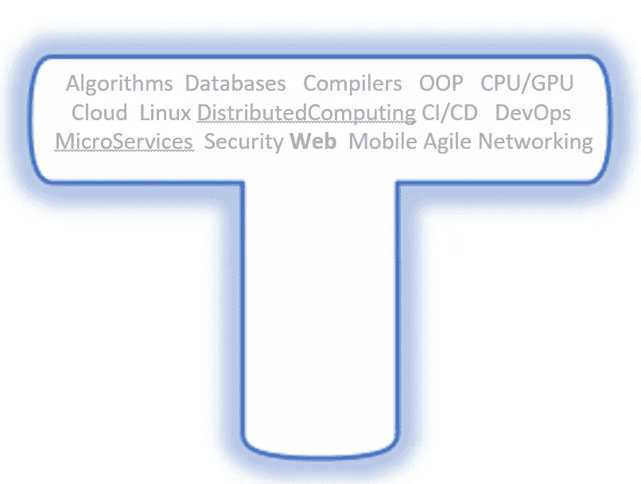
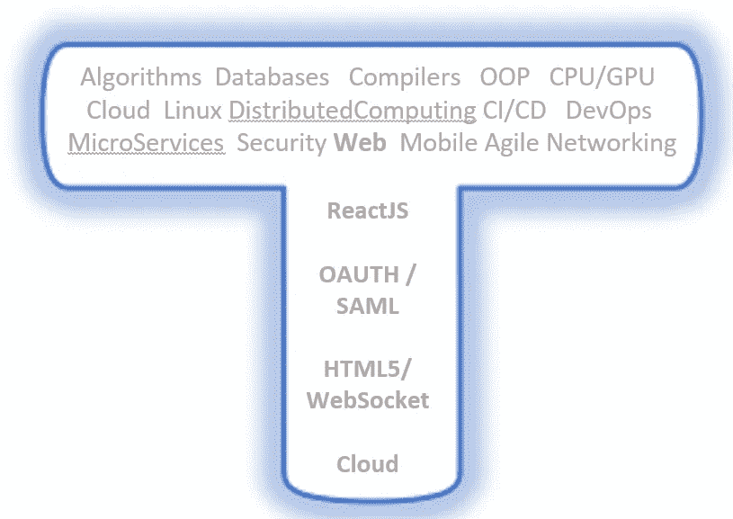

# 技术和数据科学中的年龄歧视

> 原文：<https://towardsdatascience.com/ageism-in-tech-and-data-science-67c7f4c3039d?source=collection_archive---------22----------------------->

## 了解什么以及如何应对技术职位中的年龄歧视

[阿莱西奥·法拉帝在 Unsplash 上拍摄的照片](https://unsplash.com/photos/upwjVq8cJRY)

你经常听到指向年龄歧视的恐怖故事:

> “他们不会雇用我，因为我没有**没有**经验”(太年轻)
> 
> “他们不会雇用我，因为我在 T4 太有经验了”(太老了)
> 
> “他们雇用了一些更年轻更便宜的人来代替我”(太贵了)

关于这一点有很多已发表的研究(一些列在本文末尾)——都指向一个难以忽视的事实——老年人不受欢迎。

本指南旨在帮助工程师描述一条通用路径。有许多其他的途径可以考虑，但大多数是从工程师到技术主管，到团队经理，希望还有 sr 管理。大多数人还被困在中层管理岗位，无法继续晋升。本文探讨了年龄偏见如何影响旅程中的每个阶段。

# 对薪酬和职业发展的观察

我在硅谷做了 12 年的工程师，又做了 12 年的华尔街技术专家，最近在 MBB 咨询公司工作，从我的个人观察中收获了很多。在我的职业生涯中，我管理并雇佣了不到 200 人。话虽如此，很多这种观点或轶事却有一定的研究依据[5，6]。

## 1:对高薪工程师的需求有限

工程师的工资很高，但你很快就碰到了天花板(方公司存在一些例外)。同样重要的是要知道，随着你在曲线上移动，需求会迅速下降——对于大多数团队来说，在金字塔结构中利用人才是很自然的。

工程师的普通工资/需求

## 2:领导层的薪酬曲线更高

工程师的薪酬主要在高级研究人员级别，由领导层(包括技术主管和经理，一直到首席技术官)支付。这条线突然开始/结束，因为角色在某些层级根本不存在(有人雇佣 Jr CTOs 吗？).

## 3:高层领导薪酬过高(但一点都不技术！)

我敢肯定，我们都曾开玩笑说，毫无头绪的 Sr 领导者/CTO/CIO 已经几十年没有编码或做任何技术工作了。在许多行业都是如此。他们大规模完成工作的能力使他们与众不同，也使他们获得了巨额收入。

## 那又怎样？有什么意义？

如果你关心保住你的工作和赚更多的钱，选择你职业发展的时机是关键。一个 28 岁的经理会对他们和他们的决定有极大的偏见，而一个 48 岁的工程师会让人质疑你的能力。经常发生的陷阱是陷入中层管理——不再是技术性的，也没有发展成为一个强有力的领导者。

接下来呈现的是一个帮助提升排名的剧本。不幸的是，即使是这本剧本也显示出年龄歧视，而且是为年轻人设计的！

# 按季节划分的职业剧本

> “时间，时间，时间。看看我变成什么样了。当我四处寻找我的可能性时”——**保罗·西蒙/邦格斯，冬日朦胧的阴影**

人天生就有偏见。在你职业生涯的每个年龄和阶段，人们会以某种方式看待你。这可能不公平或不正确，但你可以利用它。

四季— [壁纸之旅](https://wallpapersafari.com/page/copyright-policy/)

# 春天——构建核心(20 年代)

对年轻人的主要偏见是缺乏经验。年轻和快速学习的积极偏见可以让你进入一个有挑战性的角色(谁不会给一个年轻的有进取心的人一个机会呢？).不要抑制快速提升的冲动，它会伤害你。

> “年轻的科技工作者表示，他们也因为年龄而感觉受到了轻视”——IEEE Spectrum[7]

## 20 岁时的目标:

*   建立广泛的专业知识作为你 T 形轮廓的基础。
*   不要被困在一个冗长乏味的项目上——你需要学习和探索。从内部和外部寻找新的角色&练习面试。
*   如果你不喜欢你正在做的事情，尽快做出改变。找到你热爱的东西，不要害怕改变。

T 型 Doug Foo 基金会

# 夏天——深入(30 年代)

给人的感觉是，你是一位技术大师，亲力亲为创新者，能快速完成工作。30 岁是科技职业的黄金时期——成为专家和进入领导岗位有很多选择。挑战在于抓住第一批领导机会——但同样不要太快进入管理层。

> 被分析的 18 家美国大型知名科技公司的员工年龄中位数是 37 岁——Payscale.com[5]

## 30 岁时的目标:

*   在你可以利用的领域建立深度。
*   寻找领导角色。这不一定是对人的管理，但是你应该领导一些东西——代码、过程或人。
*   顾名思义，领导和管理是一件苦差事，你必须证明你能反复做几次。

扩大丁字裤的深度

# 秋季——多重影响(40 度)

在你 40 多岁的时候，感觉和期望是你不去管代码，但仍然理解它，更重要的是可以有效地管理客户、团队和项目。衡量你的标准是你是否有能力成为乘数”[2]并为你的公司创造更大的影响。最大的障碍是如何更上一层楼，或者在新的岗位上复制成功。

> 一项针对 1011 名科技员工的调查显示:“老”科技工作者的定义是“超过 40 岁”。— IEEE 频谱[7]

## 40 岁时的目标:

*   寻求高管的赞助。很少有 Sr 角色是完全基于他们自身的价值而产生的——这是一个高度政治化的游戏。
*   在一个新的维度中成长——这不再是关于技术，而是关于你如何利用技术为你的领域/业务服务。想想那些商业术语，如价值、影响和投资回报率。
*   随着你的升迁，这是非常政治化的——这是我最喜欢的一句话“朋友来了又走，敌人持续一生”

第三维的 T 形，是的，它是丑陋的，感谢我可怜的艺术性道格福

# 冬天来了(50 年代)

> “超过三分之二的公司认为年龄大是竞争劣势(德勤)…。美国退休人员协会的数据显示，三分之二的 45 岁至 74 岁的人都经历过与年龄相关的歧视。— HBR [3]

对我们大多数人来说，这是最后阶段。此时，你要么是一个正在努力学习 ReactJS 的 58 岁 Java 程序员，要么是一个坐在后面啜饮陈年苏格兰威士忌的高管，因为你遵循了类似的建议，或者只是运气好。

从个人的小 T 到大组织的变化 T

严肃地说，如果你发现自己已经 50 多岁了，还在编码，还没有往上爬，只要你喜欢编码，并且可能擅长编码，这其实是很好的。管理角色通常是操作性很强的——不太技术性，更多的是政治性和公司特定性(例如，你成为了知道该和谁交谈以及在内部特定系统上的专家——而不是最可移植的技能)。

有很多方法可以对抗年龄歧视，但是最好的解决方法是不走在潮流的前面。如果你发现自己已经 50 多岁了，还在担心，好消息是学习比 20 年前便宜多了，也容易多了。YouTube，Udemy，Coursera，麻省理工和斯坦福的免费在线课程可以比以往更快更便宜地教会你一切。

# 未来

> “没有未来。没有过去。你看到了吗？时间是同时的。”**曼哈顿博士，阿兰·穆尔的守望者**

我发现阿兰·穆尔以这种方式描述时间的同时性是很有趣的，类似于克里斯托弗·诺兰在《星际穿越》中描述的第四维度。认为时间不是线性的是自相矛盾的。在不涉及量子力学和死猫的情况下，让我建议你把时间当作一种珍贵的商品，按照剧本行事，或者为自己制作一本新的剧本。

# 参考资料:

[1] T 型型材—【https://jchyip.medium.com/why-t-shaped-people-e8706198e437 

[2]乘数—[https://thewisemangroup.com/books/multipliers/](https://thewisemangroup.com/books/multipliers/)

[3]雇佣年长员工的案例—[https://hbr.org/2019/09/the-case-for-hiring-older-workers](https://hbr.org/2019/09/the-case-for-hiring-older-workers)

[4]求职者的策略—[https://HBR . org/2019/08/5-应对面试中年龄歧视的方法](https://hbr.org/2019/08/5-ways-to-respond-to-ageism-in-a-job-interview)

[5]不同年龄组的看法—[https://diginomica . com/youth-experience-ageism-tech-industry](https://diginomica.com/youth-experience-ageism-tech-industry)

[6]年龄歧视偏见被揭穿——[https://www . visier . com/clarity/four-common-tech-Ageism-myths-debuked/](https://www.visier.com/clarity/four-common-tech-ageism-myths-debunked/)

[7] IEEE 数据来自 Indeed—[https://spectrum . IEEE . org/view-from-the-valley/at-work/tech-careers/does-age-discrimina tion-in-tech-start-at-40](https://spectrum.ieee.org/view-from-the-valley/at-work/tech-careers/does-age-discrimination-in-tech-start-at-40)

[8]心理学研究—[https://www . research gate . net/publication/264261522 _ 老年人与年轻人的认知对比 _ 工人 _ 大 _ 五个方面 _ 主动性 _ 个性 _ 认知 _ 能力 _ 工作 _ 绩效](https://www.researchgate.net/publication/264261522_Perceptions_of_Older_Versus_Younger_Workers_in_Terms_of_Big_Five_Facets_Proactive_Personality_Cognitive_Ability_and_Job_Performance)

[9] NPR 谈招聘中的年龄偏见——[https://www . NPR . org/2017/03/24/521266749/too-more-over-experience-to-be-employee-some-old-Americans-face-Age-Bias](https://www.npr.org/2017/03/24/521266749/too-much-experience-to-be-hired-some-older-americans-face-age-bias)