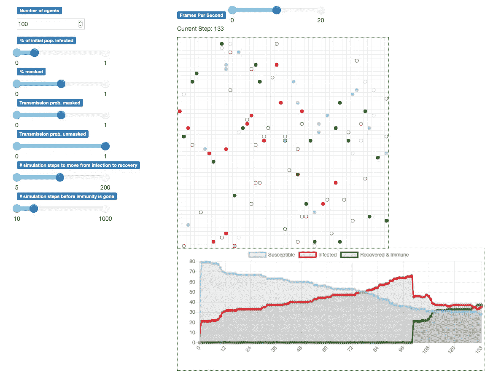
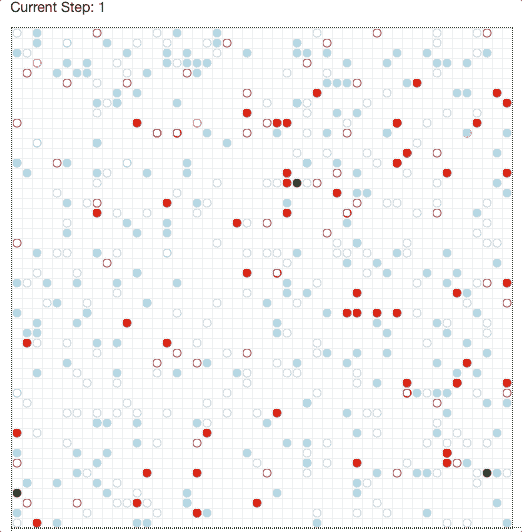
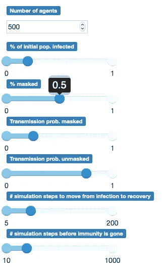
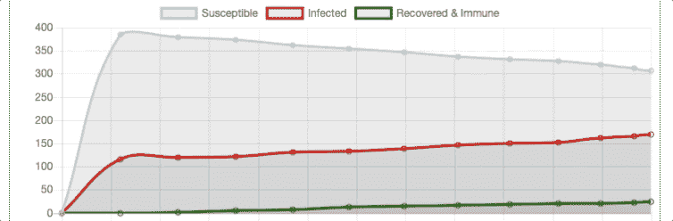
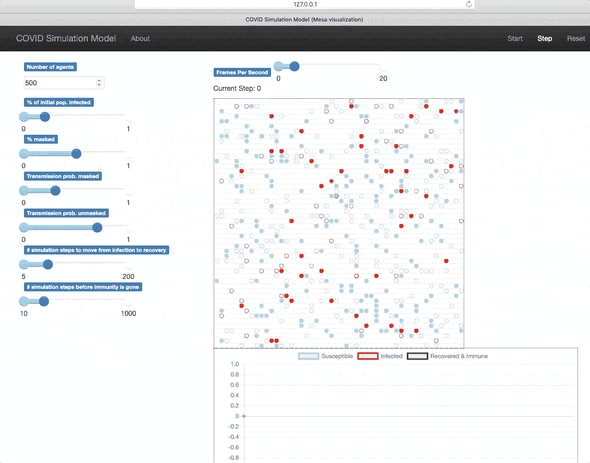

# 基于代理的模型可视化

> 原文：<https://towardsdatascience.com/agent-based-model-visualization-cb5648db51f4?source=collection_archive---------13----------------------->

## 使用 Python 的 Mesa 库和可视化模块中的空间模型对 COVID 的扩展进行建模

作者图片

## 介绍

在[之前的文章](/intro-to-agent-based-modeling-3eea6a070b72)中，我提供了一个介绍性的例子(优化超市柜台的数量),说明如何使用 Python 的 Mesa 库运行基于代理的模型。我们跟踪了 KPI 的折线图，例如我们客户的平均队列长度和等待时间，但是我们使用了有限的可视化。

在这篇文章中，我们将通过一个不同的基于代理的建模例子，我们将**更多地关注可视化**。

***来自《走向数据科学》编辑的提示:*** *虽然我们允许独立作者根据我们的* [*规则和指导方针*](/questions-96667b06af5) *发表文章，但我们并不认可每个作者的贡献。你不应该在没有寻求专业建议的情况下依赖一个作者的作品。详见我们的* [*读者术语*](/readers-terms-b5d780a700a4) *。*

## 基于代理的传播模型

我们将使用受 [SIR 模型(易感、感染、康复)](https://en.wikipedia.org/wiki/Compartmental_models_in_epidemiology#The_SIR_model_2)启发的模型来模拟 COVID 如何传播。我们有一个 50 x 50 的网格，里面有 250 个细胞和一些在相邻细胞间移动的媒介(人),有可能相互感染。

50 x 50 空网格(图片由作者提供)

我们将通过下面的**机制/假设**保持简单:

*   我们有固定数量(可调参数)的代理，这些代理最初被分配给网格中的随机单元。
*   在整个模拟过程中，这些代理的固定百分比(可调参数)被屏蔽/不被屏蔽。
*   在每一步，代理人要么留在他/她的单元，要么移动到相邻的单元。
*   当易感因子与另一个受感染因子在同一单元时，他/她可能会基于在掩蔽和未掩蔽因子之间不同的概率(可调参数)而被感染。
*   如果一个代理被感染，他/她在一定数量的模拟步骤(可调参数)后恢复并变得免疫。
*   在一定数量的步骤(可调参数)后，免疫力消失，药剂再次变得敏感。

## 画面

我们的代理将在网格中用圆圈表示。

易感因素为蓝色，受感染因素为红色，康复和免疫因素为绿色…

如果圆圈(未)填满，表示代理(未)被屏蔽…

作者 GIF

此外，我们将为模型中的所有可调参数添加一个部分。

作者图片

最后，我们将通过折线图动态显示整个模拟过程中易受感染、感染和恢复的代理数量…

作者 GIF

## 密码

为了服务于我们基于代理的模型和相关的可视化，我们将编写 2 个 python 脚本。

我将第一个脚本命名为 covid_model.py，它具有作为后端逻辑的 Mesa 模型细节。

名为 covid_model_visualization.py 的第二个脚本将从我们的第一个脚本导入模型参数以及代理和 CovidModel 类。然后，它将服务于我们的模型和可视化…

## 最终输出

我们现在如何我们的基于代理的模型准备好了。

我们可以调整网页上的参数，运行我们的模拟，并可视化代理如何交互以及易感、感染和恢复的代理的数量。

作者 GIF

**注意**你可以点击“Step”运行模拟的单个步骤，或者你可以调整每秒的帧数，然后点击“Start”以你想要的速度运行模拟。