# 汇总两两比较(受 ICML 2021 展示的启发)

> 原文：<https://towardsdatascience.com/aggregating-pairwise-comparison-inspired-by-a-demo-at-icml-2021-c6fdc05680e2?source=collection_archive---------33----------------------->

## [思想和理论](https://towardsdatascience.com/tagged/thoughts-and-theory)

## *今天我将向你展示如何在众包中执行答案聚合。当多个执行者执行一项人工智能任务时，请求者需要选择正确的响应，也称为聚合结果。*

照片由[格伦·卡斯滕斯-彼得斯](https://unsplash.com/@glenncarstenspeters?utm_source=medium&utm_medium=referral)在 [Unsplash](https://unsplash.com?utm_source=medium&utm_medium=referral) 拍摄

许多众包任务被设计为只有一个正确答案，因此注释被简化为经过充分研究的分类任务。在分类任务中，我们使用基于潜在标签假设的算法:只有一个正确的响应，算法需要恢复正确的响应。有了 spark-crowd、CEKA 或 Truth Inference 等流行的答案聚合库，就可以用相应的编程语言快速做到这一点。

分类并不是一个放之四海而皆准的方法——毕竟，它假设反应是客观的。但是，如果我们想要评估搜索或推荐质量、个人偏好或其他固有的主观任务呢？可能没有客观的答案，我们不能使用潜在标签假设。我们能做的就是从众学习。此类任务通常被设计为并排任务，也称为成对比较。群体表演者需要从两个选项中选择更吸引人的选项，而不是选择正确的答案。尽管这种方法很简单，但它可以用来处理高度复杂的任务——那些可能需要深入指导和大量设计工作的任务。

幸运的是，有一类特殊的成对聚合模型。其中最著名的被称为布拉德利-特里模型，它在 1952 年发表的一篇文章中首次被提及。从那时起，不同的研究人员和工程师对这个模型做出了贡献。

在本例中，我们将向您展示如何使用 Bradley-Terry 模型及其在 [Crowd-Kit](https://github.com/Toloka/crowd-kit) 中的变体来聚合成对比较。Crowd-Kit 是一个开源的计算质量控制库，可用于实现各种质量控制方法，如聚合、不确定性、协议等。

我们将演示如何在由陈等人于 2013 年发表的[著名数据集](http://www-personal.umich.edu/~kevynct/datasets/wsdm_rankagg_2013_readability_crowdflower_data.csv)上聚合成对比较以进行可读性评估。他们比较了成对的段落，问观众哪一段更难读。每篇文章都附加了一个 12 级可读性等级的基本事实标签。年级越低，课文越简单。这是一个很好的例子，因为我们有原始的众包数据和地面真相标签来评估结果。

我们在演示中使用了 Google Colab，但是任何其他 Python 编程环境都可以很好地工作。安装了 Crowd-Kit 并下载了带注释的数据后，我们就可以开始了。

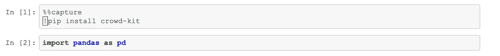

我们来看看数据。

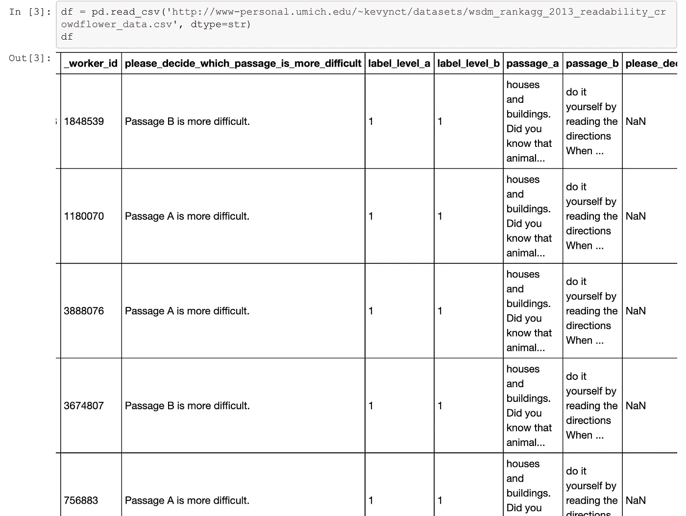

我们有一对专栏——a 篇和 b 篇——有两个比较的段落。基础事实标签分别是 label_level_a 和 label_level_b。

我们还有一个列 please _ decision _ which _ Passage _ is _ more _ different，它包含以下三个值之一:“A 段更难。”，“B 段比较难。”，或者“我不知道或者不能决定。”，由群众演员提交。

我们需要对数据集进行轻微的重新排列。首先，我们需要为每个回答分配与所选值相匹配的标签(即两个段落中的一个)。其次，我们需要重命名列:_worker_id 变成 performer，passage_a 变成 left，passage_b 变成 right。我们将省略不明确的比较，只保留带有非空标签的行。

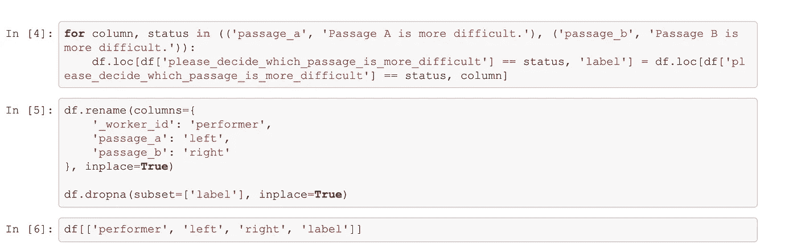

现在，让我们仔细看看我们的数据。

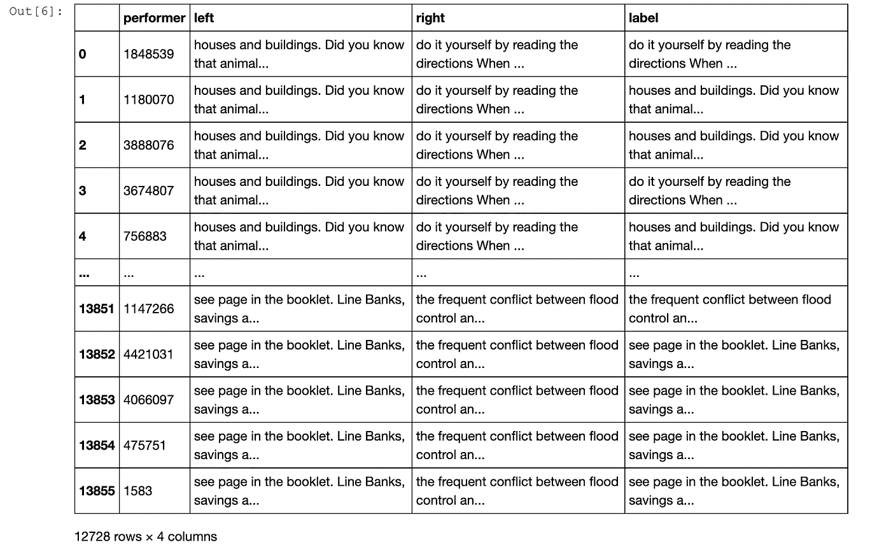

我们有一个成对的比较数据集；每个项目是由表演者提交的具有给定标识符的一对段落。我们想按可读性降序排列这些段落。这就是我们使用 Crowd-Kit 执行聚合的原因。

我们从 Crowd-Kit 导入 Bradley-Terry 和 noise Bradley-Terry 类，通过设置迭代次数直接实例化它们，并调用它们的 fit_predict 方法。

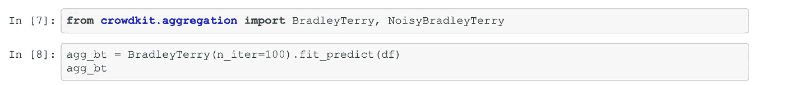

我们的 Bradley-Terry 实现使用了边缘化最大化方法。噪声类迭代运行 L-BFGS-B 优化方法来估计参数。这些参数是项目权重以及执行者的偏见和技能。

让我们看看我们得到了什么。

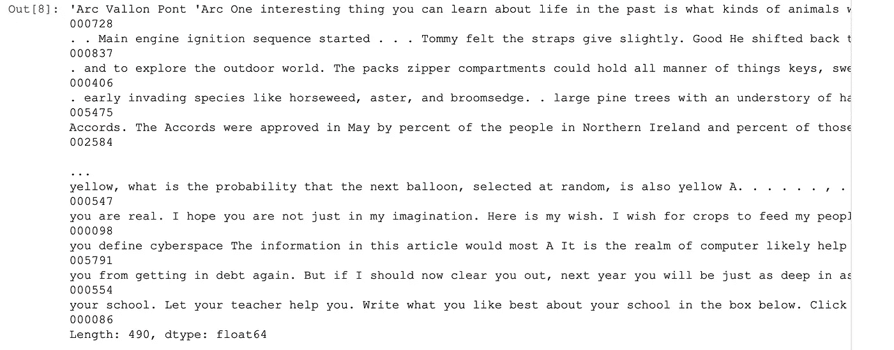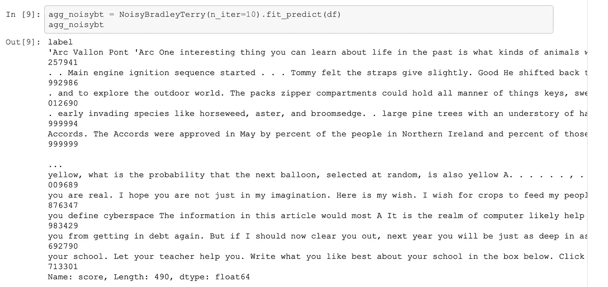

我们对段落对的比较就变成了模型提供的一系列对应权重的段落。根据大众的智慧，权重越高，阅读文章就越困难。

现在，让我们来评估模型预测的质量，并构建一个类似的系列文章，但使用地面真实等级。

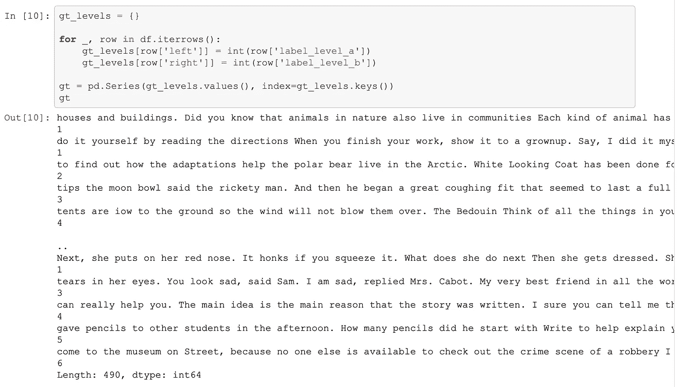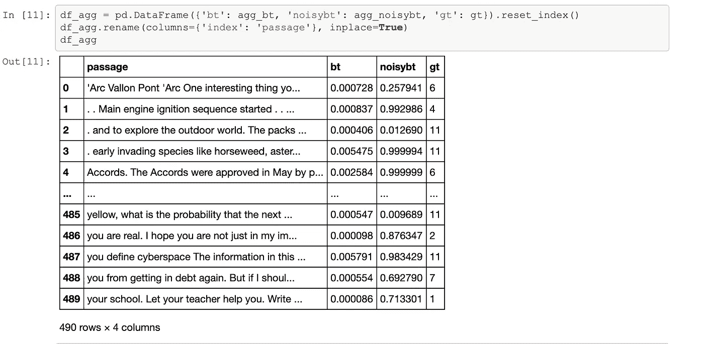

我们将使用 [NDCG@k](https://en.wikipedia.org/wiki/Discounted_cumulative_gain) 来评估我们的预测，这是一个分级的相关性分数。通过从两个预测序列和一个基础事实序列构建 Pandas 数据框架，我们只需要两个缺失的元素:从我们的权重推断的实际等级和随机排序基线。前者可以使用 Pandas rank 方法轻松获得，而后者可以使用 NumPy 随机数生成器更轻松地生成。

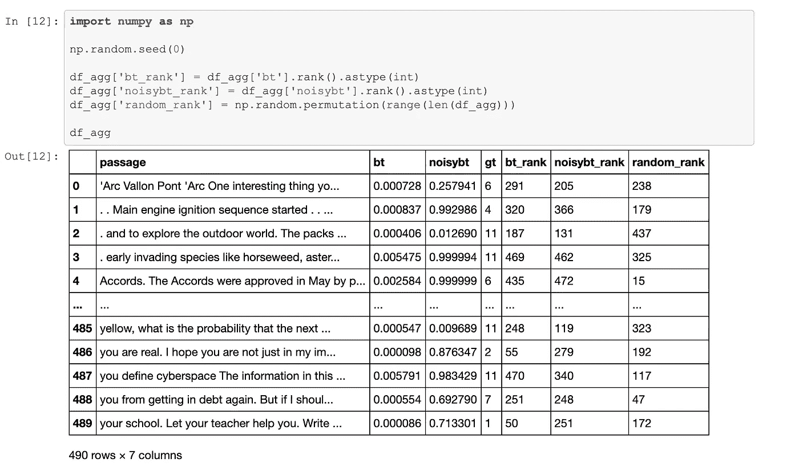

我们现在都准备好了。让我们从 scikit-learn 导入 NDCG 计算函数，并使用它来计算 NDCG@10 值。请记住，当 k 趋于无穷大时，倾向于收敛到 1(【王】等，2013 )，并且由于我们的数据集只有 490 个元素，我们需要坚持使用 k=10 的相对较小的值。请随意尝试。

在计算了我们的三个模型(基线、布拉德利-特里和嘈杂的布拉德利-特里)的 NDCG@10 值后，我们发现随机基线预期显示了最差的性能。相比之下，布拉德利-特里模型显示了更高和相似的分数。然而，在这个数据集上，更简单的模型表现优于更复杂的模型。这意味着您甚至可以使用众包数据来执行模型选择。

作为质量的最后一个指标，让我们看看预测之间的等级相关性，而不局限于前 k 项。我们看到布拉德利-特里模型适度地相互关联，并与地面真相标签相关，即使等级的粒度不同。

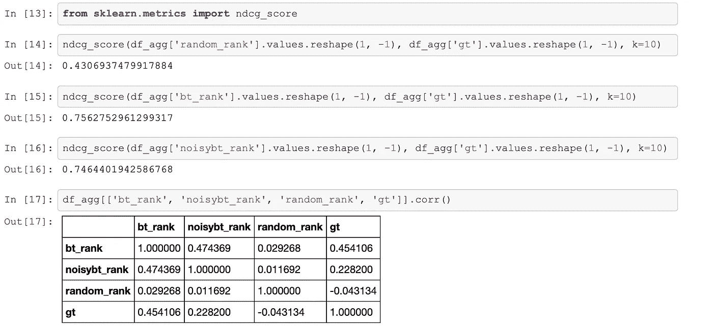

假设我们想要导出聚合数据，并在下游应用程序中使用它。我们将汇总结果放入数据框，并保存到 TSV 文件中。

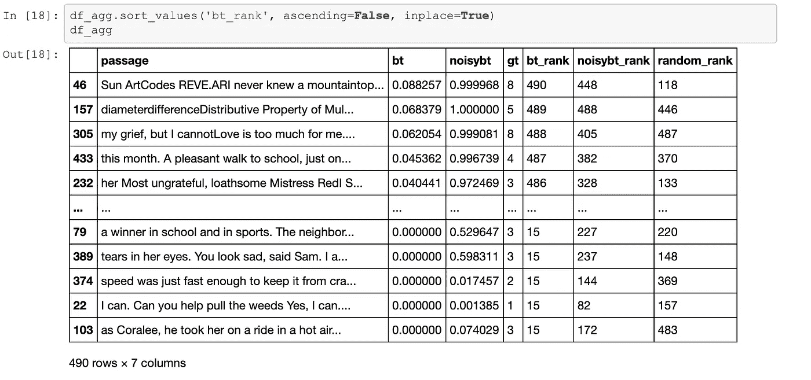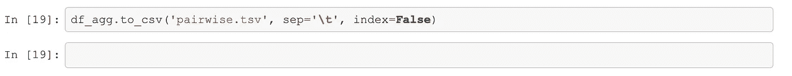

该文件应该出现在“文件”窗格中。如果你打开它，你会看到数据就在那里，还有权重和排名。

现在你已经知道了:我们用几行代码获得了聚合的成对比较，并使用 [Crowd-Kit](https://github.com/Toloka/crowd-kit) 和常用的 Python 数据科学库进行了模型选择。