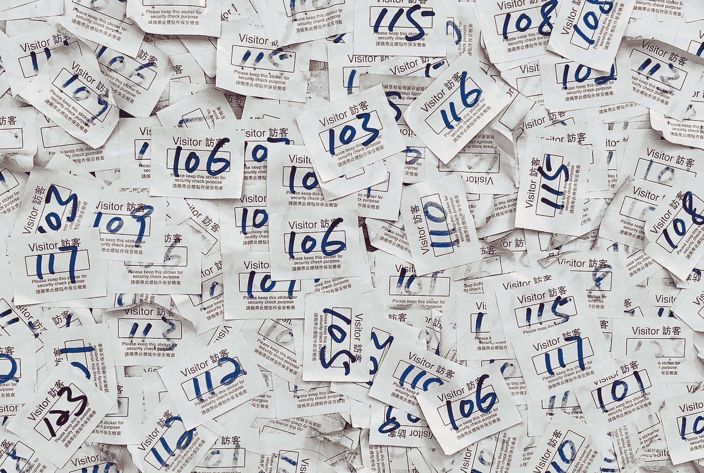

# 使用 K-means 聚类算法聚合 Reddit 评论& RobertaTokenizer

> 原文：<https://towardsdatascience.com/aggregation-of-reddit-comments-using-a-scikit-learn-k-means-clustering-algorithm-b6fa6d451e19?source=collection_archive---------19----------------------->

## 了解 HuggingFace Roberta Tokenizer 和 TfidfVectorizer 如何帮助准备 K 均值输入



[Pop &斑马](https://unsplash.com/@popnzebra?utm_source=unsplash&utm_medium=referral&utm_content=creditCopyText)在 [Unsplash](/s/photos/groups?utm_source=unsplash&utm_medium=referral&utm_content=creditCopyText) 上拍照

在社交媒体平台上对一个帖子的评论是个人观点。很多有着相似情绪的人都会留下相似的评论。然而，他们使用的词语可能会有所不同。有时候两个极性不同的帖子也会产生相同的评论。

并不是 Reddit 上的每一条评论和帖子都值得一读。用户喜欢那些有趣的帖子和评论。

那么，你如何把有趣的评论和一般的评论分开呢？

可以用分类的方法，也可以试试聚类的方法。

分类需要在评论和帖子上标注数据。这种信息很少。因此，我们可以使用无监督聚类算法对相同类型的评论进行分组。

在本文中，我们将尝试对不同 Reddit 子群帖子的评论进行聚类。Scikit-learn K-means 聚类算法将在此过程中提供帮助。TfidfVectorizer 和 HuggingFace Roberta tokenizer 将有助于为 K-means 聚类算法准备输入数据。

该聚类过程分为 3 个部分:

1.  从 reddit 获取 Subreddit 帖子的评论。
2.  准备输入文本数据。
3.  使用 K 均值聚类对评论进行聚类。

让我们从聚类过程的第一部分开始。

# 第 1 部分:从 reddit 获取 Subreddit 帖子的评论。

我们将使用 5 个子编辑( ***，‘r/shower thoughts’，‘r/wall street bets’，‘r/askreddit’，‘r/笑话’，‘r/world news’***)来收集数据。我已经将 Reddit API 配置为只选择一周内最热门帖子的评论。热门帖子会吸引大约 100 或 1000 条评论。因此，我将 API 限制为每个子编辑只有一个帖子。

您可以根据需要更改 API 的配置。

您需要按照以下步骤从 Subreddit 帖子中获取评论。

1.安装 praw python 库。使用 pip 安装程序。

2.获取您的 Reddit 帐户的 API 凭据。按照[这篇文章](https://www.reddit.com/prefs/apps)中给出的步骤获取凭证信息。

3.运行下面的代码，将 5 个子编辑帖子的所有评论存储在一个 comment_list 变量中。

**代码要点。**

**#1** 。该函数将使用凭证来创建与 Reddit API 的连接。

**#2** 。这个递归函数将获取评论及其回复。

**#3** 。它将指示 API 只获取每日热门文章。

# 第 2 部分:准备输入文本数据。

K-means 聚类方法以整数作为输入。因此，我们需要将字符串/文本数据转换为整数。此外，我们不能随意将文本转换成整数。这会给我们一个糟糕的结果。

因此，我们将遵循两种方法 HuggingFace Tokenizer 和矢量化，将字符串/文本数据转换为有意义的数字表示。

您可以通过分析它们的性能和易用性来选择其中一个过程。

## 矢量化方法

第一步是把一个句子转换成单个的单词。然后，这些字将被编码为整数、浮点或长整型值。这就是所谓的矢量化。

这里，我们遵循 TF-IDF(术语频率—逆文档频率)方法。

词频—统计某个词在文档中的出现次数。

逆文档频率—它将降低最频繁出现的单词的重要性。

总的来说，这种方法将赋予那些出现频率较低的单词更高的值。

让我们实现 TF-IDF 方法。

```
from sklearn.feature_extraction.text import TfidfVectorizer
import pandas as pdtf_idf_vectorizor = TfidfVectorizer(max_features = 20000) #1tf_idf = tf_idf_vectorizor.fit_transform(comment_list) #2tf_idf_array = tf_idf.toarray() #3pd.DataFrame(tf_idf_array,
           columns=tf_idf_vectorizor.get_feature_names()).head() #4
```

**重要的代码点。**

**#1。**我已经给 max_features 赋值 20k 了。您可以使用基于数据选择 max_features 值。

**#2。**该函数将为每个单词/数字创建向量，并将它们存储在 tf_idf 值中。它是矩阵形式的。

**#3。**它将把矩阵转换成 numpy 数组。

**#4。**该功能将显示单词及其矢量形式。

## 拥抱人脸标记方法

HuggingFace 中的每个模型都有自己的词库。但是，将单词转换成整数的过程几乎是相似的。首先，它会将句子拆分成单独的单词。然后它会在词库里搜索那些单词。如果匹配，则返回匹配单词的令牌。

如果没有匹配，它会一直断词，直到它们匹配词库。

这整个过程在 HuggingFace 中被称为标记化。

让我们实现这个过程。

```
from transformers import RobertaTokenizer #1roberta_tokenizer=RobertaTokenizer.from_pretrained('roberta-base')#2total_array=np.array([roberta_tokenizer.encode_plus(comment_list[0],
                      add_special_tokens=True,max_length=30,
   pad_to_max_length=True,return_attention_mask=True)[‘input_ids’]])for i in comment_list[1:]:
    new_array=np.array([roberta_tokenizer.encode_plus(i,
                        add_special_tokens=True, #3
                        max_length=30,
                        pad_to_max_length=True,
                        return_attention_mask=True)[‘input_ids’]])
    total_array = np.append(total_array,new_array,axis=0)print(total_array)
```

**代码要点。**

**#1** 。您还可以选择其他模型的标记器，如 BertTokenizer 和 OpenAIGPTTokenizer。

**#2。**其他选项有 roberta.large、roberta.large.mnli 和 roberta.large.wsc。

**#3** 。Encode_plus 函数将把文本数据转换成整数数据。

标记化示例:

```
comment_list[0]‘ Aside from breakups and heartbreak (which is inevitable unless you\’re a hermit) I\’ve never been happier than I\’m now. ‘tokenizer.tokenize(comment_list[0])[‘Aside’, ‘from’, ‘breakup’, ‘##s’, ‘and’, ‘heart’, ‘##break’, ‘(‘, ‘which’, ‘is’, ‘inevitable’, ‘unless’, ‘you’, “‘“, ‘re’, ‘a’, ‘her’, ‘##mit’, ‘)’, ‘I’, “‘“, ‘ve’, ‘never’, ‘been’, ‘happier’, ‘than’, ‘I’, “‘“, ‘m’, ‘now’, ‘.’]
```

正如你所看到的，心碎这个词不在罗伯塔的单词库中。所以，分为心和断两个字。

# 第三部分。使用 K 均值聚类对评论进行聚类。

K-means 聚类算法收集数据点，并基于各种相似性将这些数据点聚合在一起。它是一种无监督的机器学习算法。这意味着不需要标记数据。[点击这里](https://en.wikipedia.org/wiki/K-means_clustering)了解更多关于 K-means 聚类的知识。

**让我们实现这个算法。**

**重要的代码点。**

#1.5 个帖子的总评论超过两千条。为了简化输出，我只选择了 20 条评论进行聚类。

#2.求 n_clusters 的值，可以用肘法和剪影系数。

正如您所观察到的，TfidfVectorizer 和 Tokenizer 创建的集群下的注释是不同的。但是，两种方法的 K-均值聚类的配置是相同的。

由此可以得出结论，k-means 聚类中，标记化过程影响聚类过程。因此，尝试这两种方法，然后选择适合你的方法。

如果默认设置没有产生所需的输出，请尝试不同的设置。[访问 Scikit-learn 网站](https://scikit-learn.org/stable/modules/generated/sklearn.cluster.KMeans.html)了解更多关于不同设置的信息。

# 结论

K-means 聚类创建的组将帮助您忽略没有新信息的评论。此外，它还会帮助你发现其他评论之间的关系。

在本文中，我使用 TfidfVectorizer 和 Roberta Tokenizer 来准备输入数据。这两种方法产生的结果是不同的。因此，您可以根据自己的需求选择其中一种方法。

希望这篇文章能帮助你了解 k-means 聚类。