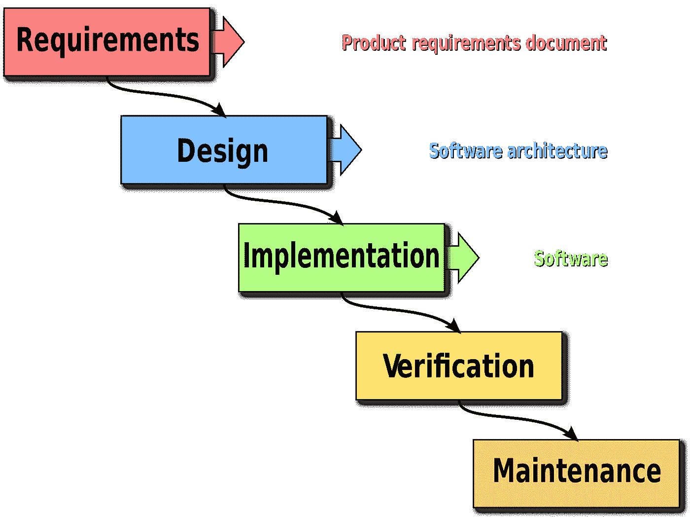
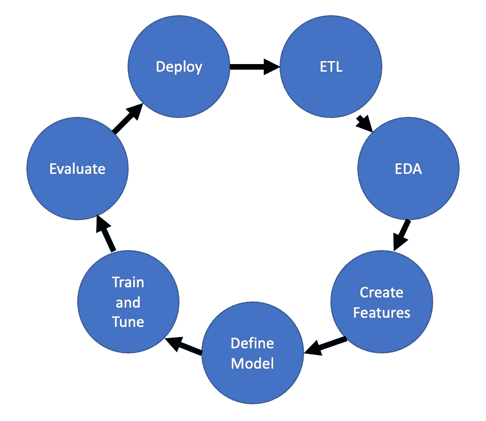

# 面向数据科学的敏捷

> 原文：<https://towardsdatascience.com/agile-for-data-science-bb91ad16e9f9?source=collection_archive---------30----------------------->

## 如何在面向瀑布的领域实践敏捷

开发软件的瀑布方法是一种遵循线性路径的方法，其中每一步在下一步之前完成，如下所示。

彼得·坎普/保罗·史密斯 (CC BY 3.0)

同时，敏捷是一个迭代开发软件的过程，在这个过程中，需求、设计和实现可能会不断地发生变化。这正成为工作的首选方法，因为演示/MVP 交付得更快，而且需求确实变化很大。在敏捷过程中，反馈更容易获得和整合，因为它以更有规律的间隔出现，并且不会在项目结束时对产品造成影响。

# 机器学习中的瀑布

虽然步骤可能不同，但在机器学习项目中会遵循这一顺序过程。步骤通常是这样的:

1.  获取数据
2.  探索性数据分析
3.  创建特征
4.  定义模型
5.  训练模型和调整超参数
6.  评估模型，并根据需要后退几步
7.  部署模型

这样做的问题是，一旦我们到达第 6 步，我们就开始回到前面的步骤，并且模型部署得不够快或不够频繁。

这是我看到的描述数据科学敏捷的模式。今天大多数人实践数据科学的方式，下图中来自模型评估的箭头可能会跳过部署，直接指向初始数据探索。

作者图片

我对上图中呈现的过程的另一个问题是，它没有告诉你从哪里开始。我将解释为什么我个人认为您应该从部署开始 ML 模型开发。

# 版本 0

面对现实吧，有时候获取数据可能是一个漫长的过程。您必须等待客户端、DBA 给您凭证，或者安全人员授权您查看数据，或者其他事情。那么在你等待的时候你能做些什么呢？开发我称之为你的 ML 模型的版本 0(或 v0)。这是一个你在没有任何数据的情况下建立起来的模型，或者是你捏造出来的数据或粗略的数据。这里有两个例子:

*   预测航班是否会延误的二元分类模型。首先，您的 v0 可以以相等的概率随机返回 yes 或 no。
*   一种线性回归模型，仅根据房屋的平方英尺来预测其价值。你会随机得出 Beta 值，选择正数，因为在这种情况下这是有意义的(即更多的平方英尺等于更高的价值)。

显然，您不希望将这两种模型部署到生产环境中。但是我认为将这两者中的任何一个部署到开发环境中都是一个好主意，原因如下:

1.  您的数据科学团队将努力尽快创建一个更好的模型，因为现有的模型显然很糟糕。
2.  一旦有了更好的模型，您就已经有了部署它的方法，所以这个过程不会花太多时间。
3.  软件团队的其他成员可以使用这些 v0 模型进行开发，直到更好的东西出现。例如，用户界面可以继续，因为您已经有了一个可以显示结果或给出预期结果的部署模型。

现在去开发一个 v0 模型，并将其部署到您的下一个项目中！