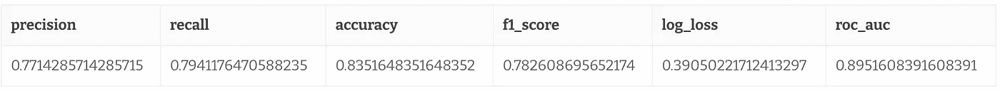

# 使用 dbt 和 BigQuery ML 的敏捷机器学习

> 原文：<https://towardsdatascience.com/agile-machine-learning-with-dbt-and-bigquery-ml-c067431ef7a9?source=collection_archive---------27----------------------->

## 分析工程

## 一步一步的教程和样本报告


这篇文章最初发表在[给我看数据](https://showmethedata.blog/agile-machine-learning-with-dbt-and-bigquery-ml)上，现已修改为 Medium。

在这篇文章中，我将介绍如何让强大的机器学习管道建立并运行起来，而不存在管理基础设施的所有令人头疼的问题。我们将利用 **dbt** 的编排能力和 **BigQuery ML** 的易用性，让您在数据仓库上做出预测的速度比说“数据”还快。

# dbt 是什么？

如果您在过去的一两年中一直从事数据仓库工作，您可能会注意到围绕一个特定工具的宣传越来越多，这个工具被称为“数据构建工具(dbt)”。dbt 是一个 CLI 工具，用于在数据仓库中运行转换管道、测试和文档。

简而言之，您的转换管道的每个阶段都被称为一个“模型”,并在一个 SQL 文件中定义。

例如，您的**订单**模型可能依赖于 **base_orders** 模型和 **base_payments** 模型。不像使用标准 SQL 那样直接从表中选择，而是用 jinja 模板语言中的 **ref** 调用替换表名。

间接告诉 dbt 每个步骤如何与其他步骤相关，并允许您运行该转换管道的任何子集，dbt 负责由依赖项定义的执行顺序。


来源: [dbt 文件](https://docs.getdbt.com/)

当然，这并不是你对金贾能做的全部。您拥有整个模板语言的能力，因此可以对 SQL 代码进行抽象，使用循环、条件等生成代码。

您还可以定义数据测试、模式测试和文档，因为 yaml configuration 和 dbt 将为您生成自动化测试和完整的文档网站！


来源: [dbt 博客](https://blog.getdbt.com/using-dbt-docs/)

如果你对 dbt 不熟悉，我强烈推荐阅读 fish town Analytics(dbt 的创造者)的首席执行官的这篇介绍性博客文章。

# 什么是 Bigquery ML？

BigQuery 是 Google 的无服务器数据仓库产品，是最简单、最用户友好的数据仓库平台之一。

机器学习通常需要专业框架和复杂基础设施的广泛知识，但 BigQuery ML 让您可以使用您已经知道并喜欢的 SQL 在几分钟内在 BigQuery 中已经拥有的数据上构建一个完全可操作的 ML 管道*。*

截至 2020 年 1 月，Bigquery ML 支持以下机器学习算法:

*   **线性回归:**用于使用变量的线性组合进行预测。
*   **逻辑回归:**用于分类任务的二元和多类逻辑回归
*   **K 均值聚类:**一种用于数据分割/聚类的无监督学习技术；例如，识别客户群。
*   **Tensorflow:** 将 Tensorflow 模型导入 Bigquery ML
*   **矩阵分解:**一种推荐算法，可以在使用相似用户的偏好之前，预测一个用户对自己没有交互过的物品的偏好。
*   **AutoML Regressor:** 使用 Google 的 AutoML Tables 服务创建一个回归模型，有效地尝试多重回归算法并自动调整超参数。
*   **AutoML 分类器:**使用 Google 的 AutoML 表格服务创建分类模型，有效地尝试多种分类算法并自动调整超参数。
*   **Boosted 树分类器:**使用 XGBoost 进行分类。
*   **增强树回归器:**使用 XGBoost 进行回归。
*   **DNN 分类器:**创建深度神经网络分类器模型。
*   **DNN 回归器:**创建深度神经网络回归器模型。
*   **ARIMA:** 建立基于 ARIMA 的单变量时间序列模型，用于时间序列预测。

如你所见，你有很大程度的灵活性，可以跳过构建一大堆机器学习基础设施，立即投入运行！

# 手动 BigQuery ML 工作流

为了理解 dbt 在幕后做什么，理解没有 dbt 的普通 BQML 工作流是什么样子是很有价值的。我们将使用流行的泰坦尼克号幸存者数据集，我们希望根据年龄、性别、船票等级等特征来预测某人是否幸存。

如果你想按照这种**手册**的方式来使用 BigQuery ML，你可以按照我列出的步骤来做，但是，在这篇文章的后面，我将通过一个示例项目来讲述如何使用 dbt 来做这些，所以你可以自由地阅读这一部分！

# 步骤 1-上传数据集

来自 [this gist](https://gist.github.com/balmasi/0e65f72c48f2a3498ceb36ffc216f5eb) 的 Titanic 数据集，并使用 [Bigquery 控制台](https://console.cloud.google.com/bigquery)将其上传到 BigQuery。如果你在这方面需要一些帮助，请查看[的 BigQuery 文档](https://cloud.google.com/bigquery/docs/loading-data-cloud-storage-csv#loading_csv_data_into_a_table)了解详情。

# 步骤 2 —创建模型

您可以创建一个简单的模型，方法是在选择中包含所有输入要素，并将目标变量命名为“label”。在这里，我只对前 800 名乘客进行培训，因为我要让 91 名乘客在**步骤 4** 中评估模型性能。

大约 30 秒后，你就有了一个名为“logreg”的经过全面训练的机器学习模型！您可以单击 BQ 控制台中的模型来查看评估指标。

# 步骤 3 —(可选)查看培训和模型统计数据

如果您感兴趣，您可以获得关于每个训练迭代的信息，比如训练和评估数据丢失、学习率以及其他相关的度量。在控制台中查看它就像单击您的模型并浏览培训选项卡一样简单。

您也可以通过运行以下查询，使用 SQL 语法来完成此操作:

该查询产生特定于模型的训练信息。


ML。培训信息输出

# 步骤 4 —评估模型

接下来，您可以在您提供的一些数据集上获得模型的性能指标。



ML。评估结果

# 第五步——预测

现在，通过运行 predict，您可以轻松地将您的模型用于看不见的数据！我将在这里假装有一些“看不见的乘客”数据集，并得到关于他们生存的预测。

Bigquery 将为您提供这两个类的概率以及用于进行预测的特征。


# 步骤 6 —(可选)解释模型

根据您使用的模型，您还可以从您的模型中获得一些全局可解释性结果。

例如，使用一个增强的树分类器，你可以使用 **ML 得到特征重要性。FEATURE_IMPORTANCE** ，或者用 logistic 回归，可以用 **ML。权重**获取模型预测中使用的基础权重。

下面是这个查询返回的输出的一个小例子。


这是制作和使用 BigQuery ML 模型的完整生命周期，但是您不希望每次使用 ML 模型时都手动执行所有这些步骤。您需要的是一种自动化的方式来运行这些步骤，作为生产工作流程的一部分。

这就是 dbt 的用武之地！

# 将 Bigquery ML 与 dbt 一起使用

在机器学习工作流中，dbt 可以很好地处理各个步骤之间的一些依赖关系。例如，我们必须预处理特征，将数据集分成训练集和测试集，并最终使用模型来预测新的数据点。

在这里，我们可以利用 dbt 的执行引擎以正确的顺序运行这些步骤，甚至可以使用驱动我们分析的相同基础架构来安排模型培训和服务！

您可能已经注意到，我们使用一些特定于 BigQuery ML 的语法来创建我们正在使用的模型。

在 dbt 中，默认情况下，我们只编写查询的 **SELECT** 部分，它的具体化，无论是作为表、视图还是公共表表达式，都由一个**“具体化”**配置来处理。

例如，要具体化一个包含数字 1 的表，我们应该写

这将在我们的数据仓库中创建一个名为**numbers**(SQL 文件的名称)的表。我们可以像实现一个视图一样简单地实现它:

实际上，这只是将执行的 SQL 模板化，以产生类似下面的查询:

我们可以利用相同的概念创建一个**自定义具体化**来编写**创建模型**，并传入任何必需的选项。

幸运的是，我们不必从头开始设置我们的自定义物化，因为来自丹麦的 Kristeligt Dagblad 已经整合了一个漂亮的轻量级 dbt 包，名为 [dbt_ml](https://hub.getdbt.com/kristeligt-dagblad/dbt_ml/latest/) ！

# 你自己试试吧

在我们的 dbt 示例中，我们将使用与上面手动工作流相同的泰坦尼克号乘客存活率数据集。这一次，我们将使用 dbt 和 dbt_ml 包来训练逻辑回归模型。

让我们开始吧。如果您已经设置了 dbt 和 Bigquery，请跳到**步骤 3** 。

学习任何东西的最好方法是亲自动手，感受 Bigquery ML 和 dbt 组合的强大功能！

## [→拿到 10 分钟？克隆回购←](https://github.com/balmasi/dbt_bigquery_ml_example)

# 1.确保安装了 dbt

由于这是一个 dbt 教程，如果你想尝试一下，你必须安装 [dbt。](https://docs.getdbt.com/dbt-cli/installation/)

对于 Mac 用户，推荐的方式是通过自制

```
brew install dbt
```

您也可以使用 pip 或[从源安装它](https://docs.getdbt.com/dbt-cli/installation/#install-from-source)[。](https://docs.getdbt.com/dbt-cli/installation/#pip)

# 2.确保访问您的 BigQuery 帐户

在我们开始之前，让我们确保您可以访问 BigQuery。任何拥有 Google 帐户的人都可以设置 BigQuery，BigQuery 有一个非常慷慨的免费层，所以不要担心运行这个例子时的任何成本。

1.  转到[big query 控制台](https://console.cloud.google.com/bigquery)——如果你没有谷歌云平台账户，系统会要求你创建一个。
2.  为本教程创建一个新项目—如果您刚刚创建了一个 BigQuery 帐户，系统会提示您立即创建一个新项目。如果您已经有另一个现有项目，您可以从标题栏的下拉列表中选择它，或者从那里创建一个新项目。
3.  使用[官方说明](https://cloud.google.com/sdk/docs/install#installation_instructions)下载并安装谷歌云 SDK。我们将使用 OAuth 向您的 BigQuery 帐户验证 dbt。
4.  使用激活应用程序默认帐户

```
gcloud auth application-default login
```

将会打开一个浏览器窗口，要求您使用您的 Google 凭据进行身份验证。一旦流程完成，您的 dbt 项目应该可以访问您的 Bigquery 帐户了！

# 3.设置您的 dbt 执行概要文件

您需要配置 dbt 来指向您的项目。您可以通过将示例项目中的 **profile-example.yml** 复制到 **~/中来做到这一点。dbt** 并将其重命名为 **profile.yml** 。dbt 的默认配置在提到的路径中查找概要文件，但是您总是可以使用**–profiles-dir**标志选择一个替代的概要文件路径。

现在，您所要做的就是将项目名称更改为您的项目

# 4.安装 dbt_ml 包

我们通过将包定义包含在 **packages.yml** 文件中，将 **dbt_ml** 包定义为依赖项。

既然我们已经定义了这个包，我们需要通过运行下面的命令来安装它。

```
dbt deps
```

# 5.导入示例数据

我们首先需要将用于训练模型的数据和一些用于预测未知案例的样本数据导入 BigQuery。

您通常会有一些现有的数据要处理，但我已经将 Titanic 数据集作为一个 **raw_titanic.csv** 种子文件，并在一个 **predict_me.csv** 种子 csv 文件中包含了一些虚拟的人来预测存活率。

要将数据放入 BigQuery，请运行以下命令

```
dbt seed
```

# 6.特征工程

在这一步中，您可以获取输入数据并对其进行整形，为构建 ML 模型做好准备。在实践中，我会构建一个宏，其中给定一个输入表，输出 SQL 以将输入数据转换为可用的要素。通过这种方式，您可以在训练管道和预测管道中使用相同的宏，并获得可用于调试的有用的具体化。

在这个玩具示例中，我将坚持基本原则，只删除乘客的姓名和机票号码，因为它们的预测价值较低。

# 7.模特培训

接下来是有趣的部分。这里，我们将定义一个新的 SQL 文件，该文件引用输入特性并具体化一个**模型**而不是一个表。

我们可以通过设置**materialized =‘model’**并简单地将我们想要传递的配置传递给 BigQuery ML 定义的模型训练参数来实现这一点。

您可以选择传入一个 post_hook，它将模型定型和特征元数据输出到一个审计表中，以便跟踪模型随时间的变化。审计步骤的输出由您的 **dbt_project.yml** 中设置的以下变量定义

我们可以在 dbt_project.yml 中设置默认变量

我们的训练模型将使用这些变量将模型审计信息输出到 **ml_model_audit.ml_models** 数据集。

下面是指定实际 ML 模型训练的 SQL 文件。在这种情况下，我们传递用于训练逻辑回归分类器的配置。我们所要做的就是**选择**要使用的训练数据，其中目标类在**标签**列中。

# 8.做预测

最后，我们可以对种子步骤中作为 **predict_me** 表导入的看不见的数据点进行预测。我们可以通过使用 **dbt_ml.predict()** 宏来做到这一点。

这里，为了使看不见的数据与训练的模型兼容，我简单地删除了*名称*和*标签*列，以使输入特征与我们训练模型时定义的形状相同。

我们不排除“幸存”一栏，因为它不可用。这就是我们试图预测的。

**注意**如果我们已经在训练管道中定义了一个宏来进行特征工程，我们将在这里重用它来将数据整理成形。

# 9.关键时刻——运行您的管道

现在，您已经定义了您的 DAG，并准备运行和持久化它！

这是依赖图的辉煌之处。


为了在数据仓库中实际具体化上面的表，我们仍然需要运行下面的命令。

```
dbt run
```


这样做可以运行整个图，但是您可以通过向模型文件添加一个标签(如“training ”)并执行类似于 **dbt run -m tag:training** 的操作来运行训练

运行之后，您可以在 BigQuery 中看到您的预测输出。


由于我们设置了模型审计 post-hook，我们还将在模型审计表中获得一个条目。在这里，您可以找到您训练的每个模型的训练、特征和模型重量信息。


# 结论

这就是:在 BigQuery 中训练机器学习模型和运行批量推理的简单而优雅的方法。

在这一点上，我想强调您需要考虑的关键点，以决定您是否希望将此作为您信息渠道中的核心战略。

# 优点(如果您关心…，请使用)

1.  超级简单的再培训和利用您现有的分析编排基础架构
2.  需要管理的基础设施更少
3.  进入门槛低，上市时间快
4.  轻松跟踪模型的血统
5.  简单的版本控制数据科学工作流
6.  经过良好记录和测试的集中式 ML 特性(这部分取决于您，但是 dbt 为您提供了一个很好的方法)

# 缺点(如果你在乎…，请避免)

1.  供应商锁定
2.  更难做更复杂的特性工程(尽管用 jinja + SQL 可以做很多事情)
3.  进行许多实验可能会更加昂贵
4.  不是为实时预测用例设计的

总的来说，我强烈建议你尝试一下，看看它是否适合你。每个人的用例都是不同的，所以一些小实验可能会在很大程度上打开加速机器学习模型生产化的大门，并最终为客户提供价值。

**有什么问题或经历想分享吗？**留下评论，我们一起来深挖吧！

## 这篇文章最初发表在[给我看数据](https://showmethedata.blog/agile-machine-learning-with-dbt-and-bigquery-ml)上，为了与媒体兼容，已经进行了修改。