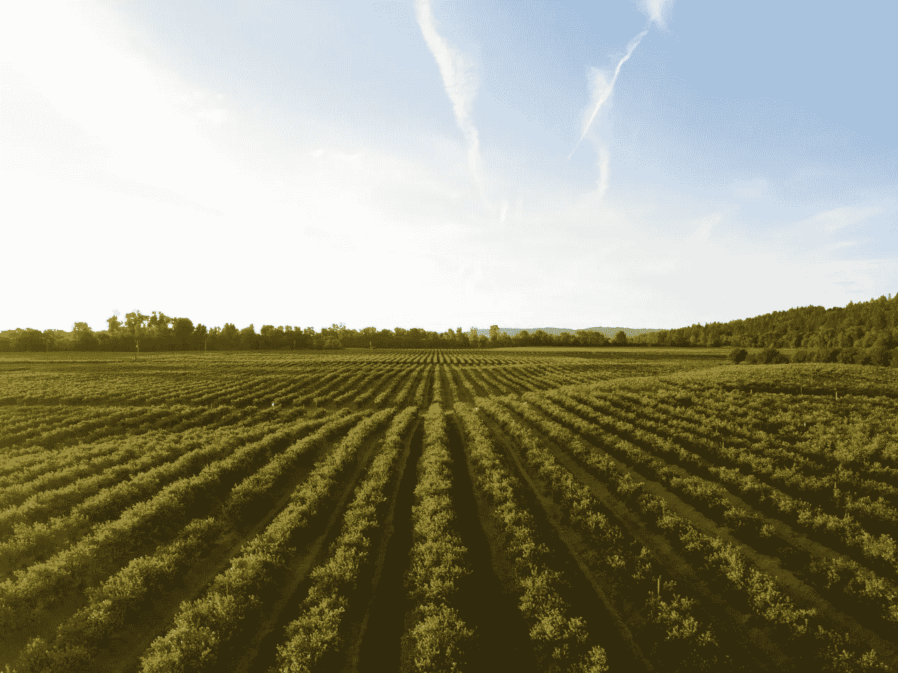
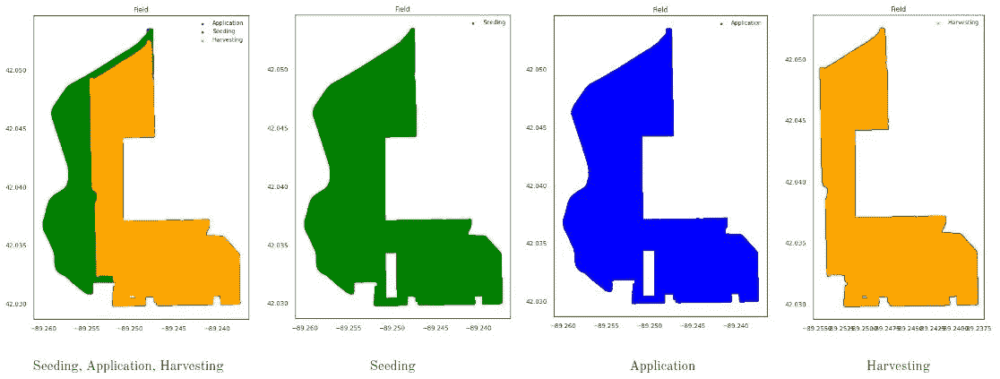
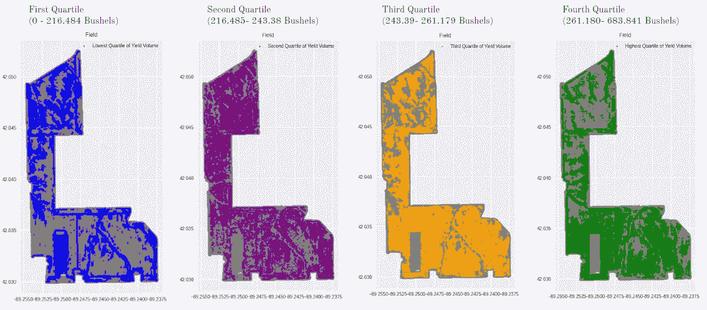
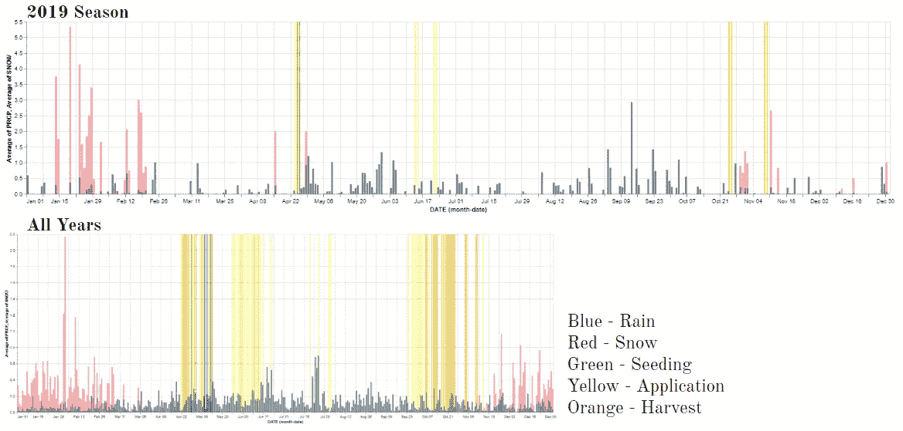
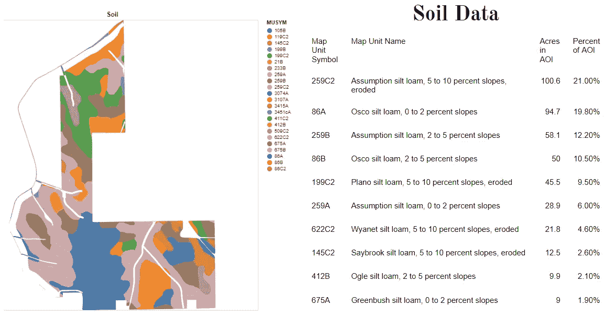
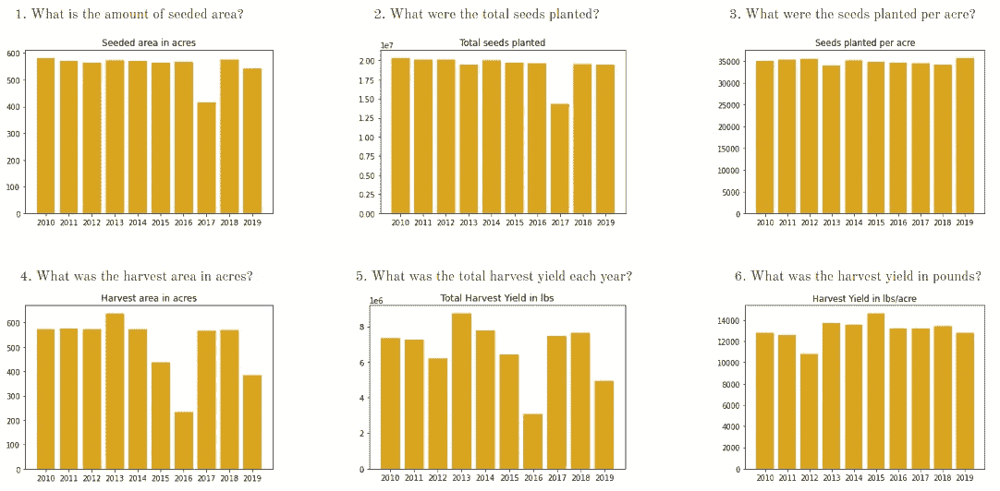
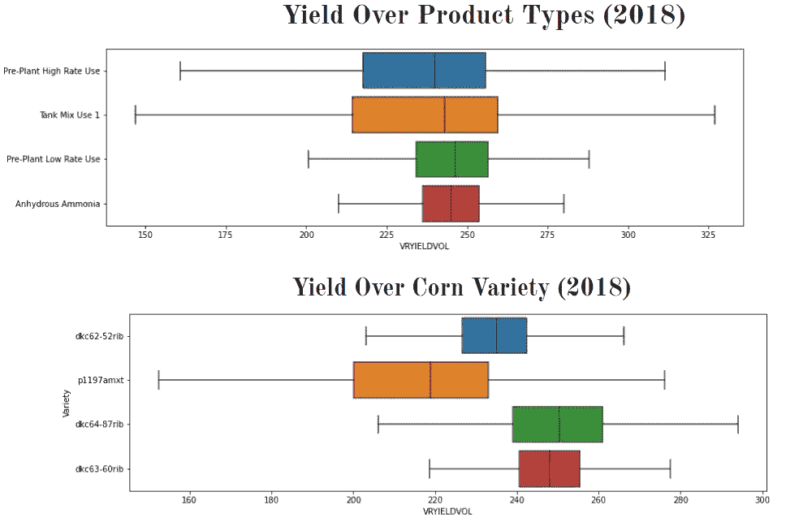
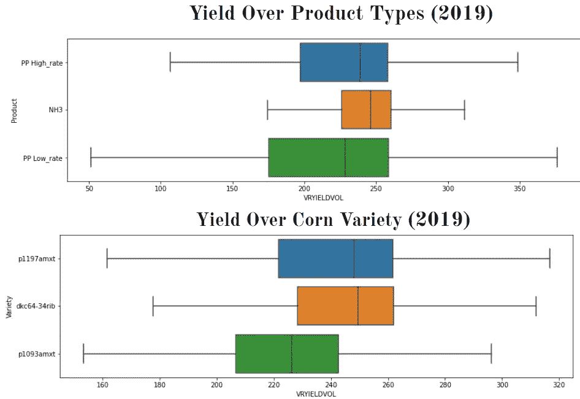
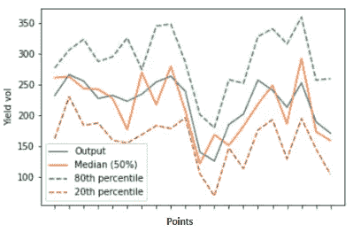

# 农学优化与农业可持续性

> 原文：<https://towardsdatascience.com/agronomics-optimization-and-sustainability-in-agriculture-c147bbf67792?source=collection_archive---------28----------------------->

## [变更数据](https://towardsdatascience.com/tagged/data-for-change)

## 分析 1800 万点数据以获得最佳农业实践

(图片由[丹·迈耶斯](https://unsplash.com/@dmey503)拍摄)

为什么农学优化在农业中很重要？每年有 900 万人死于饥饿，相当于每天 25000 人。这一惊人的统计数据不仅揭示了粮食分配平等的必要性，还揭示了农业中更可持续做法的必要性。

从小农场到大公司，最大限度地利用土地和资源变得越来越重要。由于农学和数据收集，我们开始更多地了解农业实践如何创造更美好的未来。我们如何利用肥料使用、地理数据、土壤数据和产量等数据来更好地了解最佳实践？如果农民可以通过数据分析了解更多关于他的特定地块的信息，那么数据驱动的最佳实践就可以应用于传统农业技术。

# **约翰迪尔数据集**

*该数据集来自 John Deere Challenge，是*[*Hackdays Rhein-neck ar 2021*](https://www.hack-days.de/rhein-neckar-2021)*黑客马拉松的一部分。我的天才黑客马拉松团队包括团队成员:* [*卡洛琳·佩雷拉*](https://www.linkedin.com/in/caropereira/)*[*安德鲁·费斯勒*](https://www.linkedin.com/in/andrewfessler/) *和* [*伊莱斯坎·卡雷什*](https://www.linkedin.com/in/ileskhan-k-780aa2b2/) *。**

*John Deere 的广泛数据集包含 1800 万个数据点，跨越十年的数据收集。在这个数据集中，我们发现了伊利诺伊州俄勒冈州一块土地 10 年来一年中三个部分的相关数据。我们最初关注的是 2019 赛季的最新数据。这包括 4 月份进行的最初的*播种*，4 月和 6 月进行的*产品(肥料)施用*，以及 10 月份进行的*收获*。*

*该数据集中包含的变量如下:*

*作物品种、湿重、湿度、日期和时间、海拔、机器、距离、宽度、截面 ID 和产量。*

**

*(图片由作者提供)*

*在上面的地图中，我们使用 GeoPandas python 包绘制出了这块特定田地播种、应用和收获的位置。播种和施肥是在田地的同一区域进行的，而收获只在田地的一部分进行。数据没有揭示为什么部分田地没有收割。这是从分析中得出的第一个结论，不是所有的农业数据都可以用数据本身来解释。在这种情况下，有一些外部因素(无论是数据没有收集到，还是某个特定的领域出现了问题)，只有农民能够提供帮助。*

**

*(图片由作者提供)*

*上图以四分位数显示了产量在田地上的位置。例如，在第一张图中，我们看到最低的四分位数。相对于第三和第四个四分位数，似乎更集中在油田的北部，而第三和第四个四分位数往往更集中在油田的南部。我们可以开始假设这是否与田地不同部分的土壤类型或其他条件有关。*

**

*(图片由作者提供)*

*上图显示了 2019 年申请期间产品的分布位置。第一张地图用红色显示了高使用率，红色喷洒在田地边缘。第二张地图用黄色显示的是低使用率，除了边界，到处都有喷洒。第三张地图显示了氨的施用位置。与之前的地图相比，这很有趣，因为我们可以开始思考肥料是否喷洒以及喷洒的位置，以及与产量的相关性。氮肥是数据集中使用的产品。它们被从气体压缩成液体。它们与土壤中的水反应，然后变成铵的形式。*

# ***天气数据***

*天气数据有助于理解作物在一个季节的表现。下面的第一张图是 2019 年季节与当年天气的关系。这些数据对农民来说非常有用，可以帮助他们预测一年中播种和收获的时间。在这个特殊的季节，我们看到雨季紧随四月的第一次播种，这对农作物非常有利。我们还看到，一场霜冻中断了收成，这可能影响了当年的收成。*

*第二张图显示了覆盖了所有 10 年收集数据的数据点的天气数据。播种和收获的时间一般不在该地区的霜雪期。*

**

*(图片由[安德鲁·费斯勒](https://www.linkedin.com/in/andrewfessler/)提供)*

# ***土壤数据***

*通过使用美国 Agriculture⁴部的数据，我们能够确定田地的哪些区域由哪些特定的土壤组成。土壤是作物正常生长的主要成分。土壤类型决定了水分和养分流入作物内部和周围的速度。在这种情况下，各种各样的粉质壤土可能会随着时间的推移对养分的浓度以及由于径流等造成的土地形状产生影响..事实上，我们看到在某些区域存在细微的差异，尤其是坡度较高的区域。*

**

*(图片由安德鲁·费斯勒拍摄)*

# *绘制数据点*

*我们开始思考我们可以从数据中学到的具体问题:*

*播种面积有多大？*

*每年种植的种子总量是多少？*

*每英亩种了什么种子？*

*以英亩计的收获面积是多少？*

*每年的总收获量是多少？*

*以磅为单位的收获量是多少？*

*有了这些数字和图表信息，农民可以快速查看数据，开始了解他的耕作技术的发展趋势。*

**

*(图片由[卡洛琳·佩雷拉](https://www.linkedin.com/in/caropereira/)提供)*

*某一年的天气有问题吗？有植物疾病吗？某个应用产品表现不好吗？数据只是没有被记录下来吗？*

*农民可以考虑影响他特定田地的所有因素，并通过考虑这些因素开始预测未来几年的产量。*

# ***概率预测***

**

*(图片由 [Ileskhan Kalysh](https://www.linkedin.com/in/ileskhan-k-780aa2b2/) 提供)*

*这些箱线图分别显示了施用产品类型和播种玉米品种的产量分布。这有助于了解哪种产品类型或玉米品种的产量更高。从第一个箱线图中，我们可以看到，平均而言，NH3 比 PP 高速率和 PP 低速率类型的产量更高。*

**

*(图片由 [Ileskhan Kalysh](https://www.linkedin.com/in/ileskhan-k-780aa2b2/) 提供)*

**

*(图片由 [Ileskhan Kalysh](https://www.linkedin.com/in/ileskhan-k-780aa2b2/) 提供)*

*我们建议用概率预测代替确定性预测，因为它给出了预测不确定性的信息。在农业中，困难的问题是控制不可预测的事物。我们得到的概率范围内的输出以点为单位，这样农民可以更好地计划他的操作。*

# ***结论和前进方向***

*通过使用易读的图表和图形分析数据，小农场将能够得出结论，在未来的季节中解决哪些问题以获得更高的产量。正如我之前提到的，我们最初专注于 2019 赛季，然后将我们的发现应用到其他年份。向前迈进的一种可能性是，更仔细地研究收成远低于播种的特定问题年份。由于这些数据并不能说明其中一些场景的全部情况，因此采访农场管理层以了解这些季节是否存在内部问题以及检查特别干旱季节的天气数据可能会有所帮助。*

***参考文献***

*硫酸铵和尿素用作水稻肥料的比较研究。*肥料研究* **10、**119–133(1986)。[https://doi.org/10.1007/BF01074367](https://doi.org/10.1007/BF01074367)*

*凯尔西·乔达尔、乔里斯·范登博舍、马丁·弗莱施曼、雅各布·乏色曼、詹姆斯·麦克布莱德、杰弗里·杰拉德……弗朗索瓦·勒布朗。(2020 年 7 月 15 日)。geo pandas/geo pandas:v 0 . 8 . 1(v 0 . 8 . 1 版)。芝诺多。[*http://doi.org/10.5281/zenodo.3946761*](http://doi.org/10.5281/zenodo.3946761)*

**民族，团结。每天饿死 2.5 万。联合国，*[*https://www . un . org/en/chronicle/article/losing-25000-hunger-every-day。*](https://www.un.org/en/chronicle/article/losing-25000-hunger-every-day.) *访问于 2021 年 3 月 4 日。**

**网络土壤调查—首页*。[https://websoilsurvey.sc.egov.usda.gov/App/HomePage.htm.](https://websoilsurvey.sc.egov.usda.gov/App/HomePage.htm.)*2021 年 3 月 4 日访问*。*