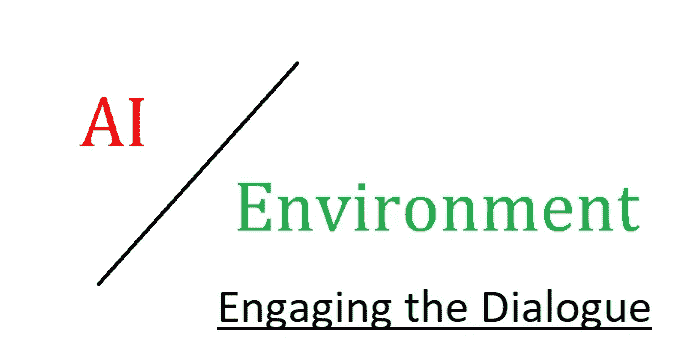

# 人工智能与环境 II:参与对话

> 原文：<https://towardsdatascience.com/ai-and-the-environment-ii-engaging-the-dialogue-e0460f3ad6d9?source=collection_archive---------29----------------------->

## 令人惊讶的是，关于人工智能可持续性的对话非常缺乏。在这篇文章中，我将告诉你加入对话需要知道什么。

作者图片

# 介绍

这是我关于人工智能和环境系列的第二篇文章。在本帖中，我将重点关注现有的解决方案，以及如何有效地表达这些方案以加入对话。我希望这将有助于提高对这一问题的认识，并让更多的公众参与辩论。

如果你还没有阅读第一篇文章，我建议你浏览一下这里的介绍，以了解人工智能给环境带来的问题的一些基本背景。

这篇文章确实涉及了一些技术概念，但我是根据对公众至关重要的关键点来介绍它们的——它们如何与环境相关，进而与公众福祉相关。

以下是关键要点:

*   减少人工智能创造期间和之后所需的能量
*   重用小的、经过修剪的人工智能，而不是原来的人工智能
*   回收好的人工智能，更有效地创造其他人工智能
*   与人工智能相关的公共对话和政策应该考虑这些选项——将人工智能描绘成“好”或“坏”(或者单独的“红”和“绿”是没有用的

# 看人工智能创造

人工智能的各个方面使其具有可持续性(或不可持续性)。这主要来自两点:人工智能占用了多少能量，以及这些能量来自哪里。

上一篇文章，我提到所有的人工智能最终归结为数学。“更大”的人工智能需要更多的数学，要么是因为它们使用更复杂的方法来理解数据，要么是因为它们对更大的数据集进行数学运算。每一个数学运算都需要电力，这使得这些人工智能更加耗电。

然而，即使是耗电的人工智能也可能相对“绿色”。大多数大型人工智能都是在数据中心创建的。数据中心是仓库般的建筑，储存着数以千计的电脑。这些数据中心基本上支撑着整个互联网——谷歌、推特、微软等的所有数据。储存在其中。然而，许多数据中心包含旨在快速创建人工智能的计算机——即，它们专注于使用数据而不是存储数据。

所有数据中心都需要大量电力——通常比城市还要多。这种能量不仅来自计算机的运行，也来自计算机的冷却(如果没有适当的冷却，计算机会过热并出现故障)。Jones 在[1]中对这个主题做了一个很好且容易理解的介绍。

事情是这样的:数据中心在获取能源的方式上并不平等:一些数据中心从肮脏的来源获取能源(如煤、石油和天然气)，而许多其他数据中心则部分由太阳能或风能等可再生能源提供能源[2]。这意味着，同一个人工智能在两个不同的领域运行，将对环境产生截然不同的影响。

此外，一些数据中心的冷却效率更高，这意味着它们的总体能耗更低[1]。这些数据中心也比它们的替代品更环保。

# “修剪”创造的人工智能

许多人工智能基于一种受大脑启发的名为“神经网络”的技术。在这些神经网络中，数学是在不同的单元中完成的，通过类比称为“神经元”(仍然只是大量的数学)。

然而，神经网络有一个有趣的特性:虽然它们需要非常大才能创建——在某些情况下有数百万或数十亿个神经元——但一旦创建，你可以在不损失有效性的情况下让它们变得更小[3]。

这个使它们变小的过程叫做“修剪”。它包括切除对人工智能没有贡献的神经元。事实上，这甚至可以导致人工智能具有更好的整体效率，即使当大约 90%的原始神经元被移除时[3]。

这最棒的部分是什么？你猜对了——数学少！这意味着更少的电力。

事情是这样的:大多数人工智能将被创建一次，并被多次使用。虽然修剪不会减少创建人工智能所需的能量(实际上增加了)，但每次使用人工智能时都会节省大量能量。

例如，你可以创建一个人工智能来确定一张给定的人的皮肤照片中是否存在癌症。自然，你会希望这是准确的——所以你用大量的能量来创造它。那只会发生一次。但当人工智能应用于临床时，它会被使用成千上万次。随着时间的推移，尽可能提高这一步骤的效率意味着使用更少的能源。由于修剪，人工智能仍然一样准确，甚至更准确。

# 教一个老人工智能新把戏

你可能无法教会一只老狗新把戏——但你可以教会一只老人工智能！这涉及的领域被称为“预训练”或“迁移学习”。他们背后的想法是创造一个非常强大的人工智能(可能有一吨的能量)，然后重新训练它完成不同的任务(例如，见[4])。

这是怎么回事？这相当简单。大多数人工智能学习很多有助于他们决策的基础知识。例如，一个被训练来区分猫和狗的人工智能可能会学习寻找面部和身体的不同轮廓，并看不同的颜色。

许多其他动物也会在这些方面有所不同。只要给人工智能一些大象的例子，它就可以学会识别大象。这个过程更快——因为它使用了人工智能已经拥有的知识，创造这个新的人工智能需要更少的数学——因此也更少的能量

就像修剪一样，这是一种让一个非常强大，耗能的人工智能一次，然后利用这个人工智能让许多未来的任务更加节能的方法。你猜怎么着？这也可以比从头开始创造一个新的人工智能带来更高的性能[4]！

# 重访红色 AI

在我的上一篇帖子中，我提到了所谓的“红色人工智能”——基于大数据和计算能力的极度消耗资源的人工智能[5]。

我现在试图用一个问题来补充这个定义的细微差别:哪一个人工智能更“红”:花了大量能量创造的人工智能，但可以用很少的能量来使用？或者是那种制造成本低廉，但在使用过程中消耗相对较多能源的能源？

像其他事情一样，这是一种平衡。“红色”和“绿色”是很好的标签——但是讨论它们必须从全局的角度出发。

最终，给人工智能贴上“绿色”或“红色”的标签可能是有用的——但在某一点上，它会失去价值。存在许多这些术语无法捕捉的细微差别。

# 我为什么在乎？

读完以上内容后，我可以想象你可能会问“我在乎什么？我不打算创造一个人工智能。”

这样做的目的是让可持续发展成为对话的一部分，并让公众讨论和辩论其中的要点。人工智能不应该是一个“黑匣子”——人们应该知道它是如何工作的。

人工智能彻底改变了我们的生活。我们现在所做的一切——从在电脑上写字、拼写和语法检查，到与 Siri / Alexa /谷歌对话，我们都在与人工智能互动。所有这些人工智能都需要能量来创造。

人工智能无处不在。但气候危机也是如此。如果我们希望能够可持续地使用现代技术，我们需要专注于使用更少能源的技术。人们对此了解得越多，谈论得越多，他们就越能推动政府制定明智的政策。这不是要阻止人工智能，而是要学习我们如何负责任地创造和使用它。

因此，当你听到有人在使用人工智能时，记得参与到对话中来——并将可持续发展带入对话中。

# 结论

让人工智能可持续发展需要我们思考人工智能是如何以及在哪里被创造出来的。像其他事情一样，这可以归结为一句格言“减少，再利用，回收”。以下是关键要点:

*   减少人工智能创造期间和之后所需的能量
*   **重用**小的、被删减的人工智能，而不是原来的人工智能
*   **回收**好的人工智能，更有效地创造其他人工智能
*   与人工智能相关的公共对话和政策应该考虑这些选项——将人工智能描绘成“好”或“坏”(或者单独的“红”和“绿”是没有用的

# 参考

1.  如何阻止数据中心吞噬世界电力？大自然。2018 年 9 月；561(7722):163–166.PMID: 30209383。
2.  拉科斯特，亚历山大&卢乔尼，亚历山德拉&施密特，维克多&丹德斯，托马斯。(2019).量化机器学习的碳排放。
3.  弗兰克，乔纳森&卡宾，迈克尔。(2018).彩票假设:训练修剪神经网络。
4.  胡振中，董，杨，王，常，王广伟，孙，杨(2020)。GPT-GNN:图形神经网络的生成预训练。在 *KDD* 。
5.  《绿色人工智能》。*ACM 的通信*63.12(2020):54–63。