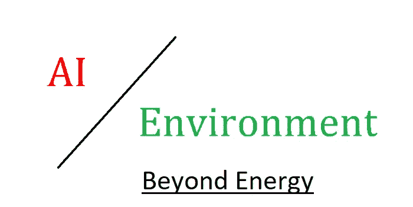

# 人工智能与环境 3:超越能源

> 原文：<https://towardsdatascience.com/ai-and-the-environment-iii-beyond-energy-51466855e04c?source=collection_archive---------26----------------------->

## 人工智能的可持续发展不仅仅关乎能源。它还涉及稀土元素提取、人类劳动、污染和水资源保护。

作者图片

# 介绍

这是我关于人工智能和环境系列的第三篇文章。在这篇文章中，我将简要概述人工智能对环境的所有其他影响——从稀土元素提取和人类劳动到水资源保护和污染。

如果你没有阅读前两篇文章，那也没关系！然而，我确实建议浏览一下他们的介绍(这里[这里](https://medium.com/@jeffrey.sardina/ai-and-the-environment-the-problem-fa61c8bc5131)和[这里](https://medium.com/@jeffrey.sardina/ai-and-the-environment-ii-engaging-the-dialogue-e0460f3ad6d9)，以获得人工智能是什么以及它如何影响全球能源使用和碳排放的概述。

这篇文章采用了一个新的视角:超越能源，人工智能(和一般的计算)对我们生活的世界意味着什么？这里有大量的因素，所以我将概述其中最重要的因素，并留下一些参考资料供进一步阅读。关键要点是:

*   制造人工智能运行的计算机需要稀土元素，提取和提炼稀土元素需要巨大的环境和人力成本
*   人工智能数据来源于公众和公共数据集，往往在人们不知情的情况下。
*   人工智能通常是私有的，而不是公共的，这限制了绿色人工智能的重用和再应用
*   制造人工智能的数据中心需要大量的水和能源来冷却

# 稀土元素

有 17 种元素被称为“稀土元素”[1]。这个术语有点用词不当:它不是指元素有多稀有，而是指它们有多难获得[1]。然而，重要的是，这些元素都有三个共同点

*   他们非常需要建造计算机和其他技术，包括人工智能[1]
*   他们有巨大的环境成本来提取和提炼[1]

开采稀土元素时提取的 99.8%的地球被丢弃并倾倒在陆地上的河流中，实际上只有 0.2%含有所需的元素[1]。除此之外，中国稀土学会发现提炼一吨稀土元素会产生一吨放射性废物和 75000 升酸性水[1]。

与稀土和其他元素的担忧交织在一起的是所有参与提取这些元素的人——这一过程通常是危险的。例如，从刚果工夫茶中提取钴的工人面临着可怕的工资——相当于每天大约 1 美元，或大约 0.90€[4]。与此同时，他们不得不在危及生命和健康的条件下工作。在许多其他开采领域的研究也大致描绘了同样的开采图景[1]。

除了稀土元素之外，看看所有其他需要的部件——比如塑料和玻璃——制造一台计算机从提取原材料到在工厂组装的整个过程需要将元素运输数百万公里[1]。当然，运输不是免费的——据估计，运输造成了 3.1%的全球碳排放[1]。这种运输通常使用低级燃料，同时也排放许多其他有毒物质，如硫磺[3]。据估计，这些排放每年导致约 30，000 人死亡[3]。

# 隐藏的人类劳动:数据经济

除了直接参与制造计算机的人工劳动之外，还有一个巨大的隐藏的人工劳动层:我们每一个阅读这篇博客的人都是谷歌、亚马逊、微软、苹果以及其他许多公司的劳动者。

与亚马逊的 Alexa(或任何其他类似设备)的每次交互都被记录为数据。你又问了同样的问题吗？如果是这样，那么 Alexa 可以推断你不喜欢它的回答。在提出问题/发出命令后，是否采取了任何行动？如果是这样，Alexa 认为它做得很好。诸如此类[1]。

但不止如此，Alexa 和相关设备总是会监听。他们使用录音来提高幕后的语音识别。这些数据来自我们身边的每一个人。

类似地，还记得那些你必须完成才能登录网站的“验证码”吗？那些写着“我不是机器人”的，或者要求你选择所有包含自行车的图片的？每一个都在收集你的数据，并用它来训练人工智能更好地进行图像识别——或任何其他任务[1]。

事情是这样的:这些数据来自公众。但是开发出来的工具都被私有化了，公众无权看到它们是如何制造的，或者它们是用来做什么的。

作为一个案例研究，请考虑 DeepMind Technologies 和皇家自由医院。DeepMind 获得了医院的公共数据，并使用它创建了一个私人工具[1]。然而，该工具当时是私有的，不向其他公立医院开放[1]。

> 人工智能是将公共数据的应用和使用私有化的一种方式。这也会对环境产生影响。

当结果保密时，这意味着基于公共数据(潜在的有价值的健康数据)的工具只保留给那些有权访问的人。但是，如果这些工具是用来帮助减少排放和执行更智能的电网规划的许多人工智能中的一部分(如[5])，这意味着帮助环境的工具也是类似隐藏的(尽管公平地说，这些数据中的大部分可能是私人的，而不是公共的)。

但这并没有结束。隐藏在所有这些背后的是数据提取的另一个领域:所谓的“点击工人”工厂[1]。这些“数字工厂”涉及大量受雇为人工智能标记数据的人——例如，判断一张照片是否包括自行车。亚马逊机械土耳其人经常这样做，这是一个允许人们登录来做这项工作的程序[1]。

这允许产生巨大的数据集来训练人工智能。巨大的数据输入到巨大的人工智能中，需要大量的能量。但是，如果结果是私有的，没有人能从它受益，除非他们自己重做所有这些工作。从数据收集到 AI 创作，中间涉及的所有精力，都要重新做一遍。

# 水利

回头看看数据中心(计算机仓库，除其他外，可以创建人工智能)，我们看到了几件事。

从一个方面来说，每个数据中心的每一台计算机、处理器和电缆都利用了稀土元素提取、运输原材料、组装、人工劳动和数据经济的庞大网络[1]。每一部手机、笔记本电脑、电脑、游戏机都是如此——只要是你能想到的。

但是一旦这些完成，数据中心建成，还有两个主要问题:能源和水。我已经在这里详细介绍过能源，所以在这一节我打算把重点放在水上。

由于人工智能是在数据中心创建的，计算机会产生热量——就像你一样，你的笔记本电脑或手机在长时间开着后会变热。为了冷却它们，必须使用大量的水。事实上，仅在美国，据估计 2014 年数据中心就使用了 1000 亿升水[5]。

如果这种冷却是通过喷雾或使用冷水来完成的，那么除了运行数据中心计算机所需的能量之外，还会涉及到大量的能量[5]。但是，即使有了最近的温水冷却，仍然有很大的水成本——即使所需的能量大大减少了[5]。

虽然在一些水资源丰富的地区，这可能不是一个问题，但在许多面临干旱的地区，或者在沙漠中，这需要考虑适当的保护。

# 结论

人工智能和环境产生的问题远远超出了能源使用:它是劳动力，它是采矿和提炼，隐藏的数据经济，污染和水资源保护。

这并不是说人工智能是“邪恶的”——甚至红色的人工智能也不一定是坏的。人工智能可以做许多伟大的事情——提高能源网格效率，检测癌症，以及创造治疗疾病的新药等许多其他应用。但是，这些好处应该总是与另一方的严肃讨论一起进入对话——人工智能来自哪里，谁的劳动创造了它，谁从中受益。在我的下一篇文章中，我将更详细地探讨红色(和绿色)人工智能的复杂性。

如果你觉得这篇文章很有趣，并且想知道更多，我强烈推荐阅读[人工智能系统的剖析](https://anatomyof.ai/) [1]和[如何阻止数据中心吞噬世界电力](https://www.nature.com/articles/d41586-018-06610-y)[5】——这两本书都很容易阅读，并且来源丰富。

目前，这篇文章的要点是:

*   制造人工智能运行的计算机需要稀土元素，提取和提炼稀土元素需要巨大的环境和人力成本
*   AI 数据来源于公众和 rom 公共数据集，往往在人们不知情的情况下。
*   人工智能通常是私有的，而不是公共的，这限制了绿色人工智能的重用和再应用
*   制造人工智能的数据中心需要大量的水和能源来冷却

# 参考

1.  Kate Crawford 和 Vladan Joler，“解剖一个 AI 系统:作为人类劳动力、数据和行星资源解剖图的亚马逊回声”，*AI Now Institute and Share Lab*，(2018 年 9 月 7 日) [https://anatomyof.ai](https://anatomyof.ai/)
2.  Zoë Schlanger，“如果航运是一个国家，它将是第六大温室气体排放国”， *Quartz* ，2018 年 4 月 17 日。
3.  约翰·维达尔，“航运污染的健康风险被‘低估’，”卫报，2009 年 4 月 9 日，sec。环境，[http://www . the guardian . com/environment/2009/apr/09/shipping-pollution](http://www.theguardian.com/environment/2009/apr/09/shipping-pollution)。
4.  “这就是我们为之而死的原因:刚果民主共和国的人权侵犯推动了全球钴贸易”(大赦国际，2016 年)，[https://www.amnesty.org/en/documents/afr62/3183/2016/en/](https://www.amnesty.org/en/documents/afr62/3183/2016/en/)
5.  尼古拉·琼斯，“如何阻止数据中心吞噬世界电力”，*自然*，2018 年 9 月 12 日。