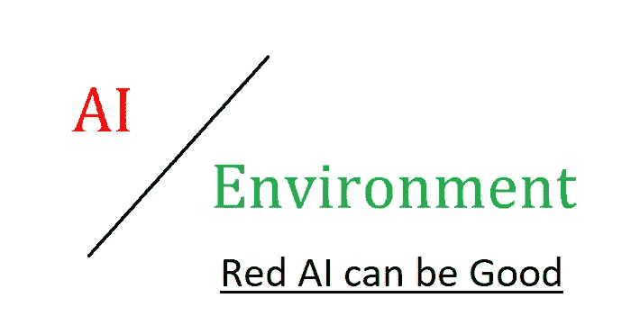

# 人工智能与环境四:红色人工智能可以是好的

> 原文：<https://towardsdatascience.com/ai-and-the-environment-iv-red-ai-can-be-good-a90283d13c3e?source=collection_archive---------23----------------------->

## 红色人工智能——具有巨大能量成本的人工智能——可以导致最终减少排放的发现和产品。这里有一些案例，尽管有危险，红色人工智能还是有价值的。

作者图片

# 介绍

这是我的“人工智能与环境”系列的第四篇也是最后一篇文章。如果你没有读过前三本书，那也没关系。然而，请随意浏览他们的介绍[这里](https://medium.com/@jeffrey.sardina/ai-and-the-environment-the-problem-fa61c8bc5131)、这里[这里](https://medium.com/@jeffrey.sardina/ai-and-the-environment-ii-engaging-the-dialogue-e0460f3ad6d9)和这里[这里](https://medium.com/@jeffrey.sardina/ai-and-the-environment-iii-beyond-energy-51466855e04c)——这不会花费超过一分钟的时间，并且为本文提供了一些很好的背景。

在这个系列之后，我将开始一个新的——我仍然在决定一个主题，所以请继续关注！

在这篇文章中，我将看看“红色人工智能”(需要大量能量运行的人工智能)有益的时候。在某些情况下，红色人工智能的好处不仅在于人工智能性能本身，还在于环境。关键要点是:

*   红色人工智能可以导致能源使用的整体减少，尽管它需要大量的能源来创造
*   健康和气候科学的红色人工智能通常是合理的，因为它对人类和生态系统生命的好处可以超过它的创造成本
*   红色人工智能本身有时有价值，因为它有助于为上述用途创建更好的人工智能。然而，这是危险的，应该非常小心谨慎地去做。
*   合法使用红色 AI 不是环保不负责任的借口。当使用红色人工智能时，研究人员将能源成本降至最低更为重要。

# 气候科学与响应的红色人工智能

红色人工智能可以通过两个主要途径对气候产生非常积极的影响:提高我们对气候变化如何发展的理解，以及智能地应对气候变化。

人工智能已经被用于预测全球温度变化，模拟风暴，海洋事件，云的变化和极端天气事件[5]。它还成功地预测了这些变化的结果，如缺水、野火、雨水破坏以及气候灾害导致的被迫人口迁移[5]。在更局部的层面上，它可以有效地应用于能源管理[3，5]和城市能源网[5]——节能减排。

有趣的是，微软在 2018 年的一份报告中估计，使用人工智能来理解和应对气候变化云，到 2030 年，排放量将减少 1.5%至 4.4%，同时全球 GDP 将增加 3.1%至 4.4%[6]。

然而，这种变化所需的许多人工智能模型将需要大量的前期能源和排放成本。例如，让我们看看数据中心。

数据中心是耗电大户。本质上，它们是成百上千的工业计算机堆在一个仓库里。不仅运行计算机需要电力，冷却计算机和执行其他辅助任务也需要电力。事实上，冷却是大多数数据中心最昂贵的辅助任务[1]。

谷歌和 DeepMind 发现，通过使用人工智能来管理数据中心的内部冷却系统，他们将冷却成本降低了 40%，并达到了创纪录的能效值[3]。

然而，这背后的人工智能必须考虑许多因素，并需要数百万个数据点进行训练[2]。它依赖于大量不同的神经网络一起工作——称为“集合”设置[3]。虽然这种设置可能非常强大，但它们通常比更小的非集合方法耗费更多的能量。

虽然涉及的人工智能的具体细节还没有公布(据我所知)，但它肯定会属于红色人工智能的范畴。尽管它的制造成本很高，但它能够削减 40%的冷却成本，并创下创纪录的效率，这说明它的好处远远大于坏处。既然它已经被创造出来，它可以被应用于许多不同的数据中心——并且可能在那里产生类似的强大结果。

归根结底，这是成本效益分析。红色 AI 有很大的前期成本，但有时它可以带来巨大的后期收益。通常，这些好处是值得的。

# 健康的红色人工智能

当 AI 对生活有直接影响时，重要的是 AI 尽可能少出错。人工智能在医学上不乏应用。例如，人工智能模型已经被创建来预测两种药物是否可以在人类中安全地结合，或者当结合时它们是否可能造成伤害[7]。

这种系统可以用来帮助指导研究人员探索在治疗疾病时应该结合哪些药物。当然，如果研究人员依赖这样的系统作为指导，而这是错误的，那么他们将浪费宝贵的时间——这可能对患者产生真正的影响。如果人工智能被用于这个领域，它绝对必须是可靠的。

我在以前的帖子中提到过，红色 AI 的特点是收益递减[4]。使用越来越多的高能耗人工智能和更多的数据变得越来越没有好处[4]。然而，这并不意味着它没有好处——如果人工智能被用于数百万个病例或帮助数百万名患者，那么即使准确度有 0.1%的变化也可能产生巨大影响。如果这种改善有可能对生活产生积极的影响，那么就必须加以考虑。

从长远来看，红色 AI 造成的污染和排放显然对人类非常有害，对整个世界也是如此。然而，这必须与当前改善(甚至拯救)生活相平衡。

回到预测药物组合的示例:想象系统高度可靠。这意味着使用它的研究人员将需要更少的时间来确定哪些药物可以安全地联合使用来治疗给定的疾病。治疗可以更快发展，结果是更多的人帮忙。

将红色人工智能应用于健康需要正确平衡现在和未来——强调其中一个而排斥另一个弊大于利。

# 为了红色人工智能，红色人工智能

在他们提倡绿色人工智能的论点中，Schwartz 等人认为红色人工智能确实有一席之地[4]。他们给它的地方是所谓的“纯研究”——为了研究本身而研究。毕竟，正是红色人工智能极大地改善了我们理解和使用人工智能的方式[4]。如果没有红色人工智能过去的那些用途和那些改进，使用人工智能来帮助处理气候变化、气候预测和健康是不可能的。

因此，假设每一个与气候或健康没有直接关系的红色禽流感病例都是坏的，可能会排除有益的类似进展。

当然，这是一条非常危险的路线。这并不意味着，也不应该意味着所有的红色人工智能都是好的。事实上，我认为大多数红色人工智能都不好。但这是可能的，哪些红色认可是好的，哪些不是，不能总是提前知道。

作为使用红色人工智能的最后一点，我必须强调一点:

> 红色人工智能——即使它的使用是合法的——也绝不是对环境不负责任的借口。

事实上，当研究人员使用红色人工智能时，他们需要更加专注于尽可能减少能源使用。他们还必须致力于共享他们的人工智能模式，这样其他人就可以重用它们——这从长远来看可以节省大量能源。

红色人工智能不是不负责任的人工智能——它只是一种人工智能，在这种智能中，造物者预先接受了需要大量的能量来朝着最终更大的善而努力。如果还不清楚对环境或人类生活的更大好处正在努力实现，那么就不应该使用红色人工智能。

> 这一切都需要成为对话的一部分——从公共讨论到政策辩论和研究方法，必须考虑环境影响。每次使用红色人工智能都必须有明确的理由。

# 结论

画一条很难的“好/坏”线很少有用。红色人工智能也是如此——它是一种工具，有很好的用途。研究人员、政策制定者和公众有责任将对话集中在人工智能的影响上——不管是好是坏——并沿着最有益、最无害的道路前进。红色人工智能和绿色人工智能一样适合这种情况。

这篇文章的主要收获是:

*   红色人工智能可以导致能源使用的整体减少，即使它需要大量的能源来创造
*   红色人工智能对于健康和气候科学来说通常是合理的，因为它对人类和生态系统生命的益处可能超过它的创建成本
*   红色人工智能本身有时有价值，因为它有助于为上述用途创建更好的人工智能。然而，这是危险的，应该非常小心谨慎地去做。
*   合法使用红色 AI 不是环保不负责任的借口。当使用红色人工智能时，研究人员将能源成本降至最低更为重要。

# 参考

1.  如何阻止数据中心吞噬世界电力？大自然。2018 年 9 月；561(7722):163–166.PMID: 30209383。
2.  [自主数据中心冷却和工业控制的安全第一人工智能| DeepMind](https://deepmind.com/blog/article/safety-first-ai-autonomous-data-centre-cooling-and-industrial-control)
3.  [DeepMind AI 将谷歌数据中心冷却费用降低 40% | DeepMind](https://deepmind.com/blog/article/deepmind-ai-reduces-google-data-centre-cooling-bill-40)
4.  《绿色人工智能》。*美国计算机学会通讯*63.12(2020):54–63。
5.  j .考尔斯，a .察马多斯，轩辕洛尹，M. *等*人工智能的策略:利用人工智能对抗气候变化——机遇、挑战和建议。 *AI & Soc* (2021)。[https://doi.org/10.1007/s00146-021-01294-x](https://doi.org/10.1007/s00146-021-01294-x)
6.  [人工智能如何实现可持续发展的未来(microsoft.com)](https://news.microsoft.com/wp-content/uploads/prod/sites/53/2019/04/PwC-Executive-Summary.pdf)
7.  卡里姆，医学博士&科切兹，迈克尔&查韦斯，若昂博斯科贾雷斯&乌丁，马姆塔兹&贝扬，奥亚&德克尔，斯特凡。(2019).基于知识图嵌入和卷积 LSTM 网络的药物相互作用预测。113–123.10.1145/3307339.3342161.