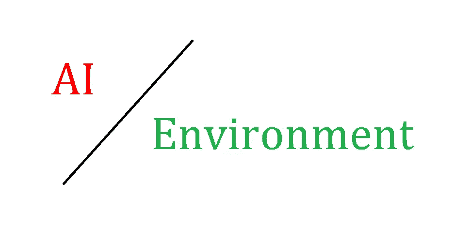
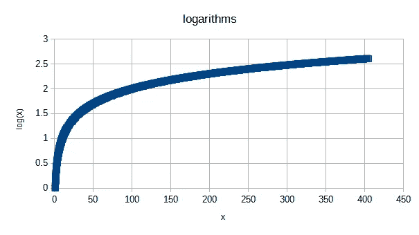

# 人工智能与环境:问题

> 原文：<https://towardsdatascience.com/ai-and-the-environment-the-problem-fa61c8bc5131?source=collection_archive---------32----------------------->

## 人工智能在许多方面都与环境有关——无论是好是坏

作者图片

# 介绍

> 关于我开始的新系列博客，以及这篇文章的内容，我做了一些说明。

这是我将围绕人工智能、大数据、生物信息学和环境的交叉点发表的一系列博客中的第一篇。为什么是这些？两个原因。首先，也是最简单的，这四个要素是我在都柏林三一学院博士工作的中心——在接下来的四年里，我将非常深入地钻研它们。

第二:这些话题虽然在现代世界至关重要，但通常有很高的准入门槛。这种科学，即使是普通大众也能获得(情况并非总是如此；我们世界上许多最好的科学工作都藏在付费墙后面)是写给专业读者而不是普通读者的。

这篇文章将涵盖人工智能和环境的一个方面，重点是存在的问题。后面的帖子将会探讨这个问题的解决方案(有很多令人兴奋的)，以及为什么即使非常耗电的人工智能也可以为环境创造奇迹。以下是关键要点:

*   复杂的人工智能需要大量的电力、计算机硬件和时间来创造
*   制造更复杂的人工智能会产生递减的回报
*   大多数人工智能目前只关注结果，而不是环境影响

# 一些背景

> 人工智能基于大量的数学，让计算机做这些数学运算需要大量的时间和电力。

AI，或人工智能，是一套方法，教计算机如何推理，智能地行动，或从数据中学习做一些工作。

人工智能的“好”和“有效”可以用许多方法来衡量；这些细节超出了本文的范围。现在，你可以认为每一个人工智能都有工作要做，它的“效率”就是它工作的好坏。

至于它是如何工作的:这一切都归结于数学。人工智能的构建模块是数学运算——细节不在本文讨论范围之内，人工智能最基本的部分(如果你愿意，可以称之为“原子”)是乘法、除法、加法和减法。

运行人工智能所需的工作量通常以所谓的“GPU-小时”来衡量——这些基本上是“人-小时”，但对于计算机来说。GPU(或图形处理单元)是计算机的一部分，能够以令人难以置信的速度执行数学，使人工智能成为可能。

事情是这样的:每个数学运算都需要电。就个人而言，他们几乎一无所获。但大多数最优秀的现代人工智能都是在如此庞大的运算量上运行的，这加起来会产生巨大的影响。

例如:一些最好的模型(如“RoBERTa28”)可以达到 25，000 GPU 小时的数量级[1]。这大约是 2.85 GPU 年——这意味着它相当于以高功率运行一台顶级计算机近 3 年，而从未关闭它。

但这还不是全部。采购计算机零件(需要黄金等稀土金属)是一项昂贵的任务。这些零件必须经过提炼、运输、组装、测试，然后运送给用户。然后，计算机必须以高电力运行来创造人工智能。即使一个人工智能被创造出来，一些人工智能需要如此强大的计算能力来使用，以至于除了人类所能提供的最好的计算机硬件之外，它们实际上不能被用在任何东西上。

另一个例子是:被训练来下围棋的“AlphaGo”人工智能(在这项任务上远远超过人类)的繁殖成本估计为 35，000，000 美元——这是迄今为止最昂贵的模型之一[1]。

# “红色”艾

> 红色人工智能是只关注结果的人工智能，而不是消耗的资源。

施瓦茨在阿尔。将“红色人工智能”定义为只关注结果的人工智能——人工智能本身有多有效——而不考虑环境成本[1]。

ai“红”有两大因素。首先是使用更大的数据集，这样人工智能就有更多的东西可以学习。第二是使用更复杂的人工智能模型(即更多的数学)，这样人工智能可以更有效地学习。

这两种方法有两个共同点。它们都需要大量的资源。他们都遭受着收益递减的困扰。

施瓦茨在阿尔。解释说，这两种方法——更多的数据和更多的计算——只能得到对数上更好的结果。那是什么意思？

这里有一个对数(或“log”)。

作者图片

随着 x 的增加，它的对数也在增加——但随着时间的推移越来越慢。这是一个收益递减的可怕例子。在我们的例子中,“x”是人工智能必须处理的数据量或数学量。Log(x)是人工智能有多“好”。

> 这意味着红色人工智能不仅需要大量资源，而且当你追求巨大的数据和计算能力时，它会变得越来越不可持续。

# 结论

到现在，应该很清楚 AI 在资源消耗方面存在一些重大问题。以下是关键要点:

*   复杂的人工智能需要大量的电力、计算机硬件和时间来创造
*   制造更复杂的人工智能会产生递减的回报
*   大多数人工智能目前只关注结果，而不是环境影响

下期帖子再见！

# 参考

1.  《绿色人工智能》。*ACM 的通信*63.12(2020):54–63。