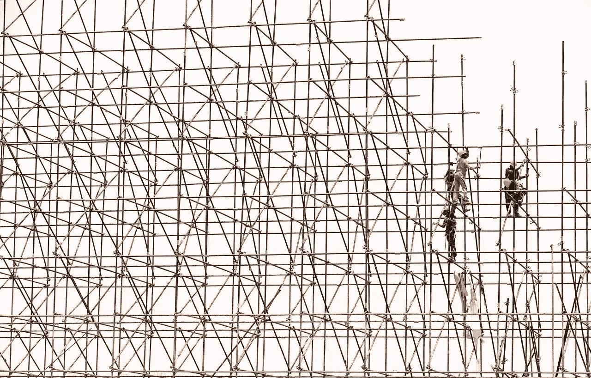
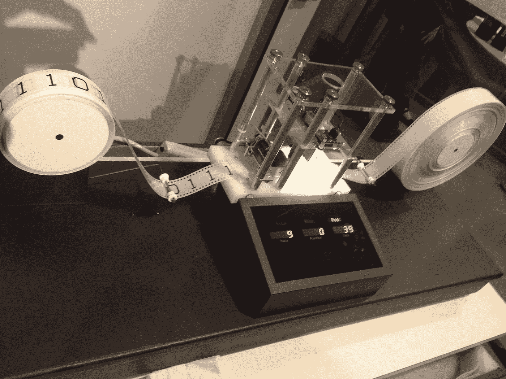
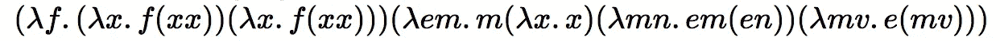
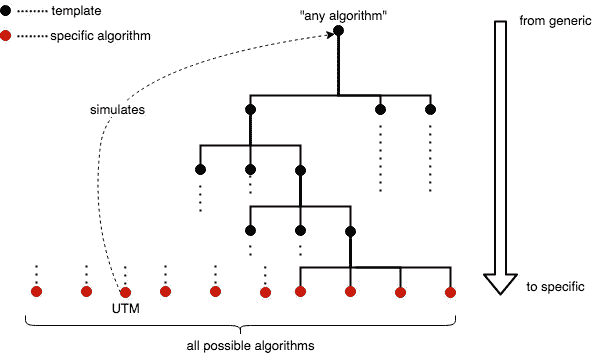

# 人工智能架构师:新程序员

> 原文：<https://towardsdatascience.com/ai-architects-the-new-programmers-7ed1963d6166?source=collection_archive---------21----------------------->

## 论编程新范式的本质

图片由来自 [Pixabay](https://pixabay.com/?utm_source=link-attribution&utm_medium=referral&utm_campaign=image&utm_content=1617969) 的 [Ahmad Ardity](https://pixabay.com/users/ahmadardity-3112014/?utm_source=link-attribution&utm_medium=referral&utm_campaign=image&utm_content=1617969) 提供

> 人工智能的成功故事已经变得如此普遍，似乎每一个软件都将很快以这样或那样的方式融入人工智能。但是人工智能程序是做什么的呢？人工智能程序可以通过经验学习和适应。构建人工智能程序与构建非人工智能程序的不同之处，正在给我们对编程的理解带来范式转变。在这篇文章中，我探索了新范式的本质以及它可能采取的未来路线。
> 
> 卡帕西在他的文章“[软件 2.0](https://karpathy.medium.com/software-2-0-a64152b37c35) ”中，描述了一个人工智能触发的范式转变。他想象“程序员 2.0”更多地参与“编辑和增加数据集”，而不是编写代码，他预测对人类开发人员的需求将会下降。他说，给定正确的数据集，人工智能会自己找到正确的算法。我不这么认为。我相信，软件 2.0 将更少地关注数据，而更多地关注围绕可能的算法的搜索空间定义适当的约束。我认为对人类开发人员的需求不会减弱，相反，它的性质会发生变化。

## 范式分歧

算法是机器可解释指令的有限序列。在旧的范例中，程序员的目标是将一系列指令编织在一起，构成一个单一的、定义明确的算法。在新的范式中，程序员只指定一个模板，该模板编码了多个潜在的算法，机器使用训练数据学习最优算法。模板映射到整个算法空间中的某个区域——所有可能算法的空间。

## 算法模板的分类

[图灵机](https://en.wikipedia.org/wiki/Turing_machine) (TM)是一个通用模板。它本身编码了所有可能算法的空间。接下来的是，每一个可以想到的算法，本质上都是一个带有规则表的图灵机。规则表规定了精确的执行路径。一种被称为通用图灵机 (UTM)的特殊图灵机可以模拟任何其他图灵机的执行，给定一个规则表作为输入。

艾伦·图灵的导师阿隆索·丘奇(Alonso Church)开发的 Lambda Calculus (LC)是另一个通用模板，相当于图灵机。LC 的美学与 TM 的美学有很大的不同。TM 将计算形式化为根据规则表对一条带上的符号进行操作。LC 将其形式化为通过变量绑定和替换的函数及其解析的堆叠。换句话说，TM 是计算的可视化表示，而 LC 是抽象的、代数式的(见图 1，2)。

图一。图灵机。作者 Gabriel F-Own 作品，CC BY-SA 3.0，【https://commons.wikimedia.org/w/index.php?curid=26270095 

图二。通用 Lambda 解释器的 Lambda 表达式。它相当于λ微积分中的 UTM。取自 crypto.stanford.edu/~blynn/lambda/.

TM 和 LC 都跨越了整个算法空间。现在的问题是如何构造只跨越子空间的模板，并在其上进行机器学习。人工神经网络(ANN)利用其可调权重，可以编码和模拟多种算法。人工神经网络并不跨越整个算法空间，除了那些图灵完备的算法空间[1]。因此，他们允许我们通过定制架构创建各种模板。与 TM 和 LC 不同，ANN 编码的算法空间是连续的，支持[差分编程](https://en.wikipedia.org/wiki/Differentiable_programming)，从而更易于机器学习。它也有其局限性，我稍后会谈到这一点。

算法子空间或模板可以组织成树状结构，如图 3 所示。树的根是一个通用的模板，不管是 TM，LC，还是图灵完全神经网络。随着我们向底部移动，模板变得更加具体，因为它们包含越来越小的算法家族。叶节点对应于单独的算法。

图 3。算法之树。叶子对应于特定的算法，而非叶子节点对应于算法族。一个算法家族可以通过一些位于底层的特定算法来模拟。UTM 可以模拟任何算法。请注意，该树纯粹是假设的。

重要的是要注意，有无限多的方式来构建这样一个树，虽然其中一些可能更符合我们对世界的先验知识。

## 风格的差异

软件 2.0 的程序员构造模板需要遵循什么策略？鉴于大数据和相对便宜的计算，一个诱人的方法是从通用模板或大搜索空间开始，让机器搜索最佳算法。与包含工作算法的小区域相比，总的算法空间是无限大的，所以用通用模板学习需要大量的数据和计算。例如， [GPT-3](https://en.wikipedia.org/wiki/GPT-3) ，一个产生类似人类文本的语言模型，使用了 1750 亿个参数，45tb 的训练数据。原则上，这种数据密集型方法不需要太多的人类专业知识。

另一种方法是从一个小的搜索空间或高度专业化的模板开始。在这里，在将球传给机器之前，需要人类的专业知识来适当缩小搜索空间。如果做得好，在更小的搜索空间中学习的成本会变得更低，找到的解决方案更有可能与我们直觉认为的智能一致。一个很好的例子是卷积神经网络( [CNN](https://en.wikipedia.org/wiki/Convolutional_neural_network) )。CNN 的想法受到了对大脑视觉皮层进行的神经科学研究的启发。CNN 使用[局部性](https://en.wikipedia.org/wiki/Principle_of_locality)和 t [平移不变性](https://en.wikipedia.org/wiki/Translational_symmetry)的原理，产生共享权重，从而比正常情况下需要更少的自由参数。AlexNet [3]是使用 CNN 的最有影响力的计算机视觉模型之一，需要大约 150G 的训练数据和 6100 万个参数。我认为这种方法将在人工智能的未来扮演更重要的角色。为了支持人工智能的这种方法，我将探索它是如何被自然本身用来解决智能和学习问题的。

## 自然智能的本质

动物和人类不需要像现代人工智能那样需要大量的数据来学习。相反，包括人类在内的幼小动物在与环境互动最少的情况下，学习速度很快。Zador [4]认为这是因为动物天生具有高度结构化的大脑。高度结构化的大脑缩小了可能算法的搜索空间，实现了快速快速的学习。根据上面的图 3，这意味着自然大脑编码的模板不是通用的；相反，它们是高度专业化的。

Zador 还引入了“基因组瓶颈”的概念。基因组瓶颈表明，大脑的接线图过于复杂，无法在基因组中明确指定，这暗示着基因组水平上发生了一些压缩。在这一点上，一个有趣的问题出现了:大自然是如何选择高度专业化的大脑结构，同时保持可压缩性的？这个问题的答案将揭示软件 2.0 的有趣线索。

## 自然的本质

林等人[5]曾无意中回答过这个问题。他们表明，描述宇宙的物理方程需要定义的参数比预期的少得多。他们认为，因为宇宙遵循对称、[组成](https://en.wikipedia.org/wiki/Principle_of_compositionality)、[位置](https://en.wikipedia.org/wiki/Principle_of_locality#:~:text=In%20physics%2C%20the%20principle%20of,%22action%20at%20a%20distance%22.)和等级形式的原则，所以试图模拟其规律的方程也是如此。由此可见，在宇宙中导航的最佳算法也遵循相同的原则，这也解释了深度和廉价学习在图像识别等任务中的成功。

在试图解释深度学习的成功时，作者还回答了关于基因组瓶颈的问题。大自然可能通过选择遵循上述原则的大脑结构来保持可压缩性。换句话说，大脑结构的特殊化不是随机发生的，而是遵循这些高级原则。

我预测软件 2.0 的架构师将利用这些指导原则来构建最佳算法模板。有趣的是，受神经科学启发的卷积神经网络也利用了平移对称性和局部性。请注意，这些原则仅规定了最终解决方案的形式。为了填充适当的内容，我们需要收集更多的知识，并将其转化为软件 2.0 的细节

## 语言的诞生

在使用人工神经网络进行深度学习的情况下，将知识转化为算法模板是具有挑战性的。我们更习惯于使用符号语言来获取、操作和交流知识。所以我们把知识翻译成经典的计算机科学概念更直观，这些概念是[离散的](https://en.wikipedia.org/wiki/Discrete_mathematics)符号化的。另一方面，现代深度学习在连续域中运行，由于其可微分性，更适合于机器学习，而不太适合于人类推理其工作方式。因此，经典计算机科学和现代深度学习之间的差距是一个有待解决的挑战[6]。我相信 Lambda 演算或函数式编程将在缩小差距方面发挥关键作用(克里斯·奥拉赫[认为](https://colah.github.io/posts/2015-09-NN-Types-FP/))。

## 结论

人工智能引发了我们对编程理解的范式转变。我在这篇文章中认为，新范式的艺术不是编辑和增长大型数据集，而是设计最佳算法模板，以最小的训练数据需求促进快速有效的机器学习。《自然》暗示了实现这一目标的可能途径，但还需要更多的工作来释放神经网络的象征力量。

## 参考

1.  西格尔曼，H. T .，&桑塔格，E. D. (1992)。神经网络的计算能力。1992 年第五届计算学习理论年度研讨会会议录。[https://doi.org/10.1145/130385.130432](https://doi.org/10.1145/130385.130432)
2.  胡贝尔博士；威塞尔(1968 年 3 月至 2001 年 1 月)。[“猴纹状皮层的感受野和功能构筑”](https://www.ncbi.nlm.nih.gov/pmc/articles/PMC1557912)。*生理学杂志*。**195**(1):215–243。[doi](https://en.wikipedia.org/wiki/Doi_(identifier)):[10.1113/jphysiol . 1968 . sp 008455](https://doi.org/10.1113%2Fjphysiol.1968.sp008455)。[刊号](https://en.wikipedia.org/wiki/ISSN_(identifier))[0022–3751](https://www.worldcat.org/issn/0022-3751)。PMC [1557912](https://www.ncbi.nlm.nih.gov/pmc/articles/PMC1557912) 。[PMID](https://en.wikipedia.org/wiki/PMID_(identifier))4966457。
3.  亚历克斯·克里日夫斯基；苏茨基弗，伊利亚；杰弗里·辛顿(2017 年 5 月 24 日)。[“深度卷积神经网络的 ImageNet 分类”](https://papers.nips.cc/paper/4824-imagenet-classification-with-deep-convolutional-neural-networks.pdf) (PDF)。*ACM 的通信*。**60**(6):84–90。[doi](https://en.wikipedia.org/wiki/Doi_(identifier)):[10.1145/3065386](https://doi.org/10.1145%2F3065386)。[刊号](https://en.wikipedia.org/wiki/ISSN_(identifier))[0001–0782](https://www.worldcat.org/issn/0001-0782)。[S2CID](https://en.wikipedia.org/wiki/S2CID_(identifier))[195908774](https://api.semanticscholar.org/CorpusID:195908774)。
4.  对纯粹学习和人工神经网络能从动物大脑学到什么的评论。***10、** 3770 (2019)。[https://doi.org/10.1038/s41467-019-11786-6](https://doi.org/10.1038/s41467-019-11786-6)*
5.  *林，H. W .，泰格马克，m .，&罗尼克，D. (2017)。为什么深度廉价学习效果这么好？*《统计物理学报》*， *168* (6)，1223–1247。【https://doi.org/10.1007/s10955-017-1836-5 *
6.  *Velič ković，p .，& Blundell，C. (2021 年)。神经算法推理。*图案*， *2* (7)，100273。[https://doi.org/10.1016/j.patter.2021.100273](https://doi.org/10.1016/j.patter.2021.100273)*