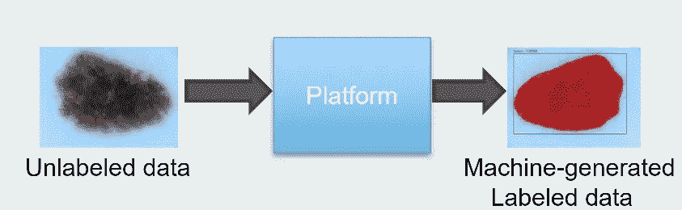
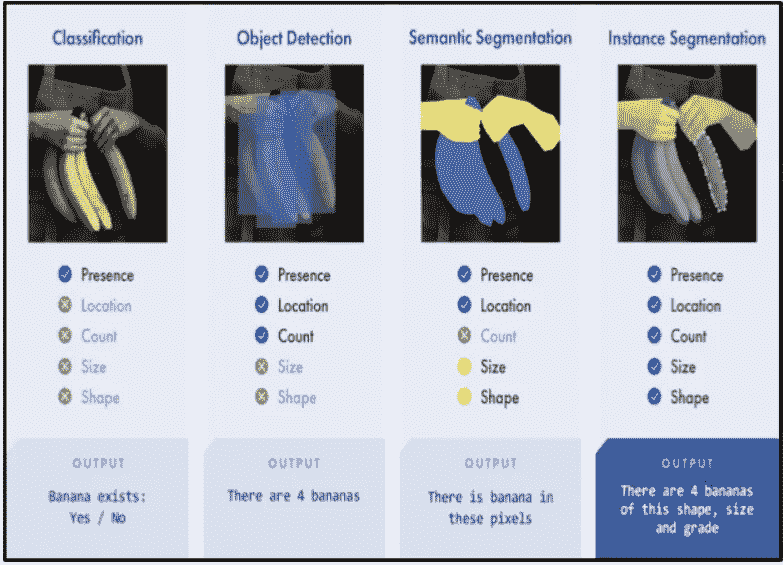
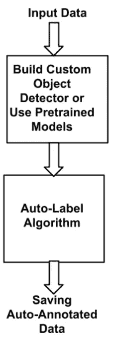
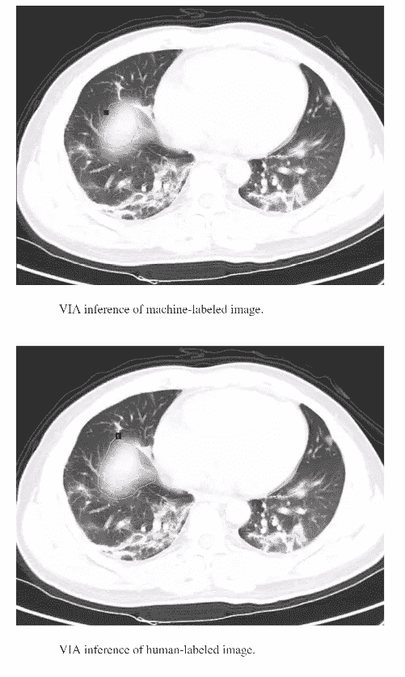

# 人工智能辅助的自动化机器驱动数据标注方法

> 原文：<https://towardsdatascience.com/ai-assisted-automated-machine-driven-data-labeling-approach-afde67e32c52?source=collection_archive---------13----------------------->

## **用于对象检测、对象识别和分割任务的自动注释解决方案**

作者提供的图片:我们的数据模型无关的自动注释工具的示例表示

**作者:****Ajay Arunachalam——高级数据科学家&研究员(AI)**

你好，朋友们。在这篇博文中，我想分享我们在使用人工智能技术自动生成数据标签方面所做的工作。

我们的完整文章可以在这里找到——[https://lnkd.in/gJDKQCY](https://lnkd.in/gJDKQCY)

在我们探讨我们的方法之前，首先让我们通俗地理解什么是数据标记。在机器学习中，**数据标注**简单来说就是识别原始数据(图像、视频、音频文件、文本文件等)的**过程。)，而**向**添加一个或多个有意义和有信息的标签**提供了上下文**，以便**一个机器学习模型可以学习&从中推断**。大多数最先进的机器学习模型高度依赖于大量标记数据的可用性，这是监督任务中必不可少的一步。各种用例都需要数据标记，包括**计算机视觉、自然语言处理和语音识别**。传统上，这种乏味的标记数据的平凡过程迄今为止主要由人类完成。为了帮助人类从零开始最大限度地减少疯狂的数据标注工作和努力，我们建议一种自动化的算法解决方案，旨在减少大量的人工工作。让我们看一下哪里真正需要这种带标签的数据。在这里，我将谈谈计算机视觉的任务。计算机视觉**简单来说就是复制人类视觉(人眼视觉)的复杂性，以及对周围环境的理解。计算机视觉任务包括**获取、处理、分析和理解数字图像的方法，以及**从真实世界中提取高维数据，以便产生数字或符号信息，例如以决策的形式。在计算机视觉领域，有许多不同的任务。例如**分类**、**检测**、**分割**等，我就不赘述了。但是，下图提供了这些任务的清晰概述&目标，并提供了一个上下文中的对象示例—“**Banana**”。

一个上下文示例——需要标记数据

分类 vs .检测 vs .语义分割 vs .实例分割，【版权&图片改编自[https://www.cloudfactory.com/image-annotation-guide](https://www.cloudfactory.com/image-annotation-guide)。经允许重新发布]

对于检测目标的监督模型——“**香蕉**”，标注的标签被馈送给模型，以便它可以学习香蕉像素的表示，并在上下文中定位它们，然后可以使用上下文来推断看不见的/新的数据。实例分割任务旨在检测对象，定位这些对象，并提供它们的数量、大小和形状信息。我们使用一个这样的最先进的实例分割模型—“**Mask R-CNN**”作为我们框架的核心骨干，但是这里可以根据他们的需求使用任何其他网络架构&目标。我们坚持使用 mask R-CNN，因为它可以有效地检测图像中的对象，同时为每个对象生成高质量的分段掩模。对于 COVID 感染检测的特定测试用例，感染区域的精确位置至关重要，因此像素级检测在这种情况下更合适。

# 我们的方法

我们工具的流水线如下所示，主要包括检测器和跟踪器、自动标记模块和用于将机器标注的标签输出和保存到磁盘的 I/O 模块。

作者图片:自动化数据标注管道

步骤 1:-对象检测和跟踪以进行像素级分类

定制的弱训练 mask-RCNN 模型用于 COVID 感染检测，具有非常少的标记实例(< 10 个样本)。为了标记感染区域，我们使用 VGG 图像注释器(VIA)图像注释工具。这是一个简单和独立的手动注释软件，用于图像、音频和视频。VIA 在 web 浏览器中运行，不需要任何安装或设置。完整的 VIA 软件可以放在一个小于 400 千字节的独立 HTML 页面中，在大多数现代 web 浏览器中作为离线应用程序运行。VIA 是一个完全基于 HTML、Javascript 和 CSS 的开源项目(不依赖外部库)。VIA 由视觉几何小组(VGG)开发，并在 BSD-2 条款许可下发布，这使得它对学术项目和商业应用都很有用。检测器用于获得被定位的遮罩、包围盒和类。接下来，为了沿着输入视频数据流一致地跟踪和标记多个感染区域，我们使用了 centriod 跟踪算法。下面是我们的 mask-RCNN covid 检测器的一个片段。

步骤 2:-逐帧数据标记

来自预训练的检测器模型的推断用于获得边界框的位置，并创建 json 元数据。一旦使用 Mask-RCNN 对帧进行分割，就会生成相应的感兴趣区域(ROI)。此外，生成每个 ROI 的掩模，然后在整个图像帧上进行轮廓检测。然后，从轮廓中提取(x，y)坐标。最后，将这些形状、区域和坐标属性逐帧保存到磁盘中。下面给出了我们的自动标记算法的片段。

示例—新冠肺炎感染检测和自动标记

我们测试了我们的方法，目标是为 Covid 感染区域生成自动计算机标签。机器生成标签和人工标注标签的结果如下所示。可以看出，自动注释引擎生成相当好质量的合成标签，这些合成标签可以用于重新训练对象检测模型，或者生成可以用于不同任务的更多注释数据。

肺部 CT 扫描中 Covid 感染区域的机器生成标记与人工注释标记的比较，[图片改编自& Copyright:doi:10.1109/tem . 2021.3094544 .经许可转贴]

# 摘要

数据标注是一项重要的任务，也是监督学习管道的关键组成部分之一。这是一项需要大量手工劳动的任务。那么，我们能不能让大量这种平凡的、劳动密集型和耗时的工作由旨在最大限度减少人类任务的机器来自主驱动。我们专注于这个通用的问题，用我们直观的方法来极大地缓解标签有限的瓶颈，或者自己从头开始标记大量实例的需要。

注意:-我们的工具目前处于 alpha 测试阶段。目前，我们设计的框架是基于掩模 R-CNN 和 VIA 注释格式。我们还旨在将我们的原型一般化，以包括不同的最先进的检测器，例如 YOLO 和相应的 YOLO 兼容注释格式。此外，我们还计划集成 COCO 注释格式。值得将所有不同的图像注释集成为我们框架的一部分，同时为该设施提供不同的库，即 Torch、TensorFlow、Caffe 等。

# 联系我

你可以打*联系我，或者通过 [Linkedin](https://www.linkedin.com/in/ajay-arunachalam-4744581a/) 联系我*

*感谢阅读。*

*继续学习！！！点击这里查看我的 github 页面*

# *参考资料:-*

*<https://en.wikipedia.org/wiki/Labeled_data>  

[https://whatis.techtarget.com/definition/data-labeling](https://whatis.techtarget.com/definition/data-labeling)

[https://AWS . Amazon . com/sagemaker/ground truth/what-is-data-labeling/](https://aws.amazon.com/sagemaker/groundtruth/what-is-data-labeling/)

[https://www . geeks forgeeks . org/object-detection-vs-object-recognition-vs-image-segmentation/](https://www.geeksforgeeks.org/object-detection-vs-object-recognition-vs-image-segmentation/)

[https://www.robots.ox.ac.uk/~vgg/software/via/](https://www.robots.ox.ac.uk/~vgg/software/via/)

[https://github.com/matterport/Mask_RCNN](https://github.com/matterport/Mask_RCNN)

[https://www . telus international . com/articles/5-面向机器学习项目的数据标注方法](https://www.telusinternational.com/articles/5-approaches-to-data-labeling-for-machine-learning-projects)

[https://engineering . matter port . com/splash-of-color-instance-segmentation-with mask-r-CNN-and-tensor flow-7c 761 e 238 b 46](https://engineering.matterport.com/splash-of-color-instance-segmentation-with-mask-r-cnn-and-tensorflow-7c761e238b46)

  <https://en.wikipedia.org/wiki/Computer_vision>  <https://arxiv.org/abs/1703.06870>   *