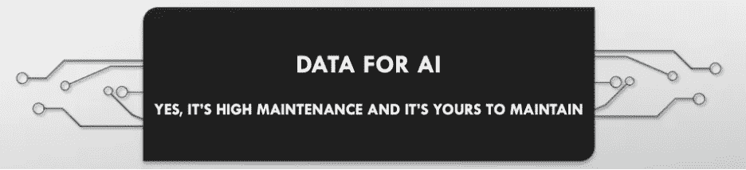
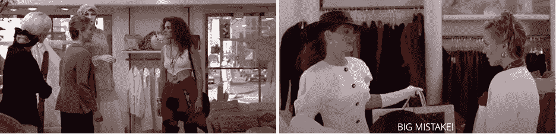
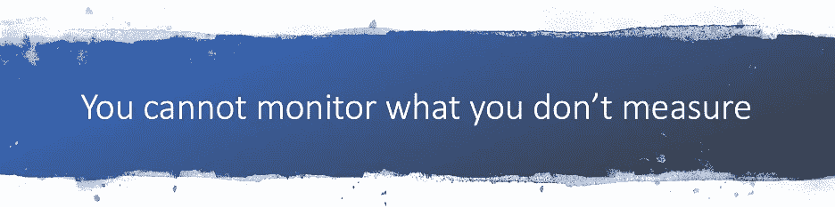

# 人工智能盲点—第二部分

> 原文：<https://towardsdatascience.com/ai-blindspots-part-ii-feeling-empowered-529ba079e945?source=collection_archive---------35----------------------->

# 感觉被授权了

*沙欣·高赫尔博士*

在 ***AI 盲点*** 系列的[第一部分中，我们谈到了在订购 AI 模型之前要进行的标准风险和投资评估。在第二部分中，我们将讨论作为一个企业主，你如何能够*感到被授权*提出问题，这些问题可以帮助你防止和减轻对人工智能的潜在不负责任的使用。作为决策者，你是关键。我将问题分为技术类和非技术类，下面我们只关注不需要 STEM 学位、博士学位或任何线性代数或微积分知识的非技术类问题。](https://medium.com/@shaheen2007/ai-blindspots-part-i-shared-responsibility-5e05824c19b4?source=friends_link&sk=62d5aa86212f9bc06981053463dae886)

在订购人工智能模型之前，向人工智能供应商提出的一些重要问题是——如何获得构建模型的数据？数据是否代表您的客户，并反映了客户的多样性？AI 模型的训练数据的模式(或小样本)是否可用？这就好比在食用之前先看一下食品标签上的成分表。把模型训练数据更深入的分析留给技术团队。

这个疫情给我们上了很多课，其中一课是关于拥有高质量数据的重要性。没有数据就无法进行数据科学。作为一名高管，虽然你不需要知道如何处理或准备数据来建立模型，但如果你希望使用人工智能，你必须了解人工智能的基本数据要求。人工智能需要一致、关联、完整和正确的数据，这比你对仪表板和报告工具的传统数据要求高得多。数据的质量和完整性很重要。数据的数量很重要。数据是人工智能的食物。你喂给你的人工智能什么将决定你的人工智能的整体健康状况。

作者图片

如果人工智能用例包括监督学习(超过 90%的业务用例构成监督学习)，那么要问的百万美元问题是，“数据是如何标记的，谁在标签上签字？”标签是你的人工智能将要学习的基本事实。标注数据需要深厚的领域专业知识，并且可能非常昂贵。不正确、错误或不一致的标签会导致不良模型。重要的是要明白人工智能并不建立地面真相；它从中学习并复制它。如果你不相信地面真理可以被建立，你可能会避免走进一个失败的人工智能计划。对尚未获得正确数据的可能性保持开放的心态，并准备转移对数据收集和数据标记的关注。这种数据投入，未来会产生 AI 红利。

作者图片

再者，如果真相令人不安，重新考虑使用 AI。回想一下下面电影《漂亮女人》中的卷轴人生例子。如果你的员工被训练成拒绝顾客，并根据他们的长相、来自哪里或看起来是否贫穷来描述他们，人工智能很可能会继承偏见、糟糕的商业政策和错误。把一个能自动决定谁进谁出的人工智能放在门口并不能解决问题！

#prettywoman #juliaroberts 来源:[https://www.youtube.com/watch?v=VxcU4q6KLyA](https://www.youtube.com/watch?v=VxcU4q6KLyA)

使用人工智能将修复过去的错误和不良做法的想法是一厢情愿的，而且是有害的。人工智能从例子中学习(这些例子来自你数据库中的商业数据)。如果你的业务的历史数据带有偏见，过去的错误根深蒂固，人工智能模型将学习同样的行为[1][2]。作为决策者，在签署任何人工智能建模之前，你绝对必须理解这一点。

最后但并非最不重要的问题是如何评估和衡量人工智能模型的有效性。作为老板，你不需要被精确度、召回率、RMSE、MAPE 等指标所束缚。虽然它们很重要，但让您的技术团队决定使用合适的指标，并为模型的预测准确性而失眠。从商业和人类的角度来看，重要的是可以量化人工智能决策的*影响*。无论人工智能解决方案是为过程变化还是自动决策而部署的，过程或经验的前后人工智能变化应该是可测量的。捕捉和收集人工智能决策反馈的机制需要在人工智能部署的同时仔细考虑和建立。这种反馈数据不仅可以监控偏差，还可以帮助迭代和改进人工智能模型。

作者图片

此外，对于关键决策，应该清楚地理解 1 型和 2 型错误[3]对业务成果的影响，并设置防护栏以减轻误报和漏报的影响。此外，当在高风险用例中部署人工智能时，例如在自动化决策可能影响生命、健康或生计的社会、医疗保健和金融领域，应该在药物发布之前采用与制药行业所做的临床试验相同的严格性和测试。人工智能模型应该和临床研究一样坚持同样的透明度和再现性标准。少做一点就是*懒惰和不负责任，并可能导致有害的陈规定型观念和不平等永久化。*

人工智能具有造福人类的巨大潜力。这是一项强大的颠覆性技术。从人工智能中获益需要聪明地使用它。负责任地使用人工智能需要勤奋，意识到人工智能的盲点，最重要的是谦逊。

*@Shaheen_Gauher*

观点是我自己的，不反映我过去或现在的工作地点。

如果你发现这篇文章相关，请分享和传播！

确认:

非常感谢 Mary Wahl、Christy Fletcher 和 Miguel Fierro 的审核和宝贵反馈。

参考资料:

[1][https://www . business insider . com/Amazon-build-ai-to-hire-people-discribed-women-2018-10](https://www.businessinsider.com/amazon-built-ai-to-hire-people-discriminated-against-women-2018-10)

[2][https://www . healthcarefinancenews . com/news/study-finds-race-bias-optum-algorithm](https://www.healthcarefinancenews.com/news/study-finds-racial-bias-optum-algorithm)

[3][https://effectsizefaq . com/2010/05/31/I-always-get-follow-about-type-I-and-ii-errors-can-you-show-me-something-to-help-me-remember-the-difference/](https://effectsizefaq.com/2010/05/31/i-always-get-confused-about-type-i-and-ii-errors-can-you-show-me-something-to-help-me-remember-the-difference/)