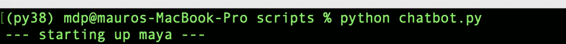
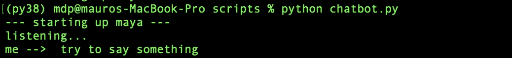
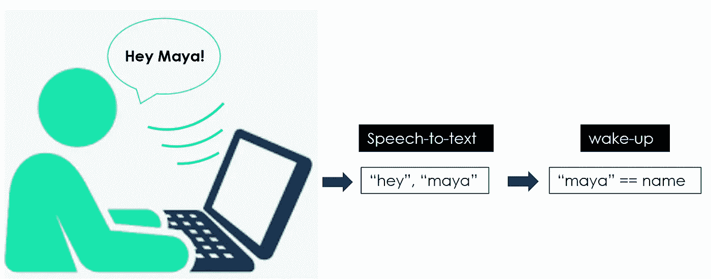

# 带 NLP 的 AI 聊天机器人:语音识别+变形金刚

> 原文：<https://towardsdatascience.com/ai-chatbot-with-nlp-speech-recognition-transformers-583716a299e9?source=collection_archive---------3----------------------->


作者图片

## 用 Python 构建一个会说话的聊天机器人，与你的人工智能进行对话

## 摘要

在本文中，我将展示如何利用预先训练的工具来构建一个使用人工智能和语音识别的聊天机器人，即一个会说话的人工智能。


安迪·凯利在 [Unsplash](https://unsplash.com?utm_source=medium&utm_medium=referral) 上的照片

[**NLP(自然语言处理)**](https://en.wikipedia.org/wiki/Natural_language_processing) 是人工智能领域，研究计算机与人类语言之间的交互，特别是如何给计算机编程以处理和分析大量自然语言数据。NLP 研究一直专注于让聊天机器人变得越来越聪明。

[**聊天机器人**](https://en.wikipedia.org/wiki/Chatbot) 是用于通过文本或文本到语音进行自动聊天对话的软件应用，模仿与人类代理的交互。第一个是 ELIZA<https://en.wikipedia.org/wiki/ELIZA>**(1966)，它使用模式匹配和替换方法来模拟文本对话(它既不能听也不能说)。目前市场上最先进的是 [*亚马逊 ALEXA*](https://en.wikipedia.org/wiki/Amazon_Alexa) ，这是一款智能个人助理，能够理解用户的声音并与之对话。**

**在本教程中，我将展示如何使用语音识别 API 和预先训练的 Transformer 模型构建一个对话聊天机器人。我将展示一些有用的 Python 代码，这些代码可以很容易地应用于其他类似的情况(只需复制、粘贴、运行)，并通过注释遍历每一行代码，以便您可以复制这个示例。**

**特别是，我将经历:**

*   **设置环境**
*   **使用 Google APIs 进行语音识别**
*   **带有转换器的语言模型**

## **设置**

**首先，我们需要安装以下库:**

```
****# for speech to text** pip install **SpeechRecognition  #(3.8.1)****# for text to speech** pip install **gTTS  #(2.2.3)****# for language model**
pip install **transformers  #(4.11.3)** pip install **tensorflow #(2.6.0,** *or pytorch****)*****
```

**我们还需要一些其他常见的软件包，如:**

```
**import **numpy** as np**
```

**让我们从创建一个空类开始，我们将逐步丰富它。为了测试聊天机器人，我们需要初始化它并运行整个脚本，我将我的机器人命名为" *Maya* ":**

```
****# Build the AI**
class **ChatBot**():
    def __init__(self, name):
        print("--- starting up", name, "---")
        self.name = name **# Run the AI**
if __name__ == "__main__": ai = **ChatBot**(name="maya")**
```

****

**作者图片**

## **语音识别**

**[语音识别](https://en.wikipedia.org/wiki/Speech_recognition)是 NLP 的一个跨学科子领域，它开发方法和技术，使计算机能够识别口语并将其翻译成文本。第一个语音识别系统(1950 年)可以理解数字，但不能理解单词，[*IBM**Shoebox*](https://www.ibm.com/ibm/history/exhibits/specialprod1/specialprod1_7.html)(1960 年)是第一个理解并响应少量英语单词的系统。**

**如今，使用最多的系统是谷歌的 API，使用它们的一个简单方法是通过 [*演讲识别*](https://pypi.org/project/SpeechRecognition/) 库:**

```
**import **speech_recognition** as srdef **speech_to_text**(self):
    recognizer = **sr**.Recognizer()
    with **sr**.Microphone() as mic:
         recognizer.adjust_for_ambient_noise(mic, duration=1)            
         print("listening...")
         audio = recognizer.listen(mic)
    try:
         self.text = recognizer.recognize_google(audio)
         print("me --> ", self.text)
    except:
         print("me -->  ERROR")**
```

**这是我们的聊天机器人类的第一个 NLP 函数，执行**语音转文本**任务。基本上，它通过将音频信号转换成文本来提供聆听和理解你的声音的能力。你可以通过跑步和试着说些什么来测试它:**

```
****# Run the AI**
if __name__ == "__main__": ai = ChatBot(name="maya") while True:
         ai.**speech_to_text**()**
```

****

**作者图片(我是在说话，不是在打字)**

**现在我们需要给人工智能回应的能力。换句话说，我们希望聊天机器人理解输入，产生输出，并大声说出来。让我们给这个类添加一个新函数:**

```
**def **wake_up**(self, text):
    return True if self.name in text.lower() else False**
```

***wake_up* 方法确保 AI 在你说出它的名字时做出反应。例如，我将通过说“*嘿，玛雅*”来激活我的聊天机器人。**

****

**作者图片**

**一旦聊天机器人听到它的名字，它会说些什么，因此它需要执行一个**文本到语音的**任务。我将使用[谷歌文本到语音库](https://pypi.org/project/gTTS/) ( *gtts* )在文件系统上保存一个 mp3 文件，该文件可以通过[库操作系统](https://docs.python.org/3/library/os.html)轻松播放。**

```
**from **gtts** import gTTS
import **os**@staticmethod
def **text_to_speech**(text):
    print("ai --> ", text)
    speaker = **gTTS**(text=text, lang="en", slow=False)
    speaker.save("res.mp3")
    **os**.system("afplay res.mp3")  **#macbook->afplay | windows->start**
    **os**.remove("res.mp3")**
```

****

**作者图片**

**您可以像这样测试这两个新函数:**

```
****# Run the AI**
if __name__ == "__main__": ai = ChatBot(name="maya") while True:
         ai.speech_to_text()

         **## wake up**
         if ai.**wake_up**(ai.text) is True:
             res = "Hello I am Maya the AI, what can I do for you?"

         ai.**text_to_speech**(res)**
```

****

**作者图片(电脑也在说话)**

**我们还可以对机器人进行编程，让它对一些特定的命令做出反应，就像任何其他虚拟助手一样( *Siri、Alexa、Cortana* 、…)。例如，我希望我的人工智能在我请求的时候告诉我时间，并在我感谢她的时候做出友好的回应(“她”，是的，我已经爱上她了)。所以我要把这个函数添加到聊天机器人类中:**

```
**import **datetime**@staticmethod
def **action_time**():
    return **datetime**.datetime.now().time().strftime('%H:%M')**
```

**并运行脚本:**

```
****# Run the AI**
if __name__ == "__main__":ai = ChatBot(name="maya")while True:
         ai.speech_to_text()

         **## wake up**
         if ai.**wake_up**(ai.text) is True:
             res = "Hello I am Maya the AI, what can I do for you?" **## action time**
         elif "time" in ai.text:
            res = ai.action_time()

         **## respond politely**
         elif any(i in ai.text for i in ["thank","thanks"]):
            res = **np**.random.choice(
                  ["you're welcome!","anytime!",
                   "no problem!","cool!",
                   "I'm here if you need me!","peace out!"])

         ai.**text_to_speech**(res)**
```

****

**作者图片**

**到目前为止，我们已经使用语音识别技术来与我们的聊天机器人交谈，但机器人仍然很笨，因为它不能对任何不是预先确定的事情做出反应。是时候将真正的人工智能放入我们的聊天机器人(Chatbot)内部了，即一个为 NLP 训练的机器学习模型。**

## **语言模型**

**我将使用 [Transformer 语言模型](https://en.wikipedia.org/wiki/Transformer_(machine_learning_model))，这是谷歌(2017) 提出的一种新的建模技术，它用[注意力机制](https://en.wikipedia.org/wiki/Attention_(machine_learning))取代了传统的序列对序列模型(如 LSTM)。这些语言模型可以执行任何 NLP 任务，因为它们动态地理解上下文。最著名的模型有 Google 的 [*BERT*](https://en.wikipedia.org/wiki/BERT_(language_model)) 和 OpenAI 的 [*GPT*](https://en.wikipedia.org/wiki/GPT-3) ，参数数十亿。**

**这些型号的主包是 HuggingFace 的 [*变形金刚*](https://huggingface.co/transformers/) 。这是一个流行的工具，它提供了对各种 NLP 任务有用的预训练模型。具体来说，我要用的是 [**DialogGPT**](https://huggingface.co/transformers/model_doc/dialogpt.html) ，这是一个 *GPT* 模型，由微软根据从 Reddit 中提取的数百万个对话进行训练。**

```
**import **transformers**nlp = transformers.**pipeline**("conversational", 
                            model="**microsoft/DialoGPT-medium**")**
```

**让我们试一试:**

```
**input_text = "hello!"
nlp(transformers.**Conversation**(input_text))**
```

****

**作者图片**

**请注意，当前版本的库在您没有指定 *pad_token_id* 时会给出警告(如上图所示)。为了避免这种情况，您可以将其作为参数添加:**

```
**nlp(transformers.Conversation(input_text), **pad_token_id=50256**)**
```

**此外，管道输出整个对话(从上图中可以看到)，所以我要把整个输出变成一个字符串，只提取聊天机器人的响应。**

```
**chat = nlp(transformers.Conversation(ai.text), pad_token_id=50256)
res = str(chat)
res = res[res.find("bot >> ")+6:].strip()**
```

**最后，我们准备运行聊天机器人，并与我们的人工智能进行有趣的对话。以下是完整的代码:**

****

**作者图片**

**太好了！该机器人既可以像虚拟助理一样执行一些特定的任务(即在被询问时说出时间)，也可以进行随意的对话。如果你认为人工智能会一直存在，她同意:**

****

**作者图片**

## **结论**

**这篇文章是一个教程，展示了如何构建一个像人类一样倾听和回复的对话聊天机器人。我使用语音识别工具来执行*语音到文本*和*文本到语音*任务，我利用预先训练的变形金刚语言模型来赋予机器人一些人工智能。现在你可以建立自己的聊天机器人，也许包括更多的虚拟助理任务，如在维基百科上搜索东西或在 Youtube 上播放视频。**

**我希望你喜欢它！如有问题和反馈，或者只是分享您感兴趣的项目，请随时联系我。**

> **👉[我们来连线](https://linktr.ee/maurodp)👈**

> **本文是系列文章 **NLP 与 Python** 的一部分，参见:**

**</text-summarization-with-nlp-textrank-vs-seq2seq-vs-bart-474943efeb09>  </text-classification-with-nlp-tf-idf-vs-word2vec-vs-bert-41ff868d1794>  </text-analysis-feature-engineering-with-nlp-502d6ea9225d>  </text-classification-with-no-model-training-935fe0e42180> **