# 人工智能计算乳腺癌风险图

> 原文：<https://towardsdatascience.com/ai-computed-breast-cancer-risk-map-b29195b477a?source=collection_archive---------19----------------------->

## [实践教程](https://towardsdatascience.com/tagged/hands-on-tutorials)

## 结合 Boosting 和支持向量机的层次聚类可视化可靠乳腺癌诊断模型

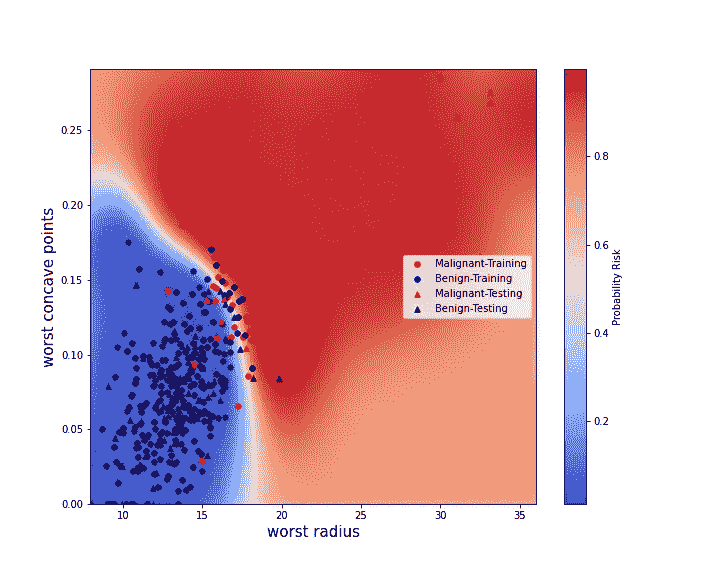

# 一.导言

**1.1 工作目标**

快速可靠的乳腺癌检测是一项重要的挑战，因为它代表了重大的公共卫生问题(2018 年全球约有 200 万例新病例被检测到[1])。在疾病的早期阶段识别恶性乳腺癌会显著增加患者的生存机会，并减少治疗的副作用。

诊断依赖于从可疑肿瘤区域提取的样本分析。该过程旨在评估给定样本是否由代表不受控制的增殖风险的细胞构成。能够在一个时间内分析更多的样本可能会有机会诊断更多的患者，并在需要采取治疗措施时更快地做出反应。出于这个目的，人工智能算法可能会带来很多好处。在需要分析数千甚至数百万个样本的情况下，它们可以用来进行初步选择，并建议哪些样本需要优先进行精确的专家研究。

为此，已经提出了一些机器学习模型(见[2]、[3])来预测恶性或良性肿瘤的发展风险。然而，这些模型是基于从肿瘤细胞成像推导出的许多变量。在这项工作中，我们建议将变量的数量减少到两个。这种维度缩减的目的是形成可视的恶性肿瘤风险图。我们在这项工作中提出:

*   1.精确分析每个初始变量在预测中的作用。为此，我们采用了一种使用分层聚类(HC)算法的特征聚类方法。第二次，使用梯度推进树分类器(GBTC)算法评估特征重要性。
*   2.选择在前一步中推导出的两个最有意义的变量。
*   3.构建支持向量机分类器(SVMC)算法以导出恶性乳腺癌发展的概率风险图。

**I.2 数据导入**

我们从几个导入开始。

```
from matplotlib import cm
import seaborn as sn
import matplotlib as matplotlib
import pandas as pd
import pylab as plt
import numpy as np
from scipy.cluster import hierarch# Sklearn imports
from sklearn.datasets import load_breast_cancer
from sklearn.preprocessing import StandardScaler
from sklearn.ensemble import GradientBoostingClassifier
from sklearn.metrics import accuracy_score
from sklearn.model_selection import cross_validate,GridSearchCV
from sklearn.svm import SVC
from sklearn.gaussian_process import GaussianProcessClassifier
from sklearn.gaussian_process.kernels import RBF
```

在这项工作中，我们使用 UCI 机器学习数据库[3]收集 569 名患者的数据。当分析肿瘤细胞时，为每个细胞核计算十种特征类型[3]:

*   1)半径(从中心到周边各点的平均距离)
*   2)纹理(灰度值的标准偏差)
*   3)周长
*   4)面积
*   5)平滑度(半径长度的局部变化)
*   6)密实度(𝑝𝑒𝑟𝑖𝑚𝑒𝑡𝑒𝑟 /面积— 1.0)
*   7)凹度(轮廓凹入部分的严重程度)
*   8)凹点(轮廓的凹入部分的数量)
*   9)对称性
*   10)分形维数(“海岸线近似值”-1)

对于这些特征中的每一个，报告平均值、标准偏差和最大值，这导致总共 30 个特征。分析这些特征中的每一个导致决定肿瘤是恶性的(1)还是良性的(0)。预测将是我们的标签。

首先，我们下载数据并验证不存在“none”值。

```
# Load the data
feat_all,label_all=load_breast_cancer(return_X_y=True,as_frame=True)feat_all.isnull().sum()mean radius                0
mean texture               0
mean perimeter             0
mean area                  0
mean smoothness            0
mean compactness           0
mean concavity             0
mean concave points        0
mean symmetry              0
mean fractal dimension     0
radius error               0
texture error              0
perimeter error            0
area error                 0
smoothness error           0
compactness error          0
concavity error            0
concave points error       0
symmetry error             0
fractal dimension error    0
worst radius               0
worst texture              0
worst perimeter            0
worst area                 0
worst smoothness           0
worst compactness          0
worst concavity            0
worst concave points       0
worst symmetry             0
worst fractal dimension    0
dtype: int64
```

现在是时候开始特征选择工作，将我们的问题从 30 维空间简化到 2 维空间。

# 一.功能选择

在这一部分中，我们首先计算成对相关性，以便重新组合彼此之间最相关的特征。使用层次聚类(HC)算法收集相关特征组。第二次，使用梯度推进树分类器(GBTC)将这种聚类方法与特征重要性评估相结合。

**I.1 特征相关性分析**

如上所述，我们计算特征之间的成对相关性:

```
correl_fig,ax=plt.subplots(1,1,figsize=(10,10),)
indexax=np.arange(0,len(feat_all.columns))
sn.heatmap(feat_all.corr())
ax.set_xticks(indexax)
ax.set_xticklabels(feat_all.columns)
ax.set_yticks(indexax)
ax.set_yticklabels(feat_all.columns)
correl_fig.tight_layout()
plt.show()
```

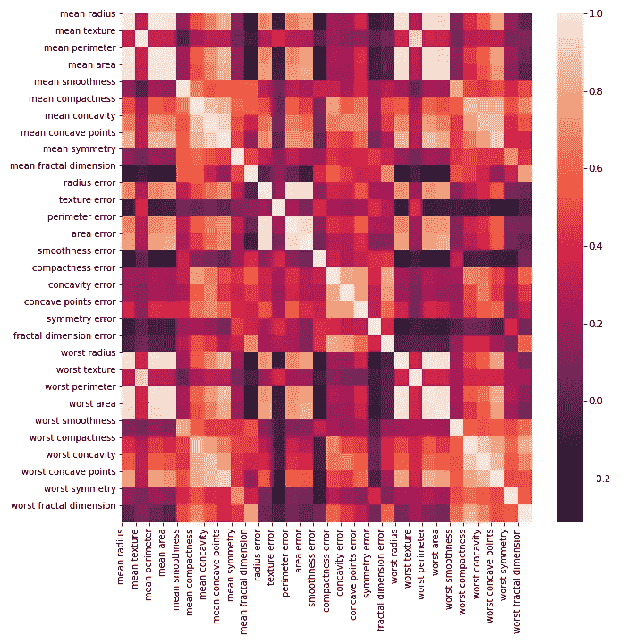

图 1:所有 30 个特征的成对相关图。

特征选择的第一步是构建相关特征组(注意，使用 Spearman 相关性可以遵循类似的方法[5])。事实上，当特征高度相关时，意味着它们传达了相近或相似的信息。结果，该组的单个特征而不是所有特征可以被考虑用于预测，从而避免冗余。

我们通过使用层次聚类(HC)来构建相关特征的组(更多细节参见[6])。因此，应用了以下过程，该过程能够构建从树叶到根的树(称为 HC 树，其中每个节点代表一个特征集群):

*   1.首先将每个特征定义为一个簇(HC 树的第 0 层，每个特征是一个叶子)。
*   2.计算每个聚类之间的距离。如果𝐹k 是聚类 I 中的特征，𝐺𝑡是聚类 2 中的特征，则聚类 I 和 j 之间的距离是𝑚𝑖𝑛_𝑘,𝑡(𝐶𝑜𝑟𝑟(𝐹𝑘,𝐺𝑡)).其中𝐶𝑜𝑟𝑟(𝐹𝑘,𝐺𝑡)是特征 f 和 g 之间的相关性
*   3.对于给定的簇 I，将其与最接近的一个(记为 j)合并。这种合并由两个合并分支表示，一个来自与 I 相关联的节点，另一个来自与 j 相关联的节点。这些分支形成了表示 I 和 j 之间的合并的树中的上层节点。
*   4.重复这些聚类合并操作，直到有一个集合了所有特征(对应于 HC 树的根)。

在固定一个级别后，该级别的不同节点产生特征的聚类。更准确地说，如果考虑与一个集群相关联给定节点。与之相连的叶子代表了这个集群中涉及的特征。

```
corr_fig1,ax1=plt.subplots(1,1,figsize=(10, 8),)# Compute pair wise correlations
corr=feat_all.corr().values# Compute the hierarchical clustering tree
link=hierarchy.ward(corr)
dendro=hierarchy.dendrogram(link,labels=feat_all.columns,ax=ax1,leaf_rotation=90,leaf_font_size=10)
dendro_index=np.arange(0,len(dendro["ivl"]))
corr_fig1.tight_layout()
plt.show()
corr_fig1.savefig("corrtree.png")
```

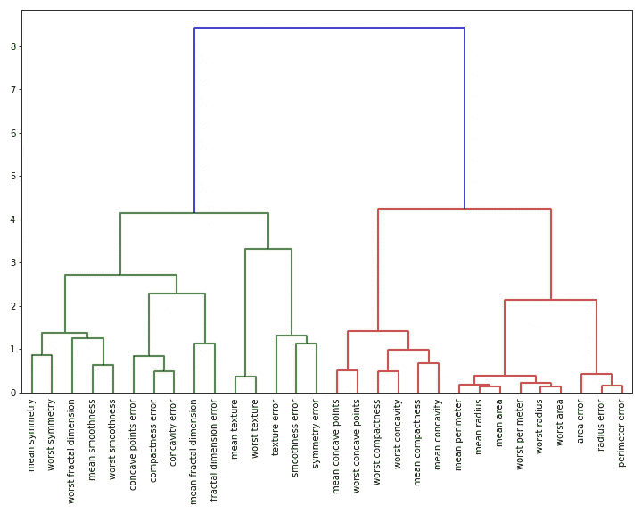

图 2:由 HC 算法计算出的树。

```
corr_fig2,ax2=plt.subplots(1,1,figsize=(10, 8),)# Compute the correlation heat map
im=ax2.imshow(corr[dendro["leaves"],:][:,dendro["leaves"]])
ax2.set_xticks(dendro_index)
ax2.set_yticks(dendro_index)
ax2.set_xticklabels(np.array(dendro["ivl"]),rotation="vertical")
ax2.set_yticklabels(np.array(dendro["ivl"]))
corr_fig2.tight_layout()
plt.colorbar(im)
plt.show()
corr_fig2.savefig("corrmap.png")
```

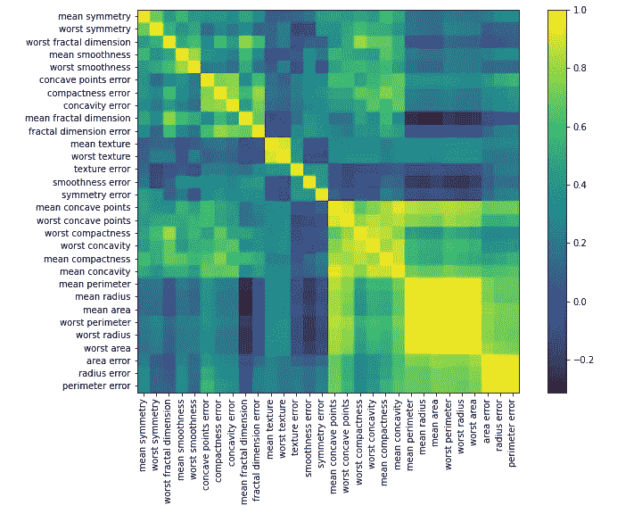

图 3:HC 聚类中重排特征的相关热图。

图 2 显示了根据 HC 方法构建的树。通过固定等级 4，看起来可以定义四个不同的特征聚类(参见图 2，HC 树的叶子从左到右:聚类 1，从“平均对称”到“分形维数误差”；聚类 2，从“平均纹理”到“对称误差”；聚类 3，从“平均凹点”到“平均凹度”；聚类 4，从“平均周长”到“周长误差”)。

对于我们的降维问题，因此需要选择不属于同一聚类的特征。图 3 示出了热图相关矩阵，其中重新排列的特征取决于它们的聚类(即遵循图 2 中 HC 树给出的顺序)。

我们确定每个特征的聚类，并将信息存储在字典中。

```
# Color list of the four feature clusters
color_list=[“red”,”navy”,”black”,”green”]# Fix a level of four in the HC tree to determine feature clusters
clusterlevel=4 # Determine the id cluster list
clusterid_list= hierarchy.fcluster(link,clusterlevel, \criterion=’distance’)# This dictionary will contain the list of features for each 
# cluster
featurecluster_dict = dict()for idx, clusterid in enumerate(clusterid_list):
 if clusterid not in featurecluster_dict.keys():
     featurecluster_dict[clusterid]=dict()
     featurecluster_dict[clusterid][“numfeat”]=[]
     featurecluster_dict[clusterid][“namefeat”]=[]
 featurecluster_dict[clusterid][“color”]=color_list[clusterid-1]
 featurecluster_dict[clusterid][“numfeat”].append(idx)
 featurecluster_dict[clusterid]\
 [“namefeat”].append(feat_all.columns[idx])
```

## I.2 数据预处理

现在，我们对数据进行预处理，以:

*   1.为未来的机器学习模型规范化特征。这一标准化过程是通过减去平均值并除以每个特征的标准偏差来实现的。
*   2.在定型集和测试集之间拆分数据。

```
def preprocess(trainrate=1.0):
    '''
    Load data, normalize and split between training and testing
    sets Input:
      trainrate: [Float] Relative size of the training set Output:
      feat_all:    [DataFrame] All the data features
      label_all:   [DataFrame] All the labels
      featnames:   [List] All the feature names
      featN_all:   [DataFrame] All the normalized features
      feat_train:  [DataFrame] Training features
      featN_train: [DataFrame] Normalized training features
      feat_test:   [DataFrame] Testing features
      featN_test: [DataFrame] Normalized testing features
      label_train: [DataFrame] Training labels
      label_test:  [DataFrame] Testing labels
      normmean_arr:[Array] All the features' means for
                           normalization
      normstd_arr: [Array] All features' standard 
                           deviation for normalization '''
    # Load the data and get the name of all features    feat_all,label_all=\
    load_breast_cancer(return_X_y=True,as_frame=True)
    featnames=np.array(feat_all.columns) # Shuffle the data
    data_all=pd.concat([feat_all,label_all],axis=1).sample(frac=1)    
    label_all=data_all["target"]
    feat_all=data_all.drop("target",axis=1) # Get normalized features    
    StdSc=StandardScaler()
    StdSc.fit(feat_all)
    featN_all=StdSc.transform(feat_all)
    featN_all=pd.DataFrame(featN_all,columns=feat_all.columns)

    # Split between training and testing sets
    trainsize=int(trainrate*len(feat_all.index))
    feat_train=feat_all[:trainsize]
    featN_train=featN_all[:trainsize]
    label_train=label_all[:trainsize]
    feat_test=feat_all[trainsize:]
    featN_test=featN_all[trainsize:]
    label_test=label_all[trainsize:] normmean_arr=StdSc.mean_
    normstd_arr=(StdSc.var_)**0.5 return\ 
    feat_all,label_all,featnames,featN_all,feat_train,\
    featN_train,feat_test,featN_test,label_train,label_test,\
    normmean_arr,normstd_arrtrainrate=0.8
feat_all,label_all,featnames,featN_all,feat_train,featN_train,feat_test,featN_test,label_train,\
label_test,mean_feat,std_feat=preprocess(trainrate=trainrate)
```

随机选择代表所有数据的 20%的测试集，其余的用于训练。

# I.3 确定特性的重要性

我们现在通过评估特征重要性分数来结合这种特征聚类方法。为此，我们建立了一个梯度推进树分类器(GBTC)算法。为了解释什么是 GBTC，我们需要首先澄清什么是决策树。决策树是一种机器学习算法，通常用于回归和决策任务。从由几个特征表征的数据集合中，目的是为每个数据得出决策，如果是回归问题，该决策可以是数字，或者在分类的情况下是离散标签。为了获得决策，通过递归地构造节点来构建树，其中在每个节点上应用这些条件来分割数据(参见图 4)。这些条件是固定的，以便最大化一个标准，如这里的基尼分类标准。

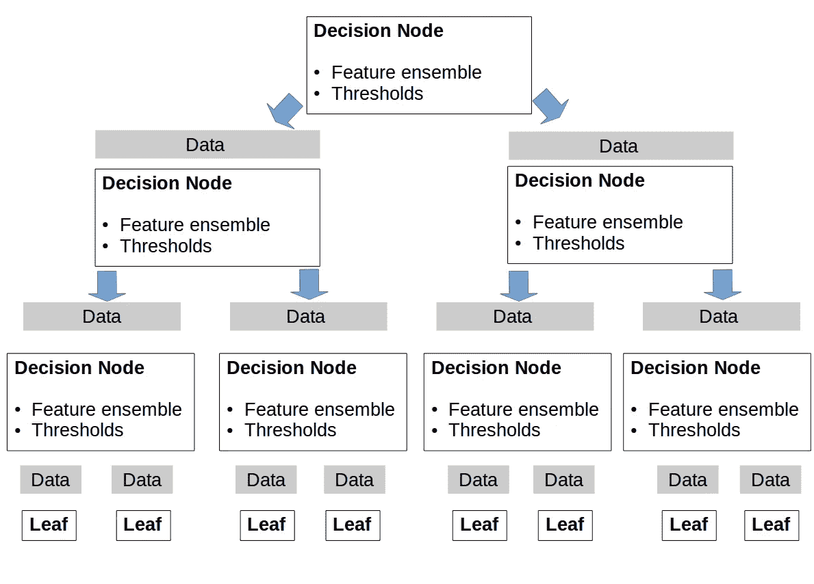

图 4:决策树的示意图，当形成决策节点直到到达叶子时，训练数据被递归分裂。

在每个节点，选择一个特征或特征集合，并且对于它们中的每一个，阈值是固定的(在训练期间使用所考虑的标准来确定所选择的特征集合以及阈值)。根据定义的阈值，数据在不同的节点之间拆分。重复该分裂过程，直到到达具有最小数量数据的节点，或者如果树达到极限深度(这些极限被预先确定为超参数)。这些最终节点被称为叶子，并且每个都与一个决策值相关联。

GBTC 算法是由一组决策树组成的。对于成对的训练特征向量和标签(，yi)，构建该集合使得对于每个，

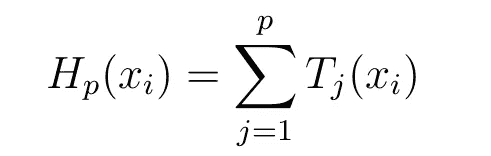

一定是离易最近的。如果引入损失函数

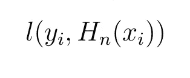

构建 p+1 决策树对应于找到 T 函数，使得 T(xi)=-Gi。其中 Gi 是损失函数在函数 Hp 上的 xi 梯度。换句话说

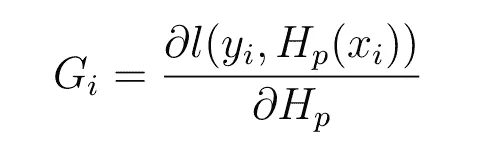

当我们在这里将该模型用于分类任务时，通过将 sigmoid 函数应用于构建的 GTBC 函数来获得预测的类别。

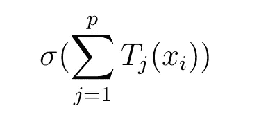

关于梯度增强的更多细节在[4]中提供。GBTC 对于回归和分类都是有用的，并且可以被认为是确定特征的重要性。对于给定的特征，其在不同决策树中的平均水平位置被用于评估其在标签预测中的重要性。最重要的特征是那些位于决策树构造之初的特征。它们实际上对应于对决策树构造的数据分割具有最强影响的那些。下面我们介绍一个功能表:

*   来确定决策树集合的最佳大小。
*   来训练 GBTC 算法。
*   评估特征的重要性。

```
def trainGbc(params,feat_train,label_train,feat_test,label_test,\
setbestestim=False,setfeatimp=False,featurecluster_dict=None):
    '''
     This function trains a gradient boosting algorithm, if 
     required, it determines the best number of n_estimators
     and evaluates feature importances Input:
       params: [Dict] Parameters for the GBTC's construction
       feat_train:  [DataFrame] Training features
       label_train: [DataFrame] Training labels
       feat_test:   [DataFrame] Testing features
       label_test:  [DataFrame] Testing labels
       setbestestim: [Bool] If True, determines the best size
                            of the decision trees' ensemble
       setfeatimp: [Bool] If True determines features' importances
       featurecluster_dict: [Dict] If not None, dictionary of the
                                   feature clusters Output:
       Gbc: [Sklearn Instance] A trained GBTC estimator ''' # If the best number of estimators has to be determined
    if setbestestim: Gbc=GradientBoostingClassifier(**params)
        Gbc.fit(feat_train,label_train) # Determine the best n_estimators
        scoretest_list=[]
        scoretrain_list=[]

        # Compute accuracy scores for training and testing with
        # different n_estimators for pred_test in Gbc.staged_predict(feat_test):
            scoretest=accuracy_score(label_test,pred_test)
            scoretest_list.append(scoretest)
        for pred_train in Gbc.staged_predict(feat_train):
            scoretrain=accuracy_score(label_train,pred_train)
            scoretrain_list.append(scoretrain) # Plot the figure showing the training and testing
      # accuracies' evolution with n_estimators       nestim_fig,ax=plt.subplots(1,1,figsize=(10,8),)
       plt.plot(np.arange(params["n_estimators"]),\
       scoretrain_list,label="Train")
       plt.plot(np.arange(params["n_estimators"]),
       scoretest_list,label="Test")
       plt.legend()
       plt.xlabel("n_estimators")
       plt.ylabel("Accuracy")
       nestim_fig.savefig("nestim.pdf")
       plt.show()
      # Cross validate and fit a GBTC estimator
    else:
       Gbc=GradientBoostingClassifier(**params)
       score=cross_validate(Gbc,feat_train,label_train,\
        cv=5,scoring="accuracy")
       print("Gbc Cross Validation Accuracy (Testing)")
       print(np.mean(score["test_score"]))
       Gbc.fit(feat_train,label_train) #Determine feature importance
    if setfeatimp:
       impfeat_list=Gbc.feature_importances_
       indexsort=np.argsort(Gbc.feature_importances_)
       impfeat_fig,ax=plt.subplots(1,1,figsize=(10,8),)
       pos=np.arange(len(indexsort))+0.5
       plt.barh(pos,impfeat_list[indexsort]) 
       plt.yticks(pos,np.array(feat_train.columns)
       [indexsort],fontsize=10,color="red") # If feature clustering, color the features depending on 
       # their clusters
       if featurecluster_dict!=None:
           for ifeat,featname in\
            enumerate(np.array(feat_train.columns)[indexsort]):
               for clusterkey in featurecluster_dict.keys():
                   if featname in \
                   featurecluster_dict[clusterkey]["namefeat"]:

                         ax.get_yticklabels()[ifeat].set_color\
                        (featurecluster_dict\
                        [clusterkey]["color"])

            plt.xlabel("Importance")
            plt.xscale("log")
            plt.xticks(size=10)
            impfeat_fig.savefig("impfeat.pdf")
            plt.show()
    return Gbc
```

我们首先需要确定决策树集合的大小来构造 GBTC 估计量。为此，根据所用决策树的数量对训练集和测试集的准确性进行评估。

```
# Determine the best number of estimators
params=\{"n_estimators":500,"learning_rate":0.01,"min_samples_split":5,"max_depth":4}Gbc=trainGbc(params,feat_train,label_train,feat_test,label_test,setbestestim=True,setfeatimp=False)
```

可以看出，300 个决策树能够达到大约 0.95 的测试精度和 0.99 的训练精度(见图 5)。因此，我们选择这种规模的决策树集合。修复它，评估 30 个特征中每一个的重要性。

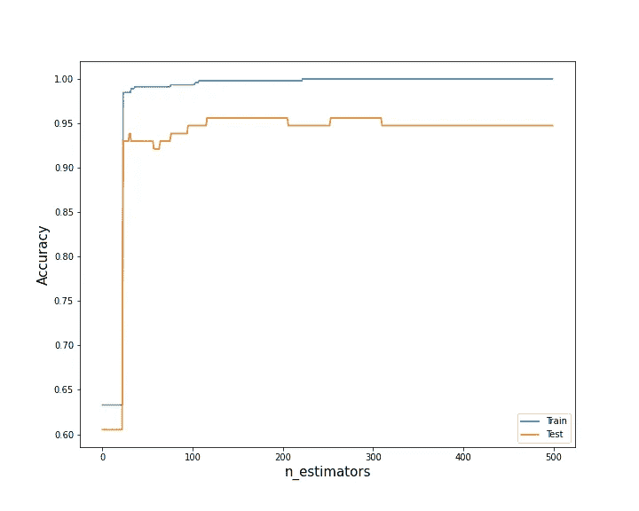

图 5:训练和测试准确率随决策树集合大小的变化。

```
# Determine feature importance with n_estimator=300
params=\
{"n_estimators":300,"learning_rate":0.01,"min_samples_split":5,"max_depth":4}Gbc=trainGbc(params,feat_train,label_train,feat_test,\
label_test,setbestestim=False,setfeatimp=True,featurecluster_dict=featurecluster_dict)
```

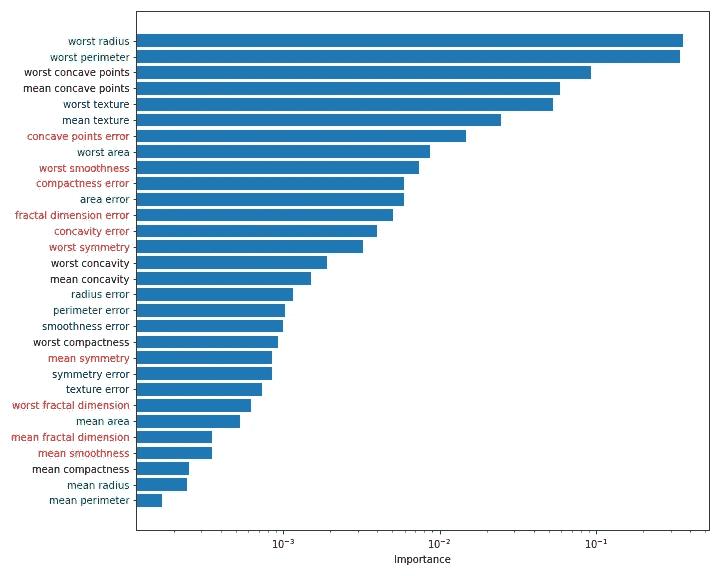

图 6:根据 GBTC 算法评估特征的重要性。相同颜色的特征名称是那些参加由 HC 推导的相同聚类的特征名称。

我们检查了，在测试集上，具有 300 个估计量的 GBTC 算法达到了 0.951 的精度。

```
predGBC_test=Gbc.predict(feat_test)
accGBC=accuracy_score(label_test,predGBC_test)
print("Testing Accuracy")
print(accGBC)Testing Accuracy
0.9513684210526315
```

在图 6 中，我们可以看到“最差半径”和“最差凹点”是属于先前建立的不同聚类的两个最重要的特征。此外，我们还展示了五个最重要特征的配对图。我们可以如预期的那样注意到两个最重要的特征“最差半径”和“最差周长”是强相关的(它们属于相同的特征聚类)。这就是为什么在特征选择过程中“最差周长”被“最差凹点”所取代。

```
def pairplot(feat_all,label_all,featimp_list):

    '''
    Compute the pair plots from a list of features
    Input:
      feat_all: [DataFrame] All the features
      label_all: [DataFrame] All the labels
      featimp_list: [List] Name of the features to compute the
                           pair plots ''' mostfeat_list=feat_all.columns[np.argsort(\
    Gbc.feature_importances_)][-5:]
    pairplot_fig=plt.figure()
    sns_plot=sn.pairplot(pd.concat(\
    [feat_all[mostfeat_list],label_all],axis=1), hue='target')
    fig = sns_plot
    fig.savefig("pairplot.pdf") featimp_list=list(Gbc.feature_importances_)
pairplot(feat_all,label_all,featimp_list)
```

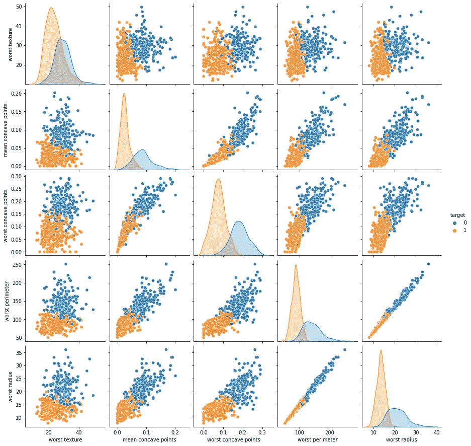

图 7:从 GBTC 推导出的五个最重要特征的配对图。

我们引入了一个函数，该函数基于所选择的特征来降低特征(未归一化和归一化)向量的维数。

```
def selectfeat(feat_selected,feat_train,\
feat_test,feat_all,featN_train,featN_test,featN_all\
,meanfeat_arr,stdfeat_arr): '''
   Reduce the dimensionality of the feature vectors based on
   the feature selected Input:
      feat_selected:  [List] Names of the features selected
      feat_train:  [DataFrame] Training features
      feat_test:   [DataFrame] Testing features
      feat_all: [DataFrame] All the features
      featN_train: [DataFrame] Normalized training
                               features
      featN_test: [DataFrame] Normalized testing
                              features
      featN_all: [DataFrame] All the normalized features
      meanfeat_arr:[Array] All the features' means for 
                          normalization
      stdfeat_arr: [Array] All features' standard 
                           deviation for normalization Output:
      featS_train: [DataFrame] Training selected features
      featS_test: [DataFrame] Testing selected features
      featS_all:  [DataFrame] All selected features
      mean_featS: [Array] Means of the selected features
      std_featS: [Array] Standard deviations of the selected
                         features
      featNS_train: [DataFrame] Training selected and normalized
                                features
      featNS_test:[DataFrame] Testing selected and normalized
                              features
      featNS_all: [DataFrame] All selected and normalized
                              features ''' # Identify selected features' indexes 
    indexfeat1=np.where(feat_train.columns==\
    feat_selected[0])[0][0]
    indexfeat2=np.where(feat_train.columns==\
    feat_selected[1])[0][0] # Determine the means and standard deviations corresponding
    # to the selected features    mean_featS=meanfeat_arr[[indexfeat1,indexfeat2]]
    std_featS=stdfeat_arr[[indexfeat1,indexfeat2]] # Select the features for unormalized and normalized data
    featS_train=feat_train[feat_selected]
    featS_test=feat_test[feat_selected]
    featS_all=feat_all[feat_selected]
    featNS_train=featN_train[feat_selected]
    featNS_test=featN_test[feat_selected]
    featNS_all=featN_all[feat_selected] return  featS_train,featS_test,featS_all,mean_featS,\
    std_featS,featNS_train,featNS_test,featNS_all# Select the two most important variables (unormalized and normalized)
feat_selected=["worst radius","worst concave points"]
featS_train,featS_test,featS_all,mean_featS,std_featS,featNS_train,featNS_test,featNS_all\
=selectfeat(feat_selected,feat_train,feat_test,feat_all,featN_train,featN_test,featN_all)
```

我们在平面图中绘制两个选定特征的数据，“最差半径”和“最差凹点”。注意，这个二维空间中的数据投影能够识别两个不同的聚类，每个聚类与两个标签中的一个相关联。

```
def plotlabel(featS_all,feat_selected):'''
   Plot the data using the selected features
   Input:
     featS_all:  [DataFrame] All selected features
     feat_selected:  [List] Names of the features selected ''' label_fig,ax=plt.subplots(1,1,figsize=(10,8),) # Plot the data in the 2D-space
    plt.scatter(featS_all.values[:,0]\
   ,featS_all.values[:,1],c=label_all,\
    cmap=matplotlib.colors.ListedColormap(["red","navy"])) # Plots for the legend
    plt.scatter(featS_all.values[:,0]\
    [np.where(label_train.values==0)[0]][0],\
    featS_all.values[:,1][np.where(label_train.values==0)\
    [0]][0],c="red",label="Malignant") plt.scatter(featS_all.values[:,0\
   [np.where(label_train.values==1)[0]][0],\
   featS_all.values[:,1][np.where(label_train.values==1)\
   [0]][0],c="navy",label="Benign") plt.xlabel(feat_selected[0])
   plt.ylabel(feat_selected[1])
   plt.legend()
   label_fig.savefig("label.png")
   plt.show()# plot the data in the 2D-space
plotlabel(featS_all,feat_selected)
```

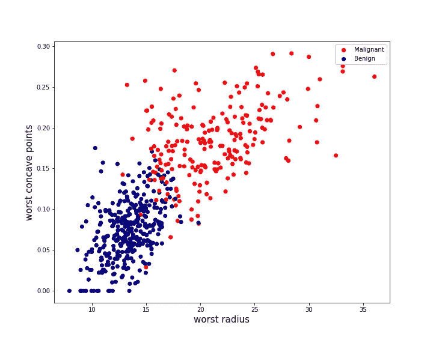

图 8:计划中“最差半径”和“最差凹点”的数据投影。

我们现在的目的是在由两个特征“最差半径”和“最差凹点”形成的二维空间中导出一个函数，以评估发展为恶性乳腺癌的概率风险。为此，下一节将开发一种支持向量机分类器(SVMC)算法

# 二。从 SVMC 推导出概率风险

在本节中，我们构建 SVC 模型，根据两个先前选择的特征来估计发展为恶性乳腺癌的概率风险。首先我们确定 SVC 的超参数。第二次，模型被用于实现计划中的预测(“工作半径”、“最差凹点”)。最终确定与预测相关的概率估计。

**二. 1 超参数的确定**

SVC 旨在确定具有相同标签的数据被重新分组的区域。这些区域由边界界定，这些边界被计算以最大化它们与数据之间的距离。这个距离叫做边缘。为了计算特征空间中的距离，可以使用核。使用核作为非线性函数确实能够模拟更灵活的边界，从而对于数据分离更有效。这里，我们采用一个称为 RBF 的高斯型核，它取决于比例参数γ，使得两点 x 和 y 之间的距离为:

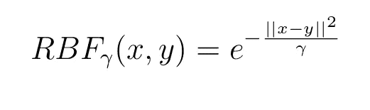

因此，必须调整该伽马参数。除此之外，还必须确定影响边界平滑度的正则化因子 C。由于交叉验证研究，两个参数都是固定的。

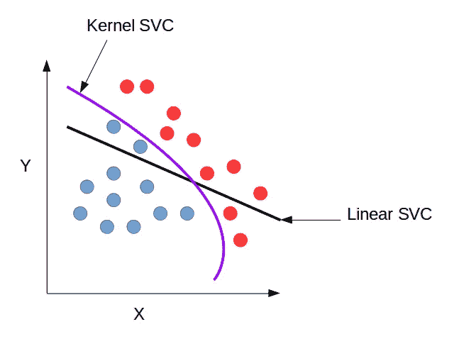

图 9:核 SVC 能够使边界具有更复杂的形状，从而更有效地进行数据分离。

```
def crossvalidateSVC(featNS_all,label_all,gammaonly=True): ''' Realize cross validation operations to determine the best
    SVC's hyperparameters Input:
      featNS_all: [DataFrame] All selected and normalized
                              features
      label_all: [DataFrame] Gathers all the labels
      gammaonly: [Bool] True if the gamma parameter is estimated
                        only, if False C is estimated either
   Output:
      bestgamma:  [Float] The best estimated gamma paramater
      bestc: [Float] The best estimated C parameter if gammaonly
                      is False ''' 
    # If just the gamma parameter is estimated  
    if gammaonly:
        param_grid={"gamma":np.logspace(0,2,200)}
        GridCV=GridSearchCV(SVC(),\
        param_grid=param_grid,scoring="accuracy",cv=10)
        GridCV.fit(featNS_all,label_all) gridcv_fig,ax=plt.subplots(1,1,figsize=(10,8),)
        plt.plot(np.array(GridCV.cv_results_["param_gamma"]),\
        np.array(GridCV.cv_results_["mean_test_score"]))
        plt.xlabel("Gamma")
        plt.ylabel("CV Accuracy")
        gridcv_fig.savefig("gridcv.png")
        plt.show() bestgamma=GridCV.best_params_["gamma"]
        return bestgamma # If both gamma and C are estimated
     else:
        param_grid=\
        {"C":np.logspace(-1,1,10),"gamma":np.logspace(0,2,200)}
        GridCV=GridSearchCV(SVC(),\
        param_grid=param_grid,scoring="accuracy",cv=10)
        GridCV.fit(featNS_all,label_all) gridcv_fig,ax=plt.subplots(1,1,figsize=(10,8),)
        plt.plot(np.array(GridCV.cv_results_["param_gamma"])\
       ,np.array(GridCV.cv_results_["mean_test_score"]))
        plt.xlabel("Gamma",fontsize=15)
        plt.ylabel("CV Accuracy",fontsize=15)
        gridcv_fig.savefig("gridcv.png")
        plt.show()
        bestgamma=GridCV.best_params_["gamma"]
        bestc=GridCV.best_params_["C"] return bestgamma,bestcbestgamma,bestc=crossvalidateSVC(featNS_all,\
label_all,gammaonly=False)
```

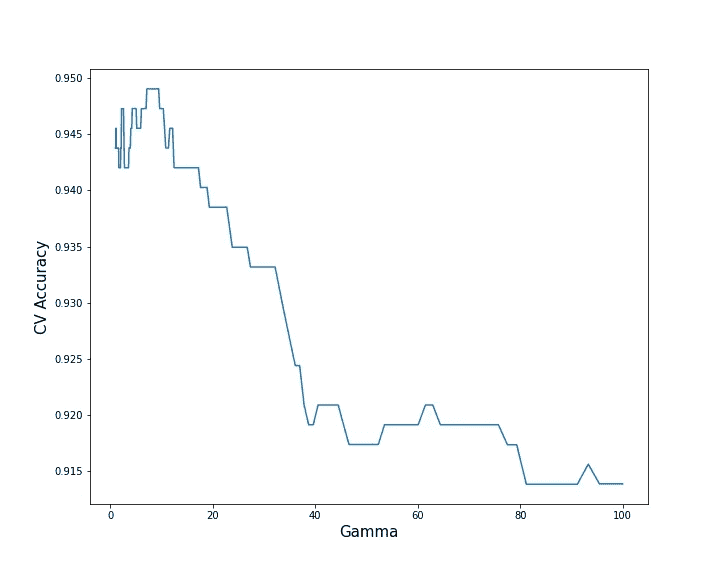

图 9:交叉验证准确度(测试平均值)作为伽马参数的函数。

```
bestgamma,bestc=crossvalidateSVC(featNS_all,label_all,gammaonly=False)
print(“Best Gamma”)
print(bestgamma)
print(“Best C”)
print(bestc)Best Gamma
2.0914343584919426
Best C
2.1544346900318834
```

我们发现，固定𝛾=2.09 和 C=2.15 能够在 10 倍交叉验证数据集中达到 0.9482 的平均测试精度，标准偏差为 0.043。因此，这两个参数的值将在下文中考虑。

```
def trainSVC(gamma,c,featNS_train,label_train):

    '''
    Realize a 10-fold cross validation for a SVC model
    and train a SVC model    Input
      gamma:  [Float] The best estimated gamma paramater
      c: [Float] The best estimated C parameter if gammaonly
                      is False
      featNS_train: [DataFrame] Training selected and normalized
                                features
      label_train: [DataFrame] Training labels Output:
     Svc: [Sklearn Instance] Trained SVC model ''' Svc=SVC(C=c,gamma=gamma,probability=True)
    score=cross_validate(Svc,featNS_train,label_train,cv=10)
    print("SVC CV Mean Testing Accuracy")
    print(np.mean(score["test_score"]))
    print("SVC CV Standard Deviation Testing Accuracy")
    print(np.std(score["test_score"]))
    Svc.fit(featNS_train,label_train)
    return Svcbestgamma=2.09
bestc=2.15
Svc=trainSVC(bestgamma,bestc,featNS_train,label_train)SVC CV Mean Testing Accuracy
0.94829178743961352
SVC CV Standard Deviation Testing Accuracy
0.043399848777455924
```

在测试集上达到的精度为 0.964。

```
predvalid=Svc.predict(featNS_test)
accvalid=accuracy_score(label_test,predvalid)
print("Testing Accuracy")
print(accvalid)Testing Accuracy
0.9649122807017544
```

可以看出，将特征集合减少到最重要的特征，对它们进行归一化，并采用如上所述的 SVC 模型，能够稍微提高测试精度，从 GBTC 的 0.95 提高到 0.96(见图 10)。

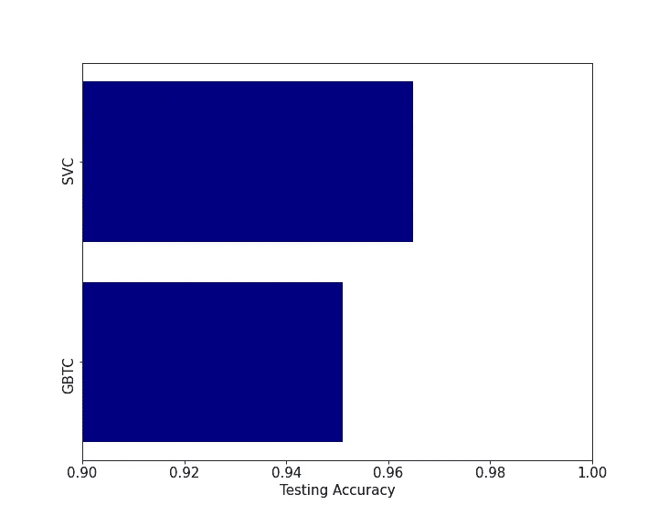

图 10:GBTC 和 SVC 算法的测试精度比较。

**三. 2 预测图**

在训练 SVC 分类器之后，在 2D 空间“最差区域”和“最差凹点”中评估其预测。图 11 显示了这些预测。在图 11 和图 12 中，圆形点代表用于训练的点，三角形点代表用于测试的点。

```
def contpredSVC(Svc,nbpoints,mean_featS,\
std_featS,featS_train,featNS_train,label_train,featS_test,\
featNS_test,label_test,predict_proba=False):'''
   Make predictions in the plan of the two selected features
   using SVC.
   Input:
     Svc: [Sklearn Instance] Trained SVC model
     nbpoints: [Int] Number of points sampling each feature
                      direction
     std_featS: [Array] Standard deviation of each selected
                        feature
     featS_train: [DataFrame] Selected feature training set
     featNS_train: [DataFrame] Selected and normalized feature
                               training set
     label_train: [DataFrame] Training labels  
     featS_test: [DataFrame] Selected feature testing set
     featNS_test: [DataFrame] Selected and normalized feature 
                              testing set
     label_test: [DataFrame] Testing labels
     predict_proba: [Bool] True if a probability risk map
                           is computed, False if label map '''  
    # Determine maximum and minimum normalized values for each
    # selected features and compute the normalized 2D mesh
    minfeat1NS=np.min(featNS_train.values[:,0])
    minfeat2NS=np.min(featNS_train.values[:,1])
    maxfeat1NS=np.max(featNS_train.values[:,0])
    maxfeat2NS=np.max(featNS_train.values[:,1])
    x_arr=np.arange(minfeat1NS,maxfeat1NS,\
   (maxfeat1NS-minfeat1NS)/nbpoints)
    y_arr=np.arange(minfeat2NS,maxfeat2NS,\
   (maxfeat2NS-minfeat2NS)/nbpoints)
    X,Y=np.meshgrid(x_arr,y_arr) # Points (normalized) in the 2D space where the predictions are
    # computed.
    pointstopred=np.array([[X[irange][ipoint],Y[irange][ipoint]]\
    for ipoint in range(len(X[0]))\
    for irange in range(len(X))]) # If a probability risk map is computed
    if predict_proba: # Make prediction with SVC
        valmesh=Svc.predict_proba(pointstopred)
        predsvccont_fig,ax=plt.subplots(1,1,figsize=(10,8),) # Denormalize feature points and plot the predictions 
        denfeat1_arr=pointstopred[:,0]*std_featS[0]+mean_featS[0]
        denfeat2_arr=pointstopred[:,1]*std_featS[1]+mean_featS[1]        
        im=plt.scatter(denfeat1_arr,denfeat2_arr,c=valmesh[:,0],\
        cmap=cm.coolwarm,alpha=1) # If a label map is computed
    else:
        valmesh=Svc.predict(pointstopred)
        predsvccont_fig,ax=plt.subplots(1,1,figsize=(10,8),)
        colors=["red","navy"]

        # Denormalize feature points and plot the predictions 
        denfeat1_arr=pointstopred[:,0]*std_featS[0]+mean_featS[0]
        denfeat2_arr=pointstopred[:,1]*std_featS[1]+mean_featS[1]        
        im=plt.scatter(denfeat1_arr,denfeat2_arr,c=valmesh,
        cmap=matplotlib.colors.ListedColormap(colors),alpha=0.1) # Plot the training data
   plt.scatter(featS_train.values[:,0]\
   [np.where(label_train.values==0)[0]],\
   featS_train.values[:,1][np.where(label_train.values==0)\
   [0]],c="red",s=30,label="Malignant-Training") plt.scatter(featS_train.values[:,0]\
   [np.where(label_train.values==1)[0]],\
   featS_train.values[:,1][np.where(label_train.values==1)\
   [0]],c="navy",s=30,label="Benign-Training") # Plot the testing data
   plt.scatter(featS_test.values[:,0]\
   [np.where(label_test.values==0)[0]],\
   featS_test.values[:,1][np.where(label_test.values==0)\
   [0]],c="red",marker="^",s=30,label="Malignant-Testing") plt.scatter(featS_test.values[:,0]
   [np.where(label_test.values==1)[0]],\
   featS_test.values[:,1][np.where(label_test.values==1)[0]],\
   c="navy",marker="^",s=30,label="Benign-Testing") plt.legend()
   plt.ylim(np.min(featS_all.values[:,1]),\
   np.max(featS_all.values[:,1]))
   plt.xlim(np.min(featS_all.values[:,0]),\
   np.max(featS_all.values[:,0]))
   plt.xlabel(feat_selected[0])
   plt.ylabel(feat_selected[1]) if predict_proba:
        plt.colorbar(im,label="Probability Risk")
        predsvccont_fig.savefig("predsvcproba.png")

        plt.show()
    else:
        predsvccont_fig.savefig("predsvclabel.png")
        plt.show()# Train SVC
nbpoints=150
bestgamma=2.09
bestc=2.15# Plot label map
contpredSVC(Svc,nbpoints,mean_featS,std_featS,featS_train,featNS_train,label_train,featS_test,featNS_test,label_test,predict_proba=False)# Plot probability map
contpredSVC(Svc,nbpoints,mean_featS,std_featS,featS_train,featNS_train,label_train,featS_test,featNS_test,label_test,predict_proba=True)
```

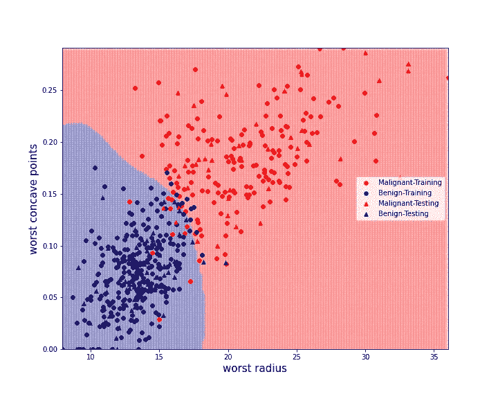

图 11: SVC 在计划中的标签预测“最差半径”和“最差凹点”。彩色点对应于训练集(圆形)和测试集(三角形)的数据。

在 SVC 分类器的情况下，也可以导出预测的概率。对于预测的标注𝑙𝑖，给定预测𝑙𝑖，数据被标注为 1 的概率由下式给出:

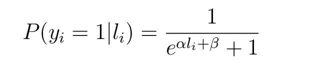

其中常数𝛼和𝛽是在训练过程中通过最大似然优化获得的(见[6])。

使用该模型，图 12 因此在识别的 2D 空间中示出了发展成恶性乳腺癌的估计概率。


图 12:SVC 模型的标签概率评估。它可以被解释为发展为恶性乳腺癌的概率图。

# 三。结论

这项工作是确定 30 个被提议用来评估恶性乳腺癌风险的变量中最重要的两个变量的机会。通过结合层次聚类算法和使用梯度推进的特征重要性估计来选择特征。使用选择的特征建立支持向量机分类器。

获得的机器学习模型与使用所有 30 个变量的其他模型具有相同的可靠性。这种方法的优点是通过计算易于解释的 2D 风险图来简化风险评估。现在需要更多的数据来证实所确定的区域和趋势。

# 来源

[1][https://www . wcrf . org/dietandcancer/cancer-trends/breast-cancer-statistics](https://www.wcrf.org/dietandcancer/cancer-trends/breast-cancer-statistics)

[2][https://towards data science . com/building-a-simple-machine-learning-model-on-breast-cancer-data-ECA 4 B3 b 99 fa 3](/building-a-simple-machine-learning-model-on-breast-cancer-data-eca4b3b99fa3)

[3][https://towards data science . com/how-to-use-scikit-learn-datasets-for-machine-learning-d 6493 b 38 ECA 3](/how-to-use-scikit-learn-datasets-for-machine-learning-d6493b38eca3)

[4][http://archive . ics . UCI . edu/ml/datasets/breast+cancer+Wisconsin+% 28 diagnostic % 29](http://archive.ics.uci.edu/ml/datasets/breast+cancer+wisconsin+%28diagnostic%29)

[5][https://sci kit-learn . org/stable/auto _ examples/inspection/plot _ permutation _ importance _ multicollinear . html # sphx-glr-auto-examples-inspection-plot-permutation-importance-multicollinear-py](https://scikit-learn.org/stable/auto_examples/inspection/plot_permutation_importance_multicollinear.html#sphx-glr-auto-examples-inspection-plot-permutation-importance-multicollinear-py)

[https://en.wikipedia.org/wiki/Hierarchical_clustering](https://en.wikipedia.org/wiki/Hierarchical_clustering)

[6][https://sci kit-learn . org/stable/modules/ensemble . html # gradient-boosting](https://scikit-learn.org/stable/modules/ensemble.html#gradient-boosting)

[7]https://scikit-learn.org/stable/modules/calibration.html