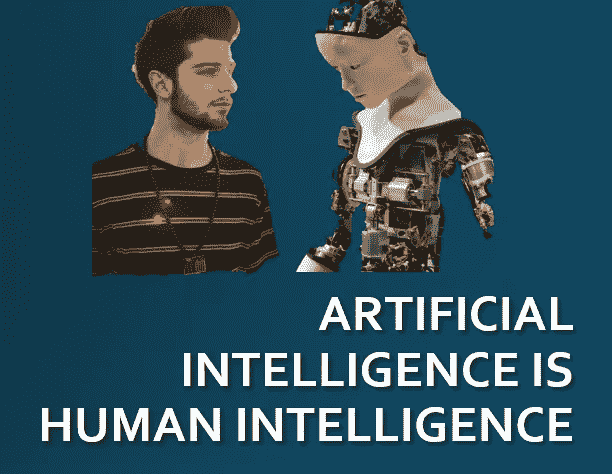

# 人工智能概念和现实生活

> 原文：<https://towardsdatascience.com/ai-concepts-and-real-life-36a51f1917ae?source=collection_archive---------24----------------------->

在过去的两年里，我接触了统计学和数学概念的基础知识，这些知识为我们以 Alexa、Jarvis、Siri 等形式看到的复杂人工智能机器奠定了基础。我觉得这些概念在现实生活中更容易想象。如果我们实际上根据我们在这个世界上的经历来思考这些事情，那么直觉上这些事情是非常清楚的。

人工智能只不过是人类的智能。不是吗？(由 Tejasvi Sharma 利用 [Unsplash](https://unsplash.com/photos/r9iNfhQLrCA?utm_source=unsplash&utm_medium=referral&utm_content=creditCopyText) 上 [Yuvraj Singh](https://unsplash.com/@yxvi?utm_source=unsplash&utm_medium=referral&utm_content=creditCopyText) 的照片和 [Unsplash](https://unsplash.com/s/photos/robot-graphic?utm_source=unsplash&utm_medium=referral&utm_content=creditCopyText) 上[拥有摄影](https://unsplash.com/@possessedphotography?utm_source=unsplash&utm_medium=referral&utm_content=creditCopyText)的照片设计)

**马尔可夫链的概念**——“给定现在，未来有条件地独立于过去”。在我们生活中的任何时候，我们只能控制我们的现在，而我们的现在是整个过去的反映，也就是说，来自我们过去的知识和经验定义了我们现在的状况，我们未来的进步完全取决于我们今天是什么样的，以及我们为过渡到未来更理想的状态付出了多少努力。

**MAP 和 MLE 估计的概念** —最大似然估计是一种参数估计分布的技术，我们观察到的数据实际上来自该分布。我们对某事的看法完全取决于我们过去所目睹的。基于这些经历，我们试图将它们映射到一个内在的表象或概念上。例如，我们在周围看到有钱有势的人，我们试图根据我们在日常生活中看到的东西，形成他们通常长什么样以及他们有什么特点的概念。

MAP 估计扩展了 MLE 的概念，并且还考虑了我们所拥有的分布的先验知识。在这里，我们对某件事情有一个预先的概念或观点，并且基于我们的大脑对我们在日常生活中遇到的最新发现的确信程度，我们对某件事情的内部表征发生了变化。我们在电影中看到有钱有势的人拥有豪华的房子、汽车和生活方式，我们在脑海中形成了一个关于他们的概念。我们在现实生活中也看到有钱有势的人，但我们的思维更新观念不仅仅是基于我们在现实生活中看到的，而是通过一种混合物，包括我们在电影中看到的先前观念。

**联合学习(FL)的概念—** 随着设备上的边缘学习因设备上更高的计算可用性而越来越受欢迎，为了确保数据的隐私性，FL 成为在边缘上学习高效和稳健模型的最佳替代方案。合作学习的想法很有前途，在现实生活中也普遍适用，因为单个个体的经验可能不够充分，也可能有偏差。整合朋友或熟人经验的能力让我们对任何事情都有更好的看法。

**抽样偏倚的概念—** 我们在现实生活中看到的数据总是有偏倚的。这完全取决于我们实际看到的数据样本。稳健的抽样并不能保证，我们在现实生活中看到的对别人有用的东西不一定对我们有用。在现实生活中，我们所目睹和经历的会试图在我们的思想和观点中产生偏见。

**探索和利用的概念—** 作为人类，我们倾向于承担较小的风险，并且我们总是更喜欢已经有人尝试过并且事实证明很棒的东西。因此，在现实生活中，我们也倾向于利用早期的知识，一般来说，一个人探索过去不太重要的东西的机会非常少。

**甘的观念与生成性造型——**当我们试图画风景、动物或任何东西时，我们会有一个我们在现实生活中看到的真实场景或艺术品的平行图像。GAN 也通过尝试学习接近理想行为的分布来做同样的事情，正如 GAN 的模式崩溃问题一样，即它最终会学习数据中的特定峰值，我们在现实生活中也是如此，因为我们最终会在大多数时间创建类似的场景。

**迁移学习的概念** —它非常适用于现实生活，比如我们所学的东西，或者如果我们有关于某件特定事情的经验，我们会尝试将其应用于不同的任务，并可能结合一些变化或学习所需的变化，以成功适应不同的任务。如果我们知道如何骑自行车，学习骑踏板车会变得更容易，如果我们知道如何骑踏板车，学习骑汽车会变得更容易。

**其他一些概念** —

**K 最近的邻居，注意**是一些更常见的平行关系，人们可以从现实生活中得出，以直观地理解为什么复杂的人工智能机器应该工作。

虽然这些事情在现实生活中看起来很直观，但在深度学习中证明它们并不容易，需要一系列聪明的实验。我们在深度学习中控制不同的旋钮，作为超参数、数据集、模型架构等的一部分。来证明因果关系和相关性。