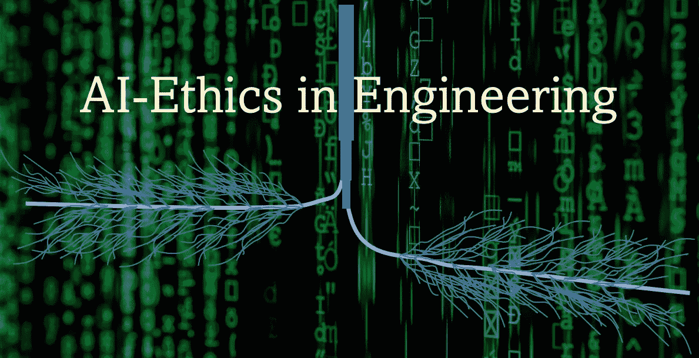
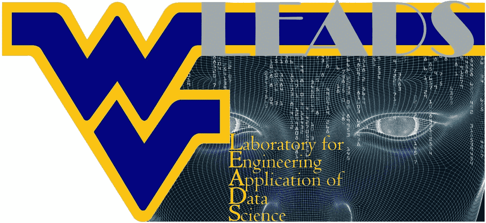
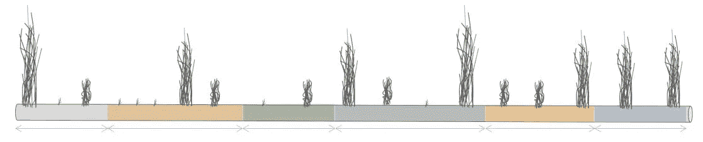
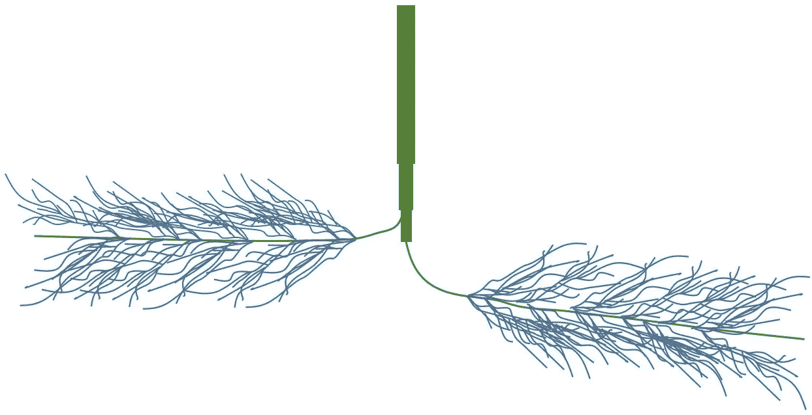
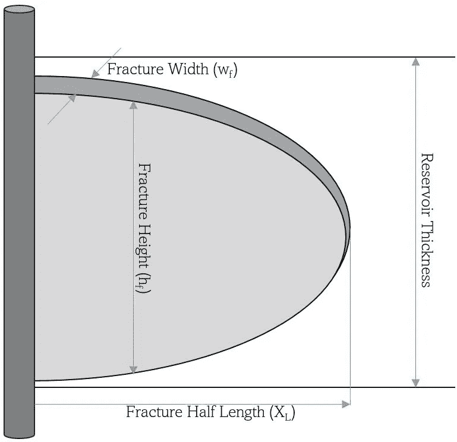

# 人工智能-工程伦理

> 原文：<https://towardsdatascience.com/ai-ethics-in-engineering-437ec07046a6?source=collection_archive---------29----------------------->

## 传统工程师在基于人工智能的物理建模中的偏见——第二部分

作者图片

**概要**

人工智能伦理在工程中的应用

页岩油井生产中的人工智能道德范例

结论

**人工智能伦理在工程中的应用**

传统工程师的偏见(包括主要假设、解释和简化)可以包含在人工智能的工程应用中。这通常是通过从数学方程中生成数据，并将其与实际的现场测量结果(实际的基于物理学的数据)相结合，然后使用这组结合的数据，通过人工智能和机器学习算法对物理学进行建模来完成的。在许多情况下，这种方法被称为“混合模型”。在人工智能和机器学习的工程应用背景下，这种模型是对人工智能和机器学习缺乏现实和科学理解的决定。

人工智能的伦理对工程师和科学家来说很重要，他们已经热衷于使用这项技术来解决工程相关的问题。虽然在过去几年中，人工智能伦理已经成为人工智能和机器学习的非工程应用中的一个重要话题，但现在它在这项技术的工程应用中同样重要。下一节将介绍人工智能和机器学习的工程应用中人工智能伦理的一个具体例子，展示猜测、假设、解释和简化如何帮助传统工程师使用人工智能和机器学习算法来生成一个不切实际和高度偏见的预测模型。这通常发生在他们尝试使用事实和实地测量但没有成功的时候。

似乎在人工智能的工程应用中包含这种偏见背后的原因与缺乏对人工智能必须如何用于建模物理现象的科学理解有很大关系。目前，一些声称使用这项技术的工程应用的个人和公司正在包括大量的人类偏见，以便他们在建立一个不包括人类偏见的基于人工智能的模型失败后，可以使用人工智能解决问题。工程中的人类偏见与如何建立数学方程来解决基于物理的问题有很大关系。

图片作者——**W**est**V**irginia**U**大学 **L** 实验室为 **E** 工程 **A** 应用**D**A**S**科学

人工智能和机器学习对工程问题解决的主要贡献是基于实际测量数据对物理现象进行建模，这将是避免偏见、假设、解释和对物理的先入为主的概念背后的主要核心。由于物理现象建模的传统技术是通过数学方程，它通常包括假设，有时还有偏差。当模拟的物理现象看不见、看不到、甚至摸不着时，这是非常正确的，例如石油工程就是这种情况的一个很好的例子，因为生产的碳氢化合物是一种深层地下流体。当包含假设、解释和简化的数学方程被用来模拟物理现象时，任何其他工程学科也是如此。

储层工程、储层建模和储层管理为石油和天然气行业的运营和服务公司贡献了绝大部分收入。这说明了为什么储层建模在石油工业中是一项非常重要的技术。事实上，模拟油气储层中的流体流动包括大量的假设、解释和简化，因为它们位于地表以下数百或数千英尺。这意味着不可能实际观察、触摸或实际测试油气藏中发生的任何事情。

值得注意的是，储层岩石的某些部分通常被带到地表，并在实验室进行测试和分析，以帮助科学家和工程师了解地下深处多孔介质中流体流动的物理复杂性。然而，绝不能忽视关于这种分析的现实事实。虽然碳氢化合物储层具有大约几亿到几百亿立方英尺的体积，但是被带到实验室进行观察和测试的那部分碳氢化合物储层岩石通常小于几立方英尺。此外，众所周知，油气储层是高度非均质的，这意味着在几平方英寸的岩石上进行的实验室分析不能真实地代表整个储层岩石中发生的情况。

因此，尽管实验室岩心分析是理解碳氢化合物储层中流体流动的重要且有用的过程，但是它们不能真实地代表在数百或数千英尺地下的碳氢化合物储层中数百亿立方英尺范围内发生的所有细节和非均质性。这澄清了用于模拟多孔介质中流体流动的数学方程中存在的假设、解释和简化。此外，当碳氢化合物储层是非传统的，例如目前是美国碳氢化合物生产的主要来源的页岩带时，上述问题变得更加复杂，甚至更加重要。

# 页岩油井生产中人工智能伦理的例子

页岩油气层中完井、水力压裂和流体流动的物理模型中的假设、解释、简化、先入为主的概念和偏差数量如此之多，以至于页岩油井的完井和生产优化的数学模型完全不现实、无用且充满偏差。这是因为了解油气藏中流体流动物理性质的历史细节主要适用于砂岩和碳酸盐岩等常规区块。从十年前开始，这种为常规油藏开发的技术已经推广到非常规油藏。

一个明显的事实是，用于对页岩油井的碳氢化合物生产的物理特性进行建模的数学方程被假设所淹没，并且几乎与事实和现实没有任何关系，因为该技术的主要本质主要适用于常规储层，而不适用于非常规储层。很难找到任何真正的科学家和专业工程师(包括那些已经开发并正在使用这些技术的科学家和专业工程师)声称当前版本的页岩油井水力压裂数学模型与现实有任何关系。

这些事实证明，使用人工智能和机器学习来开发所谓的“混合模型”充满了假设、解释和偏见，与人工智能和机器学习的工程应用现实没有多大关系。当这种数学方程用于产生数据，然后将这种数据与实际油田开发相结合，以建立所谓的“混合模型”时，这种模型可以被强制产生由开发它的人预先确定的输出和结果类型。它消除了机器学习算法的实际和真实特征，这些算法能够基于现实而不是基于猜测和偏见来建模物理。这是一个很好的例子，说明在这项技术的工程应用中，人工智能伦理必须得到解决。

众所周知，当对天然裂缝的非常规储层(如页岩)进行水力压裂时，结果与对常规储层(砂岩)进行水力压裂时的结果截然不同。在页岩中，由于复杂天然裂缝的存在，水力压裂形成了一个“裂缝网络”(如图 1 和图 2 所示)，而不是一个椭圆形的水力裂缝(如图 3 所示的常规油藏)。

如图 1 和图 2 所示，当出于水力压裂目的将液体(水)注入非常规储层时，在注入支撑剂之前，液体开始压裂地层。随着地层开始断裂，断裂的延续将通过岩石中阻力最小的路径。在天然裂缝储层中，阻力最小的路径是天然裂缝网络，而岩石的实际结构(几百万年前没有天然裂缝)具有更大的阻力。因此，天然裂缝储层页岩等非常规资源的水力压裂会产生高度复杂的天然裂缝网络，无法对其进行详细建模。这是因为岩石(页岩)天然裂缝的形状、特征和细节无法在整个储层中观察或测量。非常规油藏中水力裂缝网络的高度复杂形状是非均质性和天然裂缝网络的函数。

作者图片—图 1。天然裂缝储层的水力压裂不能基于真实测量进行建模，因为没有办法识别地下数千英尺的天然裂缝的分布。

作者图片—图 2。天然裂缝储层中的水力裂缝网络

当水力压裂的模型开发在 50 多年前进行时，常规储层中的水力裂缝的形状使用椭圆形进行建模，如图 3 所示。这种传统的水力压裂模型包括四个具体特征，允许使用数学方程对其进行建模。这四个具体特征是(a)裂缝半长，(b)裂缝高度，裂缝宽度，和(d)裂缝传导性。将图 1 和图 2 所示的水力裂缝的形状与图 3 所示的水力裂缝的形状进行比较，可以非常清楚地看出非常规储层与常规储层之间水力裂缝的实际形状有多么不同。

当实际的水力裂缝看起来如图 1 和图 2 所示时，使用图 3 所示的形状对其建模是否有任何意义或与现实有任何关系？这个问题的答案一定很清楚。这是一个很好的例子，说明了数学方程(用于模拟多孔介质中流体流动的物理特性)中包含的假设、解释、先入为主的概念、简化和偏差是如何包含在“混合模型”中的，该“混合模型”将它们与真实的现场测量相结合。

作者图片—图 3。常规油藏水力压裂。

**结论**

当基于人工智能的模型用于决策时，人工智能的伦理已被证明是一个重要的问题。人工智能伦理学可以揭露工程和非工程问题解决的人工智能应用中可能存在的偏见。几项研究，其中一些在本文中被引用，已经显示了种族主义和性别歧视等偏见是如何被包括在通过人工智能伦理学暴露的基于人工智能的模型中的。这篇文章展示了如何将传统工程师开发的假设、解释和偏见纳入人工智能的工程应用中，这被称为工程中的人工智能伦理。

# 参考

Crawford 和 t . Paglen，挖掘人工智能，机器学习训练集中图像的政治，2019 年 9 月—【https://www.excavating.ai/ 

Dastin，亚马逊废除了对女性有偏见的秘密人工智能招聘工具，路透社-旧金山。2018 年 10 月。

[https://www . Reuters . com/article/us-Amazon-com-jobs-automation-insight/Amazon-scraps-secret-ai-recruiting-tool-show-bias-against-women-iduskcn 1 MK 08g](https://www.reuters.com/article/us-amazon-com-jobs-automation-insight/amazon-scraps-secret-ai-recruiting-tool-that-showed-bias-against-women-idUSKCN1MK08G)

戴夫，p。独家谷歌搜索肤色的新措施，以遏制产品的偏见。2021 年 6 月。[https://www . Reuters . com/business/sustainable-business/exclusive-Google-searches-new-measure-skin-tones-curb-bias-products-2021-06-18/？UTM _ medium = tech board . fri . media . 2021 06 18&UTM _ source = email&UTM _ content =&UTM _ campaign = campaign](https://www.reuters.com/business/sustainable-business/exclusive-google-searches-new-measure-skin-tones-curb-bias-products-2021-06-18/?utm_medium=techboard.fri.media.20210618&utm_source=email&utm_content=&utm_campaign=campaign)

Doshi，介绍包容性图像竞赛，2018 年 9 月 6 日，谷歌人工智能产品经理——谷歌人工智能博客

[https://ai . Google blog . com/2018/09/introducing-inclusive-images-competition . html](https://ai.googleblog.com/2018/09/introducing-inclusive-images-competition.html)

郝，k。使人脸识别更少的偏见并不意味着它不那么可怕。麻省理工科技评论。技术政策-人工智能伦理。

[https://www . technology review . com/2019/01/29/137676/making-face-recognition-less-biased-donts-make-it-less-terrible/](https://www.technologyreview.com/2019/01/29/137676/making-face-recognition-less-biased-doesnt-make-it-less-scary/)

这就是人工智能偏见是如何真正发生的——以及为什么它如此难以修复。麻省理工科技评论。技术政策-人工智能伦理。

[https://www . technology review . com/2019/02/04/137602/this-is-how-ai-bias-really-happens and-why-its-so-hard-fix/](https://www.technologyreview.com/2019/02/04/137602/this-is-how-ai-bias-really-happensand-why-its-so-hard-to-fix/)

Lim，h .，机器学习中的 7 种数据偏差，2020 年 7 月 20 日

[https://lionbridge . ai/articles/7-types-of-data-bias-in-machine-learning/](https://lionbridge.ai/articles/7-types-of-data-bias-in-machine-learning/)

辨别人工智能的真实例子。人工智能算法展示偏见和成见的真实例子。2020 年 6 月。

[https://towards data science . com/real-life-examples-of-discriminate-artificial-intelligence-CAE 395 a 90070 sdfg](/real-life-examples-of-discriminating-artificial-intelligence-cae395a90070Sdfg)