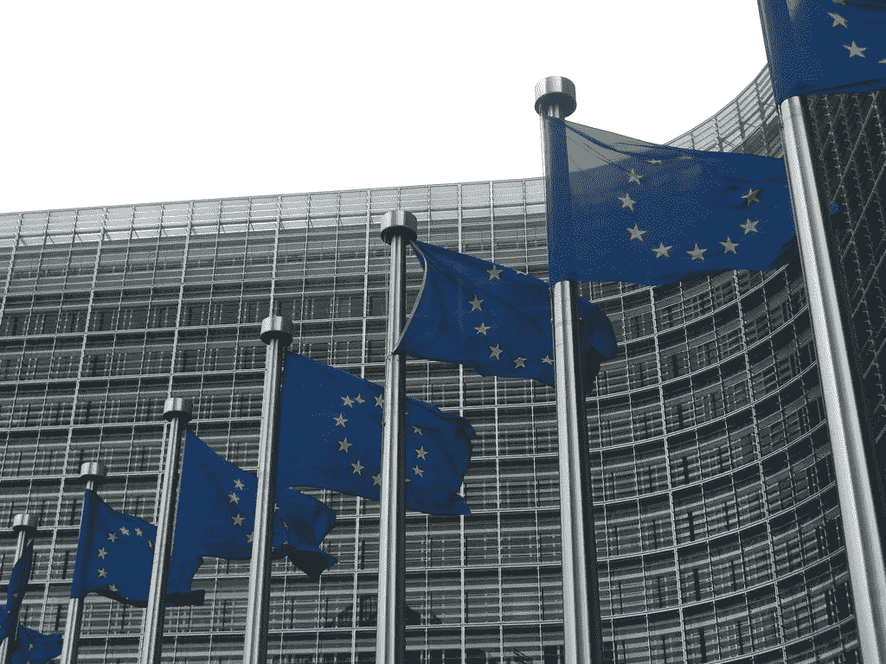
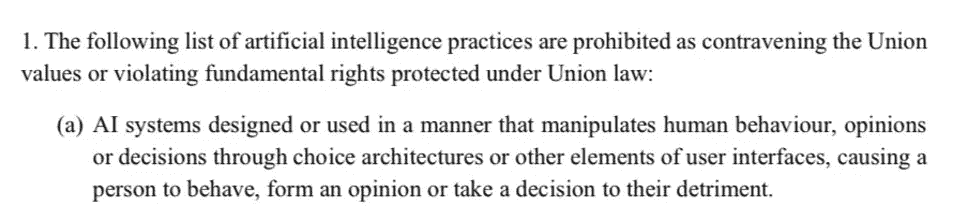
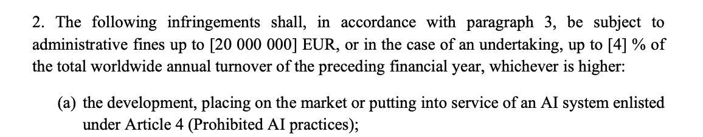
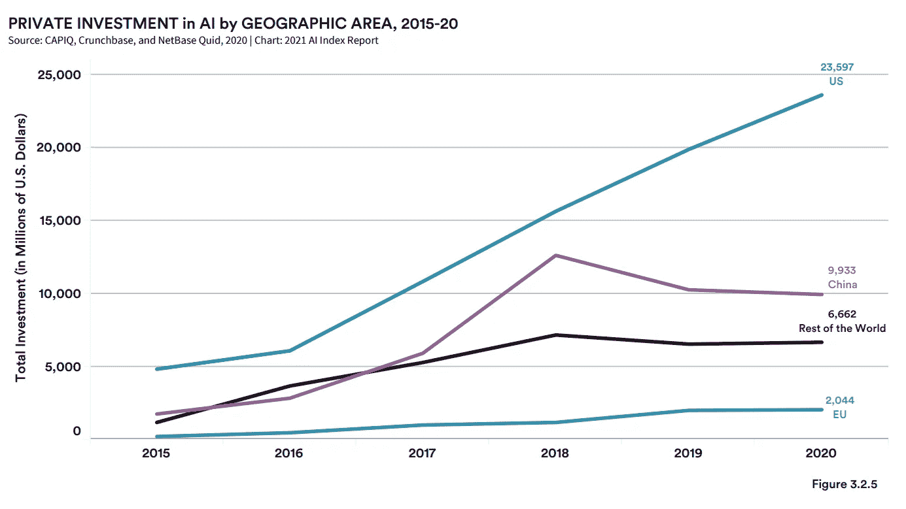
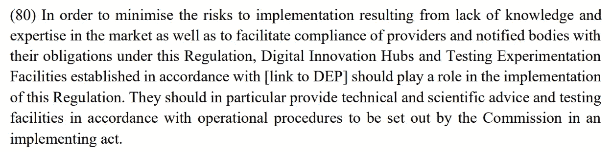
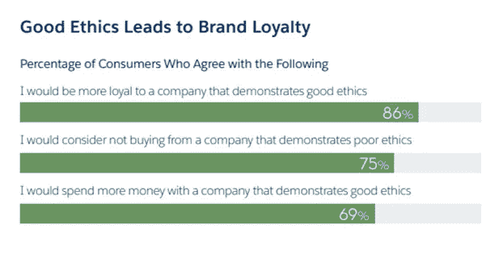

# 人工智能伦理卖…但是谁在买？

> 原文：<https://towardsdatascience.com/ai-ethics-sells-but-whos-buying-c050054ec44?source=collection_archive---------41----------------------->

## 欧盟新的人工智能法规草案已经泄露，再次引发了监管与创新的辩论。监管真的会扼杀欧洲的创新吗？

<https://www.flickr.com/photos/33195821@N00/4592786358>[tiseb](https://www.flickr.com/photos/33195821@N00)的【欧盟委员会】由[CC 2.0](https://creativecommons.org/licenses/by/2.0/?ref=ccsearch&atype=rich)授权

自欧洲人工智能高级专家(HLE)小组提交其[可信人工智能伦理指南](https://ec.europa.eu/newsroom/dae/document.cfm?doc_id=60419)以来，已经过去两年了。该指南确定了人工智能系统应满足的七个关键要求，以确保其值得信赖:

1.  [人力代理和监督](https://ec.europa.eu/futurium/en/ai-alliance-consultation/guidelines/1#Human%20agency)
2.  [技术稳健性和安全性](https://ec.europa.eu/futurium/en/ai-alliance-consultation/guidelines/1#Robustness)
3.  [隐私和数据管理](https://ec.europa.eu/futurium/en/ai-alliance-consultation/guidelines/1#privacy)
4.  [透明度](https://ec.europa.eu/futurium/en/ai-alliance-consultation/guidelines/1#Transparency)
5.  [多样性、不歧视和公平](https://ec.europa.eu/futurium/en/ai-alliance-consultation/guidelines/1#Diversity)
6.  [社会和环境福祉](https://ec.europa.eu/futurium/en/ai-alliance-consultation/guidelines/1#well-being)
7.  [问责](https://ec.europa.eu/futurium/en/ai-alliance-consultation/guidelines/1#Accountability)

正如欧盟委员会[在 2019 年公布指导方针后对](https://digital-strategy.ec.europa.eu/en/policies/european-approach-artificial-intelligence#:~:text=The%20European%20Commission%20has%20welcomed,published%20on%208%20April%202019)的解释，“委员会将在 2021 年提出一个横向监管提案。该提案旨在通过强制高风险人工智能系统满足与其可信度相关的强制性要求，来保护欧盟的基本价值观和权利以及用户安全。例如，确保有人类监督，以及关于人工智能的能力和局限性的明确信息。”从明确的声明和指导方针本身来看，欧洲委员会非常清楚地表明，不道德地使用人工智能系统将是欧洲的一条红线。

## 欧洲人工智能条例草案泄露。它的关键方面是什么？

两年后，我们即将看到欧洲人工智能法规的发布，我们已经有了一份泄露的草案版本，几位专家已经对其进行了分析。虽然[我分享了西班牙 Xataka 的一些初步想法](https://www.xataka.com/pro/filtrado-borrador-regulacion-europea-ia-primeras-impresiones-tres-expertos-materia)(西班牙文)，但 The Verge 的这篇文章是一个很好的起点，可以了解一旦最终文件发布，将会受到哪些监管:

<https://www.theverge.com/2021/4/14/22383301/eu-ai-regulation-draft-leak-surveillance-social-credit?_lrsc=2d15990e-d572-4abb-8204-ef96852847ea>  

如果你正在寻找一个快速(但非常有用)的监管关键方面的总结，我也推荐你阅读迈克尔·维尔(@mikarv)的这个帖子:

## 监管与创新和竞争力

是 [Yoav Goldberg](https://medium.com/u/e6103cf4ea89?source=post_page-----c050054ec44--------------------------------) 的另一条推文让我写了这篇文章:

他在创新和竞争力与监管之间提出了一个非常好的观点，这让我想起了我大约 3 年前写的一篇文章[为什么全球合作是人工智能未来发展的关键](https://dpereirapaz.medium.com/why-global-collaboration-is-key-for-the-future-development-of-ai-81d76786883b)。

## 人工智能会受到不公平的过度监管吗？

后来在同一条线索上，Yoav 提出了另一个非常好的观点，当他们问我对泄露的规定的最初想法时，我也和 Xataka 分享了这个观点:

这是一个敏感的话题。一方面，我完全同意他的观点。为什么我们要对人工智能公司处以高达 2000 万欧元的罚款，因为在线博彩公司通过操纵人的行为或决定已经并仍在造成类似的伤害？

泄露的欧洲 AI 法规草案—[https://www . politico . eu/WP-content/uploads/2021/04/14/AI-draft . pdf](https://www.politico.eu/wp-content/uploads/2021/04/14/AI-Draft.pdf)

泄露的欧洲 AI 法规草案—[https://www . politico . eu/WP-content/uploads/2021/04/14/AI-draft . pdf](https://www.politico.eu/wp-content/uploads/2021/04/14/AI-Draft.pdf)

另一方面，我们现在应该意识到某些特征分析、监控和营销做法可能对边缘化群体造成的伤害，以及人工智能如何有助于放大这种伤害。

我认为这份草案已经存在的事实对欧洲来说是个好消息，因为这意味着至少在明确的监管方案方面取得了进展，同时，我真的觉得这份泄露的版本是在最终版本出台之前征求公众意见的一个呼吁。

## 监管是要扼杀欧洲的 AI 创新，还是已经死了？

[几天前，我们有机会在世界经济论坛](https://www.forbes.com/connect/event/thriving-in-an-increasingly-digitalized-world/)上与 AI 的负责人 Kay Firth-Butterfield 讨论，她向我们传达的一个信息是，在当前的世界竞争场景下，欧洲不能允许自己怀疑。缺乏已公布的法规，同时，对法规一旦公布将非常严格的预期，使得欧洲对人工智能的私人投资远低于美国或中国。

2015-20 年按地理区域划分的人工智能私人投资。AI Index Report 2021，在[Attribution-no derivatives 4.0 International(CC BY-ND 4.0)](http://creativecommons.org/licenses/by-nd/4.0/)下使用，作为其[作者](https://hai.stanford.edu/research/ai-index-2021)允许的[。](https://aiindex.stanford.edu/wp-content/uploads/2021/03/2021-AI-Index-Report_Master.pdf#page=6&zoom=100,0,0)

我们今天分析的泄露的法规可能不是最好的，但至少它开始明确公民的权利和制造人工智能解决方案的公司以及实施这些解决方案的公司/公共机构的义务。

## 我的两个辩论问题

最后，在监管与创新的二分法中，我们应该问监管和我们自己两个主要问题:

*   首先，也是竞争力方面最重要的一点:我们是否建立了正确的机制，让创新能够以有竞争力的方式扩大规模？是监管真正扼杀了欧洲的创新，还是随之而来的官僚主义？我们应该让人工智能公司更容易试验和构建解决方案，而没有管理负担或通过复杂的数字创新中心结构。我真的希望最后文件能以明智的方式解决这个问题。

泄露的欧洲 AI 法规草案—[https://www . politico . eu/WP-content/uploads/2021/04/14/AI-draft . pdf](https://www.politico.eu/wp-content/uploads/2021/04/14/AI-Draft.pdf)

*   我们真的想要在高风险场景(例如，获得司法、工作、医疗保健等)中的创新(不仅是人工智能，还有人工智能)吗？)在可能对某些群体造成伤害和歧视时，不透明、不可解释、不受监督？

## 让世界变得更美好

这最后一个问题把我们带回了本文的标题。道德销售…但是谁在买？(抱歉不抱歉，我是一个 Megadeth 的音乐迷，如果你抓住了提到[他们的专辑](https://g.co/kgs/AZsYKD)，加分)。一方面，我认为人们越来越意识到技术(不仅仅是人工智能)的某些用途的社会影响，良好的道德规范显然会带来品牌忠诚度:

道德领导力与商业 2018 — Salesforce 研究

另一方面，我看到欧洲初创企业的领导者担心这一新规定会降低他们的竞争力。我完全同意欧洲特别擅长制造行政负担，这是这项新法规的一大风险。

试图像美国或中国那样在人工智能领域创新，欧洲已经输掉了这场竞争力竞赛。为什么欧洲不专注于应用技术的不同方式，特别是人工智能，通过帮助应对社会挑战，使我们真正与众不同？拜托，我们不是要让世界变得更美好吗？:)

HBO 硅谷的 TechCrunch 事件恶搞

## 你认为是什么在扼杀欧洲的 AI 创新？

现在说真的，如果你在欧洲从事人工智能工作，我很乐意通过完成下面的调查来获得你对这个相关主题的投入。你认为欧洲真正扼杀 AI 创新的是什么？也请在评论区留下你的想法。

*如果你喜欢阅读这篇文章，请* [*考虑成为会员*](https://dpereirapaz.medium.com/membership) *以便在支持我和媒体上的其他作者的同时，获得上的所有故事。*