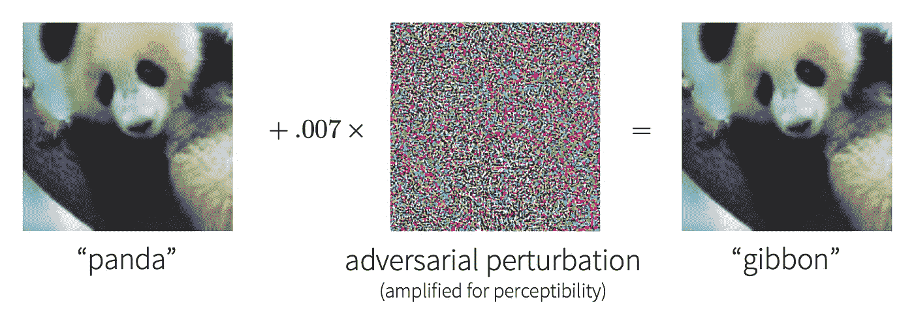
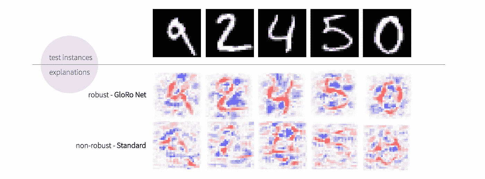

# 人工智能的可解释性需要鲁棒性

> 原文：<https://towardsdatascience.com/ai-explainability-requires-robustness-2028ac200e9a?source=collection_archive---------12----------------------->

## [模型可解释性](https://towardsdatascience.com/tagged/model-interpretability)

## 对抗输入扰动的鲁棒性如何影响模型的可解释性

[纳加拉·奥约多](https://unsplash.com/@nagaranbasaran?utm_source=medium&utm_medium=referral)在 [Unsplash](https://unsplash.com?utm_source=medium&utm_medium=referral) 上的照片

由于它们的不透明性，深度神经网络的明显能力有很大的神秘性。因此，我们经常希望通过对模型行为的*解释*来更好地了解我们的模型。与此同时，正如我们将看到的,*对立例子的存在——已知困扰典型神经网络的*—意味着解释将经常难以理解。幸运的是，最近试图寻找训练所谓的*健壮*模型的方法的努力揭示了一条通向更多可解释模型的道路；也就是说，被训练成对对抗性输入扰动具有鲁棒性的模型表现出更高质量的解释。

# 解释和可解释性

在机器学习的背景下，一个*解释*泛指一些帮助我们理解模型行为的结构。最常见的是，这是通过*属性方法*实现的，该方法量化了模型在特定输入上使用其每个特征的程度。

通常解释的消费者是人类，所以我们需要一种解释解释的方式。例如，在图像分类器的情况下，我们可以通过突出显示模型认为最相关的图像部分来可视化解释。如果一个解释能够传达有用的洞察力，并且能够被检查该解释的人容易理解，则该解释可以被认为是*可解释的*。同样，如果为模型产生的解释通常对人类有意义，我们通常将模型本身称为*可解释的*或*可解释的*。

虽然产生解释的方法有很多，但我们将专注于数学上严格的方法(例如[1])，这些方法产生的解释与模型的实际行为有因果关系，我们将这种属性称为*忠实度*。这确实是一个非常重要的属性——如果一个直观的解释不能准确描述模型的行为，那么它更容易误导人。因此，我们应该抵制诱惑，通过寻求总是试图产生可解释的解释的解释方法来“改进”我们的解释，因为它们可能偏离忠实于模型。

在这种情况下，我们看到*缺乏可解释性实际上是一个* ***模型*** 的内在问题。本文的剩余部分将探索这种洞察力的一个关键实例。

# 对立的例子

*对立示例*是模型的输入，其中*类似于*一个类(例如，“熊猫”)，而被模型分类为另一个类(例如，“长臂猿”)。虽然相似性的概念是模糊的，但我们通常认为它意味着一个对立的例子是通过以一种语义上无意义的方式干扰一个自然的输入而得到的，例如，干扰可能小到人眼察觉不到，或者在给定的上下文中仅仅是不明显的。

一个典型的对抗性例子，改编自 [Goodfellow 等人](https://arxiv.org/pdf/1412.6572v1.pdf)【3】，其中一幅熊猫的图像被不知不觉地操纵，以欺骗神经网络预测“长臂猿”。

对立的例子会影响易受其攻击的神经网络的可靠性，并在安全关键的 ML 系统中构成安全问题，因为它们会导致看似良性的输入出现意外的错误行为。

通过更仔细的观察，我们可以清楚地看到，对立例子的存在对可解释性也有影响。具体来说，对立例子的存在意味着，合理的解释可能会和对立例子本身引发的反常行为一样令人困惑。

考虑下面的思维实验(如下图所示)。假设我们有一个图像，比如图中左边的熊猫图像，我们的模型正确地将它标记为“熊猫”。此外，让我们假设将图像角落的一个像素更改为红色会导致模型产生与“熊猫”不同的标签

举例说明一个解释是如何令人费解，但却是合理的。图片作者。

当我们询问模型为什么将原始图像标记为熊猫时，我们可能会得到一个解释，只突出显示图像角落的单个像素，如图所示。虽然这种解释肯定令人困惑，但当我们考虑模型行为的背景时，实际上有一个关于为什么这种解释是合理的争论。毕竟，如果不是原始图像中该像素的值，标签可能不会是“熊猫”。因此，有理由认为该像素在模型决定将图像标记为“熊猫”时非常重要

这表明，为了让一个模型具有可解释性，它必须根据人类基本上可以理解的特征做出决策。此外，如果没有足够的正则化，我们不能期望模型会自然地学习人类可理解的特征。毕竟，有许多方法可以使用与训练数据一致的特征，但是显然不是所有的特征都是可理解的。

# 稳健模型

为了防御敌对的例子，我们通常的目标是获得所谓的*健壮的*模型，它可以抵抗恶意的干扰。这些防御通常是为一类特定的对抗性例子量身定制的，这些例子可以在不依赖于人的感知的情况下被精确定义，即*小规范*对抗性例子。

顾名思义，小范数对抗例子是指扰动的范数低于某个小阈值，通常用ε表示。换句话说，对立示例离原始输入的距离(根据某种度量，例如欧几里德距离)小于ε。就感知而言，当ε足够小时，ε-接近原始输入的任何点将在感知上与原始输入无法区分。

我们说一个模型在一个点 *x* 上是*局部鲁棒的* t，如果在距离*x*ε的距离内的所有点从该模型接收到与 *x* 相同的标号。因此，我们看到小范数对立的例子不能从模型局部鲁棒的点导出。*鲁棒模型*通过努力在尽可能多的点上实现局部鲁棒性来抵抗对立的例子。

对于产生稳健模型的各种方法已经有了大量的研究。例如，一个流行的方法系列是*对抗训练*【4】，其中训练集在训练期间通过对抗扰动来扩充——本质上，网络是根据对抗的例子来训练的。虽然对抗性训练通常提供了一个体面的经验防御，但它并没有提供任何*保证*让我们知道哪些点(如果有的话)是真正的局部稳健的。

或者，我们可能希望提供*可证明的* *保证*的健壮性，而不是使用像对抗训练这样的启发式防御。例如，[GloRo Nets](/training-provably-robust-neural-networks-1e15f2d80be2)【2】，一种设计为构造稳健的新型神经网络，提供了一种最先进的方法来训练具有稳健性保证的模型。(关于 GloRo Nets 如何实现健壮性的速成课程，请查看我关于这个主题的[博客帖子](/training-provably-robust-neural-networks-1e15f2d80be2))。

# 鲁棒性和可解释性

直觉上，当一个模型是鲁棒的时，它不能严重依赖于难以察觉的模式来做出决策——否则，这些模式可能会被不显眼地添加到自然图像中，从而将网络引入歧途，导致对立的例子。易勒雅斯等人[5]在工作中更正式地提出了这一点，他们认为，从广义上讲，在“健壮特征”和“非健壮特征”之间存在着二分法后者负责对立的例子，本质上是不可解释的。另一方面，健壮模型被劝阻不要学习这些非健壮的特征，这意味着它们将主要使用人类至少能够*感知*的特征，从而提供可解释性的机会。

在实践中，这导致稳健模型展示的解释远比非稳健模型的解释更容易理解。下图显示了这样一个例子。

说明如何提高稳健模型解释质量的示例。图片由作者提供，来源于 [MNIST](http://yann.lecun.com/exdb/mnist/) 数据集。

在图中所示的示例中，我们在 MNIST 数据集上训练了两个简单的卷积网络模型:一个使用标准训练进行非稳健训练(下图)；另一个使用 [GloRo 训练](https://github.com/klasleino/gloro)【2】进行训练，产生一个*可证明的* *健壮的*模型(上图)。然后，我们使用 [TruLens](https://www.trulens.org) 库，在测试输入样本上计算并可视化两个模型的基于梯度的输入解释。在可视化中，红色区域对应于如果其亮度被放大将*增加*正确类别的置信度的像素，而蓝色区域对应于如果变亮将*降低*置信度的像素。

直觉上，最正相关的(红色)像素应该是那些对应于每个图像中手写数字的像素。我们看到，在健壮的模型上，显著的像素确实符合这种直觉。另一方面，对非稳健模型的解释要嘈杂得多，似乎表明该模型不太关注实际数字，而对不相关的伪像更敏感。

# 摘要

从根本上说，高质量的解释需要高质量的模型，因为解释的目的是准确地阐明模型的行为。同时，事情的核心是，缺乏健壮性是模型质量和概念合理性的问题。因此，健壮性是模型质量的基本要求，是确保可解释性的必要条件。然而，我们应该清楚，仅仅是健壮性可能并不总是保证一个模型以合理的方式使用特性。换句话说，虽然健壮性不一定足以保证概念上的可靠性，但它是必要的；因此，每当我们需要可解释的模型时，我们应该在工具箱中保持健壮性。

# 参考

1.  深度卷积网络的影响导向解释。ITC 2018。 [ArXiv](https://arxiv.org/pdf/1802.03788.pdf)
2.  整体强健的神经网络。ICML 2021。 [ArXiv](https://arxiv.org/pdf/2102.08452.pdf)
3.  解释和利用对立的例子。ICLR 2015。 [ArXiv](https://arxiv.org/pdf/1412.6572v1.pdf)
4.  迈向对抗攻击的深度学习模型。ICLR 2018。 [ArXiv](https://arxiv.org/pdf/1706.06083.pdf)
5.  易勒雅斯等人。“对立的例子不是错误，它们是特征。”NIPS 2019。 [ArXiv](https://arxiv.org/pdf/1905.02175v3.pdf)