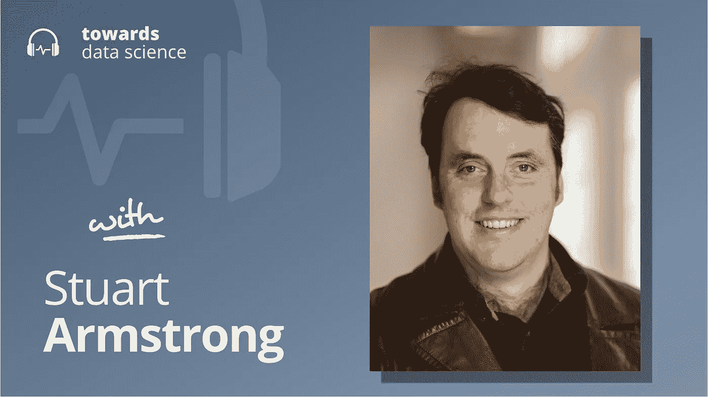

# 人工智能:人类的终极目标？

> 原文：<https://towardsdatascience.com/ai-humanitys-endgame-e3d93e0f9969?source=collection_archive---------22----------------------->

## [播客](https://towardsdatascience.com/tagged/tds-podcast)

## 斯图亚特·阿姆斯特朗谈人类遥远的未来，以及事情可能会变得惊人地好(或可怕地坏)

[苹果](https://podcasts.apple.com/ca/podcast/towards-data-science/id1470952338?mt=2) | [谷歌](https://www.google.com/podcasts?feed=aHR0cHM6Ly9hbmNob3IuZm0vcy8zNmI0ODQ0L3BvZGNhc3QvcnNz) | [SPOTIFY](https://open.spotify.com/show/63diy2DtpHzQfeNVxAPZgU) | [其他](https://anchor.fm/towardsdatascience)

矛盾的是，预测人类遥远的未来可能比预测我们不远的未来更容易。

下一个时尚，下一个网飞特辑，下一任总统——所有这些几乎都是无法预测的。这是因为它们依赖于太多琐碎的因素:下一个时尚可能是由某人心血来潮拍摄的病毒视频引发的，嗯，下一个网飞特辑或总统也可能是如此。

但是说到预测人类遥远的未来，我们可能会奇怪地站在更坚实的基础上。这并不是说可以满怀信心地做出预测，但至少可以基于经济分析和第一原理推理做出预测。大多数分析和推理指向两种情况之一:我们要么达到我们作为一个物种从未想象过的高度，要么我们关心的一切在一场宇宙规模的灾难中消失。

作为本期播客的嘉宾，斯图亚特·阿姆斯特朗，很少有人花更多的时间思考人类文明可能的终结。斯图尔特是牛津大学人类未来研究所的研究员，他在那里研究我们人类面临的各种生存风险，他的大部分工作都专注于人工智能带来的风险。斯图尔特是一个迷人而全面的思想家，他有一个全新的视角来分享你能想象到的一切，我强烈建议听一听这一集。

以下是我最喜欢的一些外卖食品:

*   总的来说，斯图尔特认为超智能人工智能系统更有可能对人类有益，但他认为如果管理不当，它们也有很大的可能性(20%至 40%)会导致灾难。正确管理它们并不容易:这需要我们找到控制和调整人工智能系统的方法，这些系统可能比我们自己更聪明，具有我们的价值观。斯图尔特乐观地认为这是可以做到的。
*   斯图尔特认为人类水平的人工智能和超越几乎是不可避免的(他给出了大约 97%的可能性，假设我们事先没有消灭自己)。他如此自信的原因是我们已经知道人类级别的 AI 是可能的(自从人类存在以来)。唯一剩下的问题是，我们是否可以在芯片上或以增强的半生物形式复制人脑，或者设计模仿或超越其功能的算法。
*   OpenAI 最近开发的大规模语言模型 GPT-3 让许多人工智能研究人员相信，转型人工智能或人工通用智能可能会比他们预期的更快出现。然而，Stuart 认为它应该有相反的效果:他将 GPT-3 视为复制人类写作风格比我们预期的更容易的证据，但矛盾的是，这可能使 AGI 更难达到。这是因为许多人认为，人工智能像人类一样写作的能力是其达到一般智力程度的重要指标。但是，如果没有一个普遍智能的系统就能做到这一点，那么我们就不能把写作作为普遍智能的决定性基准，这就使得跟踪和指导 AGI 的进步变得更加困难。
*   斯图尔特指出，可能的“思想”空间很可能比人类所能想象的要大得多。拥有与我们完全不同——并且可能更丰富——的主观体验的人工智能有朝一日很可能会存在，我们将需要决定是否要像珍视人类生命一样珍视它们。这些看起来像是科幻小说作家的问题，但根据目前技术发展的速度，我们迟早会被迫面对这些问题，这似乎是不可避免的。

你可以[在这里查看斯图尔特的作品](https://www.fhi.ox.ac.uk/team/stuart-armstrong/)，或者[在推特上关注我](https://twitter.com/jeremiecharris)

## 播客中引用的链接:

*   参见 Stuart 关于人工智能和存在主义风险的文章[。](https://www.lesswrong.com/users/stuart_armstrong)

## 章节:

*   0:00 介绍
*   0:52 斯图尔特的背景
*   3:27 对未来的担忧
*   7:30 身体方面
*   11:59 人工智能风险场景
*   13:38 校准问题
*   18:37 一致性问题
*   28:17 安全超级智能
*   29:35 神谕与 AI 安全
*   39:55 时间线
*   45:29 制作物理试卷
*   54:16 德雷克方程
*   1:02:13 人类的联系
*   1:10:26 总结

## 请查看下面的文字记录:

杰瑞米·哈里斯(00:00:00):
大家好。欢迎回到迈向数据科学播客。今天，我们采访了牛津人类未来研究所的研究员斯图亚特·阿姆斯特朗。现在，Stuart 做了一些非常有趣的工作，找出了一般形式的人工智能必须具备的一些属性，以使它们安全和令人满意。他不仅和人类未来研究所的人一起做这项工作，也和像 Deep Mind 这样的公司的人一起做。

Jeremie Harris (00:00:23):
他是一个深思熟虑的人，他正在处理重要而有趣的问题，这些问题是人类在未来某个时候必须要解决的，所以获得他对所有这些问题的观点是非常有趣的，我希望你和我一样喜欢这次谈话。

杰瑞米·哈里斯(00:00:36):
嗨，斯图尔特。非常感谢你参加我的播客。

斯图亚特·阿姆斯特朗(00:00:37):
谢谢。

Jeremie Harris (00:00:39):
你在播客中讨论了很多不同的话题。不过，首先，我想了解一下你的简历。你是如何发现这个空间的，你的旅程是什么？

斯图亚特·阿姆斯特朗(00:00:52):
在人工智能和生存风险领域，我是如何成为一名睿智的老人的？可能吧。开始很简单。我在做数学。我听说了 FHI。在那里解决问题似乎非常酷。我试着找份工作。我失败了。我在附近工作的时候在那里闲逛。最终，他们同情我，给了我一份工作，从那以后我一直在那里工作。在这一过程中的某个时刻，他们让我深刻地、个人地关心这些问题，这对他们来说是一个有点混蛋的举动。所以，在可预见的未来，我被困在那里了。

Jeremie Harris (00:01:41):
这些问题是什么？有哪些让你着迷的事情？

斯图亚特·阿姆斯特朗(00:01:44):
我们所做的许多工作都是为了人类遥远的未来。最初，我认为这三个主题是人类的进步，人类面临的风险，存在的风险，以及积极的，人类最大的潜在积极因素。但事实表明，我们在所有这些领域都没有同等的影响力，它们也不是同等重要。人类的增强看起来并不像人们最初认为的那样强大，或者现在看起来并不强大。尤其是人们所想的生物增强。

斯图亚特·阿姆斯特朗(00:02:33):
在不久的将来，智能手机可能会比任何记忆药物更能增强人类的能力。这方面还有一些工作要做。好的一面是，我们在那里实际上做不了什么。看起来，相信未来会整理出它自己的积极面，实际上是很有成效的，很难超越这个底线。但是，从存在风险和规避风险的角度来看，事实证明它有大量的正回报。

斯图亚特·阿姆斯特朗(00:03:15):
所以，我们并没有打算悲观失望，末日即将来临，但事实证明，这是更有成效的工作领域。

Jeremie Harris (00:03:27):
我可以想象，因为从某种道德角度来看，我听到的一种观点是，人们会说，“看，遥远的未来还很遥远。我们为什么要关心它？”所以我想这是你花了很多时间思考的事情，为什么深切关注人类遥远的未来？有什么想法吗？促使你朝那个方向发展的一些考虑是什么？

斯图亚特·阿姆斯特朗(00:03:54):
从模糊的角度来看，遥远的未来还很遥远。如果我们确切地知道将会发生什么，如果我们知道 200 代后我们后代的名字，并且确切地知道根据我们的所作所为他们将会有什么样的命运，那么这将是一个更接近的故事。人无论存在于何时何地，都是人。

斯图亚特·阿姆斯特朗(00:04:22):
现在，有一部分批评不太道德，但更实际，那就是我们对未来的力量会减弱或非常小，假设我们拥有强大的人类力量或一万年后的人类会是什么样子可能是非常傲慢的。

斯图亚特·阿姆斯特朗(00:04:42):
在这种情况下，距离是一个不那么专注的理由。这就是存在性风险的来源，所以我们关注的是未来 100 年或 200 年中的存在性风险，或者更短的时间，因为如果人类灭绝了，我们知道的关于遥远未来的事情是不会有存在性风险。

斯图亚特·阿姆斯特朗(00:05:12):
举例来说，如果此时此刻，我们阻止了人类被消灭，这将对遥远的未来产生巨大的影响，因为它允许人类遥远的未来存在。实用的论点不适用于避免存在风险。

Jeremie Harris (00:05:29):
你认为最有可能发生的风险是什么？

斯图亚特·阿姆斯特朗(00:05:34):
根据风险的可预测性、致命性和其他一些因素，所有的风险都有不同的等级。如果我们从天平的一端看，一个潜在的生存风险是流星撞击。我们实际上很…我们在这方面有很好的数据。我们正在计算大小，各种…我们正在计算各种大小的小行星，观察它们的轨迹，估计它们与地球相交的频率等等，我们一直在获得越来越好的数据。

斯图亚特·阿姆斯特朗(00:06:13):
事实证明，这种风险很低。低到我们可以忽略它半个世纪或一个世纪。到那时，如果我们继续作为一个技术文明，我们可能能够保护自己免受其害。

Jeremie Harris (00:06:32):
对于这类事件，风险是什么？

斯图亚特·阿姆斯特朗(00:06:36):
我不记得了。这些数字非常低。

杰瑞米·哈里斯(00:06:41):
所以我们可以相信它会从技术上解决问题？

斯图亚特·阿姆斯特朗(00:06:45):
是的。我的意思是，它值得关注，而且有人在关注它。事实上，这是另一件积极的事情，人们正在为此努力。有趣的是，几乎在我们意识到风险比我们想象的要低的同时，人们开始更认真地对待风险。

杰里米·哈里斯(00:07:02):
哦，哇。

斯图亚特·阿姆斯特朗(00:07:02):
与其说是科幻，不如说是现实。我们承担风险的认真程度似乎与风险发生的可能性完全无关。

Jeremie Harris (00:07:15):
你认为这与想象有多容易有关吗？因为当我想到人们便便的许多风险时，像流行病可能是一个伟大的经典例子，因为我们正在经历它，但在 2019 年，不可能想象整个世界被封锁，等等，等等。

Jeremie Harris (00:07:30):
然而，像小行星撞击这样的事情，其动力学和物理学方面的东西可能更令人信服。你认为那是它的一部分吗？或者说，还有别的解释吗？

斯图亚特·阿姆斯特朗(00:07:40):
我认为事物只是在流行。也许是因为这方面的工作很少，所以谈论小行星撞击的人可能更倾向于边缘人，或者不是很多。但是当你让严肃的科学家就这种风险举行会议时，它就变得值得尊敬了。这似乎是动态的一部分。

斯图亚特·阿姆斯特朗(00:08:07):
此外，我们为之前的风险做准备，所以这是为疫情准备的。我非常肯定，我们在 2022 年将比 2019 年有更好的抗流行病能力。

Jeremie Harris (00:08:22):
在这种情况下，我们将面临一种风险，如果这种风险成为现实，它可能只会发生一次，然后人类文明就此结束。那些风险，我们无法从中吸取教训，我们无法在一代人之间或一代人之内更好地应对它们。有哪些风险属于这一类，因为我知道你也花了很多时间思考这些问题。

斯图亚特·阿姆斯特朗(00:08:44):
这是我们主要面临文明崩溃或技术风险的地方。这一领域的第一名是 AI，即人工智能，这是一个非常令人讨厌的风险，很难预测。与小行星风险不同，如果你愿意，一端是最容易预测的，而另一端是最难预测的。我们真的不知道我们可能开发的任何机器的能力可能是什么。我们甚至不知道它是否危险，尽管有强有力的论据表明它应该是危险的，我们也不知道它的能力。

斯图亚特·阿姆斯特朗(00:09:33):
我们不知道如何控制它。我们不知道社会会是什么样子，是否可以利用社会的缺陷等等。但是，尽管 AI 发生的风险可能相对较低，但其中一个原因是，科幻小说和故事往往会让我们认为发生了大的坏事，文明立即崩溃，根据故事的寓意，每个人都会死，或者一群勇敢的冒险家重建文明。

斯图亚特·阿姆斯特朗(00:10:12):
但实际上，纵观历史，这两件事并不经常发生。文明不会轻易崩溃。有时他们会分裂，但国家不会轻易倒下，除非他们周围有敌对团体，否则他们不会一直倒下。甚至当你处于无政府状态时，比如最近的索马里和中国，我认为，在 20 年代，30 年代可能算…但即使在那个时期，也不是每个人都大规模死亡。在某些地方，这是可以忍受的。

斯图亚特·阿姆斯特朗(00:10:59):
所以，这不仅仅是件大事。一颗足够大的小行星可能会杀死所有人，但是一颗中等大小的小行星可能会扬起很多灰尘，然后它们会对文明造成巨大的压力。这不会是一个美好的时代，但很可能人类真的会挺过来。

斯图亚特·阿姆斯特朗(00:11:22):
人工智能的风险在某种意义上是相反的。相比之下，它变得非常糟糕的风险相对较低，但如果它真的变得糟糕，文明崩溃和灭绝的风险要高得多，这只是因为如果一个强大的人工智能是一个对手，它是一个智能的建议，而不像疾病那样，它只会随着时间的推移而自我毁灭，智能的对手会随着你变弱而变强。

Jeremie Harris (00:11:59):
你认为会出现什么情况？我想象有几个不同的场景，但如果你必须概括人工智能的风险场景，你能讲什么故事来呈现它？

斯图亚特·阿姆斯特朗(00:12:11):
有三个因素。第一个是我们可能会开发出非常智能的机器。不一定要从意识的角度来思考，因为那会引发另一场辩论，而是非常熟练的行为，解决问题，解决所有智力可以处理的问题。如果我们这样做了，他们可能会变得非常强大，就像与黑猩猩或大猩猩相比，人类在自然界中非常强大一样。或者，几乎所有的大型哺乳动物，主要是因为人类决定让它们生存下来。

斯图亚特·阿姆斯特朗(00:12:56):
因此，智力似乎确实对权力有很大的回报。如果我们创造了这些机器，如果它们非常聪明，非常强大，这个世界将会开始模仿它们的目标，它们把什么放在目标的首位，如果它们有一个目标排序，出于各种原因，它们很可能会这样。

斯图亚特·阿姆斯特朗(00:13:22):
最后一点是，很难设计一个让人类能够很好生存的目标。

Jeremie Harris (00:13:33):
我想你指的是校准问题？在你看来，是什么让对齐变得困难？

斯图亚特·阿姆斯特朗(00:13:38):
这种一致性的问题在于，几乎你能想到的任何目标都是这样的，如果人工智能能够消灭人类并轻松控制一切，它就会实现它的目标。这是更为旺盛的科幻场景。

斯图亚特·阿姆斯特朗(00:14:01):
但是，如果你有一个金钱最大化者，你可能想经营一家公司，那么消灭人类，接管任何机构，以便给自己任意大量的钱，这是它会做的事情。这是显而易见的，因为我们已经看到企业，如果不加以限制，倾向于这一方向。

斯图亚特·阿姆斯特朗(00:14:27):
所以你应该为安全目标设定更多的目标，使其与人类的繁荣和生存相适应。但是即使这些目标也是有问题的。如果你想让他们保护人类的安全，那么它可能会反过来让我们呆在混凝土掩体里，靠点滴饲料来保护我们的安全，也许用海洛因来让我们开心。安全快乐。

斯图亚特·阿姆斯特朗(00:14:57):
如果我们给它一个目标，比如让人类安全和快乐，而我们没有用代码正确地解释这是什么意思，那么这些结果在它的偏好排序中会排名很高。这并不意味着它会马上这么做。这只是意味着它将推动社会朝着那个方向发展，而且从长远来看，可能会达到那个目标。

斯图亚特·阿姆斯特朗(00:15:22):不幸的是，它会意识到我们所说的安全和快乐是什么意思。它就是不在乎。它会遵循我们给它设定的目标，或者学习和编程的混合，或者任何倾向于此的东西，即使它确切地知道我们的目标应该是或者本来会是什么。没有简单的方法让它跟随那些。

Jeremie Harris (00:15:57):
是的，这似乎也是一个相关的问题，那就是人类自己甚至不知道我们想要从生活中得到什么。如果你问普通人，你把他们变成了宇宙霸主，给了他们无限的超能力，他们不太可能会做出给你任何特别乌托邦的决定。这似乎是人类的问题，不知道如何设定人类目标的问题与此有关。

Jeremie Harris (00:16:23):
你认为这之间有联系吗，或者这些问题比暗示的更加独立？

斯图亚特·阿姆斯特朗(00:16:31):
他们是有关系的。不过，最近我的观点有点不同。不是不知道自己的目标。而是我们确实知道自己的目标，但只是在熟悉的环境中。所以，与其说我们的目标不明确，不如说我们的目标非常明确，但却不明确，或者没有明确的概念。

斯图亚特·阿姆斯特朗(00:17:01):
你可以想到的一个例子是，假设古希腊人已经完善了一些机械人工智能，他们希望它维护的目标之一是维护荣誉，例如，荣誉的概念。荣誉必须得到回报，这是他们的目标之一。

斯图亚特·阿姆斯特朗(00:17:22):
现在，荣誉意味着什么？你把这个人工智能移植到现在，荣誉基本上…这很不清楚，你可以有多种方式把古希腊的概念扩展到今天的世界。我就是这么想的。我们可能有一个幸福或繁荣或美好生活或平等或几乎任何东西的概念，在人工智能可能推动未来进入的所有可能空间中，大多数这些空间，这些概念，我们不知道它们意味着什么，我们不知道如何扩展它们。

斯图亚特·阿姆斯特朗(00:18:05):
因此，这与其说是一个获得正确定义的问题，不如说是一个获得可以扩展到新情况的定义的问题。

Jeremie Harris (00:18:19):
所以，更多的是定义一个过程，而不是一个价值？

斯图亚特·阿姆斯特朗(00:18:22):
我想是的。这是一个很大的细微差别。你可以说这个过程定义了它到底是什么或者类似的东西，但是我认为这种看待它的方式可能更有用。

Jeremie Harris (00:18:37):
你认为人类之间以及同一时代的人类之间也存在一致性的问题吗？美国普通人的价值观与欧洲或中国普通人的价值观相比如何？这些将会有相当大的偏差，很难想象一个 AGI 所暗示的道德或伦理框架能让所有人都开心。

Jeremie Harris (00:19:04):
也许我的思维如此僵化，说“好吧，单一规则必须适用于每个人”是一种谬误，但你是否认为这是挑战的一部分。即使我们能够准确地解释我们想要这个系统做什么，我们想要的东西可能会因文化不同而不同？

斯图亚特·阿姆斯特朗(00:19:19):
老实说，我认为这不是什么问题，因为人类之间的差异虽然看起来很大，但从内在来看往往相对较小。在我看来，让人工智能拥有一个类似人类的模糊概念是更大的挑战。

斯图亚特·阿姆斯特朗(00:19:44):
现在，不同人类道德体系之间的主要差异往往在很大程度上是谁值得道德关注，谁不值得。我认为，这是实践中最大的不同。在不同人的偏好，甚至是道德偏好之间进行权衡，是人工智能可以做的事情。它不一定要做到完美，我也不认为有完美的标准，但大致的做法应该是可以的。

杰瑞米·哈里斯(00:20:25):
确实有道理。从外面的角度来看，当你看人类的集体整体时，每个人似乎都想要某些东西，或者至少在某种意义上，每个人都想被爱，每个人都想被欣赏。这些东西的表现方式可能会在不同的文化中有所不同，但我想，这种基本的需求仍然是一致的。

斯图亚特·阿姆斯特朗(00:20:46):
我不是说这不会是一个挑战。我只是觉得从某种意义上来说…嗯，这是我正在努力的挑战，我认为一旦你有了这个领域的人工智能，就更容易从中得出一些适当的东西。

Jeremie Harris (00:21:04):
你有多乐观，因为你提到你认为这是一个具有重大影响的低概率事件……在人工智能安全社区显然有一场辩论。有些人认为这几乎肯定不会成为一个问题，以至于你几乎可以忽略 AI 安全或 AI 对齐。其他人认为，或者似乎认为，几乎可以肯定，在我们未来的某个时刻，这将是一场世界末日。

Jeremie Harris (00:21:29):
你对此持何立场，你认为双方都有哪些观点？对于这肯定会是一场大灾难的命题，有哪些最有说服力的论据？你听过哪些最好的反对论据？

斯图亚特·阿姆斯特朗(00:21:42):
这些争论的问题在于他们过于自信。人们知道，他们很难猜测 10 个选举周期后谁会是美国总统，即使美国总统几乎肯定是在 10 个选举周期后出生的，所以你认为你可以…这里有一份今天所有人的名单。在八个选举周期中-

杰瑞米·哈里斯(00:22:23):
他们就在那里的某个地方。

斯图亚特·阿姆斯特朗(00:22:24):
他们中的某个人将会成为美国总统。但当你预测我们可能会有人工智能，这些是人工智能的特征，我认为这比美国总统在八个选举周期中的表现要难得多，那么人们似乎会更有信心，“不，这肯定不会发生”，或者，“这肯定会发生。”

斯图亚特·阿姆斯特朗(00:22:52):
从某种意义上来说，我们工作得越少，我们就越自信。你可能会看到强烈反对彼此的经济学家和历史学家与拥有更多数据、倾向于更加微妙或接近彼此的物理学家之间的对比。

Jeremie Harris (00:23:16):
实际上，我还要补充一点。我当年工作的物理领域就是这个被称为量子力学解释的利基领域，这恰恰是你几乎没有数据的领域之一，你对数据可能告诉我们的东西有所有这些不同的观点，它们都得到了同等的支持，每个人都对他们各自的立场 100%有信心，尽管绝对缺乏数据。

Jeremie Harris (00:23:38):
很抱歉，它似乎完美地反映了你所描述的东西，甚至是物理学的微观世界。

斯图亚特·阿姆斯特朗(00:23:46):
嗯嗯(肯定)。有很大的不确定性。现在，不确定性会把你推向中间。因此，如果我说超级智能人工智能肯定会发生，而且肯定会存在风险，那将是完全愚蠢的。但是说这肯定不会发生也是一个非常错误的立场，因为我们没有证据。

斯图亚特·阿姆斯特朗(00:24:12):
如我所说，我们有争论。所以这种可能发生的情况就是我所描绘的。人工智能变得越来越强大。智力似乎与强大的…强大的实体将事物推向不同的方向，根据经验，让他们朝着正确的方向推进是非常非常困难的。

斯图亚特·阿姆斯特朗(00:24:38):
现在这个论点似乎依赖于各种事情一起发生，所以获得一个强大的人工智能…获得一个智能的人工智能，人工智能变得强大。这一论点让我相信存在风险，这取决于我如何看待它，在 20%至 40%的强大潜在灾难性人工智能范围内。

斯图亚特·阿姆斯特朗(00:25:08):
其他人可能会有不同的划分，但我很难找到任何低于 5%的理由。如果是 0.1%，我还会继续努力。那里有足够的可能性让我去努力。

Jeremie Harris (00:25:26):
仅仅因为影响如此之大？

斯图亚特·阿姆斯特朗(00:25:29):
是的。积极的影响也是如此。在人工智能非常强大的情况下，如果你让它们与人类一致，那么你会得到一个美妙的-

杰瑞米·哈里斯(00:25:40):
乌托邦式的幻想。

斯图亚特·阿姆斯特朗(00:25:41):
对，乌托邦是一个真正的乌托邦，一个生活有趣的地方，你会有很多有趣和不同的经历。不是人们写的这些标准的乌托邦，非常无聊。我认为这是一个失败。

Jeremie Harris (00:26:02):
你认为描绘一个乌托邦可能的样子的困难是暗示这个问题有多困难的一部分吗？

斯图亚特·阿姆斯特朗(00:26:10):
也许一种看待它的方式是，人类看得更多……我们似乎更擅长描述地狱而不是天堂。所以，对我们来说，列出不好的东西比列出真正好的东西要容易得多，大多数乌托邦，如果你仔细看，我们已经把所有真正不好的东西都去掉了。这是他们的主要特点。乌托邦里没有酷刑、战争、饥荒等等。

斯图亚特·阿姆斯特朗(00:26:41):
但是，一旦他们消除了不好的东西，然后他们需要继续投入好的东西，那么我们就会失去更多。但没错，我觉得是有关联的。通常，赞成的论点着眼于细节。考虑到可能发生的情况，这是一种人工智能的力量。

斯图亚特·阿姆斯特朗(00:27:07):
反对者倾向于从外部来看待它，说:“这是一项革命性的技术。”但是人类在过去已经和革命性技术打过很多次交道。我们适应了，我们调整了，我们把它融入了社会。我们已经采取了预防措施，尤其是在……而且，我们总是会遇到一些小问题，然后我们会把这些小问题变成更大的问题。人们正在努力解决这个问题，所以人们努力解决的问题往往会得到解决。

斯图亚特·阿姆斯特朗(00:27:42):
因此，对于所谓的外部观点，你可以说我们可能会管理人工智能，因为我们已经管理了类似类别中的所有其他技术或所有其他挑战。我认为这很有分量。我只是担心，它可能会被证明是一种具有软件形式的一般人类智能的技能，并以高速运行，在这种情况下，内部视图值得一看。

斯图亚特·阿姆斯特朗(00:28:17):
两类。第一个是外部视图，第二个是我混合的，我们将对其进行排序。从某种意义上说，这种观点让我更接近自己，因为我越来越有信心，我们最终可能会成功地解决这个问题。我可以看到一条从我们现在所处的位置到非常安全的超级智能的道路的开端。

Jeremie Harris (00:28:44):
有哪些事情促使你朝着这个方向前进？

斯图亚特·阿姆斯特朗(00:28:48):
现在一切都很模糊，但我觉得以前在处理 AI 安全问题时，我们是在黑暗中爬楼梯。我们不知道步骤是什么。我们不知道有多少人。现在，它仍然是黑暗的，但我可以看到通往目标的道路，以及它们可能需要如何组合，以及在每一条道路上需要做什么样的工作。

Jeremie Harris (00:29:17):
最近出现的这些步骤是什么样的？

斯图亚特·阿姆斯特朗(00:29:21):
这是我一直在关注的一件事，所以我尝试了许多不同的人工智能安全方法。制造安全的神谕-

杰里米·哈里斯(00:29:35):
大家好。我将很快地在这里打断一下，并为那些以前可能没有听说过它们的人解释什么是人工智能安全环境中的神谕。

Jeremie Harris (00:29:43):
所以，先知是一种特殊的人工智能，它只能回答问题。希望通过施加这种约束，我们可以减少超级智能人工智能在与人类价值观不一致时可能造成的潜在伤害。

斯图亚特·阿姆斯特朗(00:29:56):
我已经尝试了很多不同的人工智能安全方法。制造安全的神谕，制造减少影响的人工智能，使他们一致和各种各样的其他事情，试图减少他们的力量。过了一段时间，我觉得在某种意义上，同样的问题不断出现，你可以以一种非常概括的形式看到机器学习的分布问题，因为我们知道我们使用的概念在智能可能推动的奇异或极端场景中会分解。

斯图亚特·阿姆斯特朗(00:30:41):
我认为直接解决这个问题是问题的一部分。这是我目前的一个大项目。另一个是公式化人类偏好是什么意思？我们如何解决这个问题？我有一篇论文表明这在原则上是不可能的…所以，理论上这是不可能的，因为你无法获得一个潜在理性主体的偏好，但我认为在实践中，我可以看到我们如何达到这一点，我们如何识别偏好，将它们放在一起，或者至少找到一条通向这一点的道路。

斯图亚特·阿姆斯特朗(00:31:23):
所以我认为我们在定义人类价值方面取得了进展。理想化人类价值观，弄清楚如何让人工智能学习它，如何将功能扩展到新环境，如何解决符号基础，不是在哲学版本而是在实践版本中-

Jeremie Harris (00:31:43):
什么是符号基础？在 AI 安全方面有什么意义？

斯图亚特·阿姆斯特朗(00:31:49):
符号基础是你的大脑中有一些精神符号，比如其他人、食物等，我们如何知道这些符号在外部世界中对应着什么？在人工智能的早期，我们只是根据它们应该代表的东西来命名符号，我们认为如果人工智能内部有什么东西被称为痛苦，或者有什么东西被称为概率或信念并以正确的方式改变，那就足以使它具有那些属性，而这些属性后来证明基本上不起作用。

斯图亚特·阿姆斯特朗(00:32:30):
那么，我们如何知道人工智能大脑中的这个符号在外部世界意味着什么呢？我一直从实用的角度而不是哲学的角度来看待它，所以与其想知道这个符号是什么意思，我更想做的是，“好吧，这是人工智能内部的一个符号。这些是外部世界的特征。它们有关联吗？我们能否通过观察人工智能大脑内部的符号来了解外部世界正在发生的事情？我们能否通过观察外部世界来判断人工智能大脑中的符号是什么？”

斯图亚特·阿姆斯特朗(00:33:08):
如果有很强的相关性，我会说这个符号是有根据的或者相对来说是有根据的。

Jeremie Harris (00:33:16):
顺便说一下，这真的很有趣，因为我做了一个播客……我想我现在录制的最后一个播客是与一位专注于意识的神经科学教授一起录制的，奇怪的是，你提到的这个想法，你对接地符号的描述，实际上似乎至少映射到了他对意识的一个定义，即我们大脑中的符号与现实中的实际客观事实之间存在关联。

Jeremie Harris (00:33:47):
这是一个兔子洞，但当我们考虑人工智能安全时，我们对这个世界的体验是否也应该更加关注？你认为这样的研究和思考是没有结果的吗，“嗯，我要向内思考。我要做一些冥想，看看我是否能更多地探索主观体验，以获得一些灵感？”

斯图亚特·阿姆斯特朗(00:34:10):
我不确定这是否会有成效。我认为你可以有很好的基础符号，没有任何意识的痕迹。如果你很了解一个人，那么他的名字就是一个很好的象征。所以，书面名称可以在这…好吧，也许这是延伸它，但是你可以在运行各种东西的算法中看到，如果它们运行得好，那么你可以，通过这个半形式定理以及实践经验，你应该能够识别它们内部的符号，这些符号对应于它们外部操纵的概念。

斯图亚特·阿姆斯特朗(00:35:03):
所以你似乎不需要意识去处理这些。现在意识似乎以某种有趣的、不寻常的方式处理符号，是的，但是我不认为，尤其是目前，沿着这条路走下去会有太多收获。这里有更多的前悖论，对人类来说容易的事情对计算机来说很难，反之亦然。这真正的意思是，我们有意识的头脑和思想处于进化创造的伟大的、无意识的处理事物之上。

斯图亚特·阿姆斯特朗(00:35:46):
我们能够本能地做的事情并不是我们能够最好地向计算机解释的事情，因为这些事情我们不一定理解得很好。

Jeremie Harris (00:35:59):
最终，这当然是长期的事情之一，但是一旦我们有了可以有效进行潜意识处理的人工智能系统，我们还会有需要考虑意识的事情吗？我们是否必须把他们考虑在内，就像你之前说的，不同道德之间的差异经常涉及到决定谁是谁非。谁算人，谁不算人？

Jeremie Harris (00:36:25):
我们怎么可能会决定，“好吧，这台机器实际上有投票权，有发言权。”很明显，那是一整只兔子。你可以复制机器，把它们变成唯一重要的东西，我想这是一条潜在的前进道路。

斯图亚特·阿姆斯特朗(00:36:41):
这里可能有一个操作顺序或优先级问题。我毫不怀疑，我们可以用我们能想到的任何合理的意识定义来制造一台有意识的机器。再说一次，意识是一个暂时还没有定义的东西，但是在考虑人工智能的权利和那些问题以及它们的道德地位之前，我首先想避免灾难。

斯图亚特·阿姆斯特朗(00:37:17):
现在，当然，大量的人工智能的痛苦也是一个存在的灾难。我会说是一场灾难。所以这也是要避免的事情，但是我认为让我们想想人工智能的权利是我们太容易陷入的那种人类推理，而首要任务是确保人类生存，它是安全的，它是繁荣的，然后我们可以看看我们是否可以把圈子画得更广。如果我们要创造 10 万亿个人工智能来运行世界上的各种事物，这可能是合理的。知道他们是否在受苦是非常重要的。

斯图亚特·阿姆斯特朗(00:38:08):
但是在我们第一个强大的人工智能中，我会首先考虑安全性。道德上的当务之急是确保这些机器是安全的，让我们有一个未来。另一件事是人类倾向于…我们在云层、岩层和火山中看到神。我们很容易在没有意识的事物中看到意识，这是无意识人工智能潜在的开发途径。这可能是一条可以遵循的途径。

斯图亚特·阿姆斯特朗(00:38:47):
我认为我们应该错误地认为人工智能是没有意识的，即使我们认为它们是有意识的。

Jeremie Harris (00:38:56):
有意思。

斯图亚特·阿姆斯特朗(00:38:57):
在给他们权力和自主权方面。就防止他们遭受痛苦而言，我们可能应该认为他们是有意识的，即使我们认为他们没有。我们应该关注另一个方向。就给予他们权力和自主权而言，我们应该愿意认为他们是极其危险的，潜在的精神变态的，潜在的无意识的东西，如果他们愿意的话，可以对我们表现出意识。

斯图亚特·阿姆斯特朗(00:39:24):
一旦我们安全了，我们就可以开始放生了。

Jeremie Harris (00:39:30):
谈到意识的出现，我认为有一件事让许多人更新了他们对中期普通智能前景的看法，那就是我们最近看到的一些大型语言模型，特别是开放人工智能，但之后，我认为谷歌已经推出了更大的东西。GPT-3 显然已经遍布推特，遍布互联网，真是令人印象深刻的东西。

Jeremie Harris (00:39:55):
这对你对时间表的看法有什么影响？当你看到更多的进步时，你是否发现自己开始认为 AGI 会更快受到冲击？或者，我们在过去几年中看到的进展是否符合你可能预期的情况比如说我不知道在 2015 年或 2012 年，就在深度学习成为一件事情之后？

斯图亚特·阿姆斯特朗(00:40:15):
我现在来推测一下。我以前说过的话，虽然不是没有争议，但至少在许多聪明人中间得到了广泛的认同，至少在某些领域有一个小小的共识。我现在要说的只是我自己的看法。

斯图亚特·阿姆斯特朗(00:40:38):
我认为 GPT-3 实际上可能是一个信号，表明我们不会如此迅速地获得一般情报。这与我对符号基础的想法有关。基本的想法是，似乎伟大的，几乎是人类的性能，可以通过模仿人类拥有正确的架构来实现。人类所做的大量数据，而 GPT 3 号似乎没有我们所说的理解力或一般智力。如果你在一些看起来聪明的答案上推得更多，或者挖掘得更多，让它产生更长时间，它在某个时候会犯错误，暴露出它缺乏理解。

斯图亚特·阿姆斯特朗(00:41:44):
现在，我们所得到的东西令人印象深刻，但这向我表明，至少在创作文本时，模仿理解水平很低的人实际上是可能的。这意味着，如果你没有一个基准，你就无法真正创造出一件东西。我们衡量理解的最好方法之一曾经是图灵测试的方差

杰瑞米·哈里斯(00:42:15):
各位，再来一次。我猜你们大多数人都已经熟悉图灵测试了，但是为了以防万一，我想快速澄清一下。图灵测试是一项实验，旨在确定人工智能的行为是否可以与人类的行为区分开来。最初，人们希望图灵测试可以用来确定人工智能何时最终能够像人类一样思考。

Jeremie Harris (00:42:37):
但很明显，这个想法有很多漏洞，大多数人已经放弃了将图灵测试作为人工智能性能的有趣衡量标准的想法。

斯图亚特·阿姆斯特朗(00:42:47):
我们衡量理解的最好方法之一曾经是图灵测试的方差，只是输出文本的方差，看它是否连贯或像人类一样。而且，我们已经到了这种地步，我们有非常像人类的文本，但没有真正的理解。这让我想到，我们没有任何真正的方法来衡量理解，所以我不认为因为我们没有衡量理解的方法，所以很难对此进行优化或以此为目标。

斯图亚特·阿姆斯特朗(00:43:20):
我在想的一件事是，GPT 和/或其他人能否创造出超越人类的概念。

杰里米·哈里斯(00:43:31):
哦，有意思。

斯图亚特·阿姆斯特朗(00:43:31):
我想让我们回到 1904 年。把当时世界上所有的数据都给 GPT，去掉一些劳伦特和其他人的论文。现在，它能从这些数据中创造出狭义和广义相对论吗？我怀疑它不会，因为为了做到这一点，你必须学习物理，学习这些规则，在那里归纳，将这与已做的实验联系起来，然后提出一个新的理论，将这些事情联系在一起。

斯图亚特·阿姆斯特朗(00:44:15):
然而，我认为 GPT-3 和[GPTN 00:44:21]可能也会将物理论文视为语言学文本的构建，或视为一种社会努力，并创造出类似的或符合这些条件的东西。

斯图亚特·阿姆斯特朗(00:44:37):
好的，物理论文有这种结构，它们谈论这个东西。他们把这个连接起来，他们有这么多的数据。我认为，这比仅仅从论文的语言学中学习宇宙物理学要容易得多。

Jeremie Harris (00:44:55):
如果我说错了，请纠正我，但这个论点听起来像是论文更多地取决于作者使用的语言，而不是论文的内容。如果 GPTN 感兴趣的话，这是一个自动完成的算法。从根本上说，就是这样。如果它想尽最大努力预测将要使用的单词，那么关注语言而不是逻辑就成了更优先考虑的事情？

斯图亚特·阿姆斯特朗(00:45:29):
嗯，有两种方法可以完成一篇物理论文。有很多方法可以完成一篇物理论文，但我们只关注其中的两种。第一个是阅读它，理解所有的概念，生成你的整个物理模型，从这些概念中找出一些新的东西，写出这些概念，与社会分享分享对分享的意义。

斯图亚特·阿姆斯特朗(00:45:58):
另一条路线是从各种文本中，找出文本的模式，并从中延伸。现在，如果通过模式识别有可能创造出一篇好的物理学或物理学论文，那么这就是 GPT-3 将要做的。如果可以用一个简单的模型来做，那么构建一个过于复杂的模型是没有意义的。

斯图亚特·阿姆斯特朗(00:46:27):
所以，你需要的是一个能可靠地区分这两种方法的测试。有什么能证明，是的，你确实需要理解物理，而不仅仅是写一些你理解物理的东西，但是为了达到这个目的？似乎仅仅从文本中归纳就能让你到目前为止的事实向我表明，实际上获得深刻的理解是更难的，因为区分这两者是更难的。

斯图亚特·阿姆斯特朗(00:47:09):
五年前，我曾经告诉人们，对于强人工智能的形式，我的 80%置信区间是 5 到 100 年。我认为它一直在加速，所以我会说我 90%的置信区间现在是 5 到 70 年。我更有信心，我缩小了人类可比的一般智力。

杰里米·哈里斯(00:47:40):
当这种情况发生时，你认为有 20%到 40%的可能性会出现非常非常糟糕的情况吗？差不多吧？

斯图亚特·阿姆斯特朗(00:47:46):
我在建模时遇到的一个问题是人为干预的影响，正如我所说，我越来越相信人为干预会奏效。如果做得太天真，就有三分之一的可能性会出现可怕的错误。

Jeremie Harris (00:48:06):
我认为对许多人来说，这些时间表显然是一个非常重要的因素。当我在播客上与人们谈论他们对人工智能安全的看法时，我们应该关注的是，不可避免地，时间表确实出现了。显然，这个时间间隔很长，但是你有任何理由认为它可能永远不会发生吗？有没有可能 AGI 只是我们永远无法实现或理解的东西？

斯图亚特·阿姆斯特朗(00:48:30):
除了所有这些情况，我排除了人类灭绝或对人类文明的严重破坏……这是我们可能永远不会得到的一种方式。我们知道类人智能是可能的，因为我们在这里。进化可以在数十亿年内产生类似人类的智能。尤其是人类和生物学家，真的非常擅长利用自然过程。

斯图亚特·阿姆斯特朗(00:49:08):
所以，即使我们没有人工智能这种硬技术的技术路线，我们也可能有生物技术，我们可以重新设计大脑或类似大脑的东西。然后，有全脑仿真的蛮力方法，运行人工大脑的想法，根据物理定律向前复制大脑。

斯图亚特·阿姆斯特朗(00:49:39):
这些方法不需要对智力、意识和思维有很好的理解就可以工作。特别是因为我们在谈论技能，而不是意识或某些属性，进化产生了解决某些问题的能力，并拥有某些技能，所以这是可以做到的。我们可以改善我们自己，我们可以改善我们的孩子，我们可以以不同的方式改善我们的机器，我们可以利用技术来解决我们自己的问题。

斯图亚特·阿姆斯特朗(00:50:28):
因此，我不认为人工智能在通往那里的多条路线中的一条上是不可能实现的。我们给它一个 3%的机会。不要强迫我。这是我第一次认真地对此进行估算，它比我想象的要高一点。我忽略了一个事实，即我们在整个宇宙中看不到任何生命，所以我们的进化可能是一个不可思议的侥幸。

斯图亚特·阿姆斯特朗(00:51:10):
但是，我目前对人工智能的估计是 3%左右，这是根据人类可比技能集的一般智能而言的。

Jeremie Harris (00:51:23):
我们在宇宙中是孤独的，这是我见过的，我认为安德斯·桑伯格和人类未来研究所的其他几个人将这一点融入了他们对人工智能的思考。我很想听听你对这两者之间联系的看法。你认为我们可以从我们在宇宙中是孤独的或者我们看起来是孤独的这个事实中收集到什么信息来告诉你如何看待人工智能风险？

斯图亚特·阿姆斯特朗(00:51:50):
最初，我们研究了费米悖论，即外星人在哪里这一悖论，作为人类风险的信息。因为对费米悖论的一种解释是，高级文明总是在达到一定能力水平之前自我毁灭，在它们基本上成为恒星跨越之前。所以，这就是为什么。

斯图亚特·阿姆斯特朗(00:52:18):
然后当我看着它时，我发现它在宇宙中扩张非常容易，这意味着基本上任何控制太阳系超过几个世纪的文明都应该能够开始大规模的殖民化。这使得费米悖论更加糟糕，因为任何文明都可能到达我们，附近的文明和附近的星系也可能到达我们，特别是当你考虑到地球实际上是类地行星中的后来者。

斯图亚特·阿姆斯特朗(00:52:57):
在我们之前很久就有很多类似地球的行星存在，所以我们有更多的时间。人工智能是一个例外。人工智能是一种存在风险，它让在整个宇宙中的扩张变得更容易，而不是更难。首先，因为如果你是一个人工智能，比你是一个生物物种更容易扩展，其次，因为会导致人工智能给人类带来灾难的不当行为类型，无约束的目标函数，几乎完全相同，会导致它想要尽可能地扩展。

斯图亚特·阿姆斯特朗(00:53:38):
所以与其他灾难不同，AI 会在宇宙中留下痕迹。

杰里米·哈里斯(00:53:48):
没错。

斯图亚特·阿姆斯特朗(00:53:50):
但是过了一段时间，在考虑了各种因素之后，似乎最有可能的解释就是高级智能生命很难生存。

杰里米·哈里斯(00:54:02):
就这么难？换句话说，可能有那么多的行星，那么多的星系，但是出现生命的可能性非常低，即使有那么多，我们也只能看到 N=1？

斯图亚特·阿姆斯特朗(00:54:16):
是的。我在查德雷克方程，这是一个估计值…这是对为什么到处都应该有很多外星生命的估计。

杰瑞米·哈里斯(00:54:29):
我只是顺便来看看。如果你没有听说过德雷克方程，它值得一读。从本质上说，这是一个旨在计算我们应该能够在宇宙中看到的可探测外星文明数量的方程，通过乘以一系列因素，如宇宙中的行星数量，那些可能支持生命的行星的比例以及斯图尔特将在一分钟内描述的其他参数。由于显而易见的原因，它已经成为大多数关于费米悖论讨论的焦点。

斯图亚特·阿姆斯特朗(00:54:57):
我正在查找德雷克方程，这是一个估计……这是对为什么到处都应该有大量外星生命的估计。所以有恒星形成的平均速率乘以现在是行星的那些恒星的比例，可能支持生命的行星的平均数量，可能支持生命的行星的比例实际上发展了生命，有生命的行星的比例实际上发展了智慧生命，发展了一种技术的文明的比例将它们存在的可检测的迹象释放到太空中乘以发生的时间长度。

斯图亚特·阿姆斯特朗(00:55:40):
现在，我与安德斯和其他人的工作也有所帮助，其中一个术语，FC，即开发出一种技术的文明的一部分，这种技术可以将他们存在的可检测科学释放到太空中，这是很高的，因为如果需要，在物理形式上扩展是如此容易。

斯图亚特·阿姆斯特朗(00:56:05):
我们对恒星形成的速度也有了相当不错的估计，现在我们对恒星中行星的比例也有了更好的估计。事实上，外面有很多行星，可能比我们最初想象的要多。因此，感觉上，如果我们对其中的每一个做出最好的猜测，我们会得到一些绝对巨大的东西，但是让我们看看一些中间的。可能支持生命的行星部分和确实发展了生命的行星部分，假设它们能够支持生命和有生命的行星部分继续发展智慧生命。我们这里只有猜测。完全是猜测。

斯图亚特·阿姆斯特朗(00:56:48):
也许我们最好的猜测是 1%，这将在银河系中产生许多文明，但认为这是万亿分之一也不无道理。那也有可能。因为万亿分之一就是四千分之一的几率，一个接一个。所以，生命必须经历四个千分之一的机会才能到达我们现在的位置，或者与我们现在的位置进行比较，听起来并不那么不可能。在那里，你有万亿分之一的机会，在那里我们开始看不到周围的生命。

Jeremie Harris (00:57:28):
这大概是需要的吗？大概万亿分之一才能让我们在那个阶段独处？

斯图亚特·阿姆斯特朗(00:57:33):
差不多吧。我认为能到达我们的星系数以十亿计。我在某个地方有号码。但是，这是数十亿或数万亿的范围。对，就是这个。我们对此的最佳估计可能是 1%,但万亿分之一也不太可能。千万亿分之一也不太可能。如果我们更新了我们没有看到任何这种生命的事实，那么这些关于非常罕见的生命的假设就增加了。

斯图亚特·阿姆斯特朗(00:58:11):
现在，我有各种基于趋同进化的观点，比如基本神经系统和海豚式智能之间的趋同进化。这些都是比较容易做到的。我认为障碍在那之前或之后。

Jeremie Harris (00:58:34):
就像第一个细胞之类的？

斯图亚特·阿姆斯特朗(00:58:36):
我想应该是以前。就我个人而言，我非正式地认为，第一个细胞，线粒体…当你想到它时非常奇怪的东西…中枢神经系统，可能还有氧气。

杰瑞米·哈里斯(00:58:55):
氧气？

斯图亚特·阿姆斯特朗(00:58:56):
如果你仔细想想，氧气是植物生命的废物。这是一种废物，其能量水平高于二氧化碳，然后是植物吸收的二氧化碳。因此，在整个地球的水平上，你有这种如此能量有用的废物，这给所有的动物生命提供能量，这似乎是令人惊讶的。

斯图亚特·阿姆斯特朗(00:59:35):
氧气往往会发生很大的反应，这就是为什么我认为在第一个时期，氧气是从……这些是什么？氧细菌。他们有一个正式的名字。

Jeremie Harris (00:59:48):
叶绿素？

斯图亚特·阿姆斯特朗(00:59:48):
是叶绿素吗？不管怎样，可能吧。长期以来，我的理解是大气中没有氧气，因为氧气与铁反应生成铁锈。只有当大部分铁已经发生反应时，大气才开始充满。所以，氧是非常活泼的，所以它在大气中自由漂浮是不寻常的。

Jeremie Harris (01:00:18):
如果是这样的话，如果生命真的如此罕见，以至于我们发现自己在宇宙中真正孤独，这是否会影响你对宇宙的看法，我不想说它的目的，但似乎有一些非常奇怪的事情正在发生…也许不是，但这是否会改变你的观点或更新你的观点…我不知道这可能是什么。这是某种宇宙实验吗？发生了非常非常奇怪的事情吗？或者，这只是一个错觉，我们是如此特别，可能有宇宙的口袋，我们不能接触，同样的实验可能运行万亿次，令人惊讶的是，我们出现在一个？你是如何看待这些可能性的？

斯图亚特·阿姆斯特朗(01:01:07):
我的意思是，如果宇宙足够大，我们会在某个地方找到任何东西。这确实让我重新思考宇宙和未来的一些意义。从某种意义上说，宇宙中有伟大的美，有巨大的利益，这让人类的厄运变得更糟。有太多的东西要学，太多的东西要知道，太多可能的艺术和意义要构建，但是如果人类没有做到这一点，或者如果一个具有如此道德和美学价值的人类后代没有生存下来，那么基本上这将是星辰之间的巨大空虚和星辰的空虚，没有什么可以欣赏这一点，没有什么可以与之联系，没有什么可以赋予它意义。

Jeremie Harris (01:02:13):
你提到了我们后代的概念，如果类人或人类后代不存在，那么我们就失去了一些真正有价值和重要的东西。我想我们的后代可能会和我们非常不同。我的意思是，总的来说，我认为它们要么是生物学上的，因为经过很长一段时间，人类将进化成不同的东西，要么是因为我们将以不同的机械或软件驱动的方式或其他方式得到增强。这会影响你对未来版本的我们的共鸣吗？如果未来的人类会变得和现在的我们很不一样，你会觉得和这种想法有联系吗？

斯图亚特·阿姆斯特朗(01:02:57):
我想说，科幻小说中描绘的每一个外星物种都离人类不远，只有极少数例外。《星际迷航》中的每一个物种都是稍微改造过的人类，这不仅是因为他们看起来像，因为他们显然是演员，还因为他们的行为方式。这没有太大的区别，但可能有非常外星人的思想存在，我不是指真正的外星人。我的想法和我们不同，就像有些人可能认为他们能做的最有趣的事情是把一块积木放在另一块积木上，然后拿走，再放回去，然后拿走，永远这样做。

斯图亚特·阿姆斯特朗(01:03:51):
现在，这种思想，也许它感觉不到快乐，也没有经历痛苦。可能有智能，但这是它看到的全部。这种思想，它们的存在本身并没有错，但我不认为如果人类被这种性质的思想所取代，这将是…我要说这是一个存在主义的灾难，我们失败了。

杰里米·哈里斯(01:04:28):
我想在某种意义上这就是我想说的。根据某些定义，你可以想象人们会说，“好吧，随便。无论人工智能接管了什么，如果它最终成为一场灾难，只要人工智能继续以某种形式存在，我们就创造了它。这是人类的延续，”因此，对整个事情采取一种近乎宿命论的态度，而这听起来像是我们可能想要从任何一种系统中得到的一系列可能的要求，这种系统将在未来传播，以便我们能够……我几乎想说，现在与它产生共鸣，关心，满足于这是通过时间传播的人类存在的遗迹。你对这些要求有什么想法吗？

斯图亚特·阿姆斯特朗(01:05:12):
我一直在努力。我的意思是，有身份感的实体将是一件非常有用的事情，对于可以被复制、开启、关闭、旋转的算法来说，这没有理由会自然发生。没有理由说他们会自然而然地有一种与我们相近的认同感。我比许多人更广泛地把我的圈子定义为人类，但我认为人们并没有意识到心灵空间或可能的心灵有多么广阔。我认为一般灾难性人工智能的一般结果远远超出了人类的思维空间，甚至非常宽泛。

杰瑞米·哈里斯(01:06:14):
啊，是的。是的，我想这就像一只蚂蚁无法想象它上面的思维空间，就像一只鸟。人类也有同样的问题。

斯图亚特·阿姆斯特朗(01:06:27):
并不是那么回事。只是不一样而已。这是不同的，因为你可以想象一个超级智能的人，你可以想象一个超级智能的东西，无论如何都不是人类。所以这并不是权力或凌驾于一切之上的问题。而是他们有没有让人生值得活下去的东西？有哪些特性，如果你听说下一代将缺少或拥有它们，你会认为这是不好的。

斯图亚特·阿姆斯特朗(01:07:07):
让我们从事物的角度来看一些微不足道的事情。如果下一代永远感受不到愤怒会怎样？

杰里米·哈里斯(01:07:16):
我认为那会很复杂。这感觉像是人类经历的一部分，但我也觉得-

斯图亚特·阿姆斯特朗(01:07:22):
我所做的只是在这里做了一个小小的修改，我去掉了一些通常被认为是负面的东西。愤怒往往是消极的。它不是被视为积极的，而是不能感受愤怒的实体，这些是什么？这似乎很奇怪。然后我们说，“好吧，如果他们没有个人认同感，那么他们没有任何有争议的感觉。”哲学，哲学。这变得很复杂，但这些事情在我们的思维空间中并不遥远。因此，我认为我们必须积极主动地说，我们希望我们的后代中至少有一部分人拥有更广泛的人类跨度中的某些东西。

Jeremie Harris (01:08:17):
你几乎可以列出一个清单，列出随着时间的推移，人类有效繁殖的需求。我很高兴我不在名单上。

斯图亚特·阿姆斯特朗(01:08:28):
我想补充一点，我倾向于关注超级智能人工智能场景，主要是因为适用于超级智能人工智能的校准或控制方法，其中大多数……不是全部，但大多数也适用于更有限的实体。所以，我不认为这是最有可能的结果。你说人工智能超载。我也是非正式地这么说。我关注这一点，但我认为这不一定会发生。但是，这是最有用的方法，因为如果你解决了这个问题，大多数时候，你就解决了整个问题。

Jeremie Harris (01:09:08):
实际上，从同一个角度看待人类似乎也很有趣。你是否接受这样一种观点，即人类本身，我们 70 亿人，就任何个人而言，都像是一种错位的超级智能？我们所做的决定，我们所参与的国际竞争，似乎经常对我们个人的幸福有害，这是一个结盟的问题吗？这是同一类还是不同的东西？

斯图亚特·阿姆斯特朗(01:09:43):
我认为这是一个有用的类比，只要我们不把它推得太远。在某些方面，一个公司可以被看作是一个超级智能体。但是，一个比真正的超级智能更容易控制，因为即使有一个完整的系统，它是由人类居住的，这些限制了它的行为方式，它可以不被抓住的行为方式。

斯图亚特·阿姆斯特朗(01:10:20):
是的，我同意将其作为一个类比，只要它不被推得太远。

杰里米·哈里斯(01:10:26):
斯图尔特，非常感谢你。我真的很喜欢这次谈话。如果人们想更密切地关注你的研究，你有没有一个链接，一个你愿意分享的个人网站？

斯图亚特·阿姆斯特朗(01:10:36):
我有一些 LessWrong 的链接，它们蜿蜒穿过那里的许多区域。我有一个个人网站，但它早已不复存在。看看人类研究所的未来，看看 LessWrong。

杰里米·哈里斯(01:10:54):
完美。我会在播客附带的博客文章中包含一些链接。斯图尔特，非常感谢你抽出时间。

斯图亚特·阿姆斯特朗(01:11:00):
酷。谢谢你。