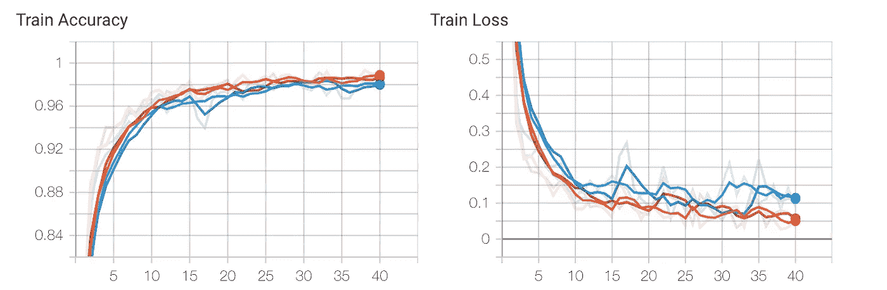

# 超参数优化的人工智能图像分类

> 原文：<https://towardsdatascience.com/ai-image-classification-with-hyperparameter-optimization-343303ad7e13?source=collection_archive---------27----------------------->

## 使用迁移学习、超参数优化和 PyTorch 深度学习框架的图像分类


由 [Unsplash](https://unsplash.com?utm_source=medium&utm_medium=referral) 上的 [Katarzyna Pe](https://unsplash.com/@kasiape?utm_source=medium&utm_medium=referral) 拍摄

自 Alex Krizhevsky 等人开发出赢得 2012 年 ImageNet 挑战赛的 AlexNet 卷积神经网络(CNN)以来，使用人工智能识别物体和分类图像的能力一直是 AI 发展最快的领域之一。AlexNet 网络实现了从 14，197，122 ImageNet 数据集标记图像的最先进的性能。从那时起，CNN 架构的数量和多样性已经跨越深度 CNN 架构显著扩展到初始和剩余 CNN 网络。今天，CNN 正被用于图像分类、医学成像、面部识别和鉴定、分拣邮件、机器人视觉以及即将到来的自动驾驶汽车。


典型的卷积神经网络(CNN)——维基共享

本文将展示一个使用人工智能神经网络执行图像分类的基于代码的示例。虽然网上有许多优秀的图像分类文章，但本文中介绍的两个关键项目是使用迁移学习来启动您的神经网络模型，以及利用 TensorBoard 来帮助优化您的模型和训练超参数的代码框架。对于这个例子，PyTorch 将被用作深度学习框架，Google Colab 将被用作训练基础设施。

# 数据探索和预处理

这个示例的数据集包含四类花卉图像:郁金香、玫瑰、雏菊和向日葵。图像数据集可在此下载[。](https://www.kaggle.com/alxmamaev/flowers-recognition)


郁金香(左)和玫瑰(右)


雏菊(左)和向日葵(右)

第一项任务是回顾每节课的图片。如下所示，这是一个不平衡的分类数据集。


按类别划分的花卉数据集影像

尝试平衡分类数据集被认为是最佳实践。以下 Python 代码使用过采样方法来平衡数据集，每个类 600 个图像。


平衡数据集

然后，数据集被分成每个类的训练集、验证集和测试集。


数据集训练、验证和测试集

理想情况下，深度学习模型将使用大量训练数据进行训练。鉴于可用数据的样本量较小，我将利用迁移学习来启动神经网络模型的训练工作。迁移学习是利用一个神经网络模型，该模型已经在一个不同但相似的任务上成功地训练过，并利用这个预训练的模型作为你的模型的起点。

预训练的 [VGG-16](https://www.kaggle.com/pytorch/vgg16) 模型被用作迁移学习模型。由于该模型是在 ImageNet 数据集上训练的，因此使用 ImageNet 数据集归一化值对每个通道的平均值和标准偏差进行归一化。图像大小被裁剪为 224 x 224。


图像增强和标准化

图像增强也将用于增强训练效果。在每次训练运行期间，当图像被馈送到神经网络时，一组图像变换将被随机地应用于图像。这使神经网络在训练过程中暴露于更广泛的图像变化。图像增强不适用于验证和测试数据集。

# CNN 模型

用于迁移学习模型的方法是保持核心模型不变，以便我们可以利用其先前的特征图训练，并用我们模型的输出层替换图像分类器层。

以下函数用于加载迁移学习模型，冻结来自进一步训练的模型权重，并用新的层替换原始分类器层用于修正的模型。


CNN 模型定义

在训练期间，仅更新新定义的神经网络层权重；冻结的(也称为预训练的)重量保持不变。最终输出层是 LogSoftmax 层，因为在训练期间使用了 NLL(负对数似然)损失函数。

# 模特培训

为了在模型训练过程中探索各种模型和超参数设置，在 Python 有序字典中定义了模型参数。

```
# Training Hyperparameters
params = OrderedDict(
    hidden_units = [256, 512],
    dropout = [0.4, 0.5],
    num_classes = [4],
    lr = [0.001],
    batch_size = [25],
    n_epochs = [40]
)
```

定义了一个 Python 类来生成跨越各种参数排列的运行定义列表。


RunBuilder 类

创建一个 RunManager 类来定义一组用于管理 run 和 epoch 参数初始化的方法，以跟踪训练输出并将输出数据提供给 TensorBoard。

训练循环被定义为一个函数。该函数实例化 RunManager 类的一个实例，并循环运行每个 RunBuilder 生成的参数列表。该函数使用运行参数创建 CNN 模型，并定义优化器和数据加载器。注意，RunBuilder 类不需要实例化，因为它包含一个静态方法。


然后，该函数在每个时期执行 PyTorch 训练循环。PyTorch 梯度计算在训练时打开，但在处理验证数据时关闭。


在整个训练过程中，损耗、准确度和重量信息由 RunManager 方法跟踪并发送到 TensorBoard。此外，每次运行和时期的结果被保存到输出文件中。

使用以下命令启动训练；其中“运行结果”是输出文件名。

```
history = execution_loop('Run_Results')
```

# 结果

一旦训练运行完成，保存的输出文件将提供用于分析的表格数据。


训练运行输出数据

可以对输出文件进行排序，以找到最佳的参数组合。


顶级验证准确度运行

表现最好的组合是运行 1，训练准确率为 98.9%，验证准确率为 94%。运行参数为:

*   256 个隐藏单元
*   辍学率为 0.4%
*   批量为 25 件
*   学习率为 0.001

## 张量板

以下是在训练运行期间发送到 TensorBoard 的一些输出数据示例。

模型图可以交互地向下钻取，以确认您的神经网络模型设计。


张量板神经网络模型图

每次运行的训练和验证准确度和损失曲线图。可以切换图以显示所有运行或仅显示一组选定的运行。



训练准确度和损失曲线—所有运行


训练准确度和损失曲线—运行 1(橙色)，运行 2(蓝色)


验证准确度和损失曲线—运行 1

每次运行的每个层的模型权重和偏差分布以及直方图也可用于审查。


分类器层零偏差直方图-所有运行


分类器层零权重直方图-所有运行

# 结论

使用迁移学习模型可以快速启动您的神经网络模型创建，并极大地增强您的模型性能，即使在小于理想值的数据集上进行训练时也是如此。

虽然这个例子只包括两对要优化的参数(隐藏单元和下降)，但是它可以扩展到任何数量的参数/超参数；您可以改变:学习速率、批量大小、训练期间的样本洗牌、优化器选择、损失函数选择、在不同层内设置多个超参数值、在模型内切换层的开/关等。

还应该注意的是，这种基于参数的训练框架并不是 PyTorch 特有的。通过对训练循环进行一些编码调整，它可以用于纯张量流或 Keras/张量流模型。在 [Deeplizard](https://deeplizard.com/) 向提出 RunBuilder / RunManager 概念的人们大声欢呼。

我希望你喜欢这篇文章，并发现它的信息。你可以在我的 [GitHub repo](https://github.com/BLarzalere?tab=repositories) 中找到这个例子的所有代码。