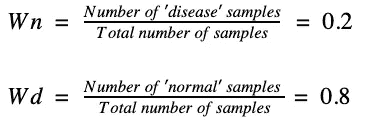
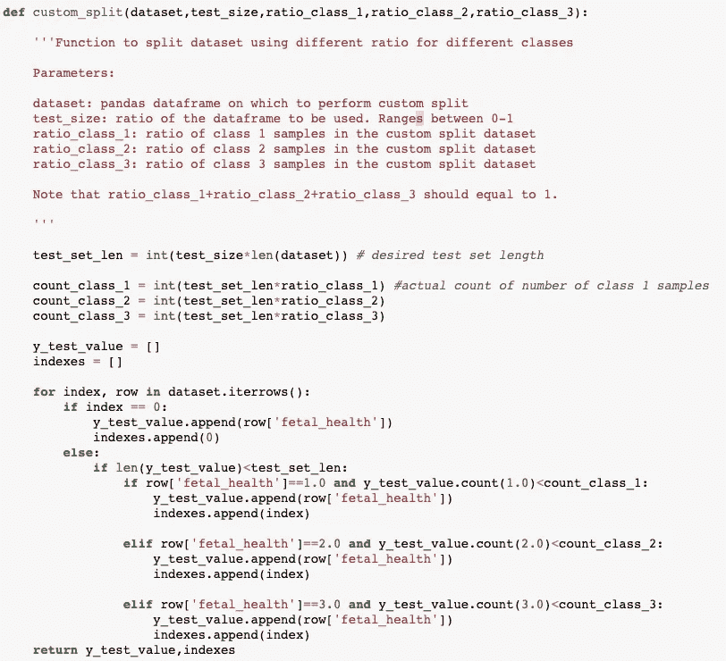

# 医疗诊断中的人工智能——处理医疗数据集

> 原文：<https://towardsdatascience.com/ai-in-medical-diagnosis-dealing-with-medical-datasets-b746e8bda9e5?source=collection_archive---------18----------------------->

## 处理医疗数据集挑战，如不平衡数据集，管理测试集以构建有用的模型

国家癌症研究所的图片来自 Unsplash。

# **简介:**

这篇博客文章是我将分享的一系列文章的一部分，基于我从人工智能医学专业课程中学到的东西。我最近完成了[第一部分:医学诊断中的人工智能](https://www.coursera.org/learn/ai-for-medical-diagnosis)，我在这篇博文中总结了我从第一周学到的东西。

更快。更聪明。好多了。这就是人工智能算法日益发展的趋势。新的模型正在不断改进，并且速度很快。虽然对问题使用最先进的模型并知道如何有效地调优超参数很重要，但知道如何处理手头的数据集也是同样重要的技能。【2021 年人工智能状况报告陈述了以数据为中心的人工智能是如何因为所有正确的原因而受到欢迎的。记住这一点，让我们讨论如何处理医疗数据集。记住 ML 的黄金法则:垃圾进==垃圾出

# **医疗数据集的挑战:**

医疗数据集有一个巨大的挑战:数据稀缺。更重要的是，属于“疾病”类别的数据稀缺，这是我们最有兴趣使用我们建立的模型进行预测的。在这篇博文的其余部分，我们将提到数据集中的两个类别:患有我们有兴趣预测的疾病的患者将属于“疾病”类别，而没有患病的患者将属于“正常”类别。

数据的缺乏导致了两个主要的挑战:类别不平衡和管理测试集。制造业等其他领域也可能遭遇同样的问题。比如，阶级不平衡是制造业的一个经典问题，缺陷元件的数量远远少于非缺陷元件的数量。

让我们详细讨论一下这些挑战，以及如何应对这些挑战！

# **阶层失衡问题:**

在典型的医疗场景中，当观察健康人群时,“正常”患者的数量将远远超过特定疾病患者的数量。

这就是所谓的阶层失衡问题。这导致对模型损失的大部分贡献来自“正常”类实例而不是“疾病”类，并导致算法优化损失函数，以比“疾病”类更好地预测“正常”类实例。

我们可以使用以下技术来处理训练集中的类别不平衡:

1.  **过采样少数类** —为了平衡这两个类，可以对少数类进行过采样。这可以通过对表格数据使用 SMOTE 等方法以及旋转、翻转等图像增强技术来实现。对于图像数据。在扩充数据时，我们需要确保被扩充数据的标签是真实的。例如，胸部 X 射线水平翻转导致患者的心脏指向右侧，这种情况称为右位心。
2.  **对多数类进行欠采样** —这涉及到从多数类中移除一些样本，以使数据集平衡。这种方法的缺点之一是多数类中有价值的数据可能会在数据移除过程中丢失。
3.  **类别加权** —我们可以修改算法，以确保它能很好地处理倾斜数据集。这意味着我们在算法的成本函数中给予少数类更多的权重，这导致在训练阶段对少数类的惩罚更高。选择类别权重的一个简单方法是取另一个类别与样本总数的比率。这导致少数阶级的惩罚高于多数阶级。

下面是一个常见的等级称重方法的例子:

假设我们有 10 个数据点，其中 8 个数据点是正常类(N)，2 个数据点是疾病类(D)。为了计算“正常”类别的权重(Wn)和“疾病”类别的权重(Wd ),我们使用以下公式:

不平衡数据集的类惩罚乘数计算公式。图片作者。

由于数据集只有少量疾病类别示例，因此通常很难使用准确性等指标在不平衡数据集上训练的模型中发现问题。这引出了我们需要考虑的第二个要点:

# **管理测试和验证集:**

回到不平衡数据集的问题，我们需要确保测试集和验证集都有疾病类和正常类的例子。这一点很重要，如果不这样做，将会导致模型性能度量不能真实地代表模型的性能。

让我们看一个简单的例子:

我们有一个 100 个数据点的数据集。这些数据点中只有 10 个(10%)属于“疾病”类别。我们使用 sklearn 的 train_test_split 函数拆分数据集，80%的数据在训练集中，剩下的 20%在测试集中。因为这是一个随机的分割，很可能在我们的测试集中没有一个单独的数据点或者只有 10 个数据点属于“疾病”类别。现在，在对模型进行训练并在测试集上对其进行评估之后，模型的性能指标可能会非常高。但是如果没有疾病类别的良好表示，这些性能度量将会给我们一个模型实际能力的错误感觉。

因此，我们需要确保测试集以正确的比例包含“疾病”和“正常”类别的样本。这种划分在不同的用例中会有所不同，有时这种划分会高达 50-50。这有助于我们真正测试训练好的模型，并确保模型有能力预测“疾病”和“正常”类别。

一旦我们有了满意的测试集，我们就使用与测试集相同的分布(百分比分割)创建一个验证集

有两种方法可以根据我们希望在测试集上的每个类的数据点的分布来管理我们的测试集:

## 分层:

如果我们想在训练集和测试集中平均分配类，我们可以分层。数据集的分层是指我们希望在训练集和验证集中平均分布类。例如，如果数据集有 20%的标签用于“疾病”类，80%的标签用于正常类，并且我们希望在分割数据集用于训练和测试后保持该比例，我们可以使用分层。这可以在 sklearn 中简单地完成，在调用 train_test_split 辅助函数时使用参数 stratify。我在这里整理了一个简单的 [Jupyter 笔记本](https://github.com/bikramb98/ai_in_medicine_specialization/blob/main/stratification_test.ipynb)来展示在使用和不使用分层的情况下，train vs 测试集中所有类的分布差异。

## 自定义拆分:

如果我们想要在测试集中进行更加定制的划分(例如 40%的‘正常’类和 60%的‘疾病’类)，我们必须手动进行。详细代码请点击[链接](https://github.com/bikramb98/ai_in_medicine_specialization/blob/main/custom_split.ipynb)至 Jupyter 笔记本。下面给出了该函数的代码片段，展示了如何对一个包含 3 个不同类的数据集执行该操作。

3 个不同类别的自定义分割功能。GitHub 库中的详细代码。图片作者。

一旦我们有了我们选择的正确百分比分割的验证和测试数据集，我们就可以继续创建训练集。我们已经讨论了如何实现平衡的训练数据集。

# 其他要点:

处理医疗数据时需要记住的其他几点:

1.  **患者重叠** —按患者 ID 分割数据集，而不是按数据点/图像分割，这一点很重要。这是为了确保模型不会学习与预测患者是否患有我们感兴趣的疾病无关的数据部分。此问题类似于数据泄漏问题，在数据泄漏问题中，定型集和验证集中存在相同的数据，从而使验证集的结果不能真正衡量模型的预测能力。
2.  **在数据标注者之间达成共识** —必须在整个数据集中保持标注的一致性。不同的标注者可能对特定数据点的标注有不同的看法。在这种情况下，应咨询各种其他标签，并以多数票为最终决定。也可以使用其他技术，如活检来确定地面真相，尽管这些技术往往更昂贵和耗时。

我希望这篇博文能让你对如何处理医疗数据集有所了解——同样的概念也可以应用于制造业等领域。请继续关注本系列的第 2 部分，在那里我将讨论评估为医疗诊断而构建的模型的不同方法。请随时在 [Twitter](https://twitter.com/baruahbikram05) 和 [LinkedIn](https://www.linkedin.com/in/bikramb/) 上与我联系！祝你有美好的一天:)