# 使用 NLP 改进你的简历

> 原文：<https://towardsdatascience.com/ai-is-working-against-your-job-application-bec65d496d22?source=collection_archive---------3----------------------->

## [从零开始逐个任务地进行数据科学](https://towardsdatascience.com/tagged/dofromscratch)

## 对工作描述执行关键字匹配和文本分析


[附身摄影](https://unsplash.com/@possessedphotography?utm_source=medium&utm_medium=referral)在 [Unsplash](https://unsplash.com?utm_source=medium&utm_medium=referral) 上拍照

招聘人员正在使用越来越复杂的软件和工具来扫描简历，并将其与发布的职位和工作规范进行匹配。如果你的简历很普通，或者工作说明含糊不清，这些工具会对你不利。AI 真的在和你的工作申请作对，我不确定你是否知道或者会接受它！但是让我来示范一些可以帮助你平衡胜算的技巧。自然，我们会使用 NLP(自然语言处理)，Python，和一些 Altair 的视觉效果。你准备好反击了吗？

假设你对网上看到的一个好职位感兴趣。有多少人会看到同样的工作？有和你大致相同的经历和资历？你认为会有多少申请人提出申请？会不会少于 10 或者少于 1000？

此外，考虑面试小组可能只有 5 名强有力的候选人。那么，你如何从 995 份申请中“筛选”出 5 名优秀的候选人呢？这就是为什么我说你需要平衡胜算，否则就和杂草一起被扔掉！

# 处理 1，000 份简历

我想，首先，你可以把这些简历分成 3-5 份。把它们打印出来，分配给人类读者。每个读者从他们的一堆中选择一个。5 个读者有 200 份简历——去挑选最好的一两份。阅读这些会花很长时间，而且可能最终只能得到一个答案。我们可以使用 Python 在几分钟内阅读所有这些简历！

在 Medium 上阅读文章“[我如何使用 NLP (Spacy)筛选数据科学简历](/do-the-keywords-in-your-resume-aptly-represent-what-type-of-data-scientist-you-are-59134105ba0d)”表明，只需两行代码就可以收集这 1000 份简历的文件名。

```
#Function to read resumes from the folder one by one
mypath='D:/NLP_Resume/Candidate Resume' 
onlyfiles = [os.path.join(mypath, f) for f in os.listdir(mypath) 
             if os.path.isfile(os.path.join(mypath, f))]
```

变量‘only files’是一个 Python 列表，它包含使用 Python os 库获得的所有简历的文件名。如果你研究文章，你也会看到你的简历是如何根据关键词分析几乎自动地被排名和淘汰的。因为我们试图平衡胜算，所以我们需要把重点放在你想要的工作规范和你目前的简历上。它们匹配吗？

# 匹配简历和工作描述

为了公平起见，我们想浏览一下职位描述、简历，并衡量一下匹配程度。理想情况下，我们这样做是为了让输出对你调整游戏有用。

## 阅读文件

因为这是你的简历，你可能有 PDF 或 DOCX 格式的。Python 模块可以读取大多数数据格式。图 1 演示了如何读取将内容保存到文本文件中的文档。

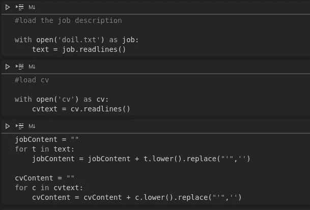

图 1:从磁盘读取文本文件并创建一个文本对象。图片由作者从 Visual studio Code—Jupyter Notebook 获取

第一步总是打开文件并阅读这些行。接下来的步骤是将字符串列表转换为单个文本，并在此过程中进行一些清理。图 1 创建了变量“jobContent”和“cvContent ”,它们表示一个包含所有文本的字符串对象。下一段代码显示了如何直接读取 Word 文档。

```
import docx2txt
resume = docx2txt.process("DAVID MOORE.docx")
text_resume = str(resume)
```

变量“text_resume”是一个字符串对象，它保存简历中的所有文本，就像前面一样。您也可以使用 PyPDF2。

```
import PyPDF2
```

足以说明的是，对于从业者来说，存在一系列选择来阅读文档，将它们转换成干净的处理过的文本。这些文档可能会很长，很难阅读，而且坦率地说很枯燥。你可以从总结开始。

## 处理文本

我爱 Gensim，经常用。

```
from gensim.summarization.summarizer import summarize
from gensim.summarization import keywords
```

我们通过读取 Word 文件创建了变量“resume_text”。我们来总结一下简历和招聘启事。

```
print(summarize(text_resume, ratio=0.2))
```

gensim . summary . summary zer . summary 将为您创建一个简明摘要。

```
summarize(jobContent, ratio=0.2)
```

现在你可以阅读工作角色的总体总结和你现有的简历了！你是否错过了总结中强调的工作角色的任何内容？细微的细节可以帮助你推销自己。你的总结文件是否有意义，是否能展现出你的本质品质？也许仅仅一个简明扼要的总结是不够的。接下来，让我们来衡量一下你的简历与工作说明书的相似程度。图 2 提供了代码。

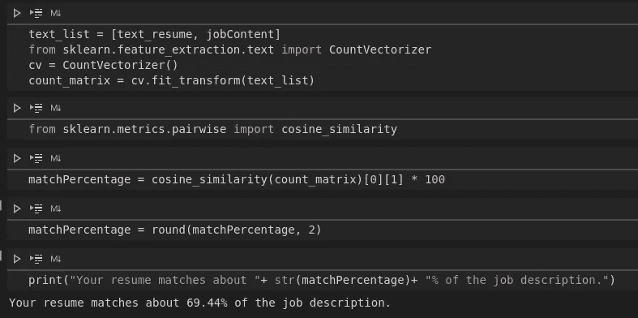

图 2 —匹配两个文档并给出相似性分数的代码。图片作者。

概括地说，我们制作一个文本对象列表，然后创建一个 sklearn CountVectorizer()类的实例。我们还引入了 cosine_similarity 度量，它帮助我们度量两个文档的相似性。**你的简历与职位描述**的匹配度约为 69.44%。听起来很棒，但我不会忘乎所以。现在，您可以阅读文档摘要并获得相似性度量。机会正在增加。

接下来，我们可以看看职位描述关键词，看看简历中有哪些是匹配的。我们是否错过了几个可以加强匹配度的关键词？现在去斯帕西。到目前为止这是一段相当长的旅程。Gensim，sklearn 和现在的 spacy！希望你没晕！

```
from spacy.matcher import PhraseMatcher
matcher = PhraseMatcher(Spnlp.vocab)
from collections import Counter
from gensim.summarization import keywords
```

我们将使用 spacy 的短语匹配器功能来匹配工作描述和简历中的关键短语。Gensim 关键字有助于提供匹配的短语。图 3 显示了如何运行匹配。

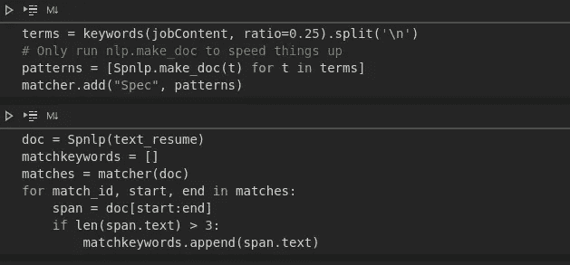

图 3:使用关键字和短语匹配来交叉引用文档。图片作者。

使用图 3 中的代码片段，提供了匹配关键字的列表。图 4 显示了总结这些关键字匹配的方法。使用集合中的计数器字典。

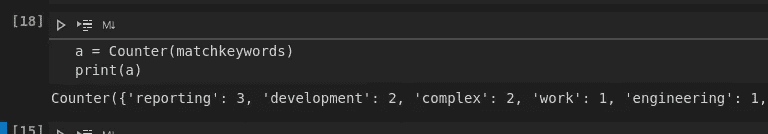

图 4 —使用集合。计数器对关键字命中次数进行计数。图片作者。

“报告”一词包含在工作描述中，简历中有 3 次点击。有哪些短语或关键词出现在招聘启事中，但没有出现在简历上？我们能增加更多吗？我用熊猫来回答这个问题—您可以在图 5 中看到输出。

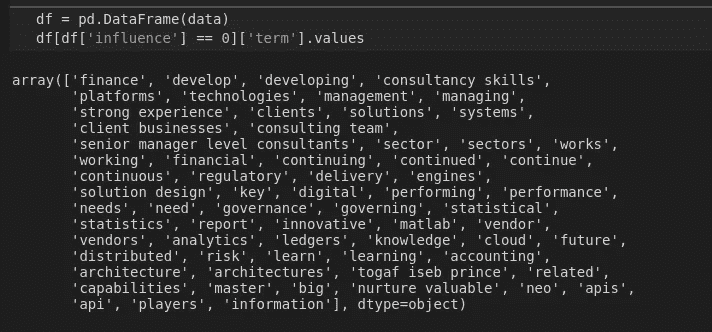

图 5-简历中没有提到的工作描述中的关键词。图片由作者提供。

如果这是真的，那也很奇怪。在文档层面，匹配率为 69.44%，但看看简历中没有提到的那一长串关键词。图 6 显示了提到的关键词。

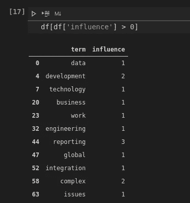

图 6 使用熊猫匹配的关键词。图片由作者提供。

在现实中，很少有关键字与工作规范匹配，这导致我对 69.44%的余弦相似性度量持怀疑态度。尽管如此，几率还是在提高，因为我们可以在工作说明书中看到简历中没有的关键词。更少的关键词匹配意味着你更有可能被淘汰。查看丢失的关键词，你可以继续前进，加强简历，并重新运行分析。不过，仅仅在简历中加入关键词会产生负面影响，你必须非常小心你的作品。你可能会通过最初的自动筛选，但你会因为明显缺乏写作技巧而被淘汰。我们确实需要对短语进行排序，并专注于工作规范中的基本主题或单词。

接下来让我们看看排名短语。对于这个练习，我将使用我自己的 NLP 类和我以前使用的一些方法。

```
from nlp import nlp as nlp
LangProcessor = nlp()
keywordsJob = LangProcessor.keywords(jobContent)
keywordsCV = LangProcessor.keywords(cvContent)
```

使用我自己的类，我从我们之前创建的 job 和 Resume 对象中恢复了排名短语。下面的代码片段为您提供了方法定义。我们现在使用 rake 模块来提取排名短语和分数。

```
def keywords(self, text):
 keyword = {}
 self.rake.extract_keywords_from_text(text)
 keyword['ranked phrases'] = self.rake.get_ranked_phrases_with_scores()
 return keyword
```

图 7 展示了方法调用的输出。

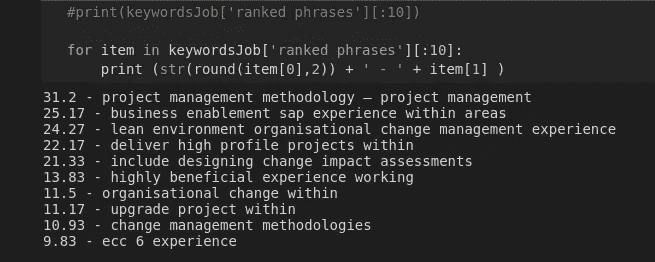

图 7——来自招聘启事的排名短语。图片由作者使用自己的代码。

“项目管理方法——项目管理”被列为 31.2，因此这是招聘信息中最重要的主题。简历中的关键短语也可以稍加改动后打印出来。

```
for item in keywordsCV['ranked phrases'][:10]:
 print (str(round(item[0],2)) + ' - ' + item[1] )
```

阅读简历和招聘启事中的热门短语，我们可以问自己是否有匹配或相似的程度？我们当然可以运行一个序列来找出答案！下面的代码在职位发布和简历中的排名短语之间创建了一个交叉引用。

```
sims = []
phrases = []
for key in keywordsJob['ranked phrases']:
 rec={}
 rec['importance'] = key[0]
 texts = key[1] sims=[]
 avg_sim=0
 for cvkey in keywordsCV['ranked phrases']:
  cvtext = cvkey[1]
  sims.append(fuzz.ratio(texts, cvtext))
  #sims.append(lev.ratio(texts.lower(),cvtext.lower()))
  #sims.append(jaccard_similarity(texts,cvtext)) count=0
 for s in sims:
 count=count+s
 avg_sim = count/len(sims)
 rec['similarity'] = avg_sim
 rec['text'] = texts
 phrases.append(rec)
```

注意，我们使用 fuzzy-wuzzy 作为匹配引擎。该代码还具有 Levenshtein 比率和 jaccard_similarity 函数。图 8 展示了这可能是什么样子。

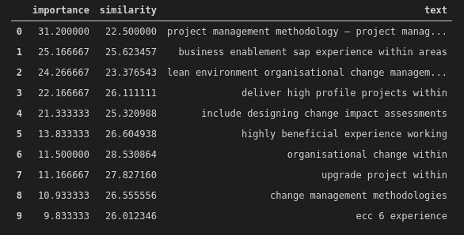

图 8 工作描述和简历之间相互参照的关键词。

“重要性”变量是简历中排名短语的分数。“相似性”变量是来自 fuzzy-wuzzy 的比率分数。术语“项目管理方法”排名 31.2，但交叉引用评级简历短语平均得分仅为 22.5。虽然项目管理是这份工作的重中之重，但简历在不同的技术项目上得分更高。通过做一个类似的练习，你可以看到人工智能是如何与你的应用程序对抗的。

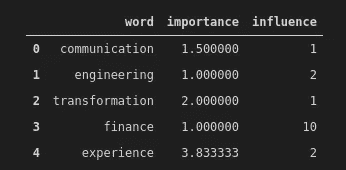

图 9 简历中术语的重要性与影响力。图片由作者提供。

图 9 显示了另一个视角。使用标记(单词)可以显示每个单词在工作描述中的重要性，以及在简历中的点击率——特定单词在文档中出现的次数越多，影响就越大。金融这个词在职位描述中并不重要，但在简历中却有很大的影响力。这是一个寻找 IT 工作的财务人员吗？用人工智能的话可以出卖你！

我相信现在你已经有了照片。使用 NLP 工具和库有助于真正理解工作描述和衡量相对匹配度。这当然不可靠，也不可信，但它确实有助于平衡胜算。你的话很重要，但是你不能在简历中加入关键词。你真的要写一份很强的简历，申请适合自己的角色。文本处理和文本挖掘是一个很大的话题，我们只是触及了可以做的事情的表面。我发现文本挖掘和基于文本的机器学习模型非常准确。让我们使用 Altair 查看一些视觉效果，然后得出结论。

## 牛郎星视觉效果

我最近用了很多 Altair，比 Seaborn 或 Matplotlib 用得更多。我对牛郎星的语法很感兴趣。我制作了三个视觉效果来帮助讨论——图 10 显示了简历中关键词的重要性和影响力。使用色标，我们可以看到像收养这样的词在简历中出现了两次，但在招聘启事中的优先级别较低。

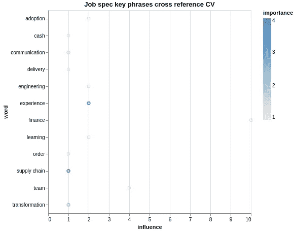

图 10 牛郎星视觉。图片由作者提供。简历中与重要性和影响力相对应的词语。

图 11 显示了在招聘启事和简历中找到的分级主题的交叉引用。最重要的短语是“项目管理”但这在简历的排名中得分很低。

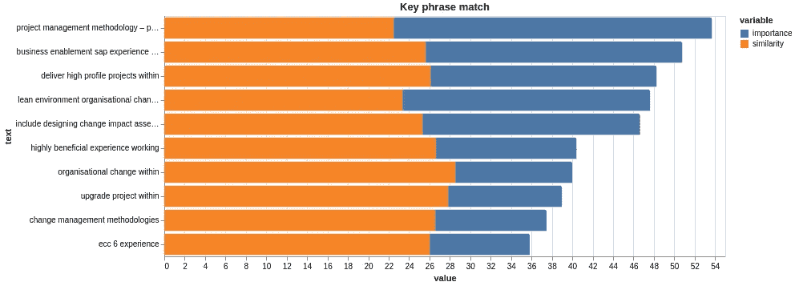

图 11。一个堆积条形图，显示已排名的短语以及简历和职务发布之间的相关性。

图 12 描绘了相似的单词。财务在简历中出现了 10 次，但在招聘启事中却只字未提。简历(CV)上提到了 project 这个词，它也出现在招聘启事中。

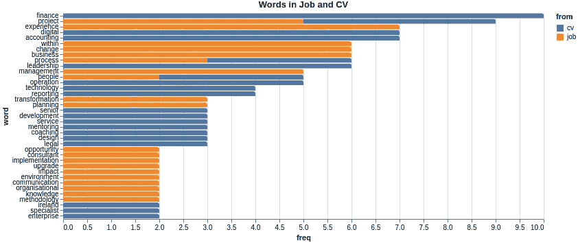

图 12 文档间关键词重叠的分析。图片由作者提供。

看图表，在我看来，简历和职位描述不太匹配。很少有共享的关键字和排名短语看起来非常不同。这就是让你的简历被淘汰的原因！

# 结论

阅读这篇文章可能看起来更像是一部大预算的电影。那些大片一般都是大牌演员出演。大型的 NLP 库在本文中扮演了主要角色，我们甚至还客串了更多更老更成熟的名字，比如 NLTK。我们使用了 Gensim、Spacy、sklearn 等库，并演示了它们的用法。我自己的班级客串了一次，包装了 NLTK、rake、textblob 和一堆其他模块，所有这些都表现出了对文本分析的见解，向你展示了你是如何与获得梦想工作的机会分离的。

想要得到这份理想的工作，需要清晰而坚定地关注细节，并仔细准备工作申请、简历和求职信。使用自然语言处理不会让你成为最佳候选人。这取决于你！但它可以提高你击败人工智能驱动的早期回合的机会。


由[维达尔·诺德里-马西森](https://unsplash.com/@vidarnm?utm_source=medium&utm_medium=referral)在 [Unsplash](https://unsplash.com?utm_source=medium&utm_medium=referral) 上拍摄的照片

每个渔民都知道你需要好的鱼饵！