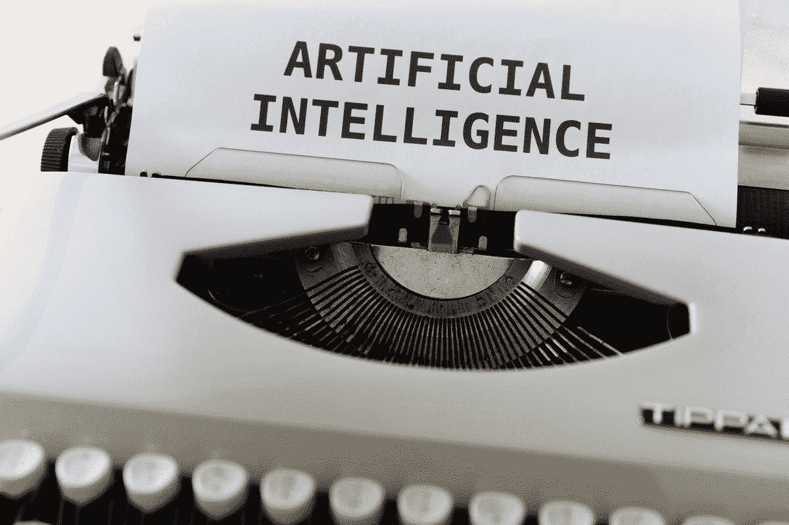
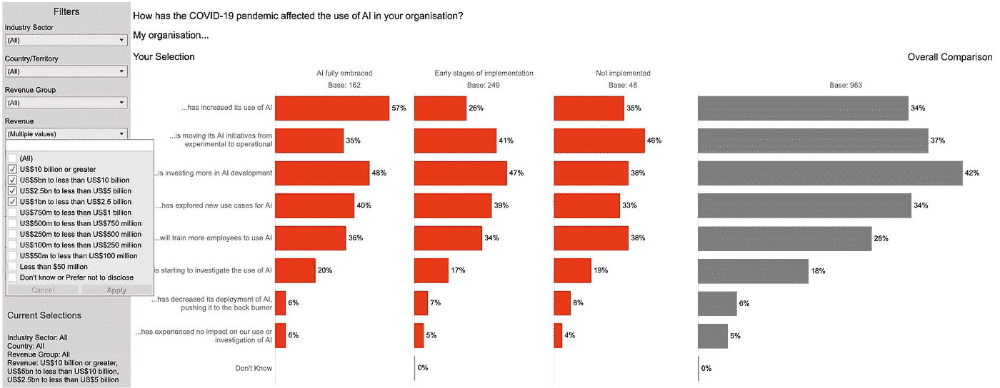
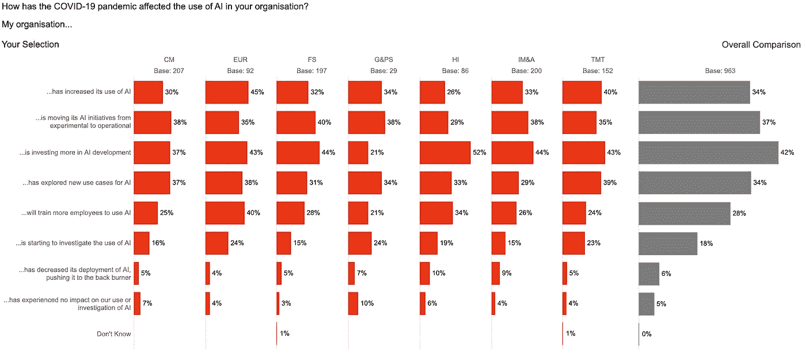
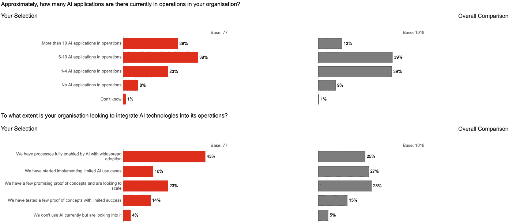
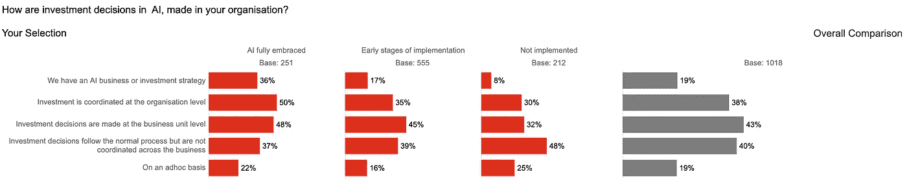
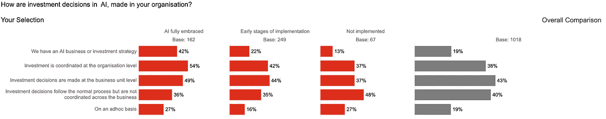
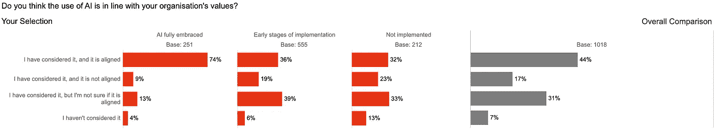
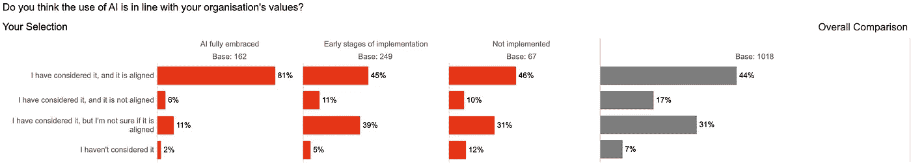

# 人工智能领导人充分利用新冠肺炎危机来增加人工智能的作用

> 原文：<https://towardsdatascience.com/ai-leaders-make-the-most-of-the-covid-19-crisis-to-increase-the-role-of-ai-ce885e39dcb9?source=collection_archive---------63----------------------->

## 全球负责任人工智能调查的结果

马修·斯特恩和 T2【马库斯·温克勒在 [Unsplash](https://unsplash.com/s/photos/investment-in-ai?utm_source=unsplash&utm_medium=referral&utm_content=creditCopyText) 上的照片

毫无疑问，到 2020 年，新冠肺炎将成为我们生活和生计最具影响力的单一驱动力。然而，疫情对某些社会群体、某些行业部门、某些公司和某些技术的影响参差不齐。普华永道在 2019 年 11 月对 1000 多名高管进行的全球负责任的人工智能调查中出现了三个关键主题。调查受访者来自七个行业领域(即消费市场；工业制造和汽车；金融服务；技术、媒体和电信；能源、公用事业和资源；医疗行业、政府和公共服务)和公司规模各不相同，从年收入不足 5 亿美元(29%的受访者)、5 亿至 10 亿美元(23%)到超过 10 亿美元(49%)不等。

# 来自新冠肺炎的大公司和人工智能领导者产生了积极影响

总体而言，44%的受访公司受到新冠肺炎有限或显著的负面影响(44%)。有趣的是，同样数量的受访者认为他们受到了新冠肺炎有限或显著的积极影响。然而，当我们看公司的规模时，差异就出现了。新冠肺炎对超大型公司(100 亿美元或以上)和超小型公司(5000 万美元或以下)产生了显著的积极影响:新冠肺炎对近 39%的超大型公司和 37%的超小型公司产生了显著的积极影响。

当这些公司按照它们的人工智能成熟度水平进行细分时，出现了三个集群——**人工智能领导者** (26%)、**人工智能落后者** (16%)和**人工智能实验者** (58%)。大公司(10 亿美元或以上)再次占据了人工智能领导者的 65%。大公司类别中人工智能领导者的这种不成比例的数量，也看到了新冠肺炎的重大而有限的积极影响。这些公司还增加了对人工智能的使用(57%比 34%，整体)，探索了更多新的人工智能用例(40%比 34%，整体)，并在人工智能开发方面投入了更多资金(48%比 42%)。

图 1:新冠肺炎对人工智能成熟度采用人工智能的影响(来源:普华永道负责任的人工智能调查)

能源、公用事业和资源公司增加了对人工智能的使用(45%对 34%的整体比例)，并且还在培训更多的员工使用人工智能(40%对 28%的整体比例)。毫不奇怪，在所有行业中，医疗保健行业对人工智能的投资最大(52%对 42%)。

图 2:新冠肺炎对各行业采用人工智能的影响(普华永道负责任的人工智能调查)

# **已经实施人工智能的公司已经看到了更好的投资回报率**

调查中出现的另一个关键主题是公司部署人工智能模型的水平及其投资回报率。毫不奇怪，78%的人工智能领导者在运营中有 5 个或更多的人工智能应用，相比之下，人工智能落后者只有 28%，所有三个细分市场的整体比例为 52%。同样，29%的超大型公司拥有 10 个或 10 个以上的人工智能应用，而平均只有 13%。此外，这些公司中有 43%的流程完全由人工智能实现，并得到广泛采用，相比之下，整个集团中只有 23%的公司采用人工智能。在另一项基于美国的研究([普华永道 2021 年人工智能预测](https://www.pwc.com/us/en/services/consulting/library/artificial-intelligence-predictions-2021.html))中，近 86%的受访者表示，他们正从基于人工智能的客户体验中受益，64%的受访者表示，他们正从基于人工智能的效率和生产力计划中受益。

图 3:运营中的人工智能应用数量(来源:普华永道负责任的人工智能调查)

# **集中或协调的战略正在取得成效**

在生产中部署人工智能模型的公司需要跨多个职能部门进行协调，在某些情况下还需要跨多个业务部门进行协调。这需要一个更加集中的人工智能功能，或者至少是一个更加协调的人工智能功能。近 36%的人工智能领导者拥有集中的人工智能业务和投资战略，相比之下，只有 19%的公司拥有这样的业务和战略。此外，50%的人工智能领导者表示，投资是在组织层面进行协调的，相比之下，整体只有 38%。对于大公司的人工智能领导者来说，对于集中的人工智能业务和投资战略，这些百分比跃升至 42%，对于协调投资，这些百分比为 54%。

图 4:按成熟度划分的人工智能投资决策(来源:普华永道责任人工智能调查)

图 5:大公司(收入超过 10 亿美元)的人工智能投资决策(来源:普华永道责任人工智能调查)

集中或协调的投资策略也意味着 74%的人工智能领导者(和 81%的大公司人工智能领导者)认为他们的人工智能计划与组织价值观一致，相比之下，整个群体中只有 44%的人这样认为。相比之下，近 39%的人工智能实验者和 33%的人工智能落后者觉得他们不确定人工智能计划是否与他们的组织价值观一致。

图 6:按成熟度划分的组织一致性(来源:普华永道责任人工智能调查)

图 7:按成熟度划分的大公司(> 10 亿美元收入)的组织一致性(来源:普华永道责任人工智能调查)

这三个观点的结果很有启发性。人工智能的领导者，通常是大公司，在疫情之前就已经投资了人工智能。鉴于他们的人工智能准备就绪，他们能够在不确定的新冠肺炎时期做出比竞争对手更好的响应，因此，他们能够从自己的计划中获得更好的投资回报。这反过来导致他们计划在 2021 年进行更大的人工智能投资，并有可能获得更多回报，进入良性的人工智能主导的投资回报周期。