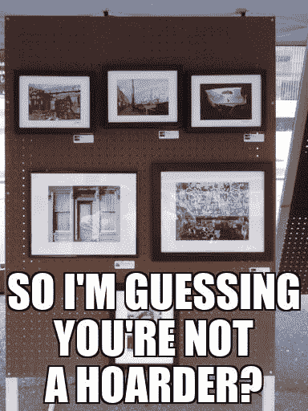
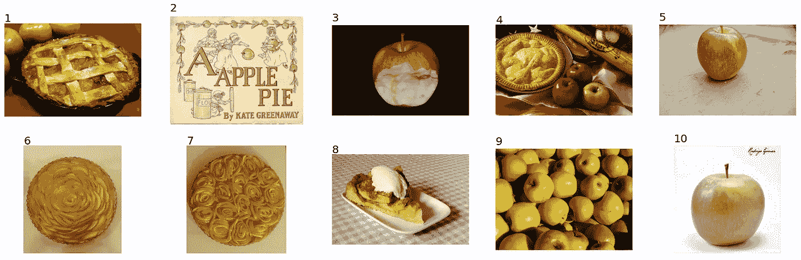

# 人工智能迷因:利用机器学习创造有趣的迷因

> 原文：<https://towardsdatascience.com/ai-memer-using-machine-learning-to-create-funny-memes-12fc1fe543e4?source=collection_archive---------7----------------------->

## 如何使用来自维基共享资源的图片和由 GPT-3 和 GPT-尼奥自动生成的带标题的开放图片来创造新的迷因


由 AI-Memer 的 Memes，图片从左上顺时针方向由 jans canon，tata_aka_T，Calvert Litho，FlugKerl2，DodosD 和 Centpacrr，标题由 OpenAI GPT-3，许可证:CC BY-SA 4.0

在本文中，我将向您展示我如何构建一个名为 AI-Memer 的系统，该系统使用最新的人工智能模型生成迷因。在进入迷因的背景和组件的细节之前，我从系统组件的高层次描述开始。然后，我将向你展示如何使用谷歌实验室生成你自己的迷因。在对结果和后续步骤进行简要讨论后，你可以在附录中看到一些模因样本。哦，我会在每个部分的开头展示一个新生成的迷因😄。


由 AI-Memer 制作的 Meme，由 David Mellis 制作的图片，由 OpenAI GPT-3 制作的标题，许可:CC BY-SA 4.0

# 系统组件

主要系统组件如下图所示。


AI-Memer 组件，图表由作者提供，饼图由 W.carter 提供

用户首先输入一个搜索查询来找到一个背景图片，比如“苹果派”。然后，系统在 Wikimedia Commons [1]和 OpenImages 数据集[2]中检查匹配的图像。两个数据集都有相应的图像文本描述。我使用 OpenAI 的 CLIP [3]编码器首先对文本描述执行语义搜索。语义搜索寻找匹配的概念，而不仅仅是单词搜索。然后我对图片进行语义搜索。用户检查出匹配查询的前 10 个图像，并选择他们最喜欢的。来自 OpenAI [4]的 GPT-3 模型或来自 EleutherAI [5]的 GPT-近地天体模型被用于生成 10 个可能的字幕。用户选择最好的标题来创建新的迷因，可以下载。


图片由 AI-Memer 提供，图片由 Atsuko Sato 提供，说明由 OpenAI GPT-3 提供，许可:CC BY-SA 4.0

# 模因

维基词典将*模因*一词定义为“任何文化信息单位，如实践或想法，通过口头或重复动作从一个头脑传递到另一个头脑，类似于基因的传递”[6]。这个术语起源于理查德·道金斯的书《自私的基因》[7]。在互联网时代，模因一词已经被缩小到指一段内容，通常是一张带有有趣标题的图片，通过社交媒体在网上传播。


艾-梅梅尔的迷因，彼得罗·佩鲁吉诺(1448–1523)的图像，开放艾 GPT-3 的标题，许可:CC BY-SA 4.0

# 先前的工作

Dylan Wenzlau 使用深度卷积网络创建了自动热图生成器[9]。他使用了 Imgflip meme Generator 用户的 1 亿个公共 Meme 标题，并训练该系统根据 48 张常用背景图片生成标题。你可以在这里阅读他的系统[，在这里](/meme-text-generation-with-a-deep-convolutional-network-in-keras-tensorflow-a57c6f218e85)在线运行它[。这里有三个例子。](https://imgflip.com/ai-meme)


人工智能在、[、](https://imgflip.com/ai-meme)上制作的样本模因

这些都很好，但该系统仅限于使用常见的背景图像。我在寻找一种方法，将一组新的图像注入迷因圈。

# AI-Memer

人工智能迷因系统创建迷因分三步:寻找背景图片，生成标题，排版迷因标题。



由 AI-Memer 制作的 Meme，由 Mike K 制作的图片，由 OpenAI GPT-3 制作的说明，许可:CC BY-SA 4.0

# 查找图像

背景图像来自两个来源，维基共享和开放图像数据集。我使用 OpenAI 的剪辑来执行语义搜索。CLIP 系统实现了两个功能，将文本和图像编码到“嵌入”中，嵌入是代表原始数据要点的数字串。剪辑模型在 4000 万对带有文本标签的图像上进行预训练，使得从图像编码的嵌入将类似于从文本标签编码的嵌入。关于 CLIP 如何工作的更多信息，请查看我的文章[这里](/using-openais-clip-to-search-for-design-patents-7fcc63d91033)。

## 维基共享

维基共享资源有超过 7300 万个 JPEG 文件。它们中的大多数都是以许可的权利发布的，比如知识共享署名许可。我使用戈德史密斯的维基百科搜索 API [10]找到与文本查询相关的前 3 页，并使用 Magnus 工具服务器[11]上的 CommonsAPI 收集图像描述。我使用 python 中的 shutil.copyfileobj()函数下载图像文件。维基百科页面上通常有 3 到 10 张图片，所以总共会有 9 到 30 张图片出现。

## 打开图像

来自谷歌的 OpenImages 数据集由从 Flikr 抓取的 675，000 张照片组成，这些照片都是在知识共享署名许可下发布的。一组图像描述可供下载[12]。我通过 OpenAI 的 CLIP 系统运行了每个描述，并缓存了嵌入内容以便快速访问。当用户输入查询时，我通过 CLIP 运行它，并将其与缓存的嵌入进行比较。然后我使用 OpenImages 下载 API [13]下载前 20 个匹配的图像。

对于最后的过滤过程，我通过图像编码器运行来自 3 个维基百科页面的图像和来自 OpenImages 的 20 个图像，并将结果与文本查询的嵌入进行比较。我向用户展示前 10 张图片，让他们选择自己最喜欢的。

例如，如果您搜索“苹果派”，您将看到按最匹配排序的前 10 张图片。



来自[维基共享资源](https://commons.wikimedia.org/wiki/Main_Page)和[开放图像](https://storage.googleapis.com/openimages/web/index.html)的语义图像搜索结果。照片由丹·帕森斯、凯特·格林纳威、切丽·乔弗、斯科特·鲍尔、我的儿子使用本账户、妮莎·埃文斯坦、妮莎·埃文斯坦、w·卡特、利兹·韦斯特、罗德里戈·戈麦斯·桑斯拍摄

8 号图片看起来很不错。它来自一个名叫 W.carter 的用户，通过维基共享。描述是“简单易行的苹果派配香草冰淇淋，放在瑞典 Lysekil 的方格布桌布上”。接下来，我们将为我们的新迷因生成一些标题。


迷因由 AI-Memer 提供，图片由 Pharlap 提供，说明由 OpenAI GPT-3 提供，许可:CC BY-SA 4.0

# 生成字幕

我使用 GPT 的两种不同实现来生成标题。OpenAI 有一个最新的 GPT-3 达芬奇模型，它做得非常好，但是你必须注册他们的测试项目才能使用它。还有来自 EleutherAI 的开源 GPT-尼奥模型。模型小了很多，但是可以免费使用。

## GPT-3 达芬奇

OpenAI 的 GPT-3 达芬奇是目前最大的自然语言处理人工智能模型[4]。我正在使用他们最新的“零射击”风格的提示和他们新的达芬奇指导模型。你可以直接问模型做什么，而不是提供你要求模型做什么的例子。

下面是为苹果派图片创建标题的提示。

```
Create a funny caption for a new meme about apple pie. The background picture is Simple and easy apple pie served with vanilla ice cream, on a gingham tablecloth in Lysekil, Sweden.
```

我将提示和一些附加参数一起传递到 OpenAI 的调用中。这是 Python 代码。

```
import openai
response = openai.Completion.create(
  engine="davinci-instruct-beta",
  prompt=prompt,
  max_tokens=64,
  temperature=0.7,
  top_p=0.5,
  frequency_penalty=0.5,
  presence_penalty=0.5,
  best_of=1)
```

*max_token* 参数表示响应应该持续多长时间。*温度*和 *top_p* 参数是相似的，因为它们指示响应中的变化量。 *frequency_penalty* 和 *presence_penalty* 也是类似的，因为它们控制响应中出现新偏差和新主题的频率。如果你想知道所有这些参数的作用，可以看看我上个月的文章，这里是。

在我展示 GPT-3 输出的例子之前，这里是 OpenAI 建议我展示的法律免责声明，这都是真的。

作者使用 OpenAI 的大规模语言生成模型 GPT-3 生成了以下文本。在生成草稿语言后，作者根据自己的喜好审阅和修改语言，并对本出版物的内容承担最终责任。

运行代码 10 次将产生以下结果，总成本为 0.03 美元。请注意，我将文本格式化为大写。

```
 1: THIS IS THE PERFECT WAY TO END A DAY OF APPLE PICKING
 2: NO, IT'S NOT THAT EASY
 3: I'LL TAKE THE ONE WITH THE VANILLA ICE CREAM, PLEASE
 4: APPLE PIE IS THE BEST!
 5: THIS APPLE PIE IS SO GOOD, I CAN'T EVEN!
 6: YOU'RE NOT THE ONLY ONE WHO LOVES APPLE PIE
 7: IF YOU CAN'T FIND THE RECIPE, JUST GOOGLE IT
 8: THE PIE IS GOOD, BUT IT'S NOT AS GOOD AS MY MOM'S
 9: I'LL HAVE A SLICE OF THAT APPLE PIE, PLEASE
10: WE'RE GOING TO NEED A BIGGER PIE
```

好的，这些很不错。我学到的一件事是 **GTP-3 达芬奇可以很有趣！**例如，标题 2 似乎指的是“易如反掌”的习语。

请注意，GPT-3，像所有在大型文本语料库上训练的人工智能模型一样，将反映社会偏见。有时，系统会产生不适当或冒犯性的文本。OpenAI 有一个特性，用三个警告级别之一来标记生成的文本:0 -文本是安全的，1 -文本是敏感的，或者 2 -文本是不安全的。我的代码将为任何被标记为敏感或不安全的标题显示警告。

## GPT-尼奥

GPT-尼奥是一个变形金刚模型，主要由 GitHub 上的 sdtblck 和 leogao2 开发人员创建。该项目是“使用 mesh-tensorflow 库的 GPT-2 和 GPT-3 风格模型”的实施[5]。到目前为止，他们的系统是 OpenAI 的 GPT-3 Ada 的大小，这是他们最小的模型。但是 GPT-尼奥是免费的。我用拥抱脸变形金刚[14]接口从我的 Python 代码访问 GPT-尼奥。

由于 get 尼奥没有他们预训练模型的“指导”版本，我不得不写一个“少数镜头”提示，以便让系统使用示例为迷因生成字幕。这是我用灾难女孩和暴躁猫迷因写的提示，并附有示例说明。

```
Create a funny caption for a meme.Theme: disaster girl
Image description: A picture of a girl looking at us as her house burns down
Caption: There was a spider. It's gone now.Theme: grumpy cat
Image description: A face of a cat who looks unhappy
Caption: I don't like Mondays.Theme: apple pie.
Image description: Simple and easy apple pie served with vanilla ice cream, on a gingham tablecloth in Lysekil, Sweden.
Caption:
```

在将温度参数设置为 0.7 并将 top_p 设置为 1.0 之后，我将提示信息传递给 GPT-尼欧以生成新的标题。下面是生成标题的代码。

```
from transformers import pipeline, AutoTokenizer
generator = pipeline('text-generation',
  device=0,
  model='EleutherAI/gpt-neo-2.7B')
results = generator(prompt,
  do_sample=True,
  min_length=50,
  max_length=150,
  temperature=0.7,
  top_p=1.0,
  pad_token_id=gpt_neo_tokenizer.eos_token_id)
```

这是样本结果。

```
 1: I LOVE APPLE PIE
 2: I CAN'T. I'M NOT ALLOWED
 3: I LOVE THE SIMPLICITY OF AN APPLE PIE
 4: APPLE PIE. THE ONLY THING BETTER THAN THIS IS A HOT BATH
 5: I'M A PIE. YOU'RE A PIE
 6: I LOVE PIE, AND THIS IS A GOOD ONE
 7: I LOVE APPLES, BUT I'M NOT VERY GOOD AT BAKING
 8: THE PIE IS DELICIOUS, BUT THE ICE CREAM IS NOT
 9: I LOVE APPLE PIE. IT'S THE BEST
10: THE BEST FOOD IS WHEN YOU CAN TASTE THE DIFFERENCE BETWEEN THE FOOD AND THE TABLECLOTH
```

嗯。这些没有 GPT-3 的字幕好。大部分都挺简单的，不怎么搞笑。第十条简直荒谬。但是 4 号好像还可以。让我们用这个作为我们的标题。

最后一步是通过将标题写入背景图片来构成迷因。


由 AI-Memer 创建的 Meme，由 John Nuttall 创建的图片，由 OpenAI GPT-3 提供的标题，许可:CC BY-SA 4.0

# 排版迷因

给迷因添加说明相当简单。大多数迷因都是由杰弗里·李在 1965 年设计的 Impact 字体组成的。对于 AI-Memer，我使用了 Emmanuel Pire 的一些代码来将标题定位和渲染到背景图像中[16]。我让用户选择调整字体的大小，并把标题放在图片的顶部或底部。

这是我们的两个迷因。左边的说明是由 GPT 3 号生成的，右边的说明是由 GPT 近地天体生成的。


艾-梅梅尔的迷因，w .卡特的图像，奥本艾·GPT-3(左)和艾勒瑟雷·GPT-尼欧(右)的字幕，许可:CC BY-SA 4.0

你可以使用谷歌实验室创建自己的迷因。


由 AI-Memer 制作的 Meme，由 Yannick Vernet 制作的图片，由 OpenAI GPT-3 制作的说明，许可:CC BY-SA 4.0

# 讨论

通过这个项目，我了解到大规模语言生成模型可以为给定图像描述的迷因创建良好的标题。尽管许多生成的标题很简单，但偶尔也会非常巧妙和有趣。特别是 GPT-3 达芬奇模型，似乎经常创造出聪明的模因，显示出对语言的掌握和对文化历史的深刻理解。


由 AI-Memer 制作的 Meme，由 Russ Neumeier 制作的图片，由 OpenAI GPT-3 制作的说明，许可:CC BY-SA 4.0

# 后续步骤

虽然成绩还算不错，但肯定还有提升的空间。例如，背景图片的选择似乎有些有限，尤其是流行文化。这可能是因为我将搜索限制为仅使用免费许可的照片。我不知道美国法院是否已经权衡了迷因中的背景图片是否可以被视为合理使用，所以我将把这个问题留给律师。

EleutherAI 的 GPT-尼奥背后的开发人员正在继续建立和训练更大的语言模型。他们的下一个模型叫做 GPT-尼欧克斯。他们说他们的“主要目标是训练一个等同于全尺寸 GPT⁠-⁠3 的模型，并在开放许可下提供给公众。”[17]

不要忘记在下面的附录中查看更多生成的模因。


迷因由 AI-Memer 提供，图片由 N/A 提供，标题由 OpenAI GPT-3 提供，许可:CC BY-SA 4.0

# 源代码

这个项目的所有源代码都可以在 [GitHub](https://github.com/robgon-art/ai-memer) 上获得。你可以使用这个 [Google Colab](https://colab.research.google.com/github/robgon-art/ai-memer/blob/main/AI_Memer.ipynb) 来试验代码。我在 [CC BY-SA 许可](https://creativecommons.org/licenses/by-sa/4.0/)下发布了源代码。


归属共享相似

如果你用 AI-Memer 创建了任何 meme 并发布到网上，请提及该项目并添加这篇文章的链接。


由 AI-Memer 制作的 Meme，由 Sean Finn 制作的图片，由 OpenAI GPT-3 制作的说明，许可:CC BY-SA 4.0

# 感谢

我要感谢詹尼弗·林和奥利弗·斯特里普尔对这个项目的帮助。

# 参考

维基共享资源(2004 年至今)

[2] [打开图像](https://storage.googleapis.com/openimages/web/index.html) (2020)

[3] A .拉德福德，J. W .金，c .哈拉西，a .拉梅什，g .高，s .阿加瓦尔，g .萨斯特里，a .阿斯克尔，p .米什金，j .克拉克等人，[从自然语言监督中学习可转移视觉模型](https://cdn.openai.com/papers/Learning_Transferable_Visual_Models_From_Natural_Language_Supervision.pdf) (2021)

[4] T. B. Brown，B. Mann，N. Ryder，M. Subbiah，J. Kaplan，P. Dhariwal，A.Neelakantan，等人[语言模型是很少出手的学习者](https://arxiv.org/abs/2005.14165) (2020)

[5]伊莱瑟雷，[GPT-尼奥](https://www.eleuther.ai/projects/gpt-neo/) (2020)

维基百科(2004 年至今)

[7] R .道金斯，[自私的基因](https://global.oup.com/academic/product/the-selfish-gene-9780198788607?cc=us&lang=en&) (2016)，牛津大学出版社

[8] L. K .博尔泽伊，《让一个迷因代替》(2013)，《琳达·博尔泽伊作品选》

[9] D. Wenzlau，[用 Keras & Tensorflow](/meme-text-generation-with-a-deep-convolutional-network-in-keras-tensorflow-a57c6f218e85) (2019)中的深度卷积网络生成迷因文本，走向数据科学

[10]戈德史密斯，[维基百科 API](https://github.com/goldsmith/Wikipedia) (2014)

[11] M. Manske，[维基共享 API](https://magnus-toolserver.toolforge.org/commonsapi.php) (2020 年)

[12] J. Pont-Tuset，J. Uijlings，S. Changpinyo，R. Soricut 和 V. Ferrari，[将视觉和语言与本地化叙事联系起来](https://google.github.io/localized-narratives) (2020) ECCV(聚光灯)

[13] [OpenImages 下载 API](https://storage.googleapis.com/openimages/web/download.html) (2018)

[14] [拥抱脸变形金刚](https://github.com/huggingface/transformers) (2019)

[15] P .麦克尼尔，类型的视觉史(2017)，劳伦斯·金，第 372–373 页

[16] E. Pire，[用 Python 为迷因加标题](https://blog.lipsumarium.com/caption-memes-in-python) (2017)

[17]刺五加，[GPT-尼奥克斯](https://www.eleuther.ai/projects/gpt-neox) (2021)

# 附录

这里还有一些由 AI-Memer 生成的迷因。


由 AI-Memer 制作的 Meme，由 Chasselat 制作的图片，由 OpenAI GPT-3 制作的标题，许可:CC BY-SA 4.0


图片由艾·梅梅尔提供，图片由伊丽塔·克斯布卢马提供，文字说明由伊莱瑟雷 Irita 尼欧提供，许可:CC BY-SA 4.0


由 AI-Memer 制作的 Meme，由 JJ·哈里逊制作的图片，由 OpenAI GPT-3 制作的说明，许可:CC BY-SA 4.0


由 AI-Memer 创建的 Meme，由 NASA 创建的图片，由 OpenAI GPT-3 提供的说明，许可:CC BY-SA 4.0


由 AI-Memer 制作的 Meme，由 Peder sever in kryer 制作的图片，由 OpenAI GPT-3 制作的说明，许可:CC BY-SA 4.0


Meme 由 AI-Memer 提供，图片由 Atelier Nadar 提供，说明由 OpenAI GPT-3 提供，许可:CC BY-SA 4.0

为了无限制地访问 Medium 上的所有文章，[成为会员](https://robgon.medium.com/membership)，每月支付 5 美元。非会员每月只能看三个锁定的故事。