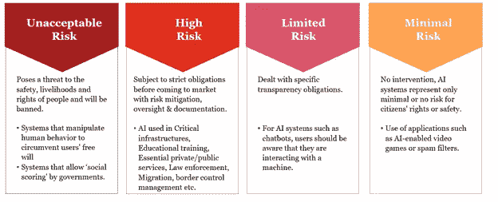

# AI/ML 模型验证框架

> 原文：<https://towardsdatascience.com/ai-ml-model-validation-framework-13dd3f10e824?source=collection_archive---------23----------------------->

## 这不仅仅是一个简单的 MRM 问题

来源:凯文·Ku 在 Unsplash 上拍摄的照片

模型风险管理(MRM)是任何金融机构评估模型风险的标准做法。然而，在分析领域，从早期的主流模型/方法到尖端的人工智能/机器学习(AI/ML)技术，存在着范式转变。随着分析领域的进步，MRM 政策/框架也需要升级，以确保 AI/ML 方法产生的任何增量风险都能够被很好地捕捉、突出和减轻。

本文讨论了一个用于验证 AI/ML 模型的健壮框架。在我们深入研究该框架之前，有必要讨论两个关键方面:

**A)****AI/ML 解决方案风险分层:**

为了使人工智能/洗钱值得信赖，相关产品/解决方案的风险分级至关重要。这尤其有助于量化解决方案的任何潜在危害。最近，欧盟委员会也提出了一套关于风险分层的指导方针。根据业内既定标准，人工智能/人工智能解决方案的相关风险分类如下:

图片来自作者

**B)** **偏向&公平**

在深度学习中，[偏差&公平性](/understanding-bias-and-fairness-in-ai-systems-6f7fbfe267f3)从数据分析和建模方法的角度来看都是重要的考虑因素。这两者都可能带来可怕的后果。从数据的角度来看，由于经验偏度，偏度可能存在。例如，如果我们在谷歌中搜索“护士”,它会更突出某一特定性别。同样，某些种族/肤色的信用评分也可能有偏差。从建模的角度来看，深度学习模型总是倾向于过度拟合数据，从而产生偏见。

不幸的是，让验证者沮丧的是，偏见和公平没有标准的定义。当从模型中得出的决策可能影响个人或公司时，偏见和公平就成了问题。为了解决这些问题:

a)验证者应该谨慎地评估变量，并指出是否存在任何与变量相关的问题。敏感变量(如年龄、性别、宗教、职业等。)应该从数据或建模中排除，如果不是非常必要的话。

b)验证人员应根据上述风险等级适当审查偏差和公平性。高风险模型可能有很高的偏见和公平性问题。

c)验证者需要定义一些标准的技术或实践来识别和解决这个问题。例如， [datarobot](https://www.datarobot.com/blog/introducing-datarobot-bias-and-fairness-testing/) 提供了自动识别偏差的选项。

给定上下文，让我们深入研究 AI/ML 模型验证框架。该框架可分为以下几个方面:

图片来自作者

**1)** **数据适当性**

AI/ML 模型的训练通常需要海量的数据，这些数据也可能是非结构化的。这将保证确保:

a.**保护** PII 或任何个人数据。此外，还应考虑数据的收集和处理过程。

b.测试数据的**完整性和适当性**，以便将其用于正确的目的和正确的方式。

c.**预处理**，如果有的话(如变换、归一化、缺失值计算等。)应用于训练和测试数据。

d.通过审查时间段、来源、分布来评估数据的**完整性**,并在需要时访问标签的定义

e.不存在上面提到的**偏见&公平**问题

**2)** **方法论和模型测试**

与传统模型不同，AI/ML 模型通常是黑盒。因此，测试模型参数、输出和对输入的敏感性变得具有挑战性。为了确保模型提供预期的结果并在一段时间内保持稳定，验证者需要:

a.理解方法的**目标**以及业务需求

b.查看**超参数**以调整模型:

一、矢量化技术 *(Word2Vec，Glove，FastText，One-hot-encoding)* ，

二。优化功能*(梯度下降、SGD、MiniBatch、Adam)*

三。激活功能 *(Sigmoid，Tanh，ReLU)*

四。损失函数 *(MSE，交叉熵损失，铰链损失)*

动词 （verb 的缩写）层数

不及物动词批量

七。退学率

八。汇集方法*(最大值，平均值)*

c.确保超参数与**模型的目的和用途**一致。

d.评估**性能指标**如误报、精度、召回是否根据业务需求正确定义。

e.通过计算量更大的方法评估模型准确性和**稳定性**，如使用不同的数据子集重新执行模型、k 重交叉验证、留一交叉验证(LOOCV)、嵌套交叉验证。

f.确保**敏感度分析**已经彻底执行，通过该分析可以测量每个特性的影响。还有更高级的全局可解释性方法，如部分相关图(PDP)，它允许通过可视化预测响应与一个或多个特征之间的平均部分关系来找出趋势。

g.一旦敏感性被捕获，评估**场景**的可能性及其影响。为了确保模型能够容忍任何极端场景或噪音，需要进行场景分析。

h.评估**标杆或挑战者**模型，并与最终模型进行比较。

I .确保**自适应或持续学习**的计划到位(如有)，以便模型能够从新数据中学习。

j.评估任何**预培训模型**的使用(如 Glove、FastText、ResNet 等。)根据手头的数据和问题谨慎处理。

**3)** **概念的合理性和可解释性**

与传统技术相比，AI/ML 技术仍然没有被监管者或从业者广泛接受。这主要是由于它的黑盒性质，这使得它很难建立关于手边的建模或业务上下文的可解释性和适用性。

为了度量黑盒模型的透明性、可解释性和特征重要性，<https://github.com/slundberg/shap>****[**LIME**](https://github.com/marcotcr/lime)或可解释的 Boosting Machines[**(EBM)**](https://github.com/interpretml/interpret)被高度使用，它们是模型不可知的，并且也为模型提供了交互项。验证者需要确保这种类型的分析已经被执行，并且分析的结论与业务问题一致。****

******4)**模型实现和模型安全****

****一旦模型被开发出来，一个关键的重要步骤就是**在生产环境中实现**模型，无论是在服务器上还是在云上，比如 Azure 或 GCP。在这一步中，验证者需要仔细评估模型实现计划的准备和设计。验证者还需要评估应用程序(包括库、模块和配置)是否适合实现，同时考虑未来版本的潜在影响。在这种情况下， **Docker/Kubernetes** 通过使用容器使得创建、部署和运行应用程序变得更加容易。****

****除了实现之外，还有关于模型安全的观点，如对抗性攻击、模型盗窃等。很可能是在这个验证框架中设计的。就此而言，在定义解决方案的透明度时，**风险分层**(前面提到过)应该是一个重要的考虑因素。****

******5)** **模型文档和版本控制******

****文档应该是**自解释的**和**足够广泛的**，以便它允许验证器复制模型。****

****文件应描述开发数据提取和预处理、模型理论和设计、开发方法和模型性能，包括 challenger 模型，以及适当的模型文件指南。它应适当提及假设、弱点和限制，提供对其影响的估计，并记录相关模型风险的缓解措施。最后，代码应该有足够的注释，并有关于功能的简要说明，还应该保持版本控制。****

******6)** **持续监控和治理******

****验证人员应该评估监控计划，以确保范围、目标、涉众、角色和职责等组成部分都被很好地涵盖。此外，还应评估定期回访或重新校准的频率和时间间隔。管理机构的有效监督将确保管理层了解所有相关的模型风险。****

******结论******

****随着各行业在采用新的人工智能/人工智能制度方面不断改进，MRM 框架需要变得比以前更加强大和全面。验证者需要评估文章中强调的所有关键维度的模型。****

*****免责声明:本文中表达的观点是作者以个人身份发表的意见，而非其雇主的意见*****

******参考文献:******

****[https://EC . Europa . eu/commission/press corner/detail/en/IP _ 21 _ 1682](https://ec.europa.eu/commission/presscorner/detail/en/ip_21_1682)****

****[https://www . data robot . com/blog/introducing-data robot-bias-and-failure-testing/](https://www.datarobot.com/blog/introducing-datarobot-bias-and-fairness-testing/)****

****[https://christophm . github . io/interpretable-ml-book/lime . html](https://christophm.github.io/interpretable-ml-book/lime.html)****

****[https://github.com/slundberg/shap](https://github.com/slundberg/shap)****

****[https://towards data science . com/understanding-bias-and-failure-in-ai-systems-6f 7 fbfe 267 f 3](/understanding-bias-and-fairness-in-ai-systems-6f7fbfe267f3)****