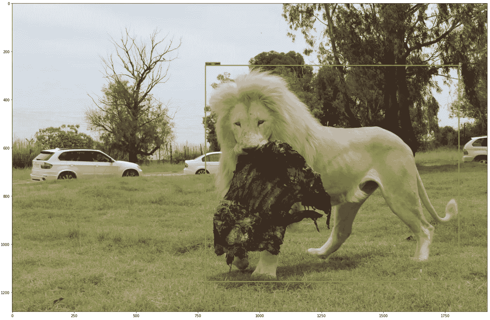
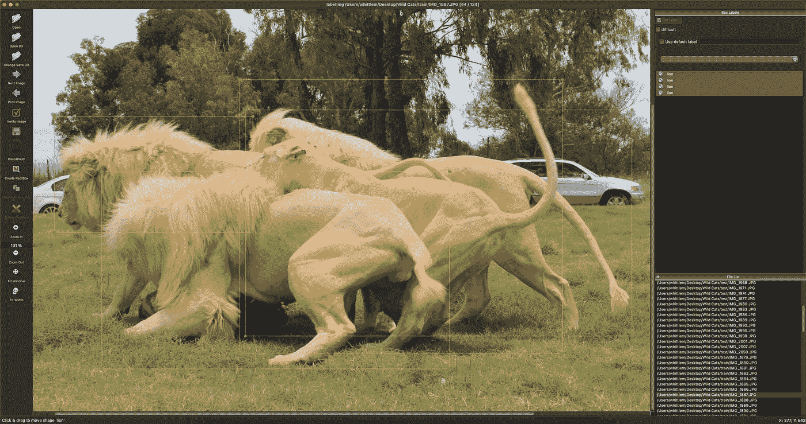
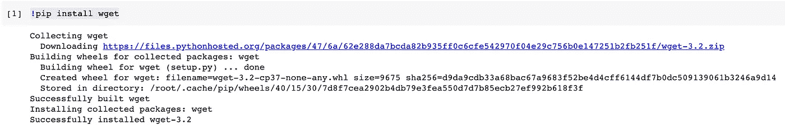
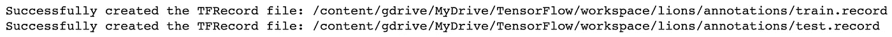
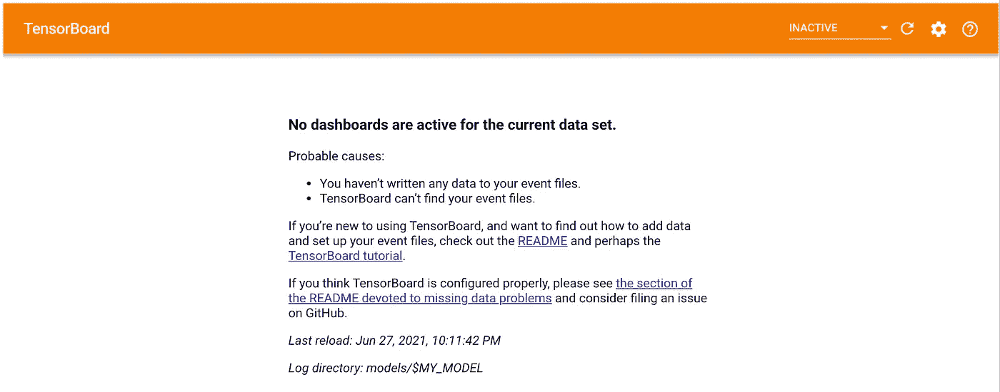
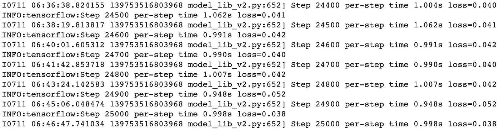
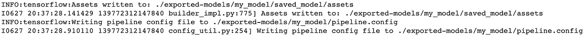
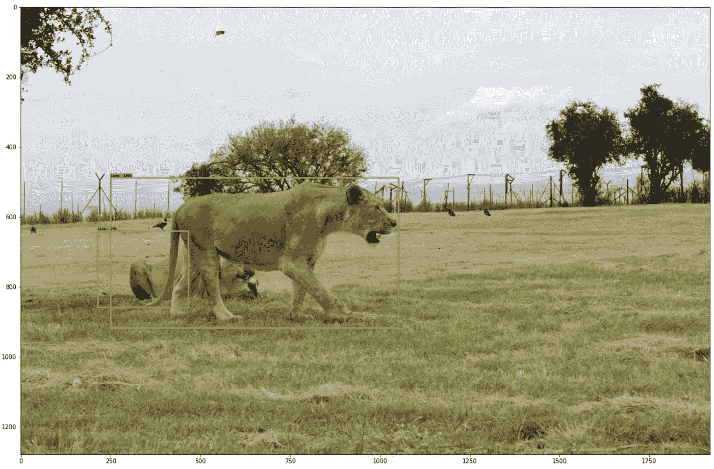

# AI 物体检测，用狮子！

> 原文：<https://towardsdatascience.com/ai-object-detection-with-lions-d301c6ab3564?source=collection_archive---------30----------------------->

## 使用基于区域的卷积神经网络(R-CNN)



作者图片

这篇文章原本是为了介绍 [AWS 重新识别](https://aws.amazon.com/rekognition)。我想我会尝试一下，并提供一个评论。我是 [AWS 服务](https://console.aws.amazon.com/)的粉丝。它们通常都设计得很好，很直观，并且工作起来很愉快。我真的对 [AWS 认证](https://aws.amazon.com/rekognition)很失望，至少我感兴趣的部分是“**自定义标签**”。名字本身可能没有这么明显这是什么。这可以让你给自己的模型贴上标签，进行训练(在我看来是最有用的部分)。AWS 确实为“**对象和场景检测**”、“**图像调节**”、“**面部分析**”、“**名人识别**”、“**人脸比对**”、“**图像中的文字**”和“ **ppe 检测**”提供了图像和视频模型。你可以在这里找到关于定价的信息。

我曾计划用那些旧的儿童书籍来演示这一点。也许你们中的一些人会记得小时候的书。在每一页上，它都有一个非常忙碌和混乱的场景，你必须在人群中找到这个叫“T26 瓦尔多的家伙。他戴着红帽子，戴着眼镜，穿着条纹衬衫。我认为这将是一个伟大的使用对象检测的人工智能演示。遗憾的是，我无法向你们展示这些惊人的结果，因为我无法获得许可。这是我对 AWS 认知的计划。相反，我用了一些我在南非约翰内斯堡的狮子和野生动物园拍摄的照片。

只要记住 [AWS 识别](https://aws.amazon.com/rekognition)不是**便宜**。你按图片付费，有时按时间付费来训练和使用你的模型。这可能会使解决方案非常昂贵。我还没有看过[谷歌云愿景](https://cloud.google.com/vision)，但我预计它在定价方面会类似。

以下是我决定不在 [AWS 重新识别](https://aws.amazon.com/rekognition)中使用自定义标签的主要原因。

*   当您创建一个“**数据集**时，它会自动为您创建一个具有正确权限的 S3 存储桶。如果您可以选择自己的 bucket 名称，这将是一个不错的特性。举个例子，如果我现在进入它，它想要创建一个名为“**custom-labels-console-eu-west-2–06e 54d 6838**”的 S3 存储桶。如果你有一个以上的项目，这将是一个痛苦的管理。
*   在您的"**数据集**"文件夹中，您至少要创建一个"**训练**"文件夹或类似的文件夹。您也可以选择创建一个“**测试**”文件夹。在“**项目**”设置中，您可以决定是否要将您的图像分割成“**系列**”和“**测试**”，或者您可以告诉它将您的“**系列**”自动分割成 80/20。我这里的问题是你不能在控制台中删除你的“**数据集**”。没有删除按钮！您需要完全移除 S3 存储桶，一段时间后它会被检测到并移除。
*   您可以直接在控制台中标记您的图像。这可能是一个伟大的功能，但它是非常基本的。例如，如果您在标签的图像上放置一个边界框，您只能移动或删除它。你无法重塑它。你应该能够抓住边界框的锚点，并对其进行优化。
*   在训练阶段，如果失败了，它不会给你一个很好的解释。您几乎肯定需要在线搜索问题所在。我遇到的一个问题是我没有添加足够的测试图像。你可能会认为只要将更多的图片复制到“ **test** ”文件夹中，贴上标签，你就可以…出错了！您添加的新图像永远不会被检测到。你相信你必须手动编辑新图像的清单文件吗？
*   在我训练好我的模型后，我期待着尝试一下。不能通过控制台使用。您需要通过 [AWS CLI](https://aws.amazon.com/cli) 启动模型、使用模型和停止模型。
*   启动和停止模型花费了很长时间。我的意思是很长一段时间，有时它没有开始，也没有解释问题是什么。请记住，在模型运行时，您是按分钟付费的。
*   一旦你花了很多钱来训练你的模型，你就不清楚这个模型是否能被导出并在 AWS 之外使用。我感觉你可能会使用 AWS 进行推理。我找不到这方面的任何文件。

在这个阶段，我认为这不适合我。至少在他们修好这一切之前不会。它有真正的潜力，但作为一个"**未完成的服务**"我不会使用它。我认为他们也可以为自定义标签提供一些自由层功能。

当我完成我的应用机器学习课程时，我想在人工智能方面推进我的研究。我的大部分深造都是从媒体文章中获得的。有些文章非常好，内容丰富，有些则不然。我注意到，尤其是在学习 LSTM 交易时，许多文章都有糟糕的代码。似乎人们只是在复制同样的代码，而没有试图去理解它。

几个月前，我发现了一篇关于物体检测的很棒的文章…

[](https://medium.com/swlh/tensorflow-2-object-detection-api-with-google-colab-b2af171e81cc) [## 使用 Google Colab 的 TensorFlow 2 对象检测 API

### 本文将指导您完成对象识别模型训练所需的所有步骤，从收集…

medium.com](https://medium.com/swlh/tensorflow-2-object-detection-api-with-google-colab-b2af171e81cc) 

演练大部分工作，但有相当大的差距。我遇到了几个问题，试图让这个工作。我试图联系作者，但没有得到任何答案。我自己解决了问题并改进了代码，现在它运行得非常好。

为此，我将使用[谷歌实验室](https://colab.research.google.com/)，它是免费的。我实际上把我的升级到了[谷歌 Colab Pro](https://colab.research.google.com/signup) ，每月 8.10 英镑。它非常值得升级，但不是必需的。如果您使用免费版本，您需要调低“ **pipeline.config** ”中的“ **batch_size** ”超参数。

## 让我们准备我们的数据

为了证明这一点，我们需要一些“**商业使用& mods 允许的**”图像用于训练和测试。正如我上面提到的，我已经获得了使用一些“**Waldo**在哪里”图片的许可。我确实在 Flickr 上看了看，但就是找不到一组好的图片。我最终只是用了一些我自己拍的照片，以避免任何潜在的版权问题。

一旦我们准备好了我们的图像，我们将需要使用这个非常神奇的免费开源工具，叫做“[](https://github.com/tzutalin/labelImg)**”。如何安装[的说明可以在这里找到](https://github.com/tzutalin/labelImg/blob/master/README.rst)。为了训练我们的模型，我们首先需要教它“**狮子**在哪里。" [**labelImg**](https://github.com/tzutalin/labelImg) "非常容易地帮你给"**狮子**"加标签，并在它周围加一个边框。保存文件时，它将包含一个 XML 文件，其中包含图像的所有标签信息。图像可以包含一个或多个标签、多个标签，甚至是重叠的标签。在这种情况下，我们只有一个名为“ **lion** ”的标签。**

****

**作者图片**

**如你所见，我已经完成了所有的训练和测试图像，标记了一个或多个“ **lion** ”。**

**在这个阶段，我们应该有一个本地目录，其中包含我们所有的图像和附带的 XML 文件。**

**我有 124 张图片用于训练和测试。我将 88 张图片和 XML 文件放入一个“ **train** 文件夹，将 36 张图片放入一个“ **test** 文件夹。我们以后会需要这些。**

## **Google Colab**

**我为此准备了一个笔记本，但把它分成了两部分:**

*   *****训练和测试模型*****
*   *****加载并使用模型*****

**理想情况下，你只需要训练你的模型一次，因为这需要很长时间。使用 [Google Colab Pro](https://colab.research.google.com/signup) 需要 7 个小时，如果您使用 [Google Colab](https://colab.research.google.com/) 可能需要更长时间，但至少是免费的。一旦你训练并导出了你的模型，那么加载和使用它就很快了。**

**给自己创建一个新的 [Google Colab](https://colab.research.google.com/) 笔记本。**

**点击**运行时**，然后**改变运行时类型**。在**硬件加速器**下选择 **GPU** 。**

**该部分的另一个重要菜单选项是“**运行时**”下的“**管理会话**”。如果你遇到崩溃或谷歌驱动会话挂起，你可能会得到一个“**僵尸会话**”，这只是不允许你做任何事情。如果你有这样的问题，硬重置笔记本的最好方法是进入“**管理会话**”，终止有问题的会话并重新开始。**

## **训练和测试模型**

**您笔记本中的第一个代码单元将是安装“ **wget** ”。**

```
!pip install wget
```

****

**作者图片**

**然后，您将希望包括以下库。**

```
import os
import sys
from shutil import copy, move
from wget import download
from re import compile as re_compile, sub as re_sub, M
from google.colab import drive
from tarfile import open as untar
```

**在我的笔记本里，我把我创建的所有这些函数放在一个代码单元里，但是我要把它们分开来解释它们是做什么的。**

**此功能将安装 Google Drive 来处理您的模型。**

```
def mount_gdrive():
  if not os.path.isdir('/content/gdrive'):
    drive.mount('/content/gdrive')
```

**该函数在 Google Drive 上创建所需的目录结构。在最初的文章中，他只是向我们展示了目录结构应该是什么样子。这实际上为你做了一切:)**

**您会注意到我使用了几个环境变量:**

*   ****GDRIVE_ROOT****

**这是您的 TensorFlow 项目在 Google Drive 中的根目录名称。稍后你会看到，但我称我的为“张量流”。**

*   ****项目名称****

**这是您的 TensorFlow 对象检测项目的名称。我把我的叫做“狮子”。**

*   ****张量流 _ 模型****

**这是我们将使用的张量流模型。我们将使用“**固态硬盘 resnet 50 V1 FPN 640 x640(retina net 50)**”但如果你想看这里的，你可以[看看其他的。](https://github.com/tensorflow/models/blob/master/research/object_detection/g3doc/tf2_detection_zoo.md)**

*   ****我的 _ 车型****

**这是一个基于我们将使用的张量流模型的模型名称。它是为您生成的，因此您不需要在这里指定任何内容。**

**除了创建所有目录之外，它还下载模型并创建标签映射。**

```
def create_gdrive_directory_structure():
  global labelsroot_dir = os.environ['GDRIVE_ROOT']
  project_name = os.environ['PROJECT_NAME']
  tensorflow_model = os.environ['TENSORFLOW_MODEL']
  my_model = os.environ['MY_MODEL']if not os.path.exists(f'/content/gdrive/MyDrive/{root_dir}'):
    print (f'creating /content/gdrive/MyDrive/{root_dir}')
    os.makedirs(f'/content/gdrive/MyDrive/{root_dir}')if not os.path.exists(f'/content/gdrive/MyDrive/{root_dir}/scripts'):
    print (f'creating /content/gdrive/MyDrive/{root_dir}/scripts')
    os.makedirs(f'/content/gdrive/MyDrive/{root_dir}/scripts')if not os.path.exists(f'/content/gdrive/MyDrive/{root_dir}/scripts/preprocessing'):
    print (f'creating /content/gdrive/MyDrive/{root_dir}/scripts/preprocessing')
    os.makedirs(f'/content/gdrive/MyDrive/{root_dir}/scripts/preprocessing')if not os.path.exists(f'/content/gdrive/MyDrive/{root_dir}/workspace'):
    print (f'creating /content/gdrive/MyDrive/{root_dir}/workspace')
    os.makedirs(f'/content/gdrive/MyDrive/{root_dir}/workspace')if not os.path.exists(f'/content/gdrive/MyDrive/{root_dir}/workspace/{project_name}'):
    print (f'creating /content/gdrive/MyDrive/{root_dir}/workspace/{project_name}')
     os.makedirs(f'/content/gdrive/MyDrive/{root_dir}/workspace/{project_name}')if not os.path.exists(f'/content/gdrive/MyDrive/{root_dir}/workspace/{project_name}/annotations'):
    print (f'creating /content/gdrive/MyDrive/{root_dir}/workspace/{project_name}/annotations')
      os.makedirs(f'/content/gdrive/MyDrive/{root_dir}/workspace/{project_name}/annotations')if not os.path.exists(f'/content/gdrive/MyDrive/{root_dir}/workspace/{project_name}/exported-models'):
    print (f'creating /content/gdrive/MyDrive/{root_dir}/workspace/{project_name}/exported-models')
      os.makedirs(f'/content/gdrive/MyDrive/{root_dir}/workspace/{project_name}/exported-models')if not os.path.exists(f'/content/gdrive/MyDrive/{root_dir}/workspace/{project_name}/images'):
    print (f'creating /content/gdrive/MyDrive/{root_dir}/workspace/{project_name}/images')
      os.makedirs(f'/content/gdrive/MyDrive/{root_dir}/workspace/{project_name}/images')if not os.path.exists(f'/content/gdrive/MyDrive/{root_dir}/workspace/{project_name}/images/test'):
    print (f'creating /content/gdrive/MyDrive/{root_dir}/workspace/{project_name}/images/test')
      os.makedirs(f'/content/gdrive/MyDrive/{root_dir}/workspace/{project_name}/images/test')if not os.path.exists(f'/content/gdrive/MyDrive/{root_dir}/workspace/{project_name}/images/train'):
    print (f'creating /content/gdrive/MyDrive/{root_dir}/workspace/{project_name}/images/train')
       os.makedirs(f'/content/gdrive/MyDrive/{root_dir}/workspace/{project_name}/images/train')if not os.path.exists(f'/content/gdrive/MyDrive/{root_dir}/workspace/{project_name}/models'):
    print (f'creating /content/gdrive/MyDrive/{root_dir}/workspace/{project_name}/models')
      os.makedirs(f'/content/gdrive/MyDrive/{root_dir}/workspace/{project_name}/models')if not os.path.exists(f'/content/gdrive/MyDrive/{root_dir}/workspace/{project_name}/models/{my_model}'):
    print (f'creating /content/gdrive/MyDrive/{root_dir}/workspace/{project_name}/models/{my_model}')
      os.makedirs(f'/content/gdrive/MyDrive/{root_dir}/workspace/{project_name}/models/{my_model}')if not os.path.exists(f'/content/gdrive/MyDrive/{root_dir}/workspace/{project_name}/models/my_ssd_resnet50_v1_fpn'):
    print (f'creating /content/gdrive/MyDrive/{root_dir}/workspace/{project_name}/models/my_ssd_resnet50_v1_fpn')
      os.makedirs(f'/content/gdrive/MyDrive/{root_dir}/workspace/{project_name}/models/my_ssd_resnet50_v1_fpn')if not os.path.exists(f'/content/gdrive/MyDrive/{root_dir}/workspace/{project_name}/pre-trained-models'):
    print (f'creating /content/gdrive/MyDrive/{root_dir}/workspace/{project_name}/pre-trained-models')
      os.makedirs(f'/content/gdrive/MyDrive/{root_dir}/workspace/{project_name}/pre-trained-models')if not os.path.isfile(f'{tensorflow_model}.tar.gz') and not os.path.exists(f'/content/gdrive/MyDrive/{root_dir}/workspace/{project_name}/pre-trained-models/{tensorflow_model}'):
    print (f'downloading {tensorflow_model}.tar.gz from [https://github.com/tensorflow/models/blob/master/research/object_detection/g3doc/tf2_detection_zoo.md'](https://github.com/tensorflow/models/blob/master/research/object_detection/g3doc/tf2_detection_zoo.md'))
    download(f'[http://download.tensorflow.org/models/object_detection/tf2/20200711/{tensorflow_model}.tar.gz'](http://download.tensorflow.org/models/object_detection/tf2/20200711/{tensorflow_model}.tar.gz'))if os.path.isfile(f'/content/{tensorflow_model}.tar.gz') and not os.path.exists(f'/content/gdrive/MyDrive/{root_dir}/workspace/{project_name}/pre-trained-models/{tensorflow_model}'):
    print (f'untar /content/{tensorflow_model}.tar.gz')
    tar = untar(f'/content/{tensorflow_model}.tar.gz', "r:gz")
    tar.extractall()
    tar.close()if os.path.exists(tensorflow_model) and not os.path.exists(f'/content/gdrive/MyDrive/{root_dir}/workspace/{project_name}/pre-trained-models/{tensorflow_model}'):
    print (f'moving model {tensorflow_model} to /content/gdrive/MyDrive/{root_dir}/workspace/{project_name}/pre-trained-models')
    move(tensorflow_model, f'/content/gdrive/MyDrive/{root_dir}/workspace/{project_name}/pre-trained-models/{tensorflow_model}')if os.path.exists(f'/content/gdrive/MyDrive/{root_dir}/workspace/{project_name}/pre-trained-models/{tensorflow_model}/pipeline.config') \
      and not os.path.exists(f'/content/gdrive/MyDrive/{root_dir}/workspace/{project_name}/models/{my_model}/pipeline.config'):
      copy(f'/content/gdrive/MyDrive/{root_dir}/workspace/{project_name}/pre-trained-models/{tensorflow_model}/pipeline.config', f'/content/gdrive/MyDrive/{root_dir}/workspace/{project_name}/models/{my_model}/pipeline.config')if not os.path.exists(f'/content/models') and not os.path.exists(f'/content/gdrive/MyDrive/{root_dir}/models'):
    !git clone [https://github.com/tensorflow/models.git](https://github.com/tensorflow/models.git)
    print (f'moving /content/models to /content/gdrive/MyDrive/{root_dir}')
    move('/content/models', f'/content/gdrive/MyDrive/{root_dir}')if not os.path.isfile(f'/content/gdrive/MyDrive/{root_dir}/workspace/{project_name}/annotations/label_map.pbtxt'):
    print (f'/content/gdrive/MyDrive/{root_dir}/workspace/{project_name}/annotations/label_map.pbtxt')label_map = ''
    for label in labels:
      label_map += "item {\n"
      label_map += f"  id: {label[0]}\n"
      label_map += f"  name: '{label[1]}'\n"
      label_map += "}\n"try:
    with open(f'/content/gdrive/MyDrive/{root_dir}/workspace/{project_name}/annotations/label_map.pbtxt', 'w') as fh:
        fh.write(label_map)
        fh.close
    except IOError as err:
      print (err)
```

****该功能用于训练和加载模型。它建立必要的对象检测库。****

```
def build():
  root_dir = os.environ['GDRIVE_ROOT']
  project_name = os.environ['PROJECT_NAME']
  tensorflow_model = os.environ['TENSORFLOW_MODEL']os.chdir(f'/content/gdrive/MyDrive/{root_dir}/models/research')
  !git checkout -f e04dafd04d69053d3733bb91d47d0d95bc2c8199!apt-get install protobuf-compiler python-lxml python-pil
  !pip install Cython pandas tf-slim lvisos.chdir(f'/content/gdrive/MyDrive/{root_dir}/models/research')
  !protoc object_detection/protos/*.proto --python_out=.!python setup.py build
  !python setup.py installos.chdir(f'/content/gdrive/MyDrive/{root_dir}/models/research/object_detection/builders')
  !python model_builder_tf2_test.py
  print('Done')
```

**这个函数创建 TFRecords。**

```
def generate_tfrecords():
  root_dir = os.environ['GDRIVE_ROOT']
  project_name = os.environ['PROJECT_NAME']
  tensorflow_model = os.environ['TENSORFLOW_MODEL']os.chdir(f'/content/gdrive/MyDrive/{root_dir}/scripts/preprocessing')if not os.path.isfile('generate_tfrecord.py'):
    !wget [https://gist.githubusercontent.com/whittlem/3dac1a51389678507d6e1a5090287f26/raw/666c93b2b36351942e806f4cedd4cf713d04d691/generate_tfrecord.py](https://gist.githubusercontent.com/whittlem/3dac1a51389678507d6e1a5090287f26/raw/666c93b2b36351942e806f4cedd4cf713d04d691/generate_tfrecord.py)

  !python generate_tfrecord.py -x "/content/gdrive/MyDrive/$GDRIVE_ROOT/workspace/$PROJECT_NAME/images/train" -l "/content/gdrive/MyDrive/$GDRIVE_ROOT/workspace/$PROJECT_NAME/annotations/label_map.pbtxt" -o "/content/gdrive/MyDrive/$GDRIVE_ROOT/workspace/$PROJECT_NAME/annotations/train.record"
  !python generate_tfrecord.py -x "/content/gdrive/MyDrive/$GDRIVE_ROOT/workspace/$PROJECT_NAME/images/test" -l "/content/gdrive/MyDrive/$GDRIVE_ROOT/workspace/$PROJECT_NAME/annotations/label_map.pbtxt" -o "/content/gdrive/MyDrive/$GDRIVE_ROOT/workspace/$PROJECT_NAME/annotations/test.record"
```

**这个函数将一些重要的脚本移动到正确的位置。**

```
def move_scripts():
  root_dir = os.environ['GDRIVE_ROOT']
  project_name = os.environ['PROJECT_NAME']
  tensorflow_model = os.environ['TENSORFLOW_MODEL']if os.path.isfile(f'/content/gdrive/MyDrive/{root_dir}/models/research/object_detection/model_main_tf2.py') \
    and not os.path.isfile(f'/content/gdrive/MyDrive/{root_dir}/workspace/{project_name}/model_main_tf2.py'):
    print (f'copying /content/gdrive/MyDrive/{root_dir}/models/research/object_detection/model_main_tf2.py to /content/gdrive/MyDrive/{root_dir}/workspace/{project_name}')
    copy(f'/content/gdrive/MyDrive/{root_dir}/models/research/object_detection/model_main_tf2.py', f'/content/gdrive/MyDrive/{root_dir}/workspace/{project_name}')if os.path.isfile(f'/content/gdrive/MyDrive/{root_dir}/models/research/object_detection/exporter_main_v2.py') \
    and not os.path.isfile(f'/content/gdrive/MyDrive/{root_dir}/workspace/{project_name}/exporter_main_v2.py'):
    print (f'copying /content/gdrive/MyDrive/{root_dir}/models/research/object_detection/exporter_main_v2.py to /content/gdrive/MyDrive/{root_dir}/workspace/{project_name}')
    copy(f'/content/gdrive/MyDrive/{root_dir}/models/research/object_detection/exporter_main_v2.py', f'/content/gdrive/MyDrive/{root_dir}/workspace/{project_name}')
```

**此功能可选择启动张量板进行训练后分析。**

```
def start_tensorboard():
  root_dir = os.environ['GDRIVE_ROOT']
  project_name = os.environ['PROJECT_NAME']os.chdir(f'/content/gdrive/MyDrive/{root_dir}/workspace/{project_name}')
  %load_ext tensorboard
  %tensorboard --logdir=models/$MY_MODEL
```

**此函数根据原始文章对“ **pipeline.config** ”文件进行建议的更改。**

****重要提示:** 原文章将批量改为 16。我对此有很多问题。由于内存问题，免费的 Google Colab 不断崩溃。我不得不把这种方式减少到 4 左右，如果不是更少的话。使用 Google Colab Pro，我可以在 12 点运行它。如果你使用的是免费版本，那么尝试 4，如果你有问题，那么尝试 2。**

```
def update_pipeline_config():
  root_dir = os.environ['GDRIVE_ROOT']
  project_name = os.environ['PROJECT_NAME']with open(f'/content/gdrive/MyDrive/{root_dir}/workspace/{project_name}/models/my_ssd_resnet50_v1_fpn/pipeline.config', 'r') as fh:
    content = fh.read()
    content_new = re_sub('num_classes: \d*', r'num_classes: ' + str(len(labels)), content, flags=M)
    content_new = re_sub('batch_size: \d*', r'**batch_size: 12**', content_new, flags=M)
    content_new = re_sub('fine_tune_checkpoint: .*', r'fine_tune_checkpoint: "pre-trained-models/' + os.environ['TENSORFLOW_MODEL'] + '/checkpoint/ckpt-0"', content_new, flags=M)
    content_new = re_sub('num_steps: \d*', r'num_steps: 25000', content_new, flags=M)
    content_new = re_sub('fine_tune_checkpoint_type: .*', r'fine_tune_checkpoint_type: "detection"', content_new, flags=M)
    content_new = re_sub('use_bfloat16: .*', r'use_bfloat16: false', content_new, flags=M)
    content_new = re_sub('label_map_path: .*', r'label_map_path: "annotations/label_map.pbtxt"', content_new, flags=M)
    content_new = re_sub('input_path: ".*"', r'input_path: "annotations/test.record"', content_new, flags=M)
    content_new = re_sub('input_path: ".*"', r'input_path: "annotations/train.record"', content_new, count=1, flags=M)
    fh.close()with open(f'/content/gdrive/MyDrive/{root_dir}/workspace/{project_name}/models/my_ssd_resnet50_v1_fpn/pipeline.config', 'w') as fh:
      fh.write(content_new)
      fh.close()
```

**这是训练模型的函数。**

```
def train_model():
  root_dir = os.environ['GDRIVE_ROOT']
  project_name = os.environ['PROJECT_NAME']TF_CPP_MIN_LOG_LEVEL=2
  os.chdir(f'/content/gdrive/MyDrive/{root_dir}/workspace/{project_name}')
  !python model_main_tf2.py --model_dir=models/$MY_MODEL --pipeline_config_path=models/$MY_MODEL/pipeline.config
```

**这将在完成后导出模型。**

```
def export_model():
  !python exporter_main_v2.py --input_type image_tensor --pipeline_config_path ./models/$MY_MODEL/pipeline.config --trained_checkpoint_dir ./models/$MY_MODEL/ --output_directory ./exported-models/my_model
```

**我将上述所有函数放在一个代码单元中，但为了便于解释，只是将它们分开。在培养基中，编码细胞很小。我用代码创建了一个 [GitHub Gist](https://gist.github.com/whittlem/4df46a9ca885bdf9cbed6df6ea7ebfa9) ,这将更容易审查。**

**下一个代码单元格应该是这样的。这是一个重要的单元格，因为它定义了我们使用的所有环境变量和标签。如果您有其他标签，可以将它们包含在列表中。我已经用粗体字标出了你想修改的项目。**

```
os.environ['GDRIVE_ROOT'] = '**TensorFlow**'
os.environ['PROJECT_NAME'] = '**lions**'
os.environ['TENSORFLOW_MODEL'] = '**ssd_resnet50_v1_fpn_640x640_coco17_tpu-8**'
os.environ['MY_MODEL'] = 'my_' + os.environ['TENSORFLOW_MODEL']
os.environ['MY_MODEL'] = re_sub('fpn.*$', 'fpn', os.environ['MY_MODEL'])
os.environ['PYTHONPATH'] += f":/content/gdrive/MyDrive/{os.environ['GDRIVE_ROOT']}/models"sys.path.append(f"/content/gdrive/MyDrive/{os.environ['GDRIVE_ROOT']}/models/research")labels = [
  **(1, 'lion')**
]
```

**下一个代码单元将从 Google Colab 挂载您的 Google Drive。它会要求您授权从 Google Colab 到 Google Drive 的连接。您需要从链接 Google Colab 复制令牌。**

```
mount_gdrive()
```

**这将初始化您的项目结构。你会看到它正在做的输出。如果它以前已经运行过，那么你不会看到任何输出。**

```
create_gdrive_directory_structure()
```

**无论您是在训练还是加载模型，都需要运行下一个函数。它构建对象检测库。这可能需要一段时间。**

```
build()
```

**如果一切顺利，您应该会在构建测试结束时看到这一点。**

```
OK (skipped=1)
Done
```

**我们现在可以包含两个刚刚构建的库。**

```
from object_detection.utils import label_map_util
from object_detection.utils import visualization_utils as viz_utils
```

**然后我们需要生成我们的 TFRecords。在运行之前，确保您已经将本地映像和相关的 XML 文件复制到项目的“**训练**和“**测试**目录中。你可以在 Google Drive 的“ **images** ”目录中找到这个。**

```
generate_tfrecords()
```

****

**作者图片**

**这个函数只是将我们需要的脚本移动到正确的位置。**

```
move_scripts()
```

**这是一个可选步骤，但如果你想你可以开始 TensorBoard。请注意，您只会在训练结束后看到一些内容。**

****

**作者图片**

**"**当前数据集没有活动的仪表板。**”是你第一次运行时所期望的。至少到目前为止是这样。在你训练好你的模型后，你会在这里看到一些有趣的分析。**

**该函数对原文章中描述的“ **pipeline.config** ”进行所有必要的修改。正如我上面提到的，如果你使用 Google Colab 的免费版本，那么就需要减少 **batch_size** 。**

```
update_pipeline_config()
```

**现在我们一直在等待的部分…**

```
train_model()
```

**这将需要很长时间。我第一次训练模型花了 7 个小时才完成，而且只用了我现在训练的一半图像。**

**当你看到类似这样的训练日志时，你就会知道它在工作。**

****

**作者图片**

**这是它完成 25000 步的最后一步！**

**一旦您的模型已经训练好，您会想要导出它，以便以后可以加载它。**

```
export_model()
```

**如果一切按计划进行，你应该在最后看到这个。**

****

**作者图片**

## **加载和使用模型**

**在这个阶段，我们应该已经将训练好的模型导出并准备就绪。**

**有些代码单元/步骤是从本文的培训部分复制来的。我故意把它们分开，因为在大多数情况下，你只是想使用你的模型。**

**像往常一样，第一步是导入我们的库。**

```
import os
import sys
import numpy as np
import matplotlib.pyplot as plt
import warningsfrom google.colab import drive
from re import sub as re_sub
from tensorflow import saved_model, convert_to_tensor, newaxis
from PIL import Imagewarnings.filterwarnings('ignore')
```

**然后我们定义我们的环境变量。我用粗体突出显示了三个可能被编辑的参数。根据本演示，您可以将它们留在下面。**

```
os.environ['GDRIVE_ROOT'] = '**TensorFlow**'
os.environ['PROJECT_NAME'] = '**lions**'
os.environ['TENSORFLOW_MODEL'] = '**ssd_resnet50_v1_fpn_640x640_coco17_tpu-8**'
os.environ['MY_MODEL'] = 'my_' + os.environ['TENSORFLOW_MODEL']
os.environ['MY_MODEL'] = re_sub('fpn.*$', 'fpn', os.environ['MY_MODEL'])
os.environ['PYTHONPATH'] += f":/content/gdrive/MyDrive/{os.environ['GDRIVE_ROOT']}/models"sys.path.append(f"/content/gdrive/MyDrive/{os.environ['GDRIVE_ROOT']}/models/research")
```

**我有一个代码单元，其中包含了我创建的所有函数。我将把它们分开来解释，但你可能想把它们都放在一个单元格中。**

**我们将再次需要此功能来安装您的 Google Drive。**

```
def mount_gdrive():
  if not os.path.isdir('/content/gdrive'):
    drive.mount('/content/gdrive')
```

**构建函数也与我们在本文的培训部分使用的函数完全相同。**

```
def build():
  root_dir = os.environ['GDRIVE_ROOT']
  project_name = os.environ['PROJECT_NAME']
  tensorflow_model = os.environ['TENSORFLOW_MODEL']os.chdir(f'/content/gdrive/MyDrive/{root_dir}/models/research')
  !git checkout -f e04dafd04d69053d3733bb91d47d0d95bc2c8199!apt-get install protobuf-compiler python-lxml python-pil
  !pip install Cython pandas tf-slim lvisos.chdir(f'/content/gdrive/MyDrive/{root_dir}/models/research')
  !protoc object_detection/protos/*.proto --python_out=.!python setup.py build
  !python setup.py installos.chdir(f'/content/gdrive/MyDrive/{root_dir}/models/research/object_detection/builders')
  !python model_builder_tf2_test.py
  print('Done')
```

**这个函数将加载我们的模型。它将返回一个带有检测函数“ **detect_fn** ”和类别索引“ **category_index** ”的元组。这些将是“**过程 _ 图像**”功能的输入。**

```
def load_model(model: str='', label_map: str=''):
  if model == '' and os.getenv('GDRIVE_ROOT') and os.getenv('PROJECT_NAME'):
    model = '/content/gdrive/MyDrive/' + os.getenv('GDRIVE_ROOT') + '/workspace/' + os.getenv('PROJECT_NAME') + '/exported-models/my_model/saved_model'if label_map == '' and os.getenv('GDRIVE_ROOT') and os.getenv('PROJECT_NAME'):
    label_map = f'/content/gdrive/MyDrive/' + os.getenv('GDRIVE_ROOT') + '/workspace/' + os.getenv('PROJECT_NAME') + '/annotations/label_map.pbtxt'if model == '' or label_map == '':
    raise ValueError('model and label_map.pbtxt locations required!')if not os.path.exists(model):
    raise IOError(f'model not found: {model}')if not os.path.isfile(label_map):
    raise IOError(f'label_map.pbtxt not found: {label_map}')print('Loading model... ', end='')
  resp_tuple = (saved_model.load(model), label_map_util.create_category_index_from_labelmap(label_map, use_display_name=True))
  print ('done.')return resp_tuple
```

**这个辅助函数将把一个图像转换成一个 Numpy 数组。**

```
def image2ndarray(path):
  return np.array(Image.open(path))
```

**该功能将显示我们处理过的图像。这个函数可能需要一些解释。前两个参数" **detect_fn** 和" **category_index** "是" **load_module** "函数的输出。 **img_path** 是输入图像的位置。在 [Google Colab](https://colab.research.google.com/) 中输出图像比例相当小。我已经添加了“ **img_scale** ”，它允许你像浮动一样增加尺寸。例如，您可以使用 1.5 将图像缩放 1.5 倍。"**裁剪**"是另一个可选参数，它将裁剪并显示检测到的边界框。**

**这里有几个要点要提一下。第一个是对于每个图像，许多检测可能以不同的精确度被发现。我们不希望看到任何得分低于 50%的检测。如果你看下面的函数，你会看到“**最小分数阈值**”。这是一个超参数，表示我们只对高分检测感兴趣。**

**还值得一提的是，检测都是在 0 和 1 之间标准化。例如，如果图像是 1024x768，标签从中间开始，您将看到 x=0.5 和 y = 0.5，而不是 x=512 和 y=384。为了找到绝对位置，我们需要找到图像的实际尺寸，然后乘以标准化值。**

```
def process_image(detect_fn: None, category_index: None, img_path: str='', img_scale: float=1, crop: bool=False):
  if not os.path.isfile(img_path):
    raise IOError(f'input image not found: {img_path}') img_path_split = img_path.split('.')
    if img_path_split[1].lower() in ['png']:
      img = Image.open(img_path)
      img_path = f"{img_path_split[0]}.jpg"
      img = img.convert('RGB')
      img.save(img_path) print('Running inference for {}'.format(img_path), end='')
  img_np=image2ndarray(img_path) input_tensor = convert_to_tensor(img_np)
  input_tensor = input_tensor[newaxis, ...] detections=detect_fn(input_tensor) num_detections = int(detections.pop('num_detections'))
  detections={key:value[0, :num_detections].numpy() for key,value in detections.items()}
  detections['num_detections'] = num_detections detections['detection_classes'] = detections['detection_classes'].astype(np.int64) img_np_with_detections = img_np.copy() min_score_thresh = .5 viz_utils.visualize_boxes_and_labels_on_image_array(
    img_np_with_detections,
    detections['detection_boxes'],
    detections['detection_classes'],
    detections['detection_scores'],
    category_index,
    use_normalized_coordinates=True,
    max_boxes_to_draw=100,     
    min_score_thresh=min_score_thresh,      
    agnostic_mode=False)

  img_file=Image.open(img_path)
  img_width, img_height=img_file.size
  print('')
  print(f'Image size: {img_width}x{img_height}px') for i in range(min(detections['detection_boxes'].shape[0], detections['detection_boxes'].shape[0])):
    if detections['detection_scores'] is None or detections['detection_scores'][i] > min_score_thresh:
      ymin, xmin, ymax, xmax = detections['detection_boxes'][i]
      x1, x2, y1, y2 = (int(xmin * img_width), int(xmax * img_width), int(ymin * img_height), int(ymax * img_height)) # left, right, top, bottom class_name = category_index[detections['detection_classes'][i]]['name']
  print('detection:', detections['detection_boxes'][i], 'is a', class_name, 'translated to (' + str(x1) + ', ' + str(y1) + ', ' + str(x2) + ', ' + str(y2) + ') pixels') if crop:
      img_crop = img_file.crop((x1, y1, x2, y2)) # left, top, right, bottom
      display(img_crop) %matplotlib inline
  fig=plt.figure()
  img_size=fig.get_size_inches()
  print (f'Render scale: {img_scale}x')
  fig.set_size_inches(img_size[0]*img_scale, img_size[1]*img_scale) 
  plt.imshow(img_np_with_detections, aspect='auto')
  print('Done')
  plt.show()
```

**这里的代码可能很难阅读，所以为了方便起见，我创建了一个 [GitHub Gist](https://gist.github.com/whittlem/812b06f40bdd3b73a764ba4833d49d95) 。**

**为了使用这些功能，我们的下一个单元将是安装我们的 Google Drive，构建我们的附加库，并包含我们构建的库(就像我们在培训步骤中所做的那样)**

```
mount_gdrive()
```

**然后构建我们的附加库。**

```
build()
```

**然后包括我们构建的库。**

```
from object_detection.utils import label_map_util
from object_detection.utils import visualization_utils as viz_utils
```

**然后，我们将加载我们的模块，该模块将返回一个我们接下来需要的元组。**

```
**detect_fn**, **category_index** = load_model(
  model = '/content/gdrive/MyDrive/TensorFlow/workspace/**lions**/exported-models/my_model/saved_model',
  label_map = '/content/gdrive/MyDrive/TensorFlow/workspace/**lions**/annotations/label_map.pbtxt'
)
```

**我们处理我们的图像…**

```
process_image(
  detect_fn = detect_fn,
  category_index = category_index,
  img_path = f"/content/gdrive/My Drive/{os.environ['GDRIVE_ROOT']}/workspace/{os.environ['PROJECT_NAME']}/images/test/IMG_1938.JPG',
  img_scale = 4,
  crop = True
)
```

****

**正如你所看到的，它找到了一只 100%自信的狮子，另一只 79%自信的在后面。**

## **概括起来**

**我希望您发现原始文章的这一增强很有用。我试图弥补差距，解决大多数问题，并尽可能多地尝试自动化。我已经在几个不同的个人和专业项目中使用了这个过程，效果很好。您可能面临的两个潜在问题是 Google Drive 中的磁盘空间(它需要几个空闲 Gb)和 Google Colab 中的资源。Google Colab 中的资源问题是一个相当简单的修复方法，因为你可以调低“ **batch_size** ”，这应该可以帮你解决这个问题。你还需要一点耐心，因为训练一个模型可能需要几个小时:)**

**Python 是对缩进敏感的，我很欣赏在中型文章中展示代码并不总是按照预期的方式格式化。如果你想让我与你分享练习册，请在评论中告诉我。**

**如果你喜欢这篇文章，我建议你看看下面的文章:**

**[](https://medium.com/geekculture/using-aws-sagemaker-to-solve-machine-learning-ai-problems-3c5896da2b2d) [## 使用 AWS SageMaker 解决机器学习和人工智能问题

### 大规模构建、训练和部署机器学习模型

medium.com](https://medium.com/geekculture/using-aws-sagemaker-to-solve-machine-learning-ai-problems-3c5896da2b2d) [](https://levelup.gitconnected.com/predicting-titanic-survivors-using-ml-8570ef4e89e8) [## 用最大似然法预测泰坦尼克号幸存者

### 我通过荣誉退休一直在哥伦比亚工程学习应用机器学习。这是一个 5 个月的课程，我…

levelup.gitconnected.com](https://levelup.gitconnected.com/predicting-titanic-survivors-using-ml-8570ef4e89e8) [](https://levelup.gitconnected.com/predicting-house-sale-prices-using-ml-30b829fd9556) [## 用最大似然法预测房价

### 我通过荣誉退休一直在哥伦比亚工程学习应用机器学习。这是一个 5 个月的课程，我…

levelup.gitconnected.com](https://levelup.gitconnected.com/predicting-house-sale-prices-using-ml-30b829fd9556) [](https://levelup.gitconnected.com/categorising-using-machine-learning-5601baf9a05e) [## 使用机器学习进行分类

### 我通过荣誉退休一直在哥伦比亚工程学习应用机器学习。这是一个 5 个月的课程，我…

levelup.gitconnected.com](https://levelup.gitconnected.com/categorising-using-machine-learning-5601baf9a05e) [](/spotify-artist-recommender-7950af1fe20a) [## Spotify 艺术家推荐

towardsdatascience.com](/spotify-artist-recommender-7950af1fe20a) 

# 迈克尔·惠特尔

*   ***如果你喜欢这个，请*** [***跟我上媒***](https://whittle.medium.com/)
*   ***有兴趣合作吗？让我们连线上***[***LinkedIn***](https://www.linkedin.com/in/miwhittle/)**