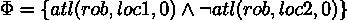
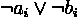

# 用 Davis-Putnam 算法实现人工智能规划的可满足性

> 原文：<https://towardsdatascience.com/ai-planning-as-satisfiability-with-davis-putnam-algorithm-53f05d2f2825?source=collection_archive---------18----------------------->

## 使用布尔(命题)可满足性问题解决人工智能规划问题——提高经典规划的表达能力和复杂性的另一种方法。

戴维斯-普特南 SAT 求解器(图片由作者提供)

# 介绍

这是提高传统规划方法的表现力和复杂性的另一种方法。

在这种技术中，我们所做的是将我们的经典规划问题表示转换成一种众所周知的表示，称为命题可满足性问题，也称为布尔可满足性问题，或简称为 SAT。

如果我们能把它转换成一个众所周知的问题表示，我们就能使用现有的算法来解决问题。

如果你不熟悉传统的规划方法，请阅读下面链接的我上一篇文章中的介绍部分。

</improving-classical-ai-planning-complexity-with-planning-graph-c63d47f87018>  

在这篇文章中，我将通过一步一步的例子来解释这个概念。

## 命题可满足性问题

SAT 是一种知道命题公式是否*可满足*的方法。公式包括:

*   变量
*   运算符(AND/合取、OR/析取、NOT/否定)
*   圆括号

命题公式(作者图片)

解决 SAT 问题意味着，给定一个命题公式，比如上面那个，检查它是否是*可满足的*。也就是说，存在逻辑值(真和假)的组合，可以使公式返回真或假。

如果是，则该公式是可满足的，否则，它是不可满足的。

在本例中，如果我们为公式分配以下逻辑值，则该公式是可满足的:

*   D =真
*   A =假
*   B =假

## 合取范式

为了解决 SAT 问题，我们需要它是一种叫做 CNF(合取范式)的结构化形式。在这种结构中，SAT 问题的公式由子句的连词组成，而子句的连词又是文字的析取。

这有点难读，但基本上，它由 or 的括号 ANDs 组成，如下所示。

CNF(作者图片)

然后我们可以使用[布尔代数](https://en.wikipedia.org/wiki/Boolean_algebra)将命题公式转换成它们的 CNF。

## 规划领域与规划问题

对于我们的循序渐进的例子，我们将需要 PDDL 格式的经典规划领域和问题。

我们将使用简单的码头工人机器人规划领域进行测试，并使用它的简化形式，其中我们只有一个机器人和两个位置用于我们的分步示例。

为了提醒我们，下面是码头工人机器人领域的插图。

简单码头工人机器人规划领域(图片由作者提供)

## 课本

这篇文章基于《自动化规划:理论与实践》一书，例子也来自这本书。

## 源代码

像往常一样，我用 Python 写了这篇文章的源代码，并在 Github 上发布了它。你可以在底部找到链接。

# 将规划问题编码成 SAT 问题

回想一下，一个经典的规划问题如下:

经典规划问题(图片由作者提供)

其中规划域如下:

经典规划领域(图片由作者提供)

## 编码状态

我们首先需要知道的是命题变量，经典规划问题中的状态可以被认为是命题变量。例如码头工人问题的初始状态:

初始状态(图片由作者提供)

我们可以把这些初始状态看作三个不同的命题变量。

命题变量(作者图片)

## 编码状态转换

传统的规划方法通过从初始状态到达到目标状态的状态转换来工作。这意味着我们需要把状态转换模型化到我们的命题公式中，光有状态是不够的。

我们需要将变化的状态以及动作表示为命题变量，以完成我们的命题公式。

考虑以下简单的状态转换，其中机器人 r1 从位置 1 移动到位置 2:

简单的状态转换(图片由作者提供)

从上图可以清楚地看出，我们需要命题公式中的所有三个步骤来正确建模。这些状态在不同的时间成立，我们需要把时间或步长包括到我们的变量中，我们的公式可以写成如下:

命题公式(作者图片)

通过在每个变量上增加一个*步骤*，我们现在可以得到我们的命题公式。公式如下:

*   在步骤 0 中，r1 位于位置 1
*   在步骤 0，r1 不在 loc2
*   在步骤 0，r1 从 loc1 移动到 loc2
*   在步骤 1 中，r1 位于 loc2
*   在步骤 1 中，r1 不在位置 1

## 编码规划问题

现在，在理解了如何将状态和状态转换编码成命题公式之后，我们就可以对我们的规划问题进行编码了。

为了创建我们的规划问题的命题公式，我们必须首先将我们的规划问题限制为**寻找已知长度*的规划的问题，也称为*有界规划问题。**

*这意味着，我们指定步骤的数量(参见上面的编码状态转换)。这是这种方法的局限性。*

*然后在我们有了*有界规划问题*之后，我们把它编码成一个 SAT 问题。所以我们有两个步骤:*

*   *从规划问题创建一个有界规划问题*
*   *将有界规划问题编码成 SAT 问题*

# *构建公式*

*构建公式有五个步骤。在我们的示例中，我们将使用下面的简单域:*

*简单域(作者代码)*

*简单的问题(作者编写的代码)*

*这个规划领域非常简单。我们只有 3 个对象:机器人、位置 1 和位置 2，并且只有一个动作将机器人从一个位置移动到另一个位置。让我们开始构建长度(步数)= 1 的公式。*

## *初始状态*

**

*构建初始状态(图片由作者提供)*

*构建这个公式的一件重要事情是枚举所有可能的谓词。在我们的示例中，它们是:*

**

*所有谓词(作者图片)*

*初始状态的公式:*

**

*初始状态的公式(图片由作者提供)*

*对于出现在初始状态的谓词，它们是正的，对于没有出现的谓词，我们否定它们。*

## *目标状态*

**

*构建目标状态(图片由作者提供)*

*当构建目标状态的公式时，我们不枚举谓词。我们需要的只是包括目标状态。*

*目标状态的公式为:*

**

*目标状态的公式(图片由作者提供)*

*请注意，步骤 1 是最后一步。*

## *行动*

**

*建筑动作(作者图片)*

*这意味着执行一个动作意味着前提条件在当前步骤成立，效果在当前步骤+ 1 成立。*

*在这里，我们列举(或实例化)的行动。在这个简单的域中，我们只有两种可能的操作。*

**

*所有动作(图片由作者提供)*

*行动的公式:*

**

*动作的公式(作者图片)*

*我们需要把这个公式转换成 CNF，以便以后在算法中使用。通过使用布尔代数，我们将得到:*

**

*CNF 行动的公式(图片由作者提供)*

## *解释性框架公理*

*这就是说，行动只改变它所影响的因素，而不是其他任何事情。*

**

*构建解释性框架公理(图片由作者提供)*

*这意味着如果一个流利度改变，那么 ***具有该流利度的动作*** 之一已经被执行。*

*值得注意的是，等式的右边可能有多个动作。*

*在我们的例子中，有四种影响，两种正面影响和两种负面影响。*

**

*解释性框架公理的公式(图片由作者提供)*

*我们还得把这个公式转换成 CNF:*

**

*CNF 解释框架公理的公式(图片由作者提供)*

## *完全排斥公理*

*最后一步是确保在每一步我们只执行一个动作。这可以通过对所有动作组合使用以下公式来实现。*

**

*构建完全排斥公理(图片由作者提供)*

*对于我们的示例，公式如下:*

**

*完全排斥公理的公式(图片由作者提供)*

*现在，我们可以把上面所有的公式合并成一个。这就成了我们在 CNF 的公式，我们可以把它输入到 Davis-Putnam 算法中，来检验它是否是可满足的。*

# *用 Davis-Putnam 算法解决 SAT 问题*

*现在有了我们的命题公式，就可以用戴维斯-普特南算法来求解了。*

*戴维斯-普特南算法是一个递归程序，如下所示:*

**

*戴维斯-普特南算法(图片由作者提供)*

*首先，对于单个子句，它们必须是真实的。所以我们通过公式来简化它。如果没有更多的单子句，我们在非单子句中选择一个变量，将其拆分为真赋值和假赋值。*

*下面是一个例子:*

**

*戴维斯-普特南的例子(图片由作者提供)*

*在我们的示例中运行 Davis-Putnam，得到以下模型和计划:*

**

*模型和平面图(图片由作者提供)*

*Davis-Putnam 算法输出六个子句及其赋值(对/错)。从模型中提取计划很容易。我们只需要提取已经赋值为 True 的动作，在本例中，就是从位置 1 移动到位置 2。*

# *结论*

*在这篇文章中，我们学习了如何使用现有技术——SAT，通过将经典规划问题表示编码为有界规划问题及其 CNF(合取范式)来找到规划问题的解决方案。*

*然后，我们使用 Davis-Putnam 算法来解决 SAT 问题，并提取我们的解决方案，如果 SAT 问题是可满足的。*

*这种方法的一个限制是我们需要指定长度，这意味着我们可能需要尝试几次才能知道我们的问题的解决方案是否存在。*

*我用 Python 写了编码和 Davis-Putnam 算法。如果您感兴趣，请从这里获取:*

*<https://github.com/debbynirwan/planning_sat> *